# Mapy ArcGIS firmy Esri w usłudze Power BI i programie Power BI Desktop
Niniejszy samouczek został napisany, uwzględniając punkt widzenia osoby tworzącej mapę ArcGIS. Jeśli twórca udostępni mapę ArcGIS współpracownikom, mogą oni wyświetlać mapę i wchodzić w interakcję z nią, ale nie mogą zapisywać zmian. Aby dowiedzieć się więcej na temat wyświetlania mapy ArcGIS, zobacz [Wchodzenie w interakcje z mapami ArcGIS](visuals/power-bi-visualizations-arcgis.md).

Kombinacja map ArcGIS i usługi Power BI przenosi tworzenie map na zupełnie nowy poziom wykraczający poza prezentację punktów na mapie. Wybieraj spośród map podstawowych, typów lokalizacji, stylów symboli i warstw referencyjnych, aby tworzyć okazałe i bogate w informacje wizualizacje map. Połączenie autorytatywnych warstw danych na mapie z analizą przestrzenną umożliwia głębsze zrozumienie danych w ramach wizualizacji.

 Chociaż tworzenie map ArcGIS na urządzeniach przenośnych nie jest możliwe, możliwe jest ich wyświetlanie oraz wchodzenie w interakcje z nimi. Zobacz [Wchodzenie w interakcje z mapami ArcGIS](visuals/power-bi-visualizations-arcgis.md).

> [!TIP]
> GIS (ang. Geographic Information Systems) to inaczej system informacji geograficznej.

W poniższym przykładzie użyto ciemnoszarej kanwy, aby pokazać sprzedaż regionalną w formie mapy cieplnej w zestawieniu z demograficzną warstwą prezentującą medianę dochodu rozporządzalnego w 2016 r. Jak zobaczysz później, korzystanie z map ArcGIS oferuje praktycznie nieograniczone możliwości w zakresie zaawansowanego tworzenia map, dane demograficzne oraz jeszcze bardziej atrakcyjne wizualizacje map, co pozwala lepiej prezentować dane historyczne.

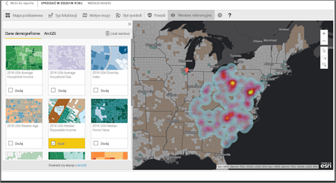

> [!TIP]
> Odwiedź [stronę firmy Esri dotyczącą usługi Power BI](https://www.esri.com/powerbi), aby zobaczyć szereg przykładów i przeczytać opinie klientów. Następnie zobacz stronę firmy Esri [ArcGIS Maps for Power BI Getting Started page (Wprowadzenie do komponentu ArcGIS Maps for Power BI)](https://doc.arcgis.com/en/maps-for-powerbi/get-started/about-maps-for-power-bi.htm).

## Zgoda użytkownika
Komponent ArcGIS Maps for Power BI jest dostarczany przez firmę Esri (www.esri.com). Korzystanie z komponentu ArcGIS Maps for Power BI objęte jest treścią ogólnych warunków oraz zasadami ochrony prywatności firmy Esri. Użytkownicy usługi Power BI, którzy chcą korzystać z wizualizacji komponentu ArcGIS Maps for Power BI, muszą zaakceptować okno dialogowe ze zgodą.

**Zasoby**

[Ogólne warunki](https://go.microsoft.com/fwlink/?LinkID=826322)

[Zasady ochrony prywatności](https://go.microsoft.com/fwlink/?LinkID=826323)

[ArcGIS Maps for Power BI — strona produktu](https://www.esri.com/powerbi)

 

## Włączanie mapy ArcGIS
Mapy ArcGIS są aktualnie dostępne w usłudze Power BI, programie Power BI Desktop i aplikacji Power BI dla urządzeń mobilnych. Ten artykuł zawiera instrukcje dotyczące usługi, a także wersji Desktop.

### Włączanie mapy ArcGIS ***w usłudze Power BI (app.powerbi.com)***
Ten samouczek korzysta z [przykładowych danych Retail Analysis](sample-retail-analysis.md). Aby włączyć komponent **ArcGIS Maps for Power BI**:

1. W prawej górnej części paska menu wybierz ikonę przypominającą koło zębate i otwórz **Ustawienia**
   
    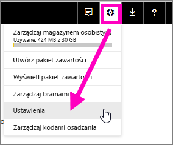
2. Zaznacz pole wyboru **ArcGIS Maps for Power BI**. Po zaznaczeniu należy uruchomić ponownie usługę Power BI.
   
    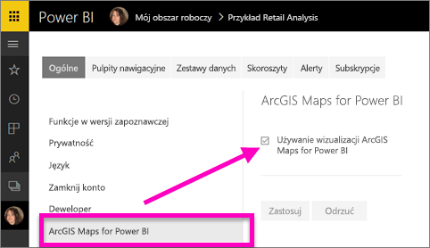
3. Otwórz raport w [widoku do edycji](consumer/end-user-reading-view.md) i wybierz ikonę komponentu ArcGIS Maps for Power BI z okienka Wizualizacje.
   
    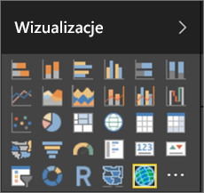
4. Usługa Power BI doda pusty szablon mapy ArcGIS do kanwy raportu.
   
   

 

## Tworzenie wizualizacji mapy ArcGIS
Obejrzyj, jak Will tworzy kilka różnych wizualizacji map ArcGIS, a następnie wykonaj poniższe kroki, aby spróbować zrobić to samodzielnie, korzystając z [przykładowych danych Retail Analysis](sample-datasets.md).

<iframe width="560" height="315" src="https://www.youtube.com/embed/EKVvOZmxg9s" frameborder="0" allowfullscreen></iframe>

1. Z okienka **Pola** przeciągnij pole danych do zasobnika **Lokalizacja** lub zasobników **Szerokość geograficzna** i/lub **Długość geograficzna**. W tym przykładzie używamy pola **Store > City** (Sklep > Miejscowość).
   
   > [!NOTE]
   > Komponent ArcGIS Maps for Power BI automatycznie wykryje, czy wybrane pola najlepiej wyświetlać jako kształt, czy też jako punkt na mapie. Domyślne wartości można dostosować w ustawieniach (patrz poniżej).
   > 
   > 
   
    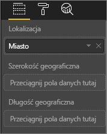
2. Skonwertuj wizualizację na mapę ArcGIS, wybierając szablon w okienku Wizualizacje .
3. Z okienka **Pola** okienka przeciągnij miarę do zasobnika **Rozmiar**, aby dostosować sposób, w jaki wyświetlane są dane. W tym przykładzie używamy miary **Sales > Last Year Sales** (Sprzedaż za ostatni rok).
   
    

## Ustawienia i formatowanie map ArcGIS
Aby uzyskać dostęp do funkcji formatowania komponentu **ArcGIS Maps for Power BI**:

1. Uzyskaj dostęp do dodatkowych funkcji, wybierając wielokropek w prawym górnym rogu wizualizacji i wybierając pozycję **Edytuj**.
   
   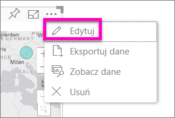
   
   Dostępne funkcje zostaną wyświetlone w górnej części wizualizacji. Po wybraniu dowolnej funkcji zostanie otwarte okienko zadań, które udostępnia opcje szczegółowe. 
   
   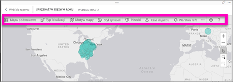
   
   > [!NOTE]
   > Aby uzyskać więcej informacji na temat ustawień i funkcji, zobacz sekcję **Szczegółowa dokumentacja** poniżej.
   > 
   > 
2. Aby powrócić do raportu, wybierz pozycję **Powrót do raportu** w lewym górnym rogu kanwy raportu.

 

## Szczegółowa dokumentacja
Firma **Esri** udostępnia [kompleksową dokumentację](https://go.microsoft.com/fwlink/?LinkID=828772) dotyczącą zestawu funkcji komponentu **ArcGIS Maps for Power BI**.

## Omówienie funkcji
### Mapy podstawowe
Dostępne są cztery mapy podstawowe: Dark Gray Canvas (Ciemnoszara kanwa), Light Gray Canvas (Jasnoszara kanwa), OpenStreetMap oraz Streets (Ulice).  Mapa Streets jest standardową mapą podstawową ArcGIS.

Aby zastosować mapę podstawową, wybierz ją w okienku zadań.

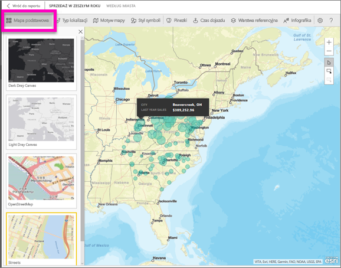

### Typ lokalizacji
Komponent ArcGIS Maps for Power BI automatycznie wykrywa najlepszy sposób wyświetlania danych na mapie. Wybierana jest opcja Punkty lub Granice. Opcje typu lokalizacji umożliwiają dostosowanie wybranej opcji.

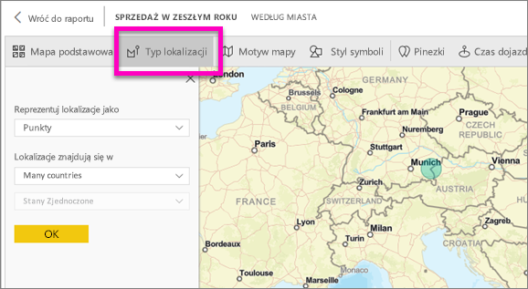

Opcja **Granice** będzie działać tylko wtedy, gdy dane zawierają standardowe wartości geograficzne. Esri automatycznie określa kształt do wyświetlenia na mapie. Standardowe wartości geograficzne obejmują kraje, prowincje, kody pocztowe itp. Podobnie jak w przypadku geokodowania, usługa Power BI może nie wykryć domyślnie, że pole powinno być granicą lub może nie mieć granicy dla danych.  

### Motyw mapy
Udostępniane są cztery motywy map. Motywy Location Only (Tylko lokalizacja) i Size (Rozmiar) są wybierane automatycznie na podstawie pól powiązanych z daną lokalizacją i dodanych do zasobnika **Rozmiar** w okienku Pola usługi Power BI. Aktualnie używany zasobnik to **Rozmiar**, więc zmieńmy go na **Mapę cieplną**.  

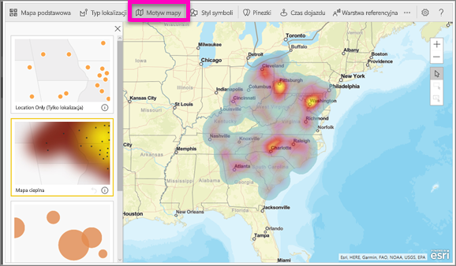

<table>
<tr><th>Motyw</th><th>Opis</th>
<tr>
<td>Location Only (Tylko lokalizacja)</td>
<td>Geograficzne nakreślenie punktów danych lub wypełnionych granic na mapie na podstawie ustawień w opcji Typ lokalizacji.</td>
</tr>
<tr>
<td>Heat Map (Mapa cieplna)</td>
<td>Geograficzne nakreślenie intensywności danych na mapie.</td>
</tr>
<tr>
<td>Size (Rozmiar)</td>
<td>Geograficzne nakreślenie punktów danych na mapie, których rozmiar jest określany na podstawie wartości w zasobniku rozmiaru w okienku pól.</td>
</tr>
<tr>
<td>Clustering (Klastrowanie)</td>
<td>Geograficzne nakreślenie liczby punktów danych w regionach na mapie. </td>
</tr>
</table>

### Styl symboli
Style symboli pozwalają dostosować sposób prezentowania danych na mapie. Style symboli działają kontekstowo na podstawie wybranego typu lokalizacji i motywu mapy. W poniższym przykładzie jako Typ lokalizacji wybrano **Rozmiar** i dokonano kilku zmian przezroczystości, stylu i rozmiaru.

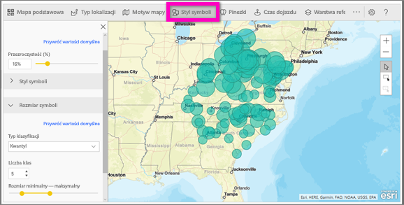

### Pinezki
Przyciągnij uwagę do konkretnych punktów na mapie, dodając pinezki.  

1. Wybierz kartę **Pinezki**.
2. W polu wyszukiwania wpisz słowa kluczowe (na przykład adresy, miejsca lub punkty orientacyjne) i wybierz z listy rozwijanej. Symbol zostanie wyświetlony na mapie, a mapa zostanie automatycznie przybliżona, by uwzględnić lokalizację. Wyniki wyszukiwania są zapisywane jako karty lokalizacji w okienku Pinezki. Można zapisać maksymalnie 10 kart lokalizacji.
   
   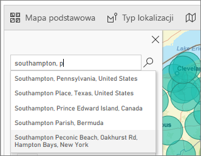
3. Usługa Power BI dodaje pinezkę dla tej lokalizacji i pozwala zmienić kolor tej pinezki.
   
   
4. Dodaj i usuń pinezki.
   
   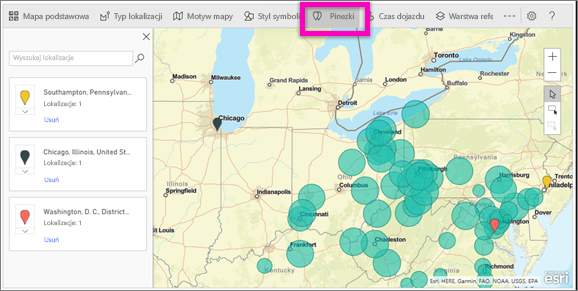

### Czas dojazdu
Okienko Czas dojazdu pozwala wybrać lokalizację, a następnie określić, jakie inne lokalizacje na mapie znajdują się w promieniu określonej odległości lub czasu dojazdu.  
    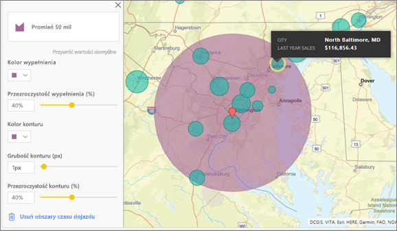

1. Zaznacz kartę **Czas dojazdu** i wybierz narzędzie pojedynczego lub wielokrotnego wyboru. Za pomocą narzędzia pojedynczego wyboru wybierz pinezkę Waszyngton D.C.
    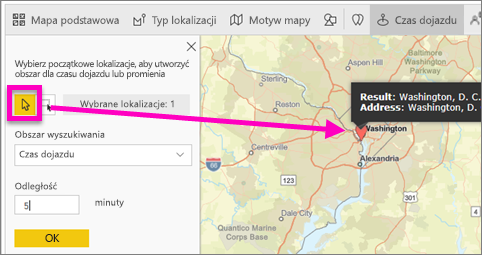
   
   > [!TIP]
   > Łatwiej wybrać lokalizację, przybliżając mapę (za pomocą ikony +).
   > 
   > 
2. Przyjmijmy, że planujesz lot do Waszyngtonu na kilka dni i chcesz sprawdzić, które sklepy znajdują się w rozsądnej odległości do jazdy samochodem. Zmień wartość w polu Obszar wyszukiwania na **Promień** oraz odległość na **50** mil, a następnie naciśnij przycisk OK.    
   
    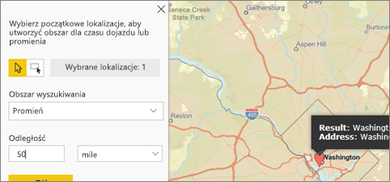
3. Promień zostanie wyświetlony na fioletowo. Wybierz dowolną lokalizację, aby wyświetlić jej szczegóły. Opcjonalnie możesz sformatować ten promień, zmieniając jego kolor i kontur.
   
    

### Warstwa referencyjna
#### Warstwa referencyjna — dane demograficzne
Komponent ArcGIS Maps for Power BI oferuje szereg warstw demograficznych, które pomagają nakreślić kontekst dla danych z usługi Power BI.

1. Zaznacz kartę **Warstwa referencyjna** i wybierz pozycję **Dane demograficzne**.
2. Każda dostępna warstwa ma pole wyboru. Dodaj znacznik wyboru, aby dodać daną warstwę do mapy.  W tym przykładzie dodaliśmy średni dochód gospodarstwa domowego. 
   
    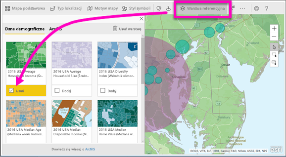
3. Każda warstwa jest również interaktywna. Można umieścić kursor na bąbelku, aby wyświetlić szczegóły, a także kliknąć przyciemniony obszar na mapie, aby wyświetlić szczegóły. 
   
    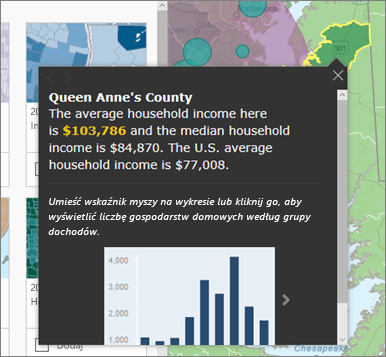

#### Warstwa referencyjna — ArcGIS
Usługa ArcGIS Online umożliwia organizacjom publikowanie publicznych map internetowych. Ponadto firma Esri udostępnia zestaw wyselekcjonowanych map internetowych za pośrednictwem witryny Living Atlas. Na karcie ArcGIS można wyszukiwać wszystkie publiczne mapy internetowe lub mapy usługi Living Atlas i dodawać je do mapy jako warstwy referencyjne.

1. Zaznacz kartę **Warstwa referencyjna** i wybierz pozycję **ArcGIS**.
2. Wprowadź terminy wyszukiwania, a następnie wybierz warstwę mapy. W tym przykładzie wybraliśmy dystrykty kongresowe w USA.
   
    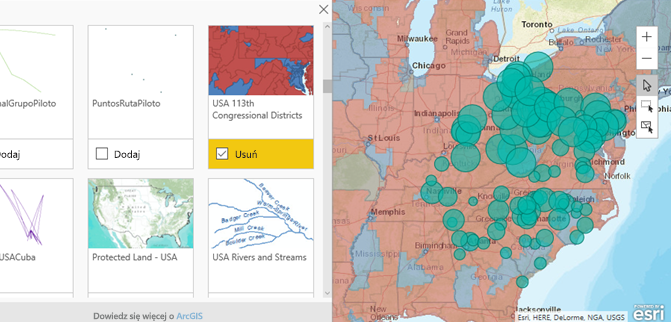
3. Aby wyświetlić szczegóły, wybierz zacieniony obszar, aby otworzyć narzędzie *Wybierz z warstwy referencyjnej*: użyj narzędzia wybierania z warstwy referencyjnej, aby zaznaczyć granice lub obiekty w warstwie referencyjnej.

 

## Wybieranie punktów danych
Komponent ArcGIS Maps for Power BI umożliwia trzy tryby wybierania.

Zmień tryb wybierania za pomocą przełącznika:

 Umożliwia wybranie poszczególnych punktów danych.

 Rysuje prostokąt na mapie i wybiera zawarte w nim punkty danych.

 Umożliwia użycie granic lub wielokątów w ramach warstwy referencyjnej w celu wybrania zawartych w nich punktów danych.

> [!NOTE]
> Maksymalnie można zaznaczyć 250 punktów danych jednocześnie.
> 
> 

 

## Uzyskiwanie pomocy
Firma **Esri** udostępnia [kompleksową dokumentację](https://go.microsoft.com/fwlink/?LinkID=828772) dotyczącą zestawu funkcji komponentu **ArcGIS Maps for Power BI**.

W ramach [wątku społeczności usługi Power BI związanego z komponentem **ArcGIS Maps for Power BI**](https://go.microsoft.com/fwlink/?LinkID=828771) można zadawać pytania, znajdować najnowsze informacje, zgłaszać problemy i szukać odpowiedzi.

Jeśli masz sugestię dotyczącą tego, co można poprawić, prześlij ją na [listę pomysłów usługi Power BI](https://ideas.powerbi.com).

 

## Zarządzanie korzystaniem z komponentu ArcGIS Maps for Power BI w organizacji
Usługa Power BI zapewnia użytkownikom, administratorom dzierżawy i administratorom IT możliwość wyboru, czy chcą korzystać z komponentu ArcGIS Maps for Power BI.

**Opcje użytkownika** W programie Power BI Desktop użytkownicy mogą uniemożliwić korzystanie z komponentu ArcGIS Maps for Power BI, wyłączając go w **opcjach** na karcie Zabezpieczenia. Po wyłączeniu mapy ArcGIS nie będą domyślnie ładowane.

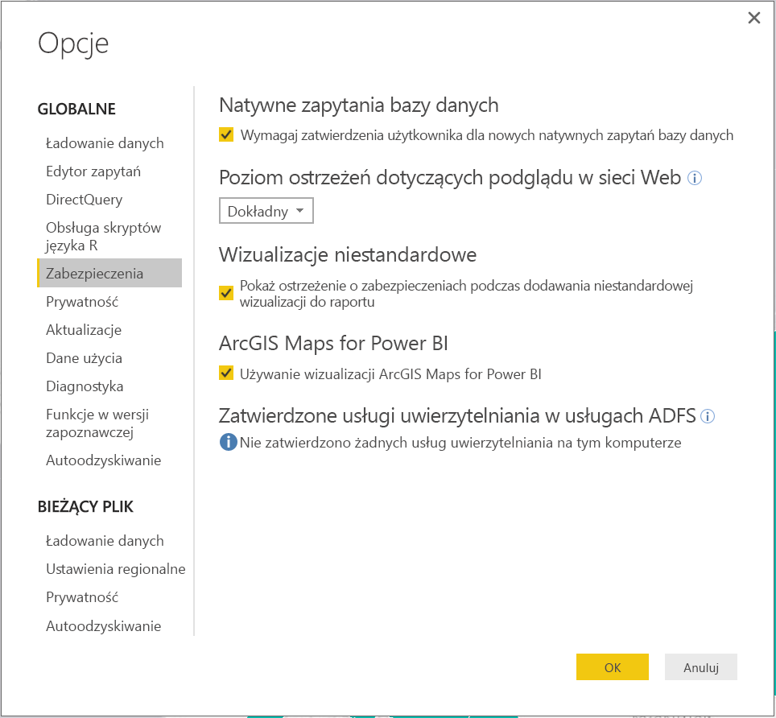

W usłudze Power BI użytkownicy mogą uniemożliwić korzystanie z komponentu ArcGIS Maps for Power BI, wyłączając go w opcjach użytkownika na karcie ArcGIS Maps for Power BI. Po wyłączeniu mapy ArcGIS nie będą domyślnie ładowane.

**Opcje administratora dzierżawy** W witrynie PowerBI.com administratorzy dzierżawy mogą uniemożliwić wszystkim użytkownikom dzierżawy korzystanie z komponentu ArcGIS Maps for Power BI przez jego wyłączenie. W takim przypadku usługa Power BI nie będzie wyświetlać ikony komponentu ArcGIS Maps for Power BI w okienku wizualizacji.

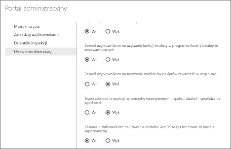

**Opcje administratora IT** Program Power BI Desktop obsługuje możliwość wykorzystania **zasad grupy** w celu wyłączenia komponentu ArcGIS Maps for Power BI na komputerach należących do organizacji.

<table>
<tr><th>Atrybut</th><th>Wartość</th>
</tr>
<tr>
<td>key</td>
<td>Software\Policies\Microsoft\Power BI Desktop&lt;/td&gt;
</tr>
<tr>
<td>valueName</td>
<td>EnableArcGISMaps</td>
</tr>
</table>

Wartość 1 (dziesiętna) włącza komponent ArcGIS Maps for Power BI.

Wartość 0 (dziesiętna) wyłącza komponent ArcGIS Maps for Power BI.

## Istotne zagadnienia i ograniczenia
Komponent ArcGIS Maps for Power BI jest dostępny w ramach następujących usług i aplikacji:

<table>
<tr><th>Usługa/aplikacja</th><th>Dostępność</th></tr>
<tr>
<td>Power BI Desktop</td>
<td>Tak</td>
</tr>
<tr>
<td>Usługa Power BI (PowerBI.com)</td>
<td>Tak</td>
</tr>
<tr>
<td>Aplikacje mobilne Power BI</td>
<td>Tak</td>
</tr>
<tr>
<td>Usługa Power BI — publikowanie w Internecie</td>
<td>Nie</td>
</tr>
<tr>
<td>Power BI Embedded</td>
<td>Nie</td>
</tr>
<tr>
<td>Osadzanie usługi Power BI (PowerBI.com)</td>
<td>Nie</td>
</tr>
</table>

W usługach lub aplikacjach, w których komponent ArcGIS Maps for Power BI nie jest dostępny, będzie wyświetlana pusta wizualizacja z logo usługi Power BI.

Geokodowanych jest tylko 1500 pierwszych adresów. Limit 1500 adresów nie dotyczy geokodowania nazw miejsc ani krajów.

 

**Jak współpracują ze sobą komponenty ArcGIS Maps for Power BI?**
Komponent ArcGIS Maps for Power BI jest dostarczany przez firmę Esri (www.esri.com). Korzystanie z komponentu ArcGIS Maps for Power BI objęte jest treścią ogólnych [warunków](https://go.microsoft.com/fwlink/?LinkID=8263222) oraz [zasadami ochrony prywatności](https://go.microsoft.com/fwlink/?LinkID=826323) firmy Esri. Użytkownicy usługi Power BI, którzy chcą korzystać z wizualizacji komponentu ArcGIS Maps for Power BI, muszą zaakceptować okno dialogowe ze zgodą (zobacz Zgoda użytkownika, aby uzyskać więcej szczegółów).  Korzystanie z komponentu ArcGIS Maps for Power BI firmy Esri objęte jest treścią ogólnych warunków oraz zasadami ochrony prywatności firmy Esri, do których można przejść z okna dialogowego zgody użytkownika. Każdy użytkownik musi wyrazić zgodę przed pierwszym użyciem komponentu ArcGIS Maps for Power BI. Gdy użytkownik zaakceptuje zgodę, dane powiązane z elementem wizualnym zostaną wysłane do usług Esri co najmniej w celu geokodowania, czyli przekształcania informacji o lokalizacji na długość i szerokość geograficzną, którą można przedstawić na mapie. Należy założyć, że wszelkie dane powiązane z wizualizacją danych mogą zostać wysłane do usług Esri. Firma Esri zapewnia usługi, takie jak mapy podstawowe, narzędzia analizy przestrzennej, geokodowanie itp. Element wizualny komponentu ArcGIS Maps for Power BI wchodzi w interakcję z tymi usługami przy użyciu połączenia SSL chronionego przez certyfikat dostarczony i utrzymywany przez firmę Esri. Dodatkowe informacje o komponencie ArcGIS Maps for Power BI można uzyskać na stronie [ArcGIS Maps for Power BI — strona produktu](https://www.esri.com/powerbi) firmy Esri.

Gdy użytkownik rejestruje się w subskrypcji Plus oferowanej przez firmę Esri za pośrednictwem komponentu ArcGIS Maps for Power BI, wchodzi w bezpośrednią relację z firmą Esri. Usługa Power BI nie wysyła informacji osobistych dotyczących użytkownika do firmy Esri. Użytkownik loguje się i ufa aplikacji usługi AAD firmy Esri przy użyciu własnej tożsamości usługi AAD. Dzięki temu użytkownik udostępnia swoje informacje osobiste bezpośrednio firmie Esri. Gdy użytkownik dodaje zawartość subskrypcji Plus do elementu wizualnego komponentu ArcGIS Maps for Power BI, inni użytkownicy usługi Power BI również będą potrzebować subskrypcji Plus od firmy Esri, aby wyświetlić lub edytować tę zawartość. 

W przypadku szczegółowych pytań technicznych dotyczących działania komponentu ArcGIS Maps for Power BI firmy Esri należy skontaktować się z firmą Esri za pośrednictwem ich strony pomocy technicznej.

**Czy korzystanie z komponentu ArcGIS Maps for Power BI wiąże się z opłatami?**

Komponent ArcGIS Maps for Power BI jest dostępny dla wszystkich użytkowników usługi Power BI bez konieczności ponoszenia dodatkowych kosztów. Jak wspomniano wcześniej w tym artykule, jest to komponent dostarczany przez firmę **Esri**, dlatego jego używanie podlega ogólnym warunkom oraz zasadom ochrony prywatności określonym przez firmę **Esri**.

**Program Power BI Desktop wyświetla błąd informujący o przepełnieniu pamięci podręcznej**

Jest to błąd, którego naprawianie jest w toku.  W międzyczasie w celu wyczyszczenia pamięci podręcznej spróbuj usunąć pliki w tej lokalizacji: C:\Users\\AppData\Local\Microsoft\Power BI Desktop\CEF, a następnie uruchom ponownie usługę Power BI.

**Czy komponent ArcGIS Maps for Power BI obsługuje pliki kształtów Esri?**

Komponent ArcGIS Maps for Power BI automatycznie wykrywa standardowe granice, takie jak kraje i regiony, województwa oraz kody pocztowe. Jeśli chcesz podać własne kształty, możesz to zrobić za pomocą komponentu [Shape Maps for Power BI Desktop (wersja zapoznawcza)](visuals/desktop-shape-map.md).

**Czy można wyświetlać mapy ArcGIS w trybie offline?**

Nie, usługa Power BI wymaga połączenia z siecią, aby wyświetlać mapy.

**Czy z poziomu usługi Power BI można połączyć się z kontem usługi ArcGIS Online?**

Jeszcze nie. [Zagłosuj na ten pomysł](https://ideas.powerbi.com/forums/265200-power-bi-ideas/suggestions/9154765-arcgis-geodatabases), a otrzymasz od nas wiadomość e-mail, gdy rozpoczniemy pracę nad tą funkcją.  

## Następne kroki
[Wchodzenie w interakcje z udostępnioną mapą ArcGIS](visuals/power-bi-visualizations-arcgis.md)

[Wpis na blogu informujący o dostępności komponentu ArcGIS Maps for Power BI](https://powerbi.microsoft.com/blog/announcing-arcgis-maps-for-power-bi-by-esri-preview/)

Masz więcej pytań? [Zadaj pytanie społeczności usługi Power BI](http://community.powerbi.com/)

