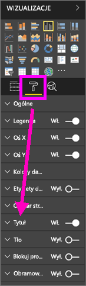
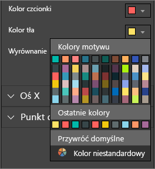
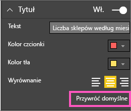
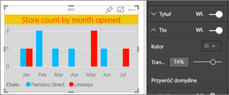
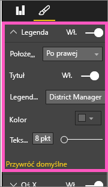
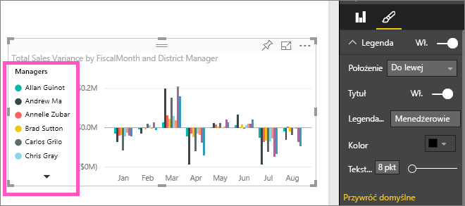

# Dostosowywanie tytułów, legend i tła wizualizacji
W tym samouczku poznasz kilka sposobów dostosowywania wizualizacji.   Istnieje wiele opcji dostosowywania wizualizacji. Najlepiej zapoznać się z nimi, eksplorując okienko Formatowanie (wybierz ikonę wałka do malowania).  Aby ułatwić rozpoczęcie pracy, w tym artykule przedstawiono, jak dostosować tytuł, legendę i tło wizualizacji.  

Nie wszystkie wizualizacje można dostosowywać, [zapoznaj się z pełną listą](#list).  

Zobacz, jak Amanda dostosowuje wizualizacje swojego raportu (przewiń film wideo do przodu do czasu 4:50). Następnie postępuj zgodnie z instrukcjami poniżej filmu wideo, aby wypróbować tę funkcję samodzielnie w odniesieniu do swoich danych.

<iframe width="560" height="315" src="https://www.youtube.com/embed/IkJda4O7oGs" frameborder="0" allowfullscreen></iframe>

### Wymagania wstępne
- Usługa Power BI lub program Power BI Desktop
- Przykład Retail Analysis

## Dostosowywanie tytułów wizualizacji w raportach
Aby to zrealizować, zaloguj się do usługi Power BI (app.powerbi.com) i [otwórz Próbkę analizy handlu detalicznego](sample-datasets.md) w [widoku do edycji](service-interact-with-a-report-in-editing-view.md).

> [!NOTE]
> Wizualizacja przypięta do pulpitu nawigacyjnego staje się kafelkiem pulpitu nawigacyjnego.  Kafelki także można dostosowywać, [podając nowe tytuły, podtytuły i hiperlinki oraz zmieniając rozmiar](service-dashboard-edit-tile.md).
> 
> 

1. Przejdź do strony „New Stores” raportu i wybierz wykres kolumnowy „Open Store Count by Open Month...”.
2. W okienku Wizualizacje wybierz ikonę wałka do malowania, aby wyświetlić opcje formatowania  i wybierz pozycję **Tytuł**, aby rozszerzyć tę sekcję.  

   
3. **Tytuł** możesz włączać i wyłączać, ustawiając suwak w pozycji Włączone i Wyłączone. Na razie zostaw go w pozycji **Włączone**.  

   
4. Zmień **Tytuł tekstu**, wpisując wartość **Store count by month opened** (Liczba sklepów według miesiąca otwarcia) w polu tekstowym.  
5. Zmień **Kolor czcionki** na pomarańczowy i **Kolor tła** na żółty.

   * Wybierz listę rozwijaną oraz kolor z **kolorów motywu**, **ostatnich kolorów** lub **kolorów niestandardowych**.
   * Wybierz listę rozwijaną, aby zamknąć okno kolorów.  
     

   Zawsze możesz przywrócić kolory domyślne, wybierając pozycję **Przywróć domyślne** w oknie kolorów.
6. Zwiększ rozmiar tekstu do 12.
7. Ostatnim dostosowaniem, jakie wykonamy w zakresie tytułu wykresu, będzie wyrównanie go do środka wizualizacji. Domyślnym położeniem tytułu jest wyrównanie do lewej.  
   

    Na tym etapie samouczka **tytuł** wykresu kolumnowego powinien wyglądać mniej więcej tak:  
    

    Aby cofnąć wszystkie dokonane dostosowania tytułu, wybierz pozycję **Przywróć domyślne** w dolnej części okienka dostosowywania **Tytuł**.  
    

## Dostosowywanie tła wizualizacji
Przy zaznaczonym wykresie kolumnowym rozwiń opcje tła.

1. Tło możesz włączać i wyłączać, ustawiając suwak w pozycji Włączone i Wyłączone. Na razie zostaw go w pozycji **Włączone**.
2. Zmień kolor tła na Szary — 74%.

   * Wybierz listę rozwijaną oraz kolor szary z **kolorów motywu**, **ostatnich kolorów** lub **kolorów niestandardowych**.
   * Zmień Przezroczystość na 74%.   
     

   Aby cofnąć wszystkie dokonane dostosowania tła, wybierz pozycję **Przywróć domyślne** w dolnej części okienka dostosowywania **Tło**.

## Dostosowywanie legend wizualizacji
1. Otwórz stronę **Overview** raportu i wybierz wykres „Total Sales Variance by FiscalMonth and District Manager”.
2. Na karcie Wizualizacja wybierz ikonę pędzla, aby otworzyć okienko formatowania.  
3. Rozwiń opcje **Legenda**.

      
4. Legendę możesz włączać i wyłączać, ustawiając suwak w pozycji Włączone i Wyłączone. Na razie zostaw go w pozycji **Włączone**.
5. Przenieś legendę na lewą stronę wizualizacji.    
6. Dodaj tytuł legendy, przełączając suwak **Tytuł** na pozycję **Włączone** i wpisując w polu **Nazwa legendy** nazwę **Managers** (Menedżerowie).
   

   Aby cofnąć wszystkie dokonane dostosowania legendy, wybierz pozycję **Przywróć domyślne** w dolnej części okienka dostosowywania **Legenda**.

## Typy wizualizacji, które można dostosowywać

| Wizualizacja | Tytuł | Tło | Legenda |
|:--- |:--- |:--- |:--- |
| obszar |tak |tak |tak |
| słupek |tak |tak |tak |
| karta |tak |tak |nie dotyczy |
| karta z wieloma wierszami |tak |tak |nie dotyczy |
| kolumna |tak |tak |tak |
| kombi |tak |tak |tak |
| pierścień |tak |tak |tak |
| kartogram |tak |tak |tak |
| lejek |tak |tak |nie dotyczy |
| wskaźnik |tak |tak |nie dotyczy |
| wskaźnik KPI |tak |tak |nie dotyczy |
| linia |tak |tak |tak |
| mapa |tak |tak |tak |
| macierz |tak |tak |nie dotyczy |
| koło |tak |tak |tak |
| wykres punktowy |tak |tak |tak |
| fragmentator |tak |tak |nie dotyczy |
| tabela |tak |tak |nie dotyczy |
| pole tekstowe |nie |tak |nie dotyczy |
| mapa drzewa |tak |tak |tak |
| wykres kaskadowy |tak |tak |tak |

## Następne kroki
[Dostosowywanie osi X i osi Y](power-bi-visualization-customize-x-axis-and-y-axis.md)  
[Dostosowywanie kolorów i właściwości osi](service-getting-started-with-color-formatting-and-axis-properties.md)  
[Power BI — podstawowe pojęcia](service-basic-concepts.md)  
Masz więcej pytań? [Odwiedź społeczność usługi Power BI](http://community.powerbi.com/)

