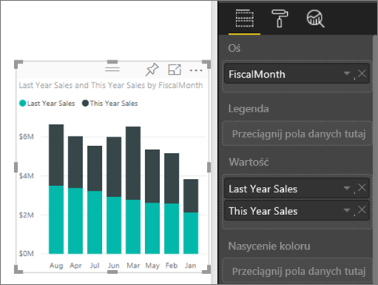
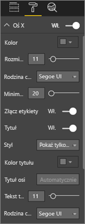
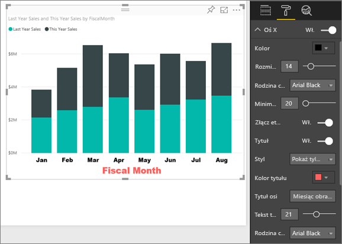
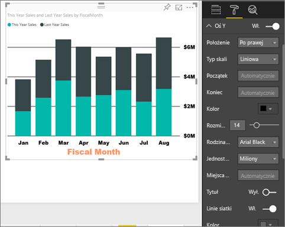
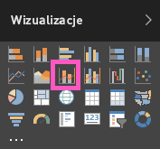
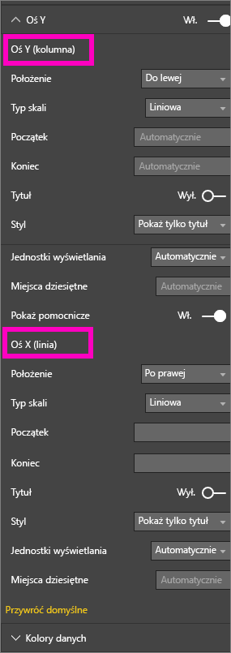
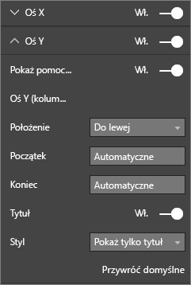

# Dostosowywanie właściwości osi X i Y (samouczek)
W tym samouczku poznasz różne sposoby na dostosowywanie osi X i Y wizualizacji. Nie wszystkie wizualizacje mają osie i nie wszystkie można dostosowywać. Na przykład wykresy kołowe nie mają osi. Opcje dostosowywania różnią się w zależności od wizualizacji, a liczba dostępnych opcji jest zbyt duża, aby można je opisać w ramach jednego artykułu. Przyjrzymy się niektórym z najczęściej używanych dostosowań osi i opiszemy szerzej, jak korzystać z karty formatowania wizualizacji na kanwie raportu usługi Power BI.  

> [!NOTE]
> Ten temat dotyczy zarówno usługi Power BI, jak i programu Power BI Desktop. Dostosowania dostępne po wybraniu ikony **Formatowanie** (ikona wałka do malowania ), są również dostępne w programie Power BI Desktop.  
>
>

Obejrzyj, jak Amanda dostosowuje osi X i Y oraz prezentuje różne sposoby kontrolowania łączenia podczas uogólniania i przechodzenia do szczegółów. Następnie postępuj zgodnie ze szczegółowymi instrukcjami zamieszczonymi poniżej filmu, aby spróbować zrobić to samodzielnie, korzystając z przykładowego zestawu danych Retail Analysis.

<iframe width="560" height="315" src="https://www.youtube.com/embed/9DeAKM4SNJM" frameborder="0" allowfullscreen></iframe>

## Dostosowywanie osi X wizualizacji w raportach
## Tworzenie wizualizacji wykresu skumulowanego
Zaloguj się do usługi Power BI i otwórz raport **przykładowego zestawu danych Retail Analysis** w [widoku do edycji](service-interact-with-a-report-in-editing-view.md). W tym celu [połącz się z przykładowym zestawem danych Retail Analysis](sample-datasets.md).

1. Utwórz nowy wykres kolumnowy pokazujący wartość sprzedaży w tym roku i poprzednim roku z podziałem na miesiące obrachunkowe.
2. Przekonwertuj go na skumulowany wykres kolumnowy.

    

## Dostosowywanie osi X
1. W okienkach Wizualizacje i Filtry wybierz pozycję **Formatowanie** (ikona wałka do malowania ), aby wyświetlić opcje dostosowywania.
2. Rozwiń opcje osi X.

   
3. Oś X możesz włączać i wyłączać, ustawiając suwak w pozycji Włączone i Wyłączone. Na razie zostaw go w pozycji **Włączone**.  Jednym z powodów, dla którego możesz chcieć wyłączyć oś X, jest pozostawienie miejsca dla innych danych.

    
4. Sformatuj kolor, rozmiar i czcionkę tekstu. W tym przykładzie ustawiliśmy **kolor** tekstu na czarny, **rozmiar tekstu** na 14 oraz **czcionkę** na Arial Black.  
5. Włącz tytuł osi X, przesuwając suwak w pozycję **Włączone** i wyświetl nazwę osi X — w tym przypadku **FiscalMonth**.  
6. Sformatuj kolor, rozmiar i czcionkę tytułu.  W tym przykładzie zmieniliśmy **Kolor tytułu** na pomarańczowy, **Tytuł osi** na **Miesiąc obrachunkowy** i **Rozmiar tekstu tytułu** na 21.
7. Aby posortować według miesiąca obrachunkowego, wybierz wielokropek (...) w prawym górnym rogu wizualizacji, a następnie pozycję **Sortuj według FiscalMonth**.

    Po dokonaniu tych modyfikacji wykres kolumnowy powinien wyglądać mniej więcej tak:

     

Aby cofnąć wszystkie dokonane dostosowania osi X, wybierz pozycję **Przywróć domyślne** w dolnej części okienka dostosowywania **osi X**.

## Dostosowywanie osi Y
1. Rozwiń opcje osi Y.

   

2. Oś Y możesz włączać i wyłączać, ustawiając suwak w pozycji Włączone i Wyłączone. Na razie zostaw go w pozycji **Włączone**.  Jednym z powodów, dla którego możesz chcieć wyłączyć oś Y, jest pozostawienie miejsca dla innych danych.
   
    
3. Przenieś **Położenie** osi Y w prawą stronę.
4. Sformatuj kolor, rozmiar i czcionkę tekstu. W tym przykładzie ustawiliśmy **kolor** tekstu na czarny, **rozmiar tekstu** na 14 oraz **czcionkę** na Arial Black.  
5. Pozostaw ustawienie Miliony dla pozycji **Jednostki wyświetlania** oraz wartość zero dla pozycji **Miejsca dziesiętne wartości**.
6. W tym przypadku tytuł osi Y nie poprawi wizualizacji, zatem zostawimy **Tytuł** wyłączony.  
7. Zadbajmy o wyróżnienie linii siatki, zmieniając **Kolor** na ciemnoszary oraz zwiększając **Pociągnięcie** na 2.

    Po dokonaniu tych modyfikacji wykres kolumnowy powinien wyglądać mniej więcej tak:

     

## Dostosowywanie wizualizacji z dwoma osiami Y
Najpierw utworzymy wykres kombi, który prezentuje wpływ liczby sklepów na sprzedaż.  Będzie to ten sam wykres, który tworzyliśmy w ramach [samouczka dotyczącego wykresów kombi](power-bi-visualization-combo-chart.md). Następnie sformatujemy obie osie.

### Tworzenie wykresu z dwoma osiami
1. Utwórz nowy wykres liniowy, który śledzi wartość **Sales > Gross Margin last year %** względem wartości **Time > FiscalMonth**.
2. Posortuj wizualizację według miesiąca, wybierając wielokropek (...) i pozycję **Sortuj według miesiąca**

    

>[NOTE]: For help sorting by month, see [sorting by other criteria](power-bi-report-change-sort.md#other)
1. W styczniu % marży brutto był równy 35%, wzrósł do 45% w kwietniu, spadł w lipcu i ponownie wzrósł w sierpniu. Czy podobny wzorzec sprzedaży wystąpił w poprzednim i bieżącym roku?
2. Dodaj pozycje **This Year Sales > Value** i **Last Year Sales** do wykresu liniowego. Skala wartości **Gross Margin last year %** (niebieska linia biegnąca wzdłuż linii siatki 0%) jest znacznie mniejsza niż skala wartości **Sales**, co utrudnia ich porównanie. Jednocześnie etykiety wartości procentowych na osi Y wyglądają groteskowo.      

   
5. Aby ułatwić odczytanie i interpretację wizualizacji, przekonwertuj wykres liniowy na wykres liniowy i skumulowany kolumnowy.

   

6. Przeciągnij pozycję **Gross Margin Last Year %** z obszaru **Wartości w kolumnie** do obszaru **Wartości liniowe**. W efekcie uzyskasz utworzony wyżej skumulowany wykres kolumnowy ***oraz*** wykres liniowy.  (Opcjonalnie użyj poznanych wyżej informacji, aby sformatować kolor i rozmiar czcionki osi).
   

   Usługa Power BI utworzy dwie osie, dzięki czemu zestawy danych można skalować w różny sposób, czyli po lewej stronie są mierzone pieniądze, po prawej stronie są mierzone procenty.

   

### Formatowanie pomocniczej osi Y
1. W okienku **Wizualizacje** wybierz ikonę wałka do malowania, aby wyświetlić opcje formatowania.
2. Rozwiń opcje osi Y, wybierając strzałkę w dół.
3. Przewijaj listę do momentu, aż znajdziesz opcję **Pokaż pomocniczą**. Przełącz opcję **Pokaż pomocniczą** z pozycji **Wyłączone** na **Włączone**.

   

   
4. (Opcjonalnie) Dostosuj obie osie. Przełączenie opcji **Położenie** osi kolumn lub osi linii spowoduje zamianę stron osi.

   

### Dodawanie tytułów do obu osi
W przypadku skomplikowanych wizualizacji, jak ta, warto dodać tytuły osi.  Tytuły pozwalają współpracownikom lepiej zrozumieć zawartość wizualizacji.

1. Przełącz pozycję **Tytuł** na **Włączone** dla **osi Y (kolumnowy)** i **osi Y (liniowy)**.
2. Ustaw wartość **Styl** na **Pokaż tylko tytuł**.

   
3. Wykres kombi wyświetli teraz dwie osie, obie z tytułami.

   

Aby uzyskać więcej informacji, zobacz [Porady i wskazówki dotyczące formatowania kolorów, etykietowania oraz właściwości osi](service-tips-and-tricks-for-color-formatting.md).

## Istotne zagadnienia i rozwiązywanie problemów
Jeśli właściciel raportu określi kategorię typ daty dla osi X, zostanie wyświetlona opcja **Typ** pozwalająca na wybór wartości ciągłych lub podzielonych na kategorie.

## Następne kroki
Więcej informacji o [wizualizacjach w raportach usługi Power BI](power-bi-report-visualizations.md)

[Dostosowywanie ](power-bi-visualization-customize-title-background-and-legend.md)[tytułów, tła i legendy](power-bi-visualization-customize-title-background-and-legend.md)

[Dostosowywanie kolorów i właściwości osi](service-getting-started-with-color-formatting-and-axis-properties.md)

[Power BI — podstawowe pojęcia](service-basic-concepts.md)

Masz więcej pytań? [Odwiedź społeczność usługi Power BI](http://community.powerbi.com/)
