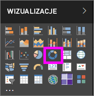
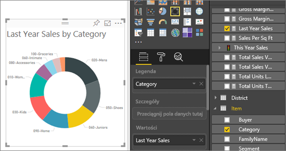

# Wykresy pierścieniowe w usłudze Power BI (samouczek)
Wykres pierścieniowy jest podobny do wykresu kołowego, ponieważ również pokazuje zależność poszczególnych części względem całości. Jedyna różnica polega na tym, że jego środek jest pusty, dlatego możliwe jest dodanie etykiety lub ikony.

## Tworzenie wykresu pierścieniowego
W poniższych instrukcjach użyto przykładu Retail Analysis, aby utworzyć wykres pierścieniowy przedstawiający tegoroczne dane sprzedaży według kategorii. Aby je wykonać, [pobierz przykład](sample-datasets.md) dla usługi Power BI (app.powerbi.com) lub dla programu Power BI Desktop.

1. Rozpocznij od [pustej strony raportu](power-bi-report-add-page.md) i wybierz pole **SalesStage** \> **Sales Stage**. Jeśli używasz usługi Power BI, upewnij się, że raport jest otwarty w [widoku do edycji](service-interact-with-a-report-in-editing-view.md).

2. W okienku Pola wybierz pozycję **Sales** \> **Last Year Sales**.  
   
3. W okienku Wizualizacje wybierz ikonę wykresu pierścieniowego , aby przekonwertować wykres słupkowy na wykres pierścieniowy. Jeśli pozycja **Last Year Sales** nie znajduje się w obszarze **Wartości**, przeciągnij ją w to miejsce.
     
   

4. Wybierz pozycję **Element** \> **Kategoria**, aby dodać ją do obszaru **Legenda**. 
     
    

5. Opcjonalnie [dostosuj rozmiar i kolor tekstu wykresu](power-bi-visualization-customize-title-background-and-legend.md). 

## Istotne zagadnienia i rozwiązywanie problemów
* Suma wartości wykresu pierścieniowego musi wynosić 100%.
* Zbyt wiele kategorii utrudnia odczyt i interpretację.
* Wykresy pierścieniowe najlepiej sprawdzają się w przypadku porównywania poszczególnych sekcji w odniesieniu do całości, a nie porównywania ich między sobą. 

## Następne kroki
[Raporty w usłudze Power BI](service-reports.md)

[Typy wizualizacji w usłudze Power BI](power-bi-visualization-types-for-reports-and-q-and-a.md)

[Wizualizacje w raportach usługi Power BI](power-bi-report-visualizations.md)

[Power BI — podstawowe pojęcia](service-basic-concepts.md)

Masz więcej pytań? [Odwiedź społeczność usługi Power BI](http://community.powerbi.com/)

