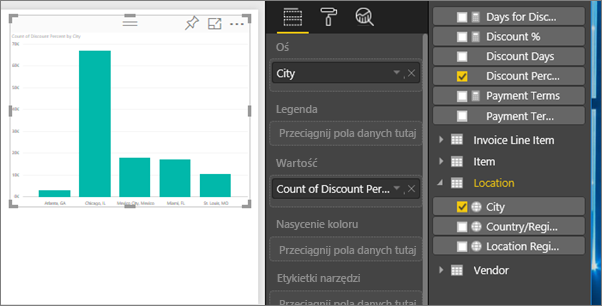
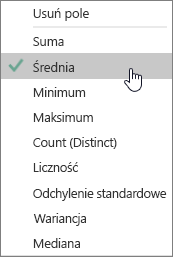
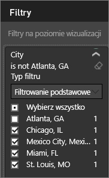
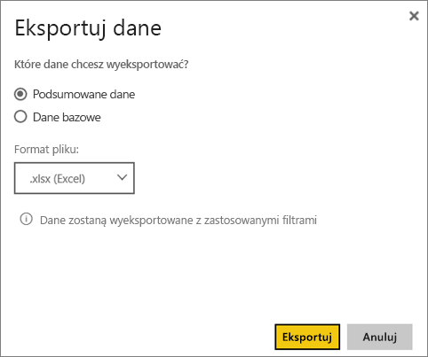

# Eksportowanie danych z wizualizacji
Jeśli chcesz zobaczyć dane, które zostały użyte do utworzenia wizualizacji, możesz [wyświetlić te dane w usłudze Power BI](service-reports-show-data.md) lub wyeksportować je do programu Excel w formie pliku xlsx lub csv.   

Zobacz, jak Will eksportuje dane z jednej z wizualizacji w swoim raporcie, zapisuje je w pliku xlsx i otwiera je w programie Excel. Następnie postępuj zgodnie ze szczegółowymi instrukcjami poniżej wideo, aby wypróbować to samodzielnie.

<iframe width="560" height="315" src="https://www.youtube.com/embed/KjheMTGjDXw" frameborder="0" allowfullscreen></iframe>

## Z wizualizacji w pulpicie nawigacyjnym usługi Power BI
1. Wybierz wielokropek w prawym górnym rogu wykresu wizualizacji.
   
    
2. Wybierz ikonę **Eksportuj dane**.
   
    
3. Dane są eksportowane do pliku CSV. Jeśli wizualizacja jest filtrowana, pobrane dane również będą filtrowane.
4. Przeglądarka wyświetli monit o zapisanie pliku.  Po zapisaniu otwórz plik csv w programie Excel.
   
    

## Z wizualizacji w raporcie
Aby skorzystać z tej metody, otwórz[raport próbnych danych dotyczących analizy zakupów](sample-procurement.md) w [Widoku edycji](service-reading-view-and-editing-view.md). [Dodaj nową pustą stronę raportu](power-bi-report-add-page.md). Następnie wykonaj kroki opisane poniżej, aby dodać agregację i filtr na poziomie wizualizacji.

1. Utwórz nowy wykres kolumnowy.  W okienku Pola wybierz opcję **Lokalizacja > Miasto** i **Faktura > Procent rabatu**.   
   
    
2. Zmień agregację dla opcji **Procent rabatu** z **Liczba** na **Średnia**. Na liście Wartość wybierz strzałkę po prawej stronie pozycji **Procent rabatu** (pozycja może być nazwana **Wartość liczbowa procentu rabatu**), a następnie wybierz opcję **Średnia**.
   
    
3. Dodaj filtr do pola **Miasto**, aby usunąć miasto **Atlanta**.
   
   
   
   Teraz możemy wypróbować obie opcje eksportowania danych.
4. Wybierz wielokropek w prawym górnym rogu wykresu wizualizacji. Wybierz opcję **Eksportuj dane**.
   
   
5. Jeśli wizualizacja ma agregację (np. jeśli zmieniono opcję **Liczba** na *Średnia*, **Suma** lub *Minimum*), masz dwie opcje: **Podsumowane dane** i **Dane bazowe**. Aby zrozumieć agregowanie, zobacz [Agregowanie w usłudze Power BI](service-aggregates.md).
   
    
6. Wybierz opcję **Podsumowane dane** > **Eksportuj**, a następnie wybierz format xlsx lub csv. Usługa Power BI eksportuje dane.  W przypadku zastosowania filtrów do wizualizacji dane zostaną wyeksportowane jako dane odfiltrowane. Po wybraniu opcji **Eksportuj** przeglądarka wyświetli monit o zapisanie pliku. Po zapisaniu otwórz plik w programie Excel.
   
   **Podsumowane dane**: wybierz tę opcję, jeśli nie masz agregacji lub jeśli masz agregację, ale nie chcesz widzieć kompletnego podziału. Jeśli na przykład masz wykres słupkowy przedstawiający 4 słupki, otrzymasz 4 wiersze danych. Podsumowane dane są dostępne w formacie xlsx i csv.
   
   W tym przykładzie dane wyeksportowane do programu Excel pokazują jedną sumę dla każdego miasta. Ponieważ odfiltrowaliśmy Atlantę, nie jest uwzględniana w wynikach.  Pierwszy wiersz naszego arkusza przedstawia filtry, które zostały użyte podczas wyodrębniania danych z usługi Power BI.
   
   
7. Teraz spróbuj wybrać opcję **Dane bazowe** > **Eksportuj** i format xlsx. Usługa Power BI eksportuje dane. W przypadku zastosowania filtrów do wizualizacji dane zostaną wyeksportowane jako dane odfiltrowane. Po wybraniu opcji **Eksportuj** przeglądarka wyświetli monit o zapisanie pliku. Po zapisaniu otwórz plik w programie Excel.
   
   >[!WARNING]
   >Eksportowanie danych bazowych umożliwia użytkownikom wyświetlenie wszystkich szczegółowych danych — każdej kolumny w danych. Administratorzy usługi Power BI mogą wyłączyć tę funkcję w organizacji. Jeśli jesteś właścicielem zestawu danych, możesz ustawić zastrzeżone kolumny na „ukryte”, aby nie były wyświetlane na liście pól w programie Power BI Desktop lub usłudze Power BI.
   > 
   > 
   
   **Dane bazowe**: wybierz tę opcję, jeśli wizualizacja zawiera agregację i chcesz zobaczyć wszystkie szczegóły dotyczące danych bazowych. Zasadniczo opcja *Dane bazowe* usuwa agregację. Po wybraniu opcji **Eksportuj** dane zostaną wyeksportowane do pliku xlsx, a przeglądarka wyświetli monit o zapisanie pliku. Po zapisaniu otwórz plik w programie Excel.
   
   W tym przykładzie dane wyeksportowane do programu Excel pokazują jeden wiersza dla każdego wiersza z miastami w zestawie danych oraz procent rabatu dla tego wpisu. Innymi słowy dane są spłaszczone i nie są agregowane. Pierwszy wiersz naszego arkusza przedstawia filtry, które zostały użyte podczas wyodrębniania danych z usługi Power BI.  
   
   

## Ograniczenia i istotne zagadnienia
* Maksymalna liczba wierszy, które można eksportować z programu **Power BI Desktop** do pliku csv to 30 000.
* Maksymalna liczba wierszy, które można eksportować do formatu xlsx w **usłudze Power BI** to 150 000 dla użytkowników wersji Pro oraz 30 000 dla użytkowników wersji bezpłatnej.
* W przypadku używania zapytania bezpośredniego maksymalna ilość danych, które można wyeksportować, to 16 MB. Może to spowodować wyeksportowanie mniejszej liczby wierszy, zwłaszcza wtedy, gdy istnieje wiele kolumn, dane są trudne do skompresowania lub zachodzą inne czynniki zwiększające rozmiar plików i zmniejszające liczbę eksportowanych wierszy.
* Usługa Power BI obsługuje eksportowanie tylko w przypadku wizualizacji korzystających z podstawowych agregacji. Eksportowanie nie jest dostępne w przypadku wizualizacji używających miar modelu lub raportu.
* Wizualizacje niestandardowe oraz wizualizacje języka R nie są obecnie obsługiwane.
* Eksportowanie danych nie jest dostępne w przypadku użytkowników spoza organizacji, którzy używają udostępnionego pulpitu nawigacyjnego. 
* Jeśli w pliku csv znajduje się znak Unicode, tekst w programie Excel może nie być wyświetlany prawidłowo. Chociaż otworzenie pliku w Notatniku będzie działać prawidłowo. Przykłady znaków Unicode to symbole walut i obce słowa. Można obejść ten problem, importując plik csv do programu Excel, zamiast otwierać go bezpośrednio. Aby to zrobić:
  
  1. Otwórz program Excel.
  2. Na karcie **Dane** wybierz opcję **Pobierz dane zewnętrzne** > **Z tekstu**.
* Administratorzy usługi Power BI mają możliwość wyłączenia eksportowania danych.

## Następne kroki
[Pulpity nawigacyjne w usłudze Power BI](service-dashboards.md)  
[Raporty w usłudze Power BI](service-reports.md)  
[Power BI — podstawowe pojęcia](service-basic-concepts.md)

Masz więcej pytań? [Zadaj pytanie społeczności usługi Power BI](http://community.powerbi.com/)

