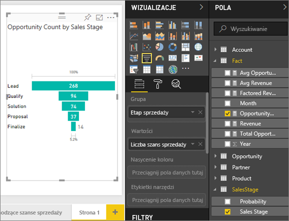
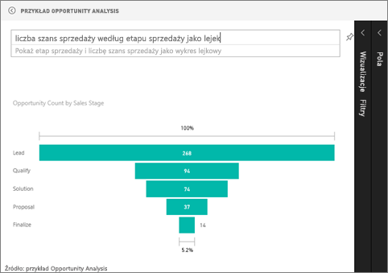

# Wykresy lejkowe
Wykres lejkowy pozwala na graficzne przedstawienie procesu liniowego o sekwencyjnie połączonych etapach. Za przykład może posłużyć wykres lejkowy sprzedaży, który śledzi zachowania klientów na poszczególnych etapach: Potencjalny klient \> Kwalifikowany potencjalny klient \> Prawdopodobny klient \> Umowa \> Finalizacja.  Już na pierwszy rzut oka kształt lejka wskazuje na kondycję śledzonego procesu.

Każdy etap wykresu lejkowego stanowi procent całości. W większości przypadków wykres lejkowy ma kształt lejka — pierwszy etap jest największy, a każdy kolejny jest mniejszy od poprzedniego.  Przydatny jest również wykres lejkowy w kształcie gruszki, ponieważ umożliwia identyfikację problemu w danym procesie.  Zazwyczaj jednak pierwszy etap, etap „pobierania”, jest największy.

## Kiedy używać wykresu lejkowego
Wykresy lejkowe są doskonałym wyborem w następujących przypadkach:

* Dane są sekwencyjne i przechodzą przez co najmniej 4 etapy.
* Oczekuje się, że liczba elementów w pierwszym etapie będzie większa niż liczba elementów w ostatnim etapie.
* Obliczenie potencjalnych wartości (przychodu/sprzedaży/transakcji itp.) według etapów.
* Obliczenie i śledzenie współczynników konwersji i utrzymania.
* Ujawnienie wąskich gardeł w liniowym procesie.
* Śledzenie przepływu pracy koszyka.
* Śledzenie postępu i skuteczności kampanii reklamowych na podstawie kliknięć.

## Praca z wykresami lejkowymi
Wykresy lejkowe:

* Można przypinać z poziomu raportów oraz sesji pytań i odpowiedzi.
* Można sortować.
* Obsługują wielokrotności.
* Można wyróżniać i filtrować krzyżowo w odniesieniu do innych wizualizacji na tej samej stronie raportu.
* Można używać do wyróżniania i filtrowania krzyżowego innych wizualizacji na tej samej stronie raportu.

## Tworzenie podstawowego wykresu lejkowego
Obejrzyj ten film wideo, aby dowiedzieć się, jak Will tworzy wykres lejkowy przy użyciu przykładu Sales and Marketing.

<iframe width="560" height="315" src="https://www.youtube.com/embed/qKRZPBnaUXM" frameborder="0" allow="autoplay; encrypted-media" allowfullscreen></iframe>

Teraz utwórz własny wykres lejkowy, który pokazuje liczbę szans sprzedaży dla każdego z etapów sprzedaży.

W poniższych instrukcjach jest używany przykład Opportunity Analysis. Aby je wykonać, [pobierz przykład](sample-datasets.md) dla usługi Power BI (app.powerbi.com) lub dla programu Power BI Desktop.   

1. Rozpocznij od [pustej strony raportu](power-bi-report-add-page.md) i wybierz pole **SalesStage** \> **Sales Stage**. Jeśli używasz usługi Power BI, upewnij się, że raport jest otwarty w [widoku do edycji](service-interact-with-a-report-in-editing-view.md).
   
    
2. [Przekonwertuj wykres](power-bi-report-change-visualization-type.md) na wykres lejkowy. Zwróć uwagę, że pole **Sales Stage** znajduje się w obszarze **Grupa**. 
3. W okienku **Pola** wybierz pozycję **Fact** \> **Opportunity Count**.
   
    
4. Umieszczenie wskaźnika na pasku spowoduje wyświetlenie szeregu informacji.
   
   * Nazwa etapu
   * Liczba możliwości w ramach danego etapu
   * Ogólny współczynnik konwersji (% potencjalnych klientów) 
   * Zmiany zachodzące w kolejnym etapie względem etapu poprzedniego (wskaźnik porzucenia) czyli procentowy udział poprzedniego etapu (w tym przypadku stosunek etapu Proposal do Solution)
     
     
5. [Dodaj lejek jako kafelek pulpitu nawigacyjnego](service-dashboard-tiles.md). 
6. [Zapisz raport](service-report-save.md).

## Wyróżnianie i filtrowanie krzyżowe
Aby uzyskać informacje o korzystaniu z okienka filtrów, zobacz [Dodawanie filtru do raportu](power-bi-report-add-filter.md).

Wyróżnianie paska na wykresie lejkowym powoduje filtrowanie krzyżowe innych wizualizacji na stronie raportu i na odwrót. Aby kontynuować, dodaj do strony raportu jeszcze kilka wizualizacji, które zawierają wykres lejkowy.

1. Na lejku zaznacz pasek **Proposal**. Spowoduje to wyróżnienie krzyżowe innych wizualizacji na stronie. Zaznacz wiele elementów za pomocą klawisza CTRL.
   
   
2. Aby ustawić preferencje dotyczące wyróżniania krzyżowego wizualizacji i ich filtrowania krzyżowego, zobacz [Interakcje wizualne w usłudze Power BI](service-reports-visual-interactions.md)

## Tworzenie wykresu lejkowego w aparacie Pytania i odpowiedzi
Otwórz pulpit nawigacyjny przykładu Opportunity Analysis lub dowolny inny pulpit nawigacyjny, który ma przypiętą co najmniej jedną wizualizację z zestawu danych przykładu Opportunity Analysis.  Po wpisaniu pytania w aparacie Pytania i odpowiedzi usługa Power BI wyszukuje odpowiedzi we wszystkich zestawach danych, które są skojarzone z wybranym pulpitem nawigacyjnym, czyli mają do niego przypięte kafelki. Aby uzyskać więcej informacji, zobacz [Power BI — podstawowe pojęcia](service-basic-concepts.md).

1. Na pulpicie nawigacyjnym przykładu Opportunity Analysis rozpocznij wpisywanie pytania w polu funkcji Pytania i odpowiedzi.
   
   
   
2. Pamiętaj o dodaniu wyrażenia „as funnel” (jako lejek), aby usługa Power BI mogła ustalić, jakiego typu wizualizacji chcesz użyć.

## Następne kroki
[Typy wizualizacji w usłudze Power BI](power-bi-visualization-types-for-reports-and-q-and-a.md)

[Przypinanie wizualizacji do pulpitu nawigacyjnego](service-dashboard-pin-tile-from-report.md)

[Power BI — podstawowe pojęcia](service-basic-concepts.md)

Masz więcej pytań? [Odwiedź społeczność usługi Power BI](http://community.powerbi.com/)

