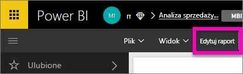
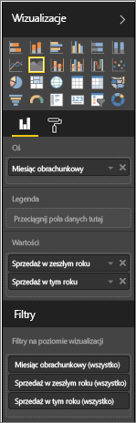
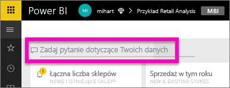
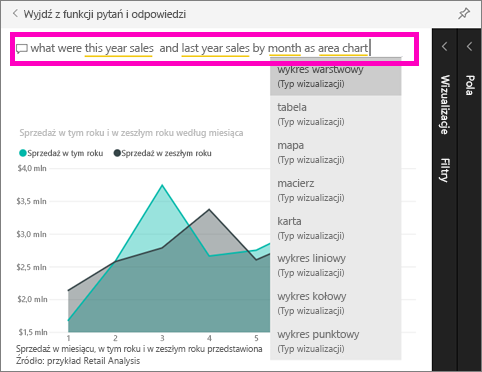

# Wprowadzenie do pytań i odpowiedzi usługi Power BI

Czasem najszybszym sposobem uzyskania odpowiedzi na podstawie danych jest zadanie pytania przy użyciu języka naturalnego.  W ramach tego podręcznika Szybki start rozpatrzymy dwa różne sposoby tworzenia tej samej wizualizacji: po pierwsze, wbudowanie jej do raportu i, po drugie, zadanie pytania za pomocą funkcji pytań i odpowiedzi. Użyjemy usługi Power BI, ale proces jest niemal identyczny w przypadku używania programu Power BI Desktop.

Aby z niego skorzystać, musisz użyć raportu, który możesz edytować, dlatego użyjemy jednego z przykładów dostępnych w usłudze Power BI.

## Tworzenie wizualizacji w edytorze raportów

1. W obszarze roboczym usługi Power BI wybierz pozycję **Pobierz dane** \> **Przykłady** \> **Przykład analizy detalicznej** > **Połącz**.
   
2. Pulpit nawigacyjny zawiera obszar kafelka wykresu „Sprzedaż zeszłoroczna i sprzedaż tegoroczna”.  Wybierz ten kafelek. Jeśli ten kafelek został utworzony za pomocą funkcji pytań i odpowiedzi, wybranie kafelka otworzy funkcję pytań i odpowiedzi. Ale ten Kafelek został utworzony w raporcie, więc raport zostanie otwarty na stronie zawierającej tę wizualizację.

    

1. Otwórz raport w widoku do edycji, wybierając pozycję **Edytuj raport**.  Jeśli nie jesteś właścicielem raportu, nie masz możliwości otwarcia raportu w widoku do edycji.
   
    
4. Wybierz obszar wykresu i przejrzyj ustawienia w okienku **Pola**.  Twórca raportu zbudował ten wykres, wybierając te trzy wartości (**Czas > Miesiąc obrachunkowy**, **Sprzedaż > Sprzedaż tegoroczna**, **Sprzedaż > Sprzedaż zeszłoroczna > Wartość**) i porządkując je w źródłach **Oś** i **Wartości**.
   
    

## Tworzenie takiej samej wizualizacji za pomocą funkcji pytań i odpowiedzi

A może spróbujemy utworzyć ten sam wykres liniowy za pomocą funkcji pytań i odpowiedzi?

1. Przejdź z powrotem do pulpitu nawigacyjnego przykładu analizy detalicznej.
2. Używając języka naturalnego, wpisz coś podobnego do poniższego w polu pytania:
   
   **jaka była tegoroczna sprzedaż i zeszłoroczna sprzedaż według miesięcy jako wykres warstwowy**
   
   W miarę pisania pytania funkcja pytań i odpowiedzi wybiera najlepszą wizualizację do wyświetlania odpowiedzi, przy czym wizualizacja zmienia się dynamicznie w miarę modyfikowania pytania. Funkcja pytań i odpowiedzi pomaga również sformatować pytanie za pomocą sugestii, funkcji automatycznego uzupełniania i korekty pisowni.
   
   Po zakończeniu wpisywania pytania wynikiem jest dokładnie ten sam wykres, który widzieliśmy w raporcie.  Ale jego tworzenie w ten sposób było znacznie szybsze!
   
   
3. Podobnie jak podczas pracy z raportami, w ramach funkcji pytań i odpowiedzi masz dostęp do okienek wizualizacji, filtrów i pól.  Otwórz te okienka, aby dalej eksplorować i modyfikować element wizualny.
4. Aby przypiąć wykres do swojego pulpitu nawigacyjnego, wybierz ikonę pinezki .

## Następne kroki
[Pytania i odpowiedzi w usłudze Power BI](consumer/end-user-q-and-a.md)

[Dbanie o poprawne współdziałanie danych z funkcją pytań i odpowiedzi w usłudze Power BI](service-prepare-data-for-q-and-a.md)

Masz więcej pytań? [Odwiedź społeczność usługi Power BI](http://community.powerbi.com/)

