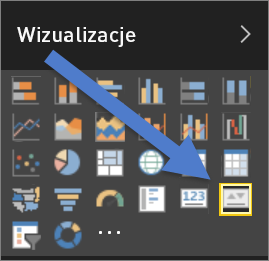
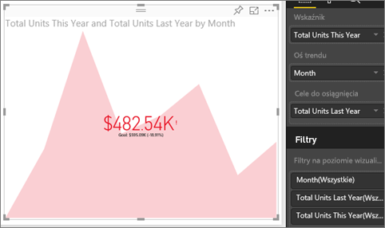

# Wizualizacje kluczowych wskaźników wydajności
Kluczowy wskaźnik wydajności (KPI) to wizualna podpowiedź przedstawiająca postęp w realizacji mierzalnego celu. Więcej informacji na temat kluczowych wskaźników wydajności można uzyskać w witrynie [Microsoft Developer Network](https://msdn.microsoft.com/library/hh272050).

## Kiedy używać kluczowych wskaźników wydajności
Kluczowe wskaźniki wydajności są doskonałym wyborem w następujących sytuacjach:

* Aby zmierzyć postęp (czy wyprzedzam harmonogram, czy mam opóźnienie).
* Aby zmierzyć odległość do celu (jak duże jest moje wyprzedzenie lub opóźnienie).   

## Wymagania dotyczące kluczowych wskaźników wydajności wizualizacji
Kluczowy wskaźnik wydajności (KPI) jest oparty na określonej mierze i jest zaprojektowany, aby ułatwić oszacowanie bieżącej wartości i stanu metryki względem zdefiniowanego celu. W związku z tym wizualizacja kluczowego wskaźnika wydajności wymaga *podstawowej* miary, która da w wyniku wartość i *docelową* miarę lub wartość, oraz progu lub celu.

> [!NOTE]
> Obecnie zestaw danych kluczowego wskaźnika wydajności musi zawierać wartości docelowe kluczowego wskaźnika wydajności. Jeśli zestaw danych nie zawiera tych wartości, można je utworzyć przez dodanie arkusza programu Excel z wartościami docelowymi do modelu danych lub pliku PBIX.
> 
> 

## Jak utworzyć kluczowy wskaźnik wydajności
Aby móc wykonywać te instrukcje, zaloguj się w usłudze Power BI, a następnie wybierz pozycję **Pobierz dane > Przykłady > Retail Analysis Sample**. Utworzymy kluczowy wskaźnik wydajności, który będzie mierzyć postęp realizacji celu sprzedaży.

Możesz też obejrzeć klip wideo, w którym pokażemy Ci, jak utworzyć pojedyncze wizualizacje metryk: mierniki, karty i kluczowe wskaźniki wydajności.

<iframe width="560" height="315" src="https://www.youtube.com/embed/xmja6EpqaO0?list=PL1N57mwBHtN0JFoKSR0n-tBkUJHeMP2cP" frameborder="0" allowfullscreen></iframe>

1. Otwórz raport w [widoku do edycji](service-reading-view-and-editing-view.md) i [dodaj nową stronę](power-bi-report-add-page.md).    
2. Wybierz pozycję **Sales > Total Units This Year** (Sprzedaż > Całkowita liczba jednostek w bieżącym roku).  To będzie wskaźnik.
3. Dodaj pozycję **Time > Month** (Czas > Miesiąc).  To będzie reprezentacja trendu.
4. WAŻNE: Posortuj wykres według **miesięcy**. Po przekształceniu wizualizacji w kluczowy wskaźnik wydajności opcja sortowania będzie niedostępna.

    
5. Przekształć wizualizację w kluczowy wskaźnik wydajności, wybierając ikonę kluczowego wskaźnika wydajności w okienku Wizualizacje.
   
    
6. Dodaj cel. Dodaj wartość sprzedaży z ostatniego roku jako cel. Przeciągnij pozycję **Total Units Last Year** (Całkowita liczba jednostek w ostatnim roku) do pola **Cele do osiągnięcia**.
   
    
7. Opcjonalnie sformatuj kluczowy wskaźnik wydajności, wybierając ikonę wałka do malowania w celu otwarcia okienka Formatowanie.
   
   * **Wskaźnik** — steruje jednostkami wyświetlania wskaźnika i liczbą miejsc dziesiętnych.
   * **Oś trendu** — jeśli zostanie ustawiona na wartość **Wł.**, oś trendu jest wyświetlana jako tło wizualizacji kluczowego wskaźnika wydajności.  
   * **Cele** — jeśli zostanie ustawiona na wartość **Wł.**, wizualizacja wyświetla cel i odległość od celu w postaci wartości procentowej.
   * **Kodowanie kolorami > Kierunek** — niektóre kluczowe wskaźniki wydajności są postrzegane jako *lepsze* dla wyższych wartości, a niektóre jako *lepsze* dla niższych wartości. Na przykład zarobki w porównaniu do czasu oczekiwania. Zwykle wyższa wartość dochodów jest lepsza niż wyższa wartość czasu oczekiwania. Wybierz pozycję **high is better** (wyższa wartość jest lepsza) i opcjonalnie zmień ustawienia kolorów.

1. Po odpowiednim skonfigurowaniu kluczowego wskaźnika wydajności [przypnij go do pulpitu nawigacyjnego](service-dashboard-pin-tile-from-report.md).

Kluczowe wskaźniki wydajności są również dostępne na urządzeniach przenośnych, dzięki czemu możesz na bieżąco śledzić stan swojej firmy.

## Istotne zagadnienia i rozwiązywanie problemów
* Jeśli Twój kluczowy wskaźnik wydajności nie wygląda jak ten powyżej, być może należy przeprowadzić sortowanie według miesięcy. Ponieważ kluczowe wskaźniki wydajności nie mają opcji sortowania, sortowanie według miesięcy należy przeprowadzić *przed* przekształceniem wizualizacji w kluczowy wskaźnik wydajności.

## Następne kroki

[Wizualizacje w raportach usługi Power BI](power-bi-report-visualizations.md)

Masz więcej pytań? [Odwiedź społeczność usługi Power BI](http://community.powerbi.com/)

