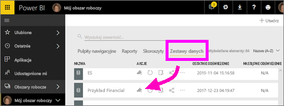
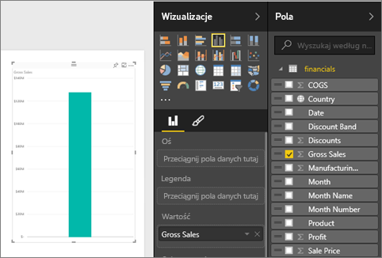
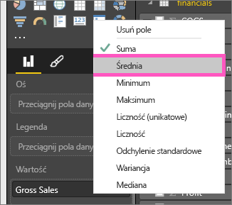
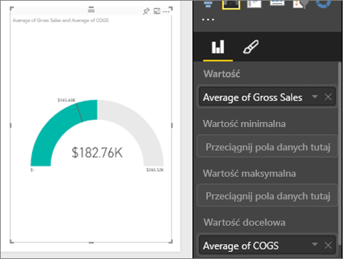
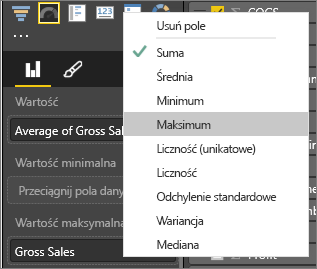
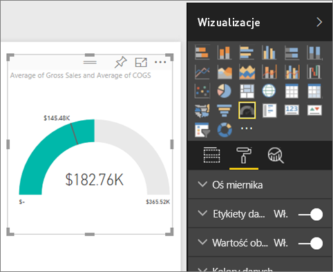
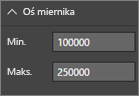
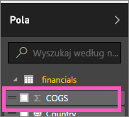
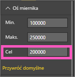

# Wykresy w postaci mierników promieniowych w usłudze Power BI
Wykres miernika promieniowego ma okrągły łuk i wyświetla jedną wartość, która mierzy postępy w kierunku celu/kluczowego wskaźnika wydajności.  Cel, lub wartość docelowa, jest reprezentowany przez linię (wskazówkę). Postęp w kierunku celu jest reprezentowany przez cieniowanie.  Wartość reprezentująca postęp jest wyświetlana w pogrubieniu wewnątrz łuku. Wszystkie możliwe wartości są równomiernie rozmieszczone na łuku, od wartości minimalnej (najbardziej po lewej) do wartości maksymalnej (najbardziej po prawej).

W poniższym przykładzie sprzedawca samochodów monitoruje średnią sprzedaż zespołu sprzedażowego względem miesiąca. Celem jest wartość 140, która jest reprezentowana przez czarną wskazówkę.  Minimalna możliwa wartość średniej sprzedaży to 0, a maksymalna wartość została ustawiona na 200.  Niebieskie cieniowanie wskazuje, że obecnie średnia wartość to około 120 sprzedaży w tym miesiącu. Na szczęście mamy jeszcze tydzień na osiągnięcie celu.

## Kiedy należy używać miernika promieniowego
Mierniki promieniowe sprawdzają się doskonale w następujących przypadkach:

* Wyświetlanie postępów na drodze do celu.
* Przedstawianie miary opartej na percentylu, np. kluczowego wskaźnika wydajności.
* Pokazywanie kondycji jednej miary.
* Wyświetlanie informacji, które można szybko przeskanować i zrozumieć.

### Wymagania wstępne
 - Usługa Power BI lub program Power BI Desktop
 - Przykładowy skoroszyt programu Excel z danymi finansowymi: [pobierz przykład bezpośrednio](http://go.microsoft.com/fwlink/?LinkID=521962).

## Tworzenie podstawowego miernika promieniowego
Poniższe instrukcje korzystają z usługi Power BI. Aby móc samodzielnie wykonać instrukcje, zaloguj się do usługi Power BI, a następnie otwórz plik przykładu Financial programu Excel.  

Możesz też obejrzeć klip wideo, w którym pokażemy Ci, jak utworzyć pojedyncze wizualizacje metryk: mierniki, karty i kluczowe wskaźniki wydajności.

<iframe width="560" height="315" src="https://www.youtube.com/embed/xmja6EpqaO0?list=PL1N57mwBHtN0JFoKSR0n-tBkUJHeMP2cP" frameborder="0" allowfullscreen></iframe>

### Krok 1. Otwórz plik programu Excel z przykładem Financial
1. [Pobierz przykładowy plik programu Excel o nazwie Financial](sample-financial-download.md), jeśli jeszcze nie zostało to zrobione. Należy zapamiętać, gdzie został on zapisany.

2. Otwórz plik w ***usłudze Power BI***, wybierając opcję **Pobierz dane \> Pliki** i przechodząc do lokalizacji, w której zapisano plik. Wybierz pozycję **Import**. Przykład Financial zostanie dodany do obszaru roboczego jako zestaw danych.

3. Z listy zawartości **Zestaw danych** wybierz pozycję **Przykład Financial**, aby otworzyć go w trybie eksplorowania.

    

### Krok 2. Utwórz miernik do śledzenia sprzedaży brutto
1. W okienku **Pola** wybierz opcję **Sprzedaż brutto**.
   
   
2. Zmień agregację na opcję **Średnia**.
   
   
3. Wybierz ikonę miernika , aby skonwertować wykres kolumnowy na miernik.
   
   Domyślnie usługa Power BI utworzy wykres miernika, w którym bieżąca wartość (w tym przypadku średnia sprzedaży brutto) będzie znajdować się w połowie miernika. Ponieważ średnia sprzedaż brutto wynosi obecnie 182,76 tys. USD wartość początkowa (minimalna) została ustawiona na 0, a wartość końcowa (maksymalna) na wartość dwukrotnie większą od wartości bieżącej.
   
   

### Krok 3. Ustaw wartość docelową
1. Przeciągnij pole **COGS** do listy **Wartość docelowa**.
2. Zmień agregację na opcję **Średnia**.
   Usługa Power BI dodaje wskazówkę, która będzie reprezentować wartość docelową wynoszącą **145,48 tys. USD**. Zauważ, że przekroczyliśmy wartość docelową.
   
   
   
   > [!NOTE]
   > Możesz też ręcznie wprowadzić wartość docelową.  Zobacz sekcję „Używanie opcji formatowania do ręcznego ustawiania wartości minimalnej, maksymalne i docelowej” poniżej.
   > 
   > 

### Krok 4. Ustaw wartość maksymalną
W kroku 2 usługa Power BI użyła pola Wartość, aby automatycznie ustawić wartość minimalną (początkową) i maksymalną (końcową).  Co zrobić, jeśli chcemy ustawić własną wartość maksymalną?  Załóżmy, że zamiast używania wartości dwukrotnie wyższej od wartości bieżącej jako możliwej wartości maksymalnej chcemy ustawić ją na najwyższy wynik sprzedaży brutto w zestawie danych? 

1. Przeciągnij miarę **Sprzedaż brutto** z listy **Pola** do listy **Wartość maksymalna**.
2. Zmień agregację na opcję **Maksimum**.
   
   
   
   Miernik jest ponownie rysowany z nową wartością końcową, 1,21 mln USD w sprzedaży brutto.
   
   

### Krok 5. Zapisz raport
1. [Zapisz raport](service-report-save.md).
2. [Dodaj wykres miernika jako kafelek pulpitu nawigacyjnego](service-dashboard-tiles.md). 

## Używanie opcji formatowania do ręcznego ustawiania wartości minimalnej, maksymalne i docelowej
1. Usuń miarę **Maksimum sprzedaży brutto** z listy **Wartość maksymalna**.
2. Otwórz okienko formatowania, wybierając ikonę wałka do malowania.
   
   
3. Rozwiń **Oś miernika** i wprowadź wartości w pozycjach **Minimum** i **Maksimum**.
   
    
4. Usuń bieżącą wartość docelową, usuwając znacznik wyboru obok pozycji **COGS**.
   
    
5. Gdy pole **Cel** pojawi się w pozycji **Oś miernika**, wprowadź wartość.
   
    
6. Opcjonalnie kontynuuj formatowanie wykresu miernika.

## Następne kroki
[Typy wizualizacji w usłudze Power BI](power-bi-visualization-types-for-reports-and-q-and-a.md)

[Dodawanie wizualizacji do raportu](power-bi-report-add-visualizations-i.md)

[Przypinanie wizualizacji do pulpitu nawigacyjnego](service-dashboard-pin-tile-from-report.md)

[Power BI — podstawowe pojęcia](service-basic-concepts.md)

Masz więcej pytań? [Odwiedź społeczność usługi Power BI](http://community.powerbi.com/)

