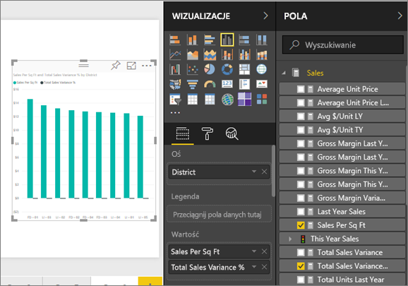
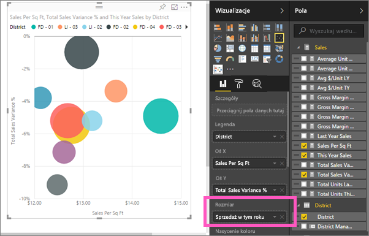
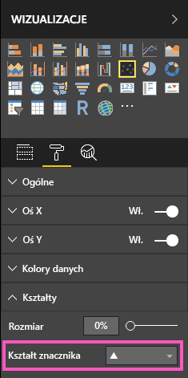
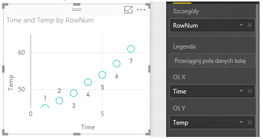
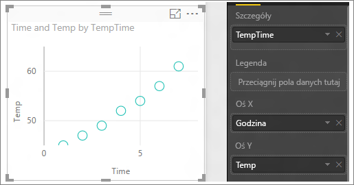

# Wykresy punktowe i bąbelkowe w usłudze Power BI (samouczek)
Wykres punktowy zawsze ma dwie osie wartości: jeden zestaw danych liczbowych jest wyświetlany wzdłuż osi poziomej, a drugi wzdłuż osi pionowej. Na wykresie kreślone są punkty występujące na przecięciu wartości liczbowych x i y, co zapewnia połączenie tych par wartości w pojedynczych punktach danych. Te punkty danych mogą być rozproszone równomiernie lub nierównomiernie wzdłuż osi poziomej, w zależności od danych.

Na wykresie bąbelkowym zamiast punktów danych używane są bąbelki. *Rozmiar* bąbelka reprezentuje dodatkowy wymiar danych.

## Kiedy używać wykresu punktowego i wykresu bąbelkowego
### Wykresy punktowe są doskonałym wyborem w następujących przypadkach:
* Pokazywanie zależności między dwiema (punkty) lub trzema (bąbelki) wartościami **liczbowymi**.
* Przedstawianie dwóch grup liczb jako jednej serii współrzędnych xy.
* Trzeba zmienić skalę osi poziomej (zamiast wykresu liniowego).    
* Trzeba zmienić oś poziomą na skalę logarytmiczną.
* Przedstawianie danych arkusza obejmujących pary lub pogrupowane zestawy wartości. Wykres punktowy pozwala niezależnie dopasowywać skale osi, aby uwidocznić dodatkowe informacje o pogrupowanych wartościach.
* Wyświetlanie wzorców w dużych zestawach danych, na przykład za pomocą trendów liniowych i nieliniowych, grup i wartości odstających.
* Porównywanie dużej liczby punktów danych bez uwzględniania czasu. Im więcej danych na wykresie punktowym, tym lepsze porównanie.

### Wykresy bąbelkowe są doskonałym wyborem w następujących przypadkach:
* Dane zawierają 3 serie danych, a każda z nich zawiera zestaw wartości.
* Przedstawianie danych finansowych.  Różne rozmiary bąbelków są przydatne do graficznego podkreślania określonych wartości.
* Są używane ćwiartki.

## Tworzenie wykresu punktowego
Obejrzyj ten film wideo, aby zobaczyć, jak Will tworzy wykres punktowy, a następnie wykonaj poniższe kroki w celu utworzenia własnego wykresu.

<iframe width="560" height="315" src="https://www.youtube.com/embed/PVcfPoVE3Ys?list=PL1N57mwBHtN0JFoKSR0n-tBkUJHeMP2cP" frameborder="0" allowfullscreen></iframe>

W poniższych instrukcjach używane są przykładowe dane dotyczące analizy handlu detalicznego. Aby je wykonać, [pobierz przykład](sample-datasets.md) dla usługi Power BI (app.powerbi.com) lub dla programu Power BI Desktop.   

1. Rozpocznij od [pustej strony raportu](power-bi-report-add-page.md) i wybierz pola **Sales** \> **Sales Per Sq Ft** oraz **Sales** > **Total Sales Variance %**. Jeśli używasz usługi Power BI, upewnij się, że raport jest otwarty w [widoku do edycji](service-interact-with-a-report-in-editing-view.md).
 
2. W okienku Pola wybierz pozycję **District > District**.
   
    
4. Przekonwertuj na wykres punktowy. W okienku wizualizacji wybierz ikonę wykresu punktowego.
   .
5. Przeciągnij pole **District** z obszaru **Szczegóły** do obszaru **Legenda**.
   
    

W efekcie powstał wykres punktowy, który przedstawia wartości Total Sales Variance % wzdłuż osi Y i Sales Per Square Feet wzdłuż osi X.  Kolory punktów danych reprezentują poszczególne regiony.  Teraz dodamy trzeci wymiar.

## Tworzenie wykresu bąbelkowego
1. Z okienka Pola przeciągnij pozycję **Sales** > **This Year Sales** > **Value** do obszaru **Rozmiar**. 
   
   
2. Umieść kursor nad bąbelkiem.  Rozmiar bąbelka odzwierciedla wielkość wartości **This Year Sales**.
   
    
3. Opcjonalnie można [sformatować kolory, etykiety, tytuły, tło i inne elementy wizualizacji](service-getting-started-with-color-formatting-and-axis-properties.md).

## Ułatwienia dostępu

Możesz ułatwić dostęp do wykresu punktowego lub wykresu bąbelkowego osobom niepełnosprawnym przy użyciu *Znaczników*. 

Aby wybrać kształt znacznika, wybierz sekcję **Format** w okienku **Wizualizacje**, rozwiń sekcję **Kształty**, a następnie wybierz kształt znacznika.

## Istotne zagadnienia i rozwiązywanie problemów
### **Wykres punktowy ma tylko jeden punkt danych**
Czy na wykresie punktowym wyświetlany jest tylko jeden punkt danych, w którym zagregowane są wszystkie wartości na osiach X i Y?  A może wszystkie wartości są zagregowane wzdłuż pojedynczej linii poziomej lub pionowej?

Dodaj pole do obszaru **Szczegóły** w celu poinformowania usługi Power BI o tym, jak należy zgrupować wartości. To pole musi być unikatowe dla każdego punktu, który ma zostać wykreślony.  
Może to być zwykły numer wiersza lub pole identyfikatora:

Jeśli dane nie zawierają takiego pola, utwórz pole, które łączy wartości X i Y w taki sposób, aby wykreślały unikatowy punkt:

W celu utworzenia nowego pola [użyj Edytora zapytań programu Power BI Desktop, aby dodać kolumnę indeksu](desktop-add-custom-column.md) do zestawu danych.  Następnie dodaj tę kolumnę do obszaru **Szczegóły** danej wizualizacji.

## Następne kroki
 [Typy wizualizacji w usłudze Power BI](power-bi-visualization-types-for-reports-and-q-and-a.md)

[Wypróbuj bezpłatnie!](https://powerbi.com/)  

Masz więcej pytań? [Odwiedź społeczność usługi Power BI](http://community.powerbi.com/)

