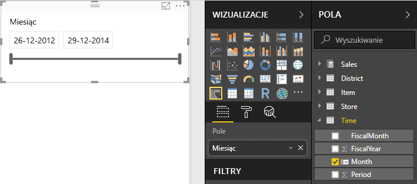

# Fragmentatory w usłudze Power BI
Chcesz, aby czytelnicy raportu mogli zapoznawać się z ogólnymi metrykami sprzedaży, ale również identyfikować wydajność poszczególnych menedżerów regionalnych i wydajność w różnych przedziałach czasowych. Możesz utworzyć oddzielne raporty lub wykresy porównawcze albo skorzystać z fragmentatorów. Fragmentator to alternatywny sposób filtrowania, który zawęża część zestawu danych wyświetlanego w innych wizualizacjach w raporcie. 

W tym samouczku używamy [przykładu Retail Analysis](sample-retail-analysis.md), aby przeprowadzić użytkownika przez proces tworzenia, formatowania i używania fragmentatorów opartych na listach i zakresach dat. Baw się dobrze, odkrywając sposoby formatowania i korzystania z fragmentatorów. 

## Kiedy użyć fragmentatora
Fragmentatory są doskonałym wyborem, jeśli chcesz:

* Wyświetlić często używane lub ważne filtry na kanwie raportu w celu ułatwienia dostępu.
* Ułatwić wyświetlanie bieżącego stanu przefiltrowanego bez konieczności otwierania listy rozwijanej. 
* Filtrować według kolumn, które są niepotrzebne i ukryte w tabelach danych.
* Utworzyć bardziej ukierunkowane raporty, ustawiając fragmentatory obok ważnych wizualizacji.

Fragmentatory usługi Power BI mają następujące ograniczenia:

- Fragmentatory nie obsługują pól danych wejściowych.
- Nie można przypiąć fragmentatora do pulpitu nawigacyjnego.
- Przechodzenie do szczegółów nie jest obsługiwane w przypadku fragmentatorów.
- Fragmentatory nie obsługują filtrów na poziomie wizualizacji.

## Tworzenie fragmentatorów

Aby utworzyć nowy fragmentator, możesz wybrać ikonę fragmentatora, a następnie wybrać pole danych, według którego będziesz filtrować (lub przeciągnąć je do obszaru **Pola** w okienku **Wizualizacje**). Możesz również najpierw wybrać lub przeciągnąć pole danych, aby utworzyć wizualizację, a następnie wybrać ikonę fragmentatora, aby przekształcić wizualizację we fragmentator. Różne typy danych służą do tworzenia różnych typów fragmentatorów z różnymi opcjami i efektami. 

**Aby utworzyć nowy fragmentator do filtrowania danych według menedżera regionalnego**

1. W programie Power BI Desktop lub w usłudze Power BI otwórz [przykład Retail Analysis](sample-retail-analysis.md). (W usłudze Power BI wybierz pozycję **Edytuj raport** w lewym górnym rogu).
2. Na stronie **Overview** (Omówienie), nie zaznaczając żadnych elementów, wybierz ikonę **Fragmentator**  w okienku **Wizualizacje**, aby utworzyć nowy fragmentator. 
3. Po zaznaczeniu nowego fragmentatora wybierz pozycję **District Manager** (Menedżer regionalny) w obszarze **District** (Region) w okienku **Pola**, aby wypełnić fragmentator. Nowy fragmentator będzie listą z polami wyboru przed nazwami. 
    
    
    
4. Zmień rozmiar fragmentatora i przeciągnij go wraz z innymi elementami na kanwę, aby zrobić miejsce na fragmentator. Pamiętaj, że po zmianie rozmiaru fragmentatora na zbyt mały niektóre jego elementy zostaną odcięte. 
5. Wybierz nazwy w obrębie fragmentatora i zobacz, jak wpłynie to na inne wizualizacje na stronie. Wybierz nazwy ponownie, aby usunąć ich zaznaczenie, a następnie naciśnij i przytrzymaj klawisz **Ctrl**, aby wybrać więcej niż jedną nazwę. Zaznaczenie wszystkich nazw ma ten sam efekt, co niewybranie żadnej nazwy. 

>[!TIP]
>Elementy fragmentatora listy są domyślnie sortowane rosnąco w porządku alfanumerycznym. Aby odwrócić kolejność sortowania, wybierz wielokropek (**...**) w prawym górnym rogu fragmentatora i wybierz pozycję **Sort by District Manager** (Sortowanie według menedżera regionalnego) z listy rozwijanej. 

**Aby utworzyć nowy fragmentator do filtrowania danych według zakresu dat**

1. Nie wybierając żadnych elementów na kanwie, rozwiń listę **Time** (Czas) w okienku Pola, a następnie przeciągnij wartość **Month** (Miesiąc) (lub **Date** (Data) w usłudze Power BI) do pola **Wartości** w okienku Wizualizacje, aby utworzyć nową wizualizację.
2. Po wybraniu nowej wizualizacji wybierz ikonę **Fragmentator**, aby przekonwertować nową wizualizację na fragmentator. Ten fragmentator będzie kontrolką suwaka z wypełnionym zakresem dat.
    
    
    
4. Zmień rozmiar fragmentatora i przeciągnij go wraz z innymi elementami na kanwę, aby zrobić miejsce na fragmentator. Zwróć uwagę, że rozmiar suwaka zmienia się wraz ze zmianą rozmiaru fragmentatora, ale znika i daty są wycinane, jeśli zmieniony rozmiar fragmentatora jest zbyt mały. 
4. Wybierz inne zakresy dat za pomocą suwaka albo wybierz pole daty i wpisz w nim wartość lub otwórz kalendarz w wyskakującym okienku w celu dokonania dokładniejszego wyboru. Zobacz, jak wpłynie to na inne wizualizacje na stronie.
    
    >[!NOTE]
    >Domyślnie typy danych liczbowych i daty/godziny powodują utworzenie fragmentatorów z suwakami zakresów. Począwszy od aktualizacji usługi Power BI z lutego 2018 r., fragmentatory zakresów typów danych, które używają liczb całkowitych, skracają je do wartości liczb całkowitych, zamiast wyświetlać miejsca dziesiętne. 

>[!TIP]
>Mimo że domyślnie pole danych **Month** (Miesiąc) powoduje utworzenie typu fragmentatora korzystającego z suwaka zakresu typu **Między**, można go zmienić na inne typy fragmentatora i opcje wyboru. Aby zmienić typ fragmentatora, po wybraniu fragmentatora umieść kursor nad jego prawym górnym obszarem, kliknij daszek, aby otworzyć listę rozwijaną, a następnie wybierz jedną z opcji, taką jak **Lista** lub **Przed**. Zobacz, jak zmienia się wygląd fragmentatora i opcje wyboru. 

Aby uzyskać więcej informacji na temat tworzenia fragmentatorów zakresów dat i numerycznych, obejrzyj poniższy film i zobacz temat [Używanie fragmentatora zakresu liczbowego w programie Power BI Desktop](desktop-slicer-numeric-range.md).
<iframe width="560" height="315" src="https://www.youtube.com/embed/zIZPA0UrJyA" frameborder="0" allowfullscreen></iframe> 

## Kontrolowanie wizualizacji stron, na które wpływają fragmentatory
Domyślnie fragmentatory na stronach raportu mają wpływ na inne wizualizacje na tej stronie, w tym na siebie. Podczas wybierania wartości we właśnie utworzonych fragmentatorach list i dat zwróć uwagę, jak wpływa to na inne wizualizacje. Odfiltrowane dane to część wspólna wartości wybranych w obu fragmentatorach. 

Możesz użyć pozycji **Interakcje wizualne**, aby niektóre wizualizacje strony nie podlegały wpływowi innych. Na stronie **Overview** (Omówienie) wykres „Total Sales Variance by FiscalMonth and District Manager” (Różnice łącznej sprzedaży według wartości FiscalMonth i menedżera regionalnego) przedstawia ogólne dane porównawcze dla menedżerów regionalnych według miesiąca, które mają być widoczne przez cały czas. Możesz użyć pozycji **Interakcje wizualne**, aby uniemożliwić filtrowanie tego wykresu na podstawie wyborów fragmentatora. 

1. Po wybraniu fragmentatora District Manager (Menedżer regionalny):
    - W programie Power BI Desktop wybierz menu **Format** w obszarze **Narzędzia wizualizacji**, a następnie wybierz pozycję **Edytuj interakcje**.
    - W usłudze Power BI rozwiń listę rozwijaną **Interakcje wizualne** z paska menu i włącz opcję **Edytuj interakcje**. 
   
   Kontrolki filtrowania  pojawią się nad innymi wizualizacjami na stronie. Początkowo wybrane są wszystkie ikony **Filtr**.
   
2. Wybierz ikonę **Brak** nad wykresem **Total Sales Variance by FiscalMonth and District Manager** (Różnice łącznej sprzedaży według wartości FiscalMonth i menedżera regionalnego), aby uniemożliwić fragmentatorowi jego filtrowanie. 
3. Wybierz fragmentator **Month** (Miesiąc), a następnie ponownie ikonę **Brak** nad wykresem **Total Sales Variance by FiscalMonth and District Manager** (Różnice łącznej sprzedaży według wartości FiscalMonth i menedżera regionalnego), aby uniemożliwić fragmentatorowi jego filtrowanie. Teraz po wybraniu nazw i zakresów dat we fragmentatorach wykres Total Sales Variance by FiscalMonth and District Manager (Różnice łącznej sprzedaży według wartości FiscalMonth i menedżera regionalnego) pozostaje niezmieniony. 

Aby uzyskać więcej informacji na temat edytowania interakcji, zobacz temat [Interakcje wizualizacji w raporcie Power BI](service-reports-visual-interactions.md).

## Synchronizacja i używanie fragmentatorów na innych stronach
Począwszy od aktualizacji usługi Power BI w lutym 2018, można synchronizować fragmentator i używać go na dowolnych lub wszystkich stronach w raporcie. 

W bieżącym raporcie strona **District Monthly Sales** (Miesięczna sprzedaż w regionie) zawiera również fragmentator **District Manager** (Menedżer regionalny), ale nie jest on synchronizowany z fragmentatorem utworzonym na stronie **Overview** (Omówienie) (dwa fragmentatory mogą mieć różne wybrane opcje). Strona **New Stores** (Nowe sklepy) zawiera tylko fragmentator **Store Name** (Nazwa sklepu). Nowy fragmentator **District Manager** (Menedżer regionalny) można zsynchronizować z tymi stronami, aby wybory fragmentatora na każdej stronie wpływały na wizualizacje na wszystkich trzech stronach. 

1. W menu **Widok** wybierz pozycję **Synchronizuj fragmentatory** w programie Power BI Desktop (lub włącz **okienko synchronizowania fragmentatorów** w usłudze Power BI). Zostanie wyświetlone okienko **Synchronizuj fragmentatory**. 
2. Na stronie **Overview** (Omówienie) wybierz fragmentator **District Manager** (Menedżer regionalny). Pamiętaj, że strona **District Monthly Sales** (Miesięczna sprzedaż w regionie) została już wybrana w kolumnie **Widoczne**, ponieważ na tej stronie znajduje się fragmentator District Manager (Menedżer regionalny), którego nie wybrano w kolumnie **Synchronizacja**. 
    
    
    
3. W kolumnie **Synchronizacja** wybierz stronę **New Stores** (Nowe sklepy) i stronę **District Monthly Sales** (Miesięczna sprzedaż w regionie), aby zsynchronizować fragmentator **Overview** (Omówienie) do tych stron. 
    
3. W kolumnie **Widoczne** wybierz stronę **New stores** (Nowe sklepy) i pozostaw zaznaczoną stronę **District Monthly Sales** (Miesięczna sprzedaż w regionie). 
4. Obserwuj skutki synchronizowania fragmentatora i oznaczania go jako widocznego na stronie. Na stronie **District Monthly Sales** (Miesięczna sprzedaż w regionie) fragmentator **District Manager** (Menedżer regionalny) zawiera obecnie opcje wybrane na stronie **Overview** (Omówienie). Na stronie **New Stores** (Nowe sklepy) opcje wybrane we fragmentatorze **District Manager** (Menedżer regionalny) wpływają na opcje do wyboru dostępne we fragmentatorze **Store Name** (Nazwa sklepu). 
    
    >[!TIP]
    >Mimo że fragmentator początkowo jest wyświetlany na zsynchronizowanych stronach w tym samym rozmiarze i położeniu, co na stronie oryginalnej, zsynchronizowane fragmentatory można niezależnie przenosić i formatować oraz zmieniać ich rozmiary na różnych stronach. 

>[!NOTE]
>Jeśli zsynchronizujesz fragmentator do strony, ale ustawisz go na tej stronie jako widoczny, wybory fragmentatora dokonane na innych stronach będą nadal powodować filtrowanie danych na stronie.
 
## Formatowanie fragmentatorów
W zależności od typu fragmentatora są dostępne różne opcje formatowania. Używając orientacji **Pozioma**, układu **Dynamiczny** i kolorowania **Element**, można tworzyć przyciski lub kafelki zamiast standardowych elementów list, a także zmieniać rozmiary elementów fragmentatora tak, aby pasowały do różnych rozmiarów i układów ekranu.  

1. Po wybraniu fragmentatora **District Manager** (Menedżer regionalny) na dowolnej stronie w okienku **Wizualizacje** wybierz ikonę **Formatuj** , aby wyświetlić kontrolki formatowania. 
    
    
    
2. Wybierz strzałki listy rozwijanej obok każdej kategorii, aby wyświetlić i edytować opcje. 

### Opcje ogólne
1. Wybierz kolor czerwony w obszarze **Kolor konturu** i zmień ustawienie **Grubość konturu** na „2”. Powoduje to ustawienie koloru i grubości konturów lub podkreśleń nagłówka i elementu, jeśli są włączone. 
2. W obszarze **Orientacja** ustawienie domyślne to **Pionowa**. Wybierz pozycję **Pozioma**, aby utworzyć fragmentator z kafelkami lub przyciskami ułożonymi w poziomie, a następnie przewijaj przy użyciu strzałek, aby uzyskiwać dostęp do elementów, które nie mieszczą się we fragmentatorze.
    
    
    
3. Włącz układ **dynamiczny**, aby zmienić rozmiar i rozmieszczenie elementów fragmentatora zgodnie z ekranem widoku i rozmiarem fragmentatora. W przypadku fragmentatorów list układ dynamiczny jest dostępny tylko w orientacji poziomej i zapobiega obcinaniu elementów na małych ekranach. W przypadku fragmentatorów suwaka zakresu formatowanie dynamiczne powoduje zmianę stylu suwaka i oferuje bardziej elastyczne zmiany rozmiaru. Oba typy fragmentatorów stają się ikonami filtrów, jeśli ich rozmiar jest bardzo mały. 
    
    
    
    >[!NOTE]
    >Zmiany układu dynamicznego mogą zastępować określone formatowanie nagłówka i elementów ustawione przez użytkownika. 
    
4. Ustaw położenie i rozmiar fragmentatora z dokładnością liczbową w **pozycji X**, **położeniu Y**, **szerokości** i **wysokości** lub przenieś i zmień rozmiar fragmentatora bezpośrednio na kanwie. Eksperymentuj z różnymi rozmiarami i położeniami elementów i zobacz, jakie zmiany są wprowadzane przez funkcję formatowania dynamicznego.  

    

Zobacz [Tworzenie fragmentatora dynamicznego z możliwością zmiany rozmiaru w usłudze Power BI](power-bi-slicer-filter-responsive.md), aby uzyskać więcej informacji na temat orientacji poziomej i układu dynamicznego.

### Opcje kontrolek wyboru (tylko fragmentatory listy)
1. Pozycja **Pokazywanie elementu Zaznacz wszystko** jest domyślnie **wyłączona**. Ustaw ją na **Włącz**, aby dodać element **Zaznacz wszystko** do fragmentatora, który zaznacza wszystkie elementy lub usuwa ich zaznaczenie, gdy jest włączony. Kiedy wszystkie elementy są zaznaczone, kliknięcie lub wybranie jednego elementu usuwa jego zaznaczenie, umożliwiając zastosowanie filtru typu „nie jest”. 
    
    
    
2. **Wybór pojedynczego elementu** jest domyślnie **włączony**. Kliknięcie lub wybranie każdego elementu zaznacza go, a przytrzymanie wciśniętego klawisza **Ctrl** podczas klikania lub wybierania umożliwia zaznaczenie wielu elementów. Ustaw opcję **Wybór pojedynczego elementu** na **Wył.**, aby umożliwić zaznaczanie wielu elementów bez przytrzymywania klawisza **Ctrl**. Ponowne kliknięcie lub wybranie każdego elementu usuwa jego zaznaczenie. 

### Opcje nagłówka
**Nagłówek** jest domyślnie **włączony** i powoduje wyświetlanie u góry fragmentatora nazwy pola danych. 
1. Sformatuj tekst nagłówka, aby ustawić **Kolor czcionki** czerwony, **Rozmiar tekstu** 14 punktów i **Rodzinę czcionek** Arial Black. 
2. W obszarze **Kontur** wybierz pozycję **Tylko dół**, aby utworzyć podkreślenie o rozmiarze i kolorze ustawionych w obszarze opcji **Ogólne**. 

### Opcje elementu (tylko fragmentatory listy)
1. Sformatuj tekst i tło elementu, aby ustawić **Kolor czcionki** czarny, **Tło** jasnoczerwone, **Rozmiar tekstu** 10 punktów i **Rodzinę czcionek** Arial. 
2. W obszarze **Kontur** wybierz pozycję **Ramka**, aby narysować dookoła każdego elementu obramowanie o rozmiarze i kolorze ustawionych w obszarze opcji **Ogólne**. 
    
    
    
    >[!TIP]
    >- W przypadku wybrania pozycji **Orientacja > Pozioma** elementy niezaznaczone są wyświetlane przy użyciu wybranych kolorów tekstu i tła, natomiast elementy zaznaczone używają systemowych ustawień domyślnych, zazwyczaj czarnego tła i białego tekstu.
    >- W przypadku wybrania pozycji **Orientacja > Pionowa** elementy zawsze wyświetlają ustawione kolory, a pola wyboru są zawsze czarne po zaznaczeniu. 

### Dane wejściowe daty/liczbowe i opcje fragmentatora (tylko fragmentatory suwaka zakresu)
- Opcje danych wejściowych daty/liczbowe są takie same jak opcje **Element** dla fragmentatorów listy, nie ma tylko opcji **Kontur** ani podkreślenia.
- Opcje suwaka umożliwiają ustawianie koloru suwaka zakresu i przełączanie suwaka do pozycji **Wył.**, co powoduje pozostawienie tylko liczbowych danych wejściowych.

### Inne opcje formatowania
Inne opcje formatowania są domyślnie wyłączone. Po **włączeniu**: 
- **Tytuł:** dodaje i formatuje tytuł (dodatkowy i niezależny od nagłówka) w górnej części fragmentatora. 
- **Tło:** dodaje kolor tła do ogólnego fragmentatora i ustawia jego przezroczystość.
- **Blokuj proporcje:** zachowuje kształt fragmentatora w przypadku zmiany jego rozmiaru.
- **Obramowanie:** dodaje 1-pikselowe obramowanie wokół fragmentatora i ustawia jego kolor. (To obramowanie fragmentatora jest oddzielne i niezależne od ustawień ogólnych konturu). 

## Następne kroki
[Wypróbuj bezpłatnie!](https://powerbi.com/)

Masz pomysły dotyczące poprawy usługi Power BI? [Prześlij pomysł](https://ideas.powerbi.com/forums/265200-power-bi-ideas).

Masz więcej pytań? [Odwiedź społeczność usługi Power BI](http://community.powerbi.com/)

[Dodawanie wizualizacji do raportu](power-bi-report-add-visualizations-i.md)

[Typy wizualizacji w usłudze Power BI](power-bi-visualization-types-for-reports-and-q-and-a.md)

[Power BI — podstawowe pojęcia](service-basic-concepts.md)

