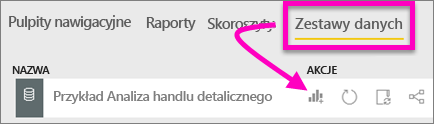
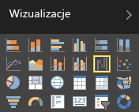
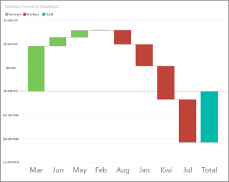
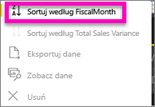
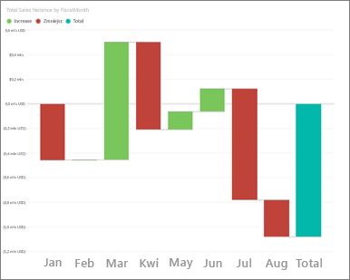
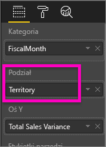
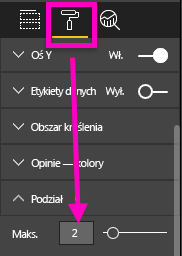
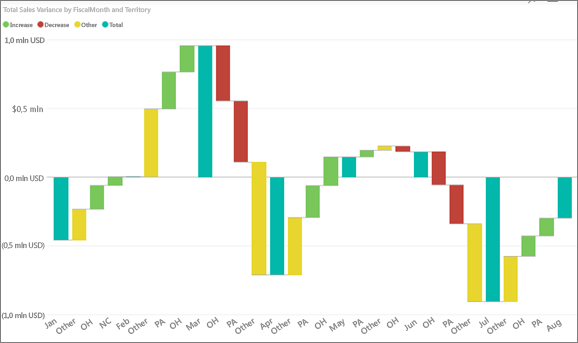

# Wykresy kaskadowe w usłudze Power BI
Wykres kaskadowy pokazuje sumę bieżącą, gdy wartości są dodawane lub odejmowane. Jest to użyteczne, jeśli chcemy zrozumieć, jak na początkową wartość (np. przychód netto) ma wpływ seria zmian dodatnich i ujemnych.

Kolumny są kodowane przy użyciu kolorów, więc szybko można zobaczyć wzrosty i spadki. Kolumny z wartościami początkowymi i końcowymi często [zaczynają się na osi poziomej](https://support.office.com/article/Create-a-waterfall-chart-in-Office-2016-for-Windows-8de1ece4-ff21-4d37-acd7-546f5527f185#BKMK_Float "zaczynają się na osi poziomej"), podczas gdy wartości pośrednie są kolumnami przestawnymi. Ze względu na ten „wygląd” wykresy kaskadowe są często zwane wykresami mostkowymi.

<iframe width="560" height="315" src="https://www.youtube.com/embed/qKRZPBnaUXM" frameborder="0" allow="autoplay; encrypted-media" allowfullscreen></iframe>

## Kiedy stosować wykresy kaskadowe
Wykresy kaskadowe są doskonałym wyborem w następujących przypadkach:

* Jeśli występują zmiany miary w serii czasu lub różnych kategoriach.
* W przypadku inspekcji najważniejszych zmian przyczyniających się do wartości całkowitej.
* W przypadku wykreślania rocznego zysku firmy poprzez przedstawienie różnych źródeł dochodu i osiągnięcie zysku całkowitego (lub straty).
* W przypadku ilustrowania początkowej i końcowej liczby pracowników w firmie w roku.
* W przypadku wizualizowania zarobków i wydatków w każdym miesiącu oraz salda bieżącego dla konta. 

## Tworzenie wykresu kaskadowego
Utworzymy wykres kaskadowy, który będzie przedstawiać wariancję sprzedaży (szacowaną sprzedaż w porównaniu do faktycznej sprzedaży) według miesięcy. Aby móc wykonywać te instrukcje, zaloguj się w usłudze Power BI, a następnie wybierz pozycję **Pobierz dane \> Przykłady \> Retail Analysis Sample**. 

1. Wybierz kartę **Zestawy danych** i przewiń do nowego zestawu danych „Przykład Retail Analysis”.  Wybierz ikonę **Utwórz raport**, aby otworzyć zestaw danych w widoku edycji raportu. 
   
    
2. W okienku **Pola** wybierz pozycje **Sprzedaż \> Wariancja sprzedaży całkowitej**. Jeśli pozycja **Wariancja sprzedaży całkowitej** nie znajduje się w obszarze **Oś Y**, przeciągnij ją tam.
3. Przekonwertuj wykres na **Wykres kaskadowy**. 
   
    
4. Wybierz pozycje **Czas** \> **Miesiąc obrachunkowy**, aby je dodać do źródła **Kategoria**. 
   
    
5. Posortuj wykres kaskadowy chronologicznie. W prawym górnym rogu wykresu wybierz wielokropek (...), a następnie wybierz pozycję **Miesiąc obrachunkowy**.
   
    
   
    
6. Przejdź do szczegółów, aby zobaczyć, co ma największy wpływ na zmiany z miesiąca na miesiąc. Przeciągnij **Magazyn** > **Terytorium** do zasobnika **Podział**.
   
    
7. Domyślnie usługa Power BI dodaje pięć najważniejszych elementów przyczyniających się do wzrostów lub spadków według miesiąca. Niemniej nas interesują jedynie dwa najważniejsze elementy.  W okienku Formatowanie wybierz opcję **Podział** i ustaw opcję **Maksimum** na 2.
   
    
   
    Szybki przegląd wykazuje, że terytoria Ohio i Pensylwania mają największy wpływ na trend, ujemny i dodatni, w wykresie kaskadowym. 
   
    
8. Jest to interesujące odkrycie. Czy Ohio i Pensylwania mają tak znaczny wpływ, ponieważ sprzedaż w tych dwóch terytoriach jest znacznie wyższa niż w innych regionach?  Możemy to sprawdzić. Utwórz mapę, która będzie sprawdzać sprzedaż według terytorium.  
   
    
   
    Nasza mapa potwierdza teorię.  Pokazuje, że te dwa terytoria mają najwyższą wartość sprzedaży w ubiegłym roku (rozmiar bąbelka) i w tym roku (cieniowanie bąbelka).

## Wyróżnianie i filtrowanie krzyżowe
Aby uzyskać informacje o korzystaniu z okienka filtrów, zobacz [Dodawanie filtru do raportu](power-bi-report-add-filter.md).

Wyróżnianie kolumny lub linii na wykresie kaskadowym powoduje krzyżowe filtrowanie innych wizualizacji na stronie raportu... i na odwrót. Jednak kolumna z podsumowaniem nie wyzwala wyróżniania ani nie reaguje na filtrowanie krzyżowe.

## Następne kroki
[Raporty w usłudze Power BI](service-reports.md)

[Typy wizualizacji w usłudze Power BI](power-bi-visualization-types-for-reports-and-q-and-a.md)

[Wizualizacje w raportach usługi Power BI](power-bi-report-visualizations.md)

[Power BI — podstawowe pojęcia](service-basic-concepts.md)

Masz więcej pytań? [Odwiedź społeczność usługi Power BI](http://community.powerbi.com/)

