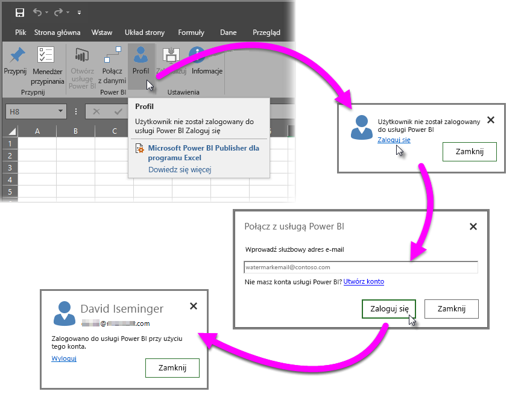

# Dodatek Power BI Publisher dla programu Excel
Dodatek Microsoft **Power BI Publisher dla programu Excel** umożliwia tworzenie migawek najważniejszych informacji w programie Excel, takich jak tabele przestawne, wykresy i zakresy oraz ich przypinanie do pulpitów nawigacyjnych w usłudze Power BI.

Jakie elementy można przypiąć? Niemal wszystkie elementy w arkuszu programu Excel. Można zaznaczyć zakres komórek w prostym arkuszu lub tabeli, tabeli przestawnej lub wykresie przestawnym, oraz ilustracje, obrazy i tekst.

Czego nie można przypiąć? Nie można przypiąć Map 3D lub wizualizacji w arkuszach Power View. Istnieją również pewne elementy, które można przypiąć, ale nie miałoby to większego sensu, takie jak filtr fragmentatora lub osi czasu.

Po przypięciu elementu z poziomu programu Excel do nowego lub istniejącego pulpitu nawigacyjnego w usłudze Power BI jest dodawany nowy kafelek. Nowy kafelek jest migawką, więc nie jest dynamiczny, ale można go aktualizować. Na przykład w przypadku wprowadzenia zmiany w tabeli przestawnej lub wykresie, który został już przypięty, kafelek pulpitu nawigacyjnego w usłudze Power BI nie jest aktualizowany automatycznie, ale można zaktualizować przypięte elementy przy użyciu **Menedżera przypinania**. Poniższe sekcje zawierają więcej informacji na temat **Menedżera przypinania**.

## Pobieranie i instalowanie
Power BI Publisher dla programu Excel jest dodatkiem, który można pobrać i zainstalować w wersji klasycznej programu Microsoft Excel 2007 lub nowszego.

[Pobierz dodatek Power BI Publisher dla programu Excel](http://go.microsoft.com/fwlink/?LinkId=715729)

Po zainstalowaniu dodatku Publisher w programie Excel będzie wyświetlana nowa wstążka usługi **Power BI** umożliwiająca logowanie się do usługi Power BI lub wylogowywanie się z niej, przypinanie elementów do pulpitów nawigacyjnych oraz zarządzanie przypiętymi elementami.

Dodatek **Power BI Publisher dla programu Excel** jest domyślnie włączony, ale jeśli z jakiegoś powodu karta usługi Power BI na wstążce w programie Excel nie jest widoczna, musisz go włączyć. Kliknij pozycję **Plik** > **Opcje** > **Dodatki** > **Dodatki COM**. Wybierz pozycję **Microsoft Power BI Publisher dla programu Excel**.

## Przypinanie zakresu do pulpitu nawigacyjnego
W arkuszu możesz wybrać dowolny zakres komórek i przypiąć migawkę tego zakresu do istniejącego lub nowego pulpitu nawigacyjnego w usłudze Power BI. Tę samą migawkę możesz również przypiąć do wielu pulpitów nawigacyjnych.

Aby rozpocząć, należy zalogować się do usługi Power BI.

1. Wybierz pozycję **Profil** na karcie **Power BI** wstążki w programie Excel. Jeśli już wcześniej zalogowano się do usługi Power BI, zostanie wyświetlone okno dialogowe zawierające informację o koncie, do którego użytkownik jest aktualnie zalogowany. Jeśli jest to konto, którego chcesz użyć, przejdź do następnego zestawu kroków, aby przypiąć zakres. Wybierz pozycję *Wyloguj się*, aby użyć innego konta usługi Power BI. Jeśli nie zalogowano się wcześniej, przejdź do kolejnego kroku (Krok 2).
   
   
2. Jeśli nie zalogowano się wcześniej, wybierz link **Zaloguj się** wyświetlany po wybraniu pozycji **Profil** na karcie **Power BI** wstążki w programie Excel, w oknie dialogowym **Łączenie z usługą Power BI** wpisz adres e-mail konta usługi Power BI, którego chcesz użyć, a następnie wybierz pozycję **Zaloguj się**.
   
   

Po zalogowaniu się wykonaj następujące kroki, aby przypiąć zakres do pulpitu nawigacyjnego:

1. W programie Excel wybierz kartę **Power BI** na wstążce, aby wyświetlić przycisk wstążki **Przypnij**.
2. Zaznacz zakres w skoroszycie programu Excel.
3. Kliknij przycisk **Przypnij** na wstążce **Power BI**, aby wyświetlić okno dialogowe **Przypnij do pulpitu nawigacyjnego**. Jeśli jeszcze nie zalogowano się do usługi Power BI, zostanie wyświetlony monit, aby to zrobić. Wybierz obszar roboczy z listy rozwijanej **Obszar roboczy**. Aby przypiąć do własnego pulpitu nawigacyjnego, upewnij się, że wybrano pozycję **Mój obszar roboczy**. Aby przypiąć do pulpitu nawigacyjnego w obszarze roboczym grupy, wybierz grupę z listy rozwijanej.
4. Wybierz, czy chcesz przypiąć do *istniejącego pulpitu nawigacyjnego*, czy utworzyć *nowy pulpit nawigacyjny*.
5. Kliknij przycisk **OK**, aby przypiąć zaznaczenie do pulpitu nawigacyjnego.
6. W oknie dialogowym **Przypnij do pulpitu nawigacyjnego** wybierz istniejący pulpit nawigacyjny w obszarze roboczym lub utwórz nowy, a następnie kliknij przycisk **OK**.
   
   

## Przypinanie wykresu do pulpitu nawigacyjnego
Kliknij wykres, a następnie kliknij przycisk Przypnij .

## Zarządzanie przypiętymi elementami
Przy użyciu **Menedżera przypinania** można zaktualizować (odświeżyć) kafelek skojarzony z przypiętym elementem w usłudze Power BI. Można również usunąć skojarzenie z elementem, który został już przypięty do pulpitów nawigacyjnych w usłudze Power BI.

Aby zaktualizować kafelki na pulpicie nawigacyjnym, w **Menedżerze przypinania** wybierz co najmniej jeden element, a następnie wybierz przycisk **Aktualizuj**.

Aby usunąć mapowanie między przypiętym elementem w programie Excel oraz skojarzonym kafelkiem na pulpicie nawigacyjnym, wybierz przycisk **Usuń**. Wybranie przycisku **Usuń** *nie* spowoduje usunięcia elementu z arkusza w programie Excel ani usunięcia skojarzonego kafelka z pulpitu nawigacyjnego. Usuwane jest przypięcie (*mapowanie*) między tymi elementami. Usunięty element nie będzie już widoczny w **Menedżerze przypinania**. W przypadku ponownego przypięcia elementu będzie on wyświetlany jako nowy kafelek.

Przypięty element (kafelek) należy usunąć z pulpitu nawigacyjnego z poziomu usługi Power BI. Dla kafelka do usunięcia wybierz ikonę **Otwórz menu** , a następnie wybierz polecenie **Usuń kafelek** .

## Łączenie się z danymi w usłudze Power BI
Począwszy od dodatku **Power BI Publisher dla programu Excel** w wersji z lipca 2016 roku (łącznie z bieżącą wersją, do której link znajduje się powyżej), można łączyć się bezpośrednio z danymi w usłudze Power BI i analizować te dane w programie Excel przy użyciu tabel przestawnych i wykresów przestawnych. Te funkcje ułatwiają użycie danych usługi Power BI oraz programu Excel razem do analizowania najważniejszych danych.

Wprowadzono następujące ulepszenia:

* Wszystkie sterowniki wymagane do łączenia się z danymi w usłudze Power BI są automatycznie aktualizowane wraz z każdą wersją — nie ma konieczności samodzielnego instalowania sterowników ani zarządzania nimi.
* Nie trzeba już pobierać plików odc, aby móc tworzyć połączenia — dodatek **Power BI Publisher dla programu Excel** automatycznie tworzy połączenia po wybraniu raportu lub zestawu danych, który ma zostać użyty.
* Teraz można tworzyć wiele połączeń i tabel przestawnych w tym samym skoroszycie
* Komunikaty o błędach zostały ulepszone i są specyficzne dla dodatku **Power BI Publisher dla programu Excel**. Nie są używane domyślne komunikaty programu Excel

### Łączenie z danymi usługi Power BI w programie Excel
Aby nawiązać połączenie z danymi usługi Power BI przy użyciu dodatku **Power BI Publisher dla programu Excel**, wykonaj te proste czynności:

1. Zaloguj się do usługi Power BI. Kroki dotyczące logowania się (lub logowania się przy użyciu innego konta) przedstawiono wcześniej w tym artykule.
2. Po zalogowaniu się do usługi Power BI przy użyciu odpowiedniego konta wybierz pozycję **Połącz z danymi** na karcie wstążki **Power BI** w programie Excel.
   
   
3. Program Excel łączy się z usługą Power BI przy użyciu połączenia HTTPS i wyświetla okno dialogowego **Łączenie z danymi w usłudze Power BI** umożliwiające wybór *obszaru roboczego*, z którego mają zostać wybrane dane (element 1 na poniższym obrazie), *typ danych*, z którymi ma zostać nawiązane połączenie, **raport** lub **zestaw danych** (2), oraz listę rozwijaną (3) umożliwiającą wybór *dostępnego raportu lub zestawu danych*, z którym ma zostać nawiązane połączenie.
   
   
4. Po wybraniu odpowiednich opcji i wybraniu przycisku **Połącz** w oknie dialogowym **Łączenie z danymi w usłudze Power BI** program Excel przygotowuje tabelę przestawną i wyświetla okienko **Pola tabeli przestawnej**, w którym można wybrać pola z połączonych danych usługi Power BI i tworzyć tabele lub wykresy ułatwiające analizowanie danych.
   
   

Jeśli nie ma żadnych danych w usłudze Power BI, program Excel wykrywa ich brak i proponuje utworzenie przykładowych danych, aby móc nawiązać połączenie i przetestować je.

Należy pamiętać o kilku kwestiach dotyczących tej wersji dodatku **Power BI Publisher dla programu Excel**:

* **Dane udostępnione** — Dane, które zostały udostępnione użytkownikowi, ale nie są bezpośrednio widoczne dla użytkownika w usłudze Power BI, nie są dostępne w oknie dialogowym **Łączenie z danymi**.
* **Lokalne usługi SSAS** — Jeśli wybrany zestaw danych pochodzi z lokalnych usług SQL Server Analysis Services (SSAS), a zestaw danych w usłudze Power BI używa zapytań bezpośrednich do uzyskiwania dostępu do danych, dodatek **Power BI Publisher dla programu Excel** łączy się z tymi danymi przy użyciu lokalnego połączenia sieciowego i *nie* łączy się z tymi danymi za pośrednictwem usługi Power BI. Z tego względu każdy użytkownik podejmujący próbę połączenia z takimi zestawami danych musi być podłączony do lokalnej sieci i uwierzytelniony, aby uzyskać dostęp do tych danych przy użyciu metody uwierzytelniania stosowanej przez wystąpienie usług Analysis Services, w którym są przechowywane dane.
* **Wymagane sterowniki** - Dodatek **Power BI Publisher dla programu Excel** automatycznie instaluje wszystkie sterowniki niezbędne do działania tej funkcji. Wśród sterowników instalowanych automatycznie jest sterownik OLE DB programu Excel dla usług Analysis Services. W przypadku usunięcia tego sterownika przez użytkownika (lub z innych przyczyn) połączenie z danymi usługi Power BI nie będzie działać.
* **Zestaw danych musi zawierać miary** — Zestaw danych musi mieć zdefiniowane miary modelu, aby program Excel mógł traktować miary jako wartości w tabelach przestawnych i poprawnie analizować dane. Dowiedz się więcej o [miarach](desktop-measures.md).
* **Obsługa grup** — Zestawy danych udostępnione osobom spoza określonej grupy nie są obsługiwane i nie można łączyć się z nimi.
* **Porównanie subskrypcji bezpłatnych i Pro** — Działania skojarzone z grupami nie są obsługiwane dla użytkowników wersji bezpłatnej usługi Power BI, dlatego zestawy danych i raporty udostępnione grupie nie będą widoczne w obszarach roboczych tych użytkowników.
* **Udostępnione raporty lub zestawy danych** — Nie można łączyć się z raportami lub zestawami danych udostępnionymi użytkownikowi.
* **Użycie tabel zamiast modeli danych** — Zestawy danych i raporty, które są tworzone przez zaimportowanie tylko tabel z programu Excel (bez modelu danych) nie są obecnie obsługiwane i nie można się z nimi łączyć.

Po utworzeniu atrakcyjnych wykresów lub innych wizualizacji, takich jak zakres danych, można je łatwo przypiąć do pulpitu nawigacyjnego w usłudze Power BI, jak opisano wcześniej w tym artykule.

## Powiązane artykuły
Istnieje wiele sposobów umożliwiających użycie razem programu Excel i usługi Power BI, aby uzyskać największe korzyści z obu rozwiązań. Aby uzyskać więcej informacji, zobacz następujące artykuły.

* [Analizowanie w programie Excel](service-analyze-in-excel.md)
* [Rozwiązywanie problemów z analizą w programie Excel](desktop-troubleshooting-analyze-in-excel.md)

