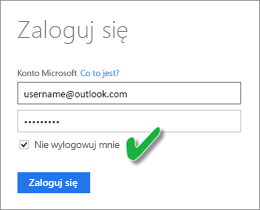

# Odświeżanie zestawu danych utworzonego na podstawie pliku CSV w usłudze OneDrive lub SharePoint Online
## Jakie są zalety?
Po ustanowieniu połączenia z plikiem csv w usłudze OneDrive lub SharePoint Online jest tworzony zestaw danych w usłudze Power BI. Dane z pliku csv są następnie importowane do zestawu danych w usłudze Power BI. Usługa Power BI następnie automatycznie łączy się z plikiem i odświeża wszelkie zmiany za pomocą zestawu danych w usłudze Power BI. Po zmodyfikowaniu pliku csv w usłudze OneDrive lub SharePoint Online i ich zapisaniu, zmiany te zostaną wyświetlone w usłudze Power BI zazwyczaj w ciągu około godziny. Wszystkie wizualizacje w usłudze Power BI oparte na tym zestawie danych zostaną również automatycznie zaktualizowane.

Jeśli pliki znajdują się w folderze udostępnionym w usłudze OneDrive dla Firm lub SharePoint Online, inni użytkownicy mogą pracować na tym samym pliku. Po zapisaniu wszelkie wprowadzone zmiany są automatycznie aktualizowane w usłudze Power BI, zazwyczaj w ciągu godziny.

W wielu organizacjach są uruchamiane procesy, które automatycznie wysyłają zapytania o dane do bazy danych, które następnie są codziennie zapisywane w pliku csv. Jeśli plik jest przechowywany w usłudze OneDrive lub SharePoint Online i ten sam plik jest zastępowany każdego dnia, w przeciwieństwie tworzenia codziennie nowego pliku o innej nazwie, możesz połączyć się z tym plikiem w usłudze Power BI. Twój zestaw danych, który łączy się z plikiem, zostanie zsynchronizowany wkrótce po zaktualizowaniu pliku w usłudze OneDrive lub SharePoint Online. Wszelkie wizualizacje oparte na tym zestawie danych zostaną również automatycznie zaktualizowane.

## Zakres obsługi
Pliki z wartościami rozdzielanymi przecinkami są prostymi plikami tekstowymi, więc połączenia z zewnętrznymi źródłami danych i raporty nie są obsługiwane. Nie możesz zaplanować odświeżania zestawu danych utworzonego na podstawie pliku rozdzielanego przecinkami. Jednak jeśli plik znajduje się w usłudze OneDrive lub SharePoint Online, usługa Power BI będzie automatycznie synchronizować co godzinę wszelkie zmiany wprowadzone w pliku z zestawem danych.

## Usługa OneDrive lub OneDrive dla Firm. Jaka jest różnica?
Jeśli masz zarówno osobistą usługę OneDrive, jak i OneDrive dla Firm, zalecane jest przechowywanie wszelkich plików, z którymi chcesz nawiązać połączenie w usłudze Power BI, w usłudze OneDrive dla Firm. Oto dlaczego: prawdopodobnie używasz dwóch różnych kont do logowania się do nich.

Nawiązywanie połączenia z usługą OneDrive dla Firm w usłudze Power BI jest zwykle bezproblemowe, ponieważ to samo konto, którego używasz do logowania się do usługi Power BI, często jest kontem używanym do logowania się do usługi OneDrive dla Firm. Jednak w przypadku osobistej usługi OneDrive najprawdopodobniej logujesz się przy użyciu innego [konta Microsoft](http://www.microsoft.com/account/default.aspx).

Po zalogowaniu się do swojego konta Microsoft, musisz pamiętać o zaznaczeniu opcji Nie wylogowuj mnie. Usługa Power BI następnie może zsynchronizować wszelkie aktualizacje z zestawami danych w usłudze Power BI

Jeśli wprowadzisz zmiany w pliku csv w usłudze OneDrive, których nie można zsynchronizować z zestawem danych w usłudze Power BI, ponieważ Twoje poświadczenia konta Microsoft mogły ulec zmianie, musisz połączyć się z plikiem i zaimportować go ponownie z Twojej osobistej usługi OneDrive.

## Gdy wystąpią problemy
Jeśli dane w pliku csv w usłudze OneDrive zostaną zmienione, a te zmiany nie zostaną odzwierciedlone w usłudze Power BI, najprawdopodobniej jest to spowodowane tym, że usługa Power BI nie może połączyć się z usługą OneDrive. Spróbuj połączyć się z plikiem i ponownie go zaimportować. Jeśli zostanie wyświetlony monit do logowania, należy koniecznie wybrać pozycję **Nie wylogowuj mnie**.

## Następne kroki
[Narzędzia do rozwiązywania problemów z odświeżaniem](service-gateway-onprem-tshoot.md)
[ Rozwiązywanie problemów ze scenariuszami odświeżania](refresh-troubleshooting-refresh-scenarios.md)

Masz więcej pytań? [Zadaj pytanie społeczności usługi Power BI](https://community.powerbi.com/)

