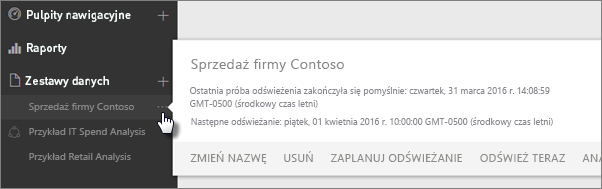
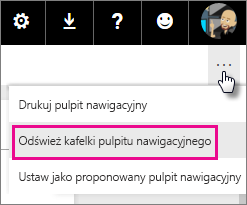
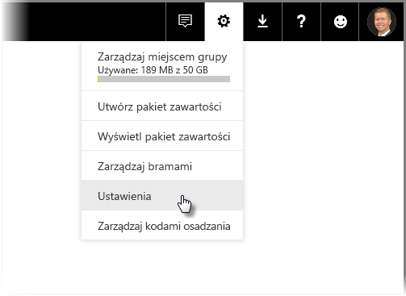
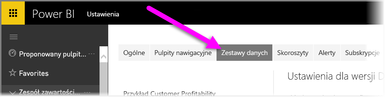
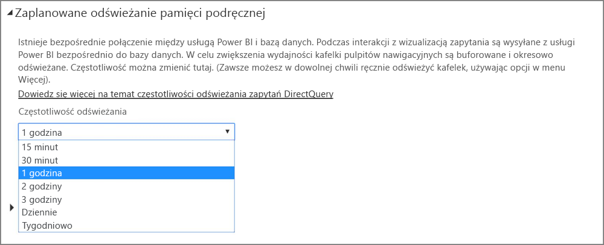

# Odświeżanie danych w usłudze Power BI
Pewność, że używane dane są zawsze aktualne, ma często zasadnicze znaczenie dla podejmowania właściwych decyzji. Prawdopodobnie znasz już funkcję pobierania danych w usłudze Power BI, która służy do nawiązania połączenia i przekazania danych. Wiesz także, jak tworzyć raporty i pulpity nawigacyjne. Teraz chcesz mieć pewność, że Twoje dane są naprawdę najnowsze i najlepsze.

W wielu przypadkach nie musisz robić nic. Niektóre dane, takie jak pochodzące z pakietu zawartości usługi Salesforce lub Marketo, są odświeżane automatycznie. W przypadku połączenia na żywo lub zapytań bezpośrednich dane są aktualne. Jednak w innych przypadkach, takich jak skoroszyt programu Excel lub plik programu Power BI Desktop łączący się z zewnętrznym źródłem danych online lub lokalnym źródłem danych, musisz przeprowadzić odświeżanie ręcznie lub skonfigurować harmonogram odświeżania, aby usługa Power BI mogła odświeżyć dane w raportach i pulpitach nawigacyjnych.

Ten artykuł, oraz kilka innych, ma na celu pomóc Ci zrozumieć, jak w rzeczywistości działa odświeżanie danych w usłudze Power BI, czy należy skonfigurować harmonogram odświeżania i co musi być przygotowane, aby odświeżanie powiodło się.

## Informacje o odświeżaniu danych
Przed skonfigurowaniem odświeżania ważne jest zrozumienie, co jest odświeżane i skąd biorą się dane.

*Źródło danych* to miejsce, z którego pochodzą dane i które eksplorujesz w raportach i na pulpitach nawigacyjnych. Przykładem takiego źródła danych może być usługa online, taka jak Google Analytics lub QuickBooks, baza danych w chmurze, taka jak Azure SQL Database, a także baza danych lub plik na lokalnym komputerze lub serwerze w danej organizacji. To wszystko są źródła danych. Typ źródła danych określa sposób odświeżania danych, które z niego pochodzą. Odświeżanie wszystkich typów źródeł danych jest omówione nieco później w temacie [Co można odświeżać?](#what-can-be-refreshed).

*Zestaw danych* jest tworzony automatycznie w usłudze Power BI po użyciu funkcji pobierania danych w celu nawiązania połączenia i przekazania danych z pakietu zawartości lub pliku bądź po nawiązaniu połączenia ze źródłem danych na żywo. W programach Power BI Desktop i Excel 2016 możesz także opublikować plik bezpośrednio do usługi Power BI, co ma taki sam efekt jak użycie funkcji pobierania danych.

W każdym przypadku zestaw danych zostanie utworzony i wyświetlony w kontenerach obszaru Mój obszar roboczy, czyli grupie, usługi Power BI. Po wybraniu **wielokropka (...)** dla zestawu danych możesz eksplorować dane w raporcie, edytować ustawienia i skonfigurować odświeżanie.

Zestaw danych może pobierać dane z jednego lub wielu źródeł danych. Na przykład możesz użyć programu Power BI Desktop do pobrania danych z usługi SQL Database w Twojej organizacji i innych danych ze strumieniowego źródła danych OData online. Następnie podczas publikowania pliku do usługi Power BI jest tworzony pojedynczy zestaw danych, lecz ma on źródła danych dla usługi SQL Database i strumieniowego źródła danych OData.

Zestaw danych zawiera informacje o źródłach danych, poświadczeniach źródeł danych i w większości przypadków także podzbiory danych skopiowanych ze źródła danych. Podczas tworzenia wizualizacji w raportach i na pulpitach nawigacyjnych widzisz dane w zestawie danych, a w przypadku połączenia na żywo — takiego jak z usługą Azure SQL Database — zestaw danych określa wyświetlane dane bezpośrednio na podstawie źródła danych. W przypadku połączenia na żywo z usługami Analysis Services definicja zestawu danych pochodzi bezpośrednio z usług Analysis Services.

> *Podczas odświeżania danych aktualizujesz dane w zestawie danych znajdującym się w usłudze Power BI ze źródła danych. Takie odświeżanie to odświeżanie pełne, a nie przyrostowe.*
> 
> 

Zawsze podczas odświeżania danych w zestawie danych, za pomocą polecenia Odśwież lub skonfigurowanego harmonogramu, usługa Power BI używa informacji w zestawie danych do nawiązania połączenia się ze źródłami danych zdefiniowanymi dla niego, odpytuje je pod kątem zaktualizowanych danych, a następnie ładuje zaktualizowane dane do zestawu danych. Wszelkie wizualizacje w raportach lub na pulpitach nawigacyjnych oparte na tych danych są aktualizowane automatycznie.

Zanim przejdziemy dalej, musisz zrozumieć jeszcze jedną bardzo ważną rzecz:

> *Niezależnie od częstotliwości odświeżania zestawu danych i przeglądania danych na żywo — aktualne muszą być przede wszystkim dane w źródle danych.*
> 
> 

Większość organizacji przetwarza dane raz dziennie, zazwyczaj w wieczorem. Jeśli zaplanujesz odświeżanie zestawu danych utworzonego za pomocą pliku programu Power BI Desktop i korzystającego z połączenia z lokalną bazą danych, a dział IT uruchamia przetwarzanie dla tej bazy danych SQL co wieczór, wystarczy skonfigurować wykonywanie zaplanowanego odświeżania raz na dzień. Na przykład po wykonaniu przetwarzania bazy danych, lecz przed rozpoczęciem dnia pracy. Oczywiście nie jest to uniwersalne rozwiązanie. Usługa Power BI udostępnia wiele sposobów nawiązywania połączenia ze źródłami danych, które są aktualizowane często lub nawet w czasie rzeczywistym.

## Typy odświeżania
Istnieją cztery główne typy odświeżania wykonywane w usłudze Power BI. Odświeżanie pakietu, odświeżanie modelu/danych, odświeżanie kafelka i odświeżanie kontenera wizualizacji.

### Odświeżanie pakietu
Synchronizacja pliku programu Power BI Desktop lub Excel między usługą Power BI i usługą OneDrive lub SharePoint Online. Dane nie są pobierane z oryginalnego źródła danych. Zestaw danych w usłudze Power BI zostanie zaktualizowany tylko za pomocą danych w pliku znajdującym się w usłudze OneDrive lub SharePoint Online.

### Odświeżanie modelu/danych
Dotyczy odświeżania zestawu danych w usłudze Power BI przy użyciu danych z oryginalnego źródła danych. Jest to realizowane za pomocą odświeżania zaplanowanego lub natychmiastowego odświeżania na żądanie. Dla lokalnych źródeł danych jest wymagana brama.

### Odświeżanie kafelka
Odświeżanie kafelka obejmuje aktualizację pamięci podręcznej wizualizacji kafelka na pulpicie nawigacyjnym po zmianie danych. Dzieje się to co około 15 minut. Możesz też wymusić odświeżanie kafelka, wybierając **wielokropek (...)** w prawym górnym rogu pulpitu nawigacyjnego, a następnie polecenie **Odśwież kafelki pulpitu nawigacyjnego**.

Aby uzyskać szczegółowe informacje na temat typowych błędów odświeżania kafelka, zobacz temat [Rozwiązywanie problemów z błędami kafelka](refresh-troubleshooting-tile-errors.md).

### Odświeżanie kontenera wizualizacji
Odświeżenie kontenera wizualizacji powoduje zaktualizowanie buforowanych wizualizacji w raporcie po zmianie danych.

## Co można odświeżyć?
W usłudze Power BI zazwyczaj używasz funkcji pobierania danych do zaimportowania danych z pliku na dysku lokalnym, w usłudze OneDrive lub w usłudze SharePoint Online, opublikowania raportu z programu Power BI Desktop lub połączenia się bezpośrednio z bazą danych w chmurze w Twojej organizacji. Możesz odświeżyć dowolne dane w usłudze Power BI, ale konieczność wykonania tej czynności zależy od sposobu utworzenia zestawu danych i źródeł danych, z którymi się on łączy. Przyjrzyjmy się, jak dane są odświeżane przy użyciu każdej z tych metod.

Zanim przejdziemy dalej, zapoznaj się z kilkoma ważnymi definicjami:

**Odświeżanie automatyczne** — użytkownik nie musi definiować żadnej konfiguracji, aby zestaw danych był regularnie odświeżany. Ustawienia odświeżania danych są konfigurowane przez usługę Power BI. W przypadku dostawców usług online odświeżanie jest zazwyczaj wykonywane raz dziennie. W przypadku plików ładowanych z usługi OneDrive odświeżanie automatyczne jest wykonywane co godzinę dla danych niepochodzących z zewnętrznego źródła danych. O ile można skonfigurować inny harmonogram odświeżania oraz odświeżać ręcznie, prawdopodobnie nie jest to potrzebne.

**Odświeżanie ręczne skonfigurowane przez użytkownika lub zaplanowane** — możesz ręcznie odświeżyć zestaw danych za pomocą polecenia Odśwież teraz lub skonfigurować harmonogram odświeżania za pomocą polecenia Zaplanuj odświeżanie w ustawieniach zestawu danych. Ten typ odświeżania jest wymagany dla plików programu Power BI Desktop i skoroszytów programu Excel, które łączą się z zewnętrznymi źródłami danych online i lokalnymi źródłami danych.

> [!NOTE]
> Po skonfigurowaniu godziny odświeżania zaplanowanego może wystąpić opóźnienie o długości co najwyżej jednej godziny jego rozpoczęciem.
> 
> 

**Połączenie na żywo/zapytanie bezpośrednie** — usługa Power BI jest połączona ze źródłem danych za pomocą połączenia na żywo. W przypadku lokalnych źródeł danych administratorzy muszą skonfigurować źródło danych w ramach bramy przedsiębiorstwa, lecz interakcja z użytkownikiem może nie być wymagana.

> [!NOTE]
> Aby podwyższyć wydajność, pulpity nawigacyjne połączone z danymi za pomocą zapytania bezpośredniego są aktualizowane automatycznie. Możesz też w dowolnym momencie ręcznie odświeżyć kafelek przy użyciu menu **Więcej** na kafelku.
> 
> 

## Pliki lokalne i pliki w usłudze OneDrive lub SharePoint Online
Odświeżanie danych jest obsługiwane dla plików programu Power BI Desktop i skoroszytów programu Excel, które łączą się z zewnętrznymi źródłami danych online lub lokalnymi źródłami danych. Odświeżane są tylko dane dla zestawu danych w ramach usługi Power BI. Plik lokalny nie jest odświeżany.

Przechowywanie plików w usłudze OneDrive lub SharePoint Online i nawiązywanie połączenia z nimi z usługi Power BI zapewnia dużą elastyczność. Jednak ta elastyczność sprawia, że zrozumienie całego mechanizmu jest dość trudne. Zaplanowane odświeżanie plików przechowywanych w usłudze OneDrive lub SharePoint Online różni się od odświeżania pakietu. Możesz dowiedzieć się więcej w sekcji [Typy odświeżania](#types-of-refresh).

### Plik programu Power BI Desktop

| **Źródło danych** | **Odświeżanie automatyczne** | **Odświeżanie ręczne skonfigurowane przez użytkownika lub odświeżanie zaplanowane** | **Brama jest wymagana** |
| --- | --- | --- | --- |
| Polecenie Pobierz dane (na wstążce) umożliwia nawiązanie połączenia z danymi z dowolnego źródła danych online na liście i odpytywanie ich. |Nie |Tak |Nie (zobacz poniżej) |
| Polecenie Pobierz dane umożliwia nawiązanie połączenia z bazą danych usług Analysis Services i eksplorowanie jej na żywo. |Tak |Nie |Tak |
| Polecenie Pobierz dane umożliwia nawiązanie połączenia z obsługiwanym lokalnym źródłem danych zapytań bezpośrednich i eksplorowanie go. |Tak |Nie |Tak |
| Polecenie Pobierz dane umożliwia nawiązanie połączenia z usługami Azure SQL Database, Azure SQL Data Warehouse i Azure HDInsight Spark oraz odpytywania ich. |Tak |Tak |Nie |
| Polecenie Pobierz dane umożliwia nawiązanie połączenia z dowolnym lokalnym źródłem danych na liście, z wyjątkiem pliku usługi Hadoop (HDFS) i programu Microsoft Exchange, oraz odpytywanie go. |Nie |Tak |Tak |

> [!NOTE]
> Jeśli używasz funkcji [**Web.Page**](https://msdn.microsoft.com/library/mt260924.aspx), potrzebujesz bramy, jeśli zestaw danych lub raport opublikowano ponownie po 18 listopada 2016.
> 
> 

Szczegóły zawiera temat [Odświeżanie zestawu danych utworzonego na podstawie pliku programu Power BI Desktop w usłudze OneDrive](refresh-desktop-file-onedrive.md).

### Skoroszyt programu Excel

| **Źródło danych** | **Odświeżanie automatyczne** | **Odświeżanie ręczne skonfigurowane przez użytkownika lub odświeżanie zaplanowane** | **Brama jest wymagana** |
| --- | --- | --- | --- |
| Tabele danych w arkuszu nie zostały załadowane do modelu danych programu Excel. |Tak, co godzinę *(tylko usługi OneDrive / SharePoint Online)* |Tylko ręcznie *(tylko usługi OneDrive / SharePoint Online)* |Nie |
| Tabele danych w arkuszu połączone z tabelą w modelu danych programu Excel (tabele połączone). |Tak, co godzinę *(tylko usługi OneDrive / SharePoint Online)* |Tylko ręcznie *(tylko usługi OneDrive / SharePoint Online)* |Nie |
| Dodatek Power Query* jest używany do nawiązywania połączenia z danymi i odpytywania ich z dowolnego źródła danych online na liście oraz ładowania danych do modelu danych programu Excel. |Nie |Tak |Nie |
| Dodatek Power Query* umożliwia nawiązanie połączenia z dowolnym lokalnym źródłem danych na liście, z wyjątkiem pliku usługi Hadoop (HDFS) i programu Microsoft Exchange, odpytywanie go oraz ładowanie danych do modelu danych programu Excel. |Nie |Tak |Tak |
| Dodatek Power Pivot umożliwia nawiązanie połączenia z danymi z dowolnego źródła danych online na liście, odpytywanie ich oraz ładowanie danych do modelu danych programu Excel. |Nie |Tak |Nie |
| Dodatek Power Pivot umożliwia nawiązanie połączenia z danymi z dowolnego lokalnego źródła danych na liście, odpytywanie ich oraz ładowanie danych do modelu danych programu Excel. |Nie |Tak |Tak |

*\* Dodatek Power Query jest znany jako funkcja Pobierz i transformuj dane w programie Excel 2016.*

Aby uzyskać szczegółowe informacje, zobacz temat [Odświeżanie zestawu danych utworzonego na podstawie skoroszytu programu Excel w usłudze OneDrive](refresh-excel-file-onedrive.md).

### Plik wartości rozdzielanych przecinkami (csv) w usłudze OneDrive lub SharePoint Online

| **Źródło danych** | **Odświeżanie automatyczne** | **Odświeżanie ręczne skonfigurowane przez użytkownika lub odświeżanie zaplanowane** | **Brama jest wymagana** |
| --- | --- | --- | --- |
| Proste wartości rozdzielane przecinkami |Tak, co godzinę |Tylko ręcznie |Nie |

Aby uzyskać szczegółowe informacje, zobacz temat [Odświeżanie zestawu danych utworzonego na podstawie pliku z wartościami rozdzielanymi przecinkami (csv) w usłudze OneDrive](refresh-csv-file-onedrive.md).

## Pakiety zawartości
W usłudze Power BI są dostępne dwa typy pakietów zawartości:

**Pakiety zawartości z usług online**, takich jak Adobe Analytics, SalesForce i Dynamics CRM Online. Zestawy danych utworzone na podstawie usług online są odświeżane automatycznie raz dziennie. Mimo że prawdopodobnie nie jest to konieczne, możesz wykonać odświeżanie ręcznie lub skonfigurować harmonogram odświeżania. Ponieważ usługi online znajdują się w chmurze, brama nie jest wymagana.

**Pakiety zawartości organizacji** tworzone i udostępniane przez użytkowników w organizacji. Użytkownicy pakietu zawartości nie mogą skonfigurować harmonogramu odświeżania ani wykonać odświeżania ręcznie. Tylko twórca pakietu zawartości może skonfigurować odświeżanie dla zestawów danych w pakiecie zawartości. Ustawienia odświeżania są dziedziczone razem z zestawem danych.

### Pakiety zawartości z usług online

| **Źródło danych** | **Odświeżanie automatyczne** | **Odświeżanie ręczne skonfigurowane przez użytkownika lub odświeżanie zaplanowane** | **Brama jest wymagana** |
| --- | --- | --- | --- |
| Usługi online dostępne za pomocą pozycji Pobierz dane &gt; Usługi |Tak |Tak |Nie |

### Pakiety zawartości organizacji
Możliwości odświeżania zestawu danych w ramach pakietu zawartości organizacji zależą od zestawu danych. Zobacz powyższe informacje dotyczące plików lokalnych i w usłudze OneDrive lub SharePoint Online.

Aby dowiedzieć się więcej, zobacz temat [Wprowadzenie do pakietów zawartości organizacji](service-organizational-content-pack-introduction.md).

## Połączenia na żywo i zapytania bezpośrednie dla lokalnych źródeł danych
Za pomocą lokalnej bramy danych możesz odpytywać lokalne źródła danych z usługi Power BI. Podczas interakcji z wizualizacją zapytania są wysyłane z usługi Power BI bezpośrednio do bazy danych. Następnie zaktualizowane dane są zwracane i wizualizacje są aktualizowane. Ponieważ istnieje bezpośrednie połączenie między usługą Power BI i bazą danych, nie ma potrzeby planowania odświeżania.

Podczas nawiązywania połączenia ze źródłem danych usług SQL Service Analysis Services (SSAS) za pomocą połączenia na żywo może ono użyć pamięci podręcznej nawet podczas ładowania raportu, w przeciwieństwie do zapytania bezpośredniego. To zachowanie poprawia wydajność ładowania raportu. Możesz zażądać najnowszych danych ze źródła danych SSAS przy użyciu przycisku **Odśwież**. Właściciele źródeł danych SSAS mogą skonfigurować częstotliwość zaplanowanego odświeżania pamięci podręcznej dla zestawu danych, aby zapewnić, że raporty są możliwie aktualne. 

Podczas konfigurowania źródła danych za pomocą lokalnej bramy danych możesz użyć tego źródła danych jako opcji odświeżania zaplanowanego. W ten sposób można zastąpić użycie bramy osobistej.

> [!NOTE]
> Jeśli zestaw danych jest skonfigurowany pod kątem połączenia na żywo lub zapytań bezpośrednich, zestawy danych są odświeżane mniej więcej co godzinę lub gdy wystąpi interakcja z danymi. Możesz ręcznie zmienić *częstotliwość odświeżania* za pomocą opcji *Zaplanowane odświeżanie pamięci podręcznej* w usłudze Power BI.
> 
> 

| **Źródło danych** | **Połączenie na żywo/zapytanie bezpośrednie** | **Odświeżanie ręczne skonfigurowane przez użytkownika lub odświeżanie zaplanowane** | **Brama jest wymagana** |
| --- | --- | --- | --- |
| Dane tabelaryczne usługi Analysis Services |Tak |Tak |Tak |
| Dane wielowymiarowe usługi Analysis Services |Tak |Tak |Tak |
| SQL Server |Tak |Tak |Tak |
| SAP HANA |Tak |Tak |Tak |
| Oracle |Tak |Tak |Tak |
| Teradata |Tak |Tak |Tak |

Aby dowiedzieć się więcej, zobacz temat [Lokalna brama danych](service-gateway-onprem.md)

## Bazy danych w chmurze
Zapytania bezpośrednie udostępniają bezpośrednie połączenie między usługą Power BI a bazą danych w chmurze. Podczas interakcji z wizualizacją zapytania są wysyłane z usługi Power BI bezpośrednio do bazy danych. Następnie zaktualizowane dane są zwracane i wizualizacje są aktualizowane. I ponieważ zarówno usługa Power BI, jak i źródło danych znajdują się w chmurze, nie ma potrzeby użycia bramy Personal Gateway.

Jeśli wizualizacja nie obejmuje żadnych interakcji z użytkownikiem, dane są odświeżane automatycznie mniej więcej co godzinę. Możesz zmienić tę częstotliwość odświeżania za pomocą opcji *Zaplanowane odświeżanie pamięci podręcznej*, ustawiając częstotliwość odświeżania.

Aby ustawić częstotliwość, wybierz ikonę **koła zębatego** w prawym górnym rogu ekranu usługi Power BI, a następnie wybierz pozycję **Ustawienia**.

Zostanie wyświetlona strona **Ustawienia**, na której możesz wybrać zestaw danych, dla którego ma zostać dostosowana częstotliwość. Na tej stronie wybierz na górze kartę **Zestawy danych**.

Wybierz zestaw danych. W okienku po prawej stronie zostanie wyświetlony zestaw opcji dla tego zestawu danych. Dla zapytania bezpośredniego/połączenia na żywo możesz ustawić częstotliwość odświeżania od 15 minut do tygodnia za pomocą skojarzonego menu rozwijanego pokazanego na poniższym obrazie.

| **Źródło danych** | **Połączenie na żywo/zapytanie bezpośrednie** | **Odświeżanie ręczne skonfigurowane przez użytkownika lub odświeżanie zaplanowane** | **Brama jest wymagana** |
| --- | --- | --- | --- |
| Azure SQL Data Warehouse |Tak |Tak |Nie |
| Platforma Spark w usłudze HDInsight |Tak |Tak |Nie |

Aby dowiedzieć się więcej, zobacz [Platforma Azure i usługa Power BI](service-azure-and-power-bi.md).

## Pulpity nawigacyjne w czasie rzeczywistym
Pulpity nawigacyjne działające w czasie rzeczywistym używają interfejsu API REST usługi Microsoft Power BI lub usługi Microsoft Stream Analytics, aby zapewnić aktualność danych. Ponieważ pulpity nawigacyjne w czasie rzeczywistym nie wymagają skonfigurowania odświeżania przez użytkownika, znajdują się poza tematyką tego artykułu.

| **Źródło danych** | **Automatyczne** | **Odświeżanie ręczne skonfigurowane przez użytkownika lub odświeżanie zaplanowane** | **Brama jest wymagana** |
| --- | --- | --- | --- |
| Niestandardowe aplikacje opracowane za pomocą interfejsu API REST usługi Power BI lub usługi Microsoft Stream Analytics |Tak, transmisja strumieniowa na żywo |Nie |Nie |

Aby dowiedzieć się więcej, zobacz temat [Tworzenie pulpitu nawigacyjnego w czasie rzeczywistym w usłudze Power BI](https://msdn.microsoft.com/library/mt267603.aspx).

## Konfigurowanie odświeżania zaplanowanego
Aby dowiedzieć się, jak skonfigurować odświeżanie zaplanowane, zobacz temat [Konfigurowanie odświeżania zaplanowanego](refresh-scheduled-refresh.md)

## Typowe scenariusze odświeżania danych
Czasem najlepszym sposobem poznania funkcji odświeżania danych w usłudze Power BI jest zapoznanie się z przykładami. Oto niektóre typowe scenariusze odświeżania danych:

### Skoroszyt programu Excel z tabelami danych
Masz skoroszyt programu Excel z kilkoma tabelami danych, lecz żadna z nich nie jest załadowana do modelu danych programu Excel. Użyto polecenia Pobierz dane do przekazania pliku skoroszytu z dysku lokalnego do usługi Power BI i utworzono pulpit nawigacyjny. Lecz teraz w paru tabelach skoroszytu na dysku lokalnym wprowadzono zmiany i chcesz zaktualizować pulpit nawigacyjny w usłudze Power BI przy użyciu nowych danych.

Niestety odświeżanie nie jest obsługiwane w tym scenariuszu. Aby odświeżyć zestaw danych na potrzeby pulpitu nawigacyjnego, musisz przekazać ponownie skoroszyt. Istnieje jednak naprawdę doskonałe rozwiązanie: umieść plik skoroszytu w usłudze OneDrive lub SharePoint Online!

Po połączeniu z plikiem w usłudze OneDrive lub SharePoint Online raporty i pulpity nawigacyjne będą wyświetlać dane znajdujące się w pliku. W tym przypadku będzie to skoroszyt programu Excel. Usługa Power BI automatycznie sprawdza plik co godzinę pod kątem aktualizacji. Jeśli wprowadzisz zmiany do skoroszytu (przechowywanego w usłudze OneDrive lub SharePoint Online), te zmiany zostaną uwzględnione na pulpitach nawigacyjnych i w raportach w ciągu godziny. Konfigurowanie odświeżania nie jest w ogóle konieczne. Jednak jeśli chcesz natychmiast zobaczyć aktualizacje w usłudze Power BI, możesz odświeżyć zestaw danych ręcznie za pomocą polecenia Odśwież teraz.

Aby dowiedzieć się więcej, zobacz temat [Dane programu Excel w usłudze Power BI](service-excel-workbook-files.md) lub [Odświeżanie zestawu danych utworzonego na podstawie skoroszytu programu Excel w usłudze OneDrive](refresh-excel-file-onedrive.md).

### Skoroszyt programu Excel nawiązuje połączenie z bazą danych SQL w firmie
Przyjmijmy, że masz skoroszytu programu Excel o nazwie RaportSprzedaży.xlsx na komputerze lokalnym. Użyto dodatku Power Query w programie Excel do nawiązania połączenia z bazą danych SQL na serwerze w firmie i wykonano zapytania o dane sprzedaży załadowane do modelu danych. Każdego ranka otwierasz skoroszyt i klikasz polecenie Odśwież, aby zaktualizować tabele przestawne.

Teraz chcesz eksplorować dane sprzedaży w usłudze Power BI, więc używasz polecenia Pobierz dane do nawiązania połączenia i przekazania skoroszytu RaportSprzedaży.xlsx z dysku lokalnego.

W tym przypadku możesz ręcznie odświeżyć dane w zestawie danych RaportSprzedaży.xlsx lub skonfigurować harmonogram odświeżania. Ponieważ dane w rzeczywistości pochodzą z bazy danych SQL w firmie, musisz pobrać i zainstalować bramę. Po zainstalowaniu i skonfigurowaniu bramy musisz przejść do ustawień zestawu danych RaportSprzedaży i zalogować się do źródła danych (będzie to trzeba wykonać tylko raz). Następnie możesz skonfigurować harmonogram odświeżania, aby usługa Power BI automatycznie nawiązywała połączenie z bazą danych SQL i pobierała zaktualizowane dane. Raporty i pulpity nawigacyjne także zostaną automatycznie odświeżone.

> [!NOTE]
> Odświeżanie obejmie tylko dane w ramach zestawu danych w usłudze Power BI. Plik lokalny nie zostanie zaktualizowany w ramach odświeżania.
> 
> 

Aby dowiedzieć się więcej, zobacz tematy [Dane programu Excel w usłudze Power BI](service-excel-workbook-files.md), [Power BI Gateway — Personal](service-gateway-personal-mode.md), [Lokalna brama danych](service-gateway-onprem.md), [Odświeżanie zestawu danych utworzonego na podstawie skoroszytu programu Excel na dysku lokalnym](refresh-excel-file-local-drive.md).

### Plik programu Power BI Desktop z danymi ze strumieniowego źródła danych OData
W tym przypadku używasz polecenia Pobierz dane w programie Power BI Desktop do nawiązania połączenia i zaimportowania danych spisu ze strumieniowego źródła danych OData.  Tworzysz kilka raportów w programie Power BI Desktop, nadajesz plikowi nazwę SpisWA i zapisujesz go na udziale sieciowym w firmie. Następnie publikujesz plik do usługi Power BI.

W tym przypadku możesz odświeżyć dane w zestawie danych SpisWA ręcznie lub skonfigurować harmonogram odświeżania. Ponieważ dane w źródle danych pochodzą ze strumieniowego źródła danych OData online, nie trzeba instalować bramy, lecz należy przejść do ustawień zestawu danych SpisWA i zalogować się do strumieniowego źródła danych OData. Następnie możesz skonfigurować harmonogram odświeżania, aby usługa Power BI automatycznie nawiązywała połączenie ze strumieniowym źródłem danych OData i pobierała zaktualizowane dane. Raporty i pulpity nawigacyjne także zostaną automatycznie odświeżone.

Aby dowiedzieć się więcej, zobacz tematy [Publikowanie z programu Power BI Desktop](desktop-upload-desktop-files.md), [Odświeżanie zestawu danych utworzonego na podstawie pliku programu Power BI Desktop na dysku lokalnym](refresh-desktop-file-local-drive.md), [Odświeżanie zestawu danych utworzonego na podstawie pliku programu Power BI Desktop w usłudze OneDrive ](refresh-desktop-file-onedrive.md).

### Udostępniony pakiet zawartości od innego użytkownika w organizacji
Nawiązano połączenie z pakietem zawartości organizacji. Obejmuje on pulpit nawigacyjny, kilka raportów i zestaw danych.

W tym scenariuszu nie możesz skonfigurować odświeżania zestawu danych. Analityk danych, który utworzył pakiet zawartości, jest odpowiedzialny za zapewnienie, że zestaw danych jest odświeżany odpowiednio do użytych źródeł danych.

Jeśli Twoje pulpity nawigacyjne i raporty z pakietu zawartości nie są aktualizowane, zwróć się do analityka danych, który utworzył pakiet zawartości.

Aby dowiedzieć się więcej, zobacz tematy [Wprowadzenie do pakietów zawartości organizacji](service-organizational-content-pack-introduction.md), [Praca z pakietami zawartości organizacji](service-organizational-content-pack-copy-refresh-access.md).

### Pakiet zawartości od dostawcy usług online, takiego jak Salesforce
W usłudze Power BI użyto polecenia Pobierz dane do nawiązania połączenia z danymi od dostawcy usług online, takiego jak Salesforce, i zaimportowania ich. Tutaj nie ma wiele do zrobienia. Codzienne odświeżanie zestawu danych usługi Salesforce jest skonfigurowane automatycznie. 

Jak online większość dostawców usług online, usługa Salesforce aktualizuje dane raz dziennie, zwykle w nocy. Możesz odświeżyć zestaw danych usługi Salesforce ręcznie lub skonfigurować harmonogram odświeżania, lecz nie jest to konieczne, ponieważ usługa Power BI będzie automatycznie odświeżać zestaw danych, a także raporty i pulpity nawigacyjne.

Aby dowiedzieć się więcej, zobacz temat [Pakiet zawartości usługi Salesforce dla usługi Power BI](service-connect-to-salesforce.md).

## Rozwiązywanie problemów
Gdy coś pójdzie źle, zazwyczaj przyczyną jest to, że usługa Power BI nie może zalogować się do źródeł danych lub zestaw danych łączy się z lokalnym źródłem danych, a brama jest w trybie offline. Upewnij się, że usługa Power BI może zalogować się do źródeł danych. Jeśli hasło używane do logowania do źródła danych zostanie zmienione lub usługa Power BI zostanie wylogowana ze źródła danych, spróbuj zalogować się do źródeł danych ponownie w obszarze Poświadczenia źródła danych.

Aby uzyskać więcej informacji dotyczących rozwiązywania problemów, zobacz tematy [Narzędzia do rozwiązywania problemów z odświeżaniem](service-gateway-onprem-tshoot.md) i [Rozwiązywanie problemów ze scenariuszami odświeżania](refresh-troubleshooting-refresh-scenarios.md).

## Następne kroki
[Narzędzia do rozwiązywania problemów z odświeżaniem](service-gateway-onprem-tshoot.md)  
[Rozwiązywanie problemów ze scenariuszami odświeżania](refresh-troubleshooting-refresh-scenarios.md)  
[Power BI Gateway — Personal](service-gateway-personal-mode.md)  
[Lokalna brama danych](service-gateway-onprem.md)  

Masz więcej pytań? [Zadaj pytanie społeczności usługi Power BI](http://community.powerbi.com/)

