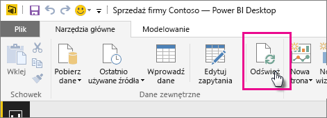

# Odświeżanie zestawu danych utworzonego na podstawie pliku programu Power BI Desktop na dysku lokalnym
## Zakres obsługi
W usłudze Power BI funkcje Odśwież teraz i Zaplanuj odświeżanie są obsługiwane w przypadku zestawów danych utworzonych na podstawie plików programu Power BI Desktop zaimportowanych z dysku lokalnego, gdzie obszary Pobieranie danych i Edytor zapytań są używane do nawiązywania połączenia i ładowania danych z dowolnych z następujących źródeł danych:

### Power BI Gateway — Personal
* Wszystkie źródła danych online widoczne w obszarach Pobieranie danych i Edytor zapytań programu Power BI Desktop.
* Wszystkie lokalne źródła danych widoczne w obszarach Pobieranie danych i Edytor zapytań programu Power BI Desktop z wyjątkiem źródeł danych Plik usługi Hadoop (HDFS) i Microsoft Exchange.

<!-- Refresh Data sources-->
[!INCLUDE [refresh-datasources](./includes/refresh-datasources.md)]

> [!NOTE]
> Brama musi być zainstalowana i uruchomiona, aby usługa Power BI mogła nawiązać połączenie z lokalnymi źródłami danych i odświeżyć zestaw danych.
> 
> 

Możesz przeprowadzić jednorazowe ręczne odświeżenie w programie Power BI Desktop, wybierając polecenie Odśwież na karcie wstążki Narzędzia główne. Po wybraniu polecenia Odśwież dane w modelu *pliku* zostaną odświeżone przy użyciu zaktualizowanych danych z oryginalnego źródła danych. Tego rodzaju odświeżenie, wykonywane całkowicie w aplikacji Power BI Desktop, różni się od ręcznego lub zaplanowanego odświeżenia w usłudze Power BI i warto wiedzieć, na czym polega różnica.

Podczas importowania pliku programu Power BI Desktop z dysku lokalnego dane oraz inne informacje o modelu są ładowane do zestawu danych w usłudze Power BI. W usłudze Power BI, w przeciwieństwie do programu Power BI Desktop, dane należy odświeżać w zestawie danych, ponieważ na nich opierają się raporty w usłudze Power BI. Ponieważ źródła danych są zewnętrzne, można ręcznie odświeżać zestaw danych za pomocą polecenia **Odśwież teraz**. Możesz też skonfigurować harmonogram odświeżania, korzystając z opcji **Zaplanuj odświeżanie**.

Podczas odświeżania zestawu danych usługa Power BI nie łączy się z plikiem na dysku lokalnym, aby wysłać zapytanie o zaktualizowane dane. Korzysta z informacji w zestawie danych, aby połączyć się bezpośrednio ze źródłami danych o wysłać zapytanie o zaktualizowane dane, które następnie są ładowane do zestawu danych.

> [!NOTE]
> Odświeżone dane w zestawie danych nie są zsynchronizowane z powrotem do pliku na dysku lokalnym.
> 
> 

## Jak zaplanować odświeżanie?
Po skonfigurowaniu harmonogramu odświeżania usługa Power BI nawiąże bezpośrednie połączenie ze źródłami danych przy użyciu informacji o połączeniu oraz jego poświadczeń w zestawie danych w celu utworzenia zapytań pod kątem zaktualizowanych danych, a następnie załadowania zaktualizowanych danych do zestawu danych. Wszystkie wizualizacje w raportach i pulpitach nawigacyjnych oparte na tym zestawie danych w usłudze Power BI również zostaną zaktualizowane.

Aby uzyskać więcej informacji dotyczących sposobu konfigurowania planowanego odświeżania, zobacz [Konfigurowanie planowanego odświeżania](refresh-scheduled-refresh.md).

## Gdy wystąpią problemy
Gdy coś pójdzie źle, zazwyczaj przyczyną jest to, że usługa Power BI nie może zalogować się do źródeł danych lub zestaw danych łączy się z lokalnym źródłem danych, a brama jest w trybie offline. Upewnij się, że usługa Power BI może zalogować się do źródeł danych. Jeśli hasło używane do logowania do źródła danych zostanie zmienione lub usługa Power BI zostanie wylogowana ze źródła danych, spróbuj zalogować się do źródeł danych ponownie w obszarze Poświadczenia źródła danych.

Pamiętaj, aby opcja **Wyślij do mnie wiadomość e-mail z powiadomieniem o niepowodzeniu odświeżania** pozostała zaznaczona. Dzięki temu od razu dowiesz się o tym, że zaplanowane odświeżanie zakończyło się niepowodzeniem.

## Rozwiązywanie problemów
Może się zdarzyć, że odświeżanie danych nie będzie przebiegać zgodnie z oczekiwaniami. Problemy są najczęściej związane z bramą. Aby zapoznać się z narzędziami i znanymi problemami, zobacz artykuły dotyczące rozwiązywania problemów z bramą.

[Rozwiązywanie problemów z lokalną bramą danych](service-gateway-onprem-tshoot.md)

[Rozwiązywanie problemów z bramą Power BI Gateway — Personal](service-admin-troubleshooting-power-bi-personal-gateway.md)

Masz więcej pytań? [Zadaj pytanie społeczności usługi Power BI](http://community.powerbi.com/)

