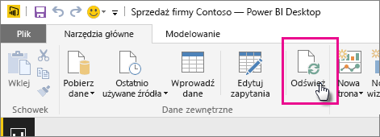
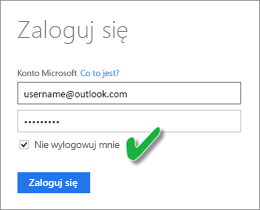

# Odświeżanie zestawu danych przechowywanego w usłudze OneDrive lub SharePoint Online
Importowanie plików z usługi OneDrive lub SharePoint Online do usługi Power BI jest doskonałym sposobem na zapewnienie synchronizacji pracy wykonywanej w programie **Power BI Desktop** z usługą Power BI.

## Zalety przechowywania plików programu Power BI Desktop w usłudze OneDrive lub SharePoint Online
Jeśli przechowujesz plik programu **Power BI Desktop** w usłudze OneDrive lub SharePoint Online, wszystkie dane załadowane do modelu tego pliku są importowane do zestawu danych, a wszystkie raporty utworzone w pliku są ładowane do sekcji **Raporty** w usłudze Power BI. Jeśli wprowadzisz zmiany w pliku w usłudze OneDrive lub SharePoint Online, na przykład dodając nowe miary, zmieniając nazwy kolumn lub edytując wizualizacje, po zapisaniu pliku te zmiany zostaną również zaktualizowane w usłudze Power BI, zwykle w ciągu około godziny.

Możesz przeprowadzić jednorazowe ręczne odświeżenie w programie Power BI Desktop, wybierając polecenie Odśwież na karcie wstążki Narzędzia główne. Po wybraniu polecenia Odśwież dane w modelu *pliku* zostaną odświeżone przy użyciu zaktualizowanych danych z oryginalnego źródła danych. Tego rodzaju odświeżenie, wykonywane całkowicie w aplikacji Power BI Desktop, różni się od ręcznego lub zaplanowanego odświeżenia w usłudze Power BI i warto wiedzieć, na czym polega różnica.

Podczas importowania pliku programu Power BI Desktop z usługi OneDrive lub SharePoint Online dane oraz inne informacje o modelu są ładowane do zestawu danych w usłudze Power BI. W usłudze Power BI, w przeciwieństwie do programu Power BI Desktop, dane należy odświeżać w zestawie danych, ponieważ na nich opierają się raporty w usłudze Power BI. Ponieważ źródła danych są zewnętrzne, można ręcznie odświeżać zestaw danych za pomocą polecenia **Odśwież teraz**. Możesz też skonfigurować harmonogram odświeżania, korzystając z opcji **Zaplanuj odświeżanie**.

Podczas odświeżania zestawu danych usługa Power BI nie łączy się z plikiem w usłudze One Drive lub SharePoint Online, aby wysłać zapytanie o zaktualizowane dane. Korzysta z informacji w zestawie danych, aby połączyć się bezpośrednio ze źródłami danych o wysłać zapytanie o zaktualizowane dane, które następnie są ładowane do zestawu danych. Te odświeżone dane w zestawie danych nie są z powrotem synchronizowane z plikiem w usłudze OneDrive lub SharePoint Online.

## Zakres obsługi
W usłudze Power BI funkcje Odśwież teraz i Zaplanuj odświeżanie są obsługiwane w przypadku zestawów danych utworzonych na podstawie plików programu Power BI Desktop zaimportowanych z dysku lokalnego, gdzie obszary Pobieranie danych i Edytor zapytań są używane do nawiązywania połączenia i ładowania danych z dowolnych z następujących źródeł danych:

### Power BI Gateway — Personal
* Wszystkie źródła danych online widoczne w obszarach Pobieranie danych i Edytor zapytań programu Power BI Desktop.
* Wszystkie lokalne źródła danych widoczne w obszarach Pobieranie danych i Edytor zapytań programu Power BI Desktop z wyjątkiem źródeł danych Plik usługi Hadoop (HDFS) i Microsoft Exchange.

<!-- Refresh Data sources-->
[!INCLUDE [refresh-datasources](./includes/refresh-datasources.md)]

> [!NOTE]
> Brama musi być zainstalowana i uruchomiona, aby usługa Power BI mogła nawiązać połączenie z lokalnymi źródłami danych i odświeżyć zestaw danych.
> 
> 

## Usługa OneDrive lub OneDrive dla Firm. Jaka jest różnica?
Jeśli masz zarówno osobistą usługę OneDrive, jak i OneDrive dla Firm, zalecane jest przechowywanie wszelkich plików, które chcesz zaimportować do usługi Power BI, w usłudze OneDrive dla Firm. Oto dlaczego: prawdopodobnie używasz dwóch różnych kont do logowania się do nich.

Nawiązywanie połączenia z usługą OneDrive dla Firm w usłudze Power BI jest zwykle bezproblemowe, ponieważ to samo konto, którego używasz do logowania się do usługi Power BI, często jest kontem używanym do logowania się do usługi OneDrive dla Firm. Jednak w przypadku osobistej usługi OneDrive najprawdopodobniej logujesz się przy użyciu innego [konta Microsoft](http://www.microsoft.com/account/default.aspx).

Po zalogowaniu się do swojego konta Microsoft należy pamiętać o zaznaczeniu opcji Nie wylogowuj mnie. Usługa Power BI może następnie zsynchronizować wszelkie aktualizacje wprowadzone w pliku w programie Power BI Desktop z zestawami danych w usłudze Power BI  
    

Jeśli wprowadzisz zmiany w pliku w usłudze OneDrive, których nie można zsynchronizować z zestawem danych lub raportami w usłudze Power BI, ponieważ Twoje poświadczenia konta Microsoft mogły ulec zmianie, należy nawiązać połączenie i zaimportować plik ponownie z Twojej osobistej usługi OneDrive.

## Jak zaplanować odświeżanie?
Po skonfigurowaniu harmonogramu odświeżania usługa Power BI nawiąże bezpośrednie połączenie ze źródłami danych przy użyciu informacji o połączeniu oraz jego poświadczeń w zestawie danych w celu utworzenia zapytań pod kątem zaktualizowanych danych, a następnie załadowania zaktualizowanych danych do zestawu danych. Wszystkie wizualizacje w raportach i pulpitach nawigacyjnych oparte na tym zestawie danych w usłudze Power BI również zostaną zaktualizowane.

Aby uzyskać więcej informacji dotyczących sposobu konfigurowania planowanego odświeżania, zobacz [Konfigurowanie planowanego odświeżania](refresh-scheduled-refresh.md).

## Gdy wystąpią problemy
Gdy coś pójdzie źle, zazwyczaj przyczyną jest to, że usługa Power BI nie może zalogować się do źródeł danych lub zestaw danych łączy się z lokalnym źródłem danych, a brama jest w trybie offline. Upewnij się, że usługa Power BI może zalogować się do źródeł danych. Jeśli hasło używane do logowania do źródła danych zostanie zmienione lub usługa Power BI zostanie wylogowana ze źródła danych, spróbuj zalogować się do źródeł danych ponownie w obszarze Poświadczenia źródła danych.

Jeśli wprowadzisz zmiany w pliku programu Power BI Desktop przechowywanym w usłudze OneDrive i zapiszesz je, a te zmiany nie zostaną wprowadzone do usługi Power BI w ciągu godziny, powodem może być brak możliwości połączenia usługi Power BI z usługą OneDrive. Spróbuj ponownie nawiązać połączenie z plikiem w usłudze OneDrive. Jeśli zostanie wyświetlony monit o zalogowanie, pamiętaj o zaznaczeniu pola Nie wylogowuj mnie. Ponieważ usługa Power Bi nie była w stanie połączyć się z usługą OneDrive w celu zsynchronizowania z plikiem, należy ponownie zaimportować plik.

Pamiętaj, aby opcja **Wyślij do mnie wiadomość e-mail z powiadomieniem o niepowodzeniu odświeżania** pozostała zaznaczona. Dzięki temu od razu dowiesz się o tym, że zaplanowane odświeżanie zakończyło się niepowodzeniem.

## Rozwiązywanie problemów
Może się zdarzyć, że odświeżanie danych nie będzie przebiegać zgodnie z oczekiwaniami. Problemy są najczęściej związane z bramą. Aby zapoznać się z narzędziami i znanymi problemami, zobacz artykuły dotyczące rozwiązywania problemów z bramą.

[Rozwiązywanie problemów z lokalną bramą danych](service-gateway-onprem-tshoot.md)

[Rozwiązywanie problemów z bramą Power BI Gateway — Personal](service-admin-troubleshooting-power-bi-personal-gateway.md)

Masz więcej pytań? [Zadaj pytanie społeczności usługi Power BI](http://community.powerbi.com/)

