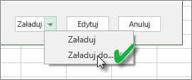
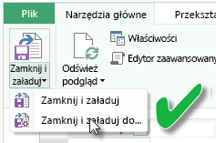
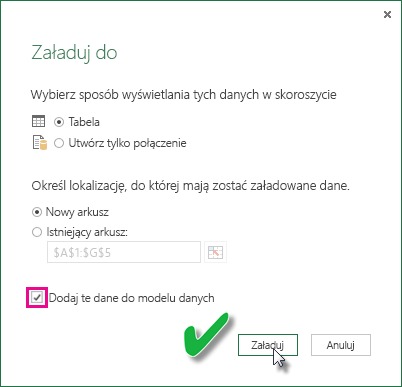

# Odświeżanie zestawu danych utworzonego na podstawie skoroszytu programu Excel na dysku lokalnym
## Zakres obsługi
W usłudze Power BI dla zestawów danych utworzonych na podstawie skoroszytów programu Excel zaimportowanych z dysku lokalnego funkcje Odśwież teraz i Zaplanuj odświeżanie są obsługiwane, jeśli do nawiązywania połączenia z dowolnym z następujących źródeł danych i ładowania danych do modelu danych programu Excel jest używany dodatek Power Query (funkcja Pobierz i transformuj dane w programie Excel 2016) lub Power Pivot:  

### Power BI Gateway — Personal
* Wszystkie źródła danych online widoczne w obszarze Power Query.
* Wszystkie lokalne źródła danych widoczne w obszarze Power Query z wyjątkiem źródeł danych Plik usługi Hadoop (HDFS) i Microsoft Exchange.
* Wszystkie źródła danych online widoczne w obszarze Power Pivot.\*
* Wszystkie lokalne źródła danych widoczne w obszarze Power Pivot z wyjątkiem źródeł danych Plik usługi Hadoop (HDFS) i Microsoft Exchange.

<!-- Refresh Data sources-->
[!INCLUDE [refresh-datasources](./includes/refresh-datasources.md)]

> **Uwagi:**  
> 
> * Brama musi być zainstalowana i uruchomiona, aby usługa Power BI mogła nawiązać połączenie z lokalnymi źródłami danych i odświeżyć zestaw danych.
> * Jeśli korzystasz z programu Excel 2013, upewnij się, że masz najnowszą wersję dodatku Power Query.
> * Odświeżanie nie jest obsługiwane w przypadku skoroszytów programu Excel zaimportowanych z dysku lokalnego, jeśli dane istnieją tylko w arkuszach lub połączonych tabelach. Odświeżanie jest obsługiwane dla danych arkusza, które zostały zaimportowane z usługi OneDrive. Aby dowiedzieć się więcej, zobacz [Odświeżanie zestawu danych utworzonego na podstawie skoroszytu programu Excel w usłudze OneDrive lub SharePoint Online](refresh-excel-file-onedrive.md).
> * W przypadku odświeżania zestawu danych utworzonego na podstawie skoroszytu programu Excel zaimportowanego z dysku lokalnego odświeżane są tylko dane ze źródeł danych, względem których wykonano zapytania. Jeśli zmienisz strukturę modelu danych w programie Excel lub dodatku Power Pivot, na przykład utworzysz nową miarę lub zmienisz nazwę kolumny, zmiany te nie zostaną skopiowane do zestawu danych. W takim przypadku musisz ponownie przekazać lub opublikować skoroszyt. Jeśli zamierzasz regularnie wprowadzać zmiany w strukturze skoroszytu i chcesz, aby były one widoczne w zestawie danych w usłudze Power BI, ale nie chcesz ponownie przekazywać skoroszytu, rozważ umieszczenie go w usłudze OneDrive. W przypadku skoroszytów przechowywanych w usłudze OneDrive oraz z niej importowanych usługa Power BI automatycznie odświeża zarówno strukturę, jak i dane w arkuszach.
> 
> 

## Jak sprawdzić, czy dane zostały załadowane do modelu danych programu Excel?
Jeśli używasz dodatku Power Query (funkcja Pobierz i transformuj dane w programie Excel 2016) do nawiązywania połączenia ze źródłem danych, możesz wskazać kilka lokalizacji, do których mają zostać załadowane dane. Aby sprawdzić, czy dane zostały załadowane do modelu danych, należy wybrać opcję **Dodaj te dane do modelu danych** w oknie dialogowym **Ładowanie do**.

> [!NOTE]
> Poniższe ilustracje przedstawiają program Excel 2016.
> 
> 

W **Nawigatorze** kliknij pozycję **Załaduj do...**  
    

Jeśli natomiast klikniesz pozycję **Edytuj** w Nawigatorze, spowoduje to otwarcie Edytora zapytań. W Edytorze zapytań możesz kliknąć pozycję **Zamknij i załaduj do...**  
    

Następnie w oknie dialogowym **Ładowanie do** upewnij się, że zaznaczono opcję **Dodaj te dane do modelu danych**.  
    

### Co w przypadku wybrania pozycji Pobierz dane zewnętrzne w dodatku Power Pivot?
Żaden problem. Za każdym razem, gdy dodatek Power Pivot jest używany do nawiązywania połączenia z danymi z lokalnego źródła danych lub źródła danych online i odpytywania go, dane są automatycznie ładowane do modelu danych.

## Jak zaplanować odświeżanie?
Po skonfigurowaniu harmonogramu odświeżania usługa Power BI nawiąże bezpośrednie połączenie ze źródłami danych przy użyciu informacji o połączeniu oraz jego poświadczeń w zestawie danych w celu utworzenia zapytań pod kątem zaktualizowanych danych, a następnie załadowania zaktualizowanych danych do zestawu danych. Wszystkie wizualizacje w raportach i pulpitach nawigacyjnych oparte na tym zestawie danych w usłudze Power BI również zostaną zaktualizowane.

Aby uzyskać więcej informacji dotyczących sposobu konfigurowania planowanego odświeżania, zobacz [Konfigurowanie planowanego odświeżania](refresh-scheduled-refresh.md).

## Gdy wystąpią problemy
Gdy coś pójdzie źle, zazwyczaj przyczyną jest to, że usługa Power BI nie może zalogować się do źródeł danych lub zestaw danych łączy się z lokalnym źródłem danych, a brama jest w trybie offline. Upewnij się, że usługa Power BI może zalogować się do źródeł danych. Jeśli hasło używane do logowania do źródła danych zostanie zmienione lub usługa Power BI zostanie wylogowana ze źródła danych, spróbuj zalogować się do źródeł danych ponownie w obszarze Poświadczenia źródła danych.

Pamiętaj, aby opcja **Wyślij do mnie wiadomość e-mail z powiadomieniem o niepowodzeniu odświeżania** pozostała zaznaczona. Dzięki temu od razu dowiesz się o tym, że zaplanowane odświeżanie zakończyło się niepowodzeniem.

>[!IMPORTANT]
>Odświeżanie nie jest obsługiwane dla źródeł danych OData połączonych z dodatkiem Power Pivot, względem których są wykonywane zapytania. Jeśli korzystasz ze źródła danych OData, użyj dodatku Power Query.

## Rozwiązywanie problemów
Może się zdarzyć, że odświeżanie danych nie będzie przebiegać zgodnie z oczekiwaniami. Problemy są najczęściej związane z bramą. Aby zapoznać się z narzędziami i znanymi problemami, zobacz artykuły dotyczące rozwiązywania problemów z bramą.

[Rozwiązywanie problemów z lokalną bramą danych](service-gateway-onprem-tshoot.md)

[Rozwiązywanie problemów z bramą Power BI Gateway — Personal](service-admin-troubleshooting-power-bi-personal-gateway.md)

## Następne kroki
Masz więcej pytań? [Odwiedź społeczność usługi Power BI](http://community.powerbi.com/)

