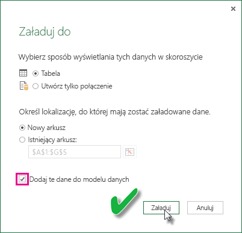

# Odświeżanie zestawu danych utworzonego na skoroszytu programu Excel w usłudze OneDrive lub SharePoint Online
Możliwe jest importowanie skoroszytów programu Excel przechowywanych na maszynie lokalnej lub w magazynie w chmurze, takim jak usługa OneDrive dla Firm lub SharePoint Online. Przyjrzymy się zaletom korzystania z magazynu w chmurze w przypadku plików programu Excel. Aby uzyskać więcej informacji o sposobie importowania plików programu Excel do usługi Power BI, zobacz [Pobieranie danych z plików skoroszytów programu Excel](service-excel-workbook-files.md).

## Jakie są zalety?
Importowanie plików usługi OneDrive lub SharePoint Online jest doskonałym sposobem, aby zapewnić, że praca wykonywana w programie Excel będzie zsynchronizowana z usługą Power BI. Wszystkie dane załadowane do modelu pliku zostaną importowane do zestawu danych, a wszystkie raporty utworzone w pliku zostaną załadowane do obszaru Raporty w usłudze Power BI. Jeśli wprowadzisz zmiany w pliku w usłudze OneDrive lub SharePoint Online, na przykład dodając nowe miary, zmieniając nazwy kolumn lub edytując wizualizacje, po zapisaniu te zmiany zostaną również zaktualizowane w usłudze Power BI, zwykle w ciągu około godziny.

Podczas importowania skoroszytu programu Excel z osobistej usługi OneDrive wszystkie dane w skoroszycie, takie jak tabele w arkuszach i/lub dane załadowane do modelu danych programu Excel i struktura modelu danych, zostaną zaimportowane do nowego zestawu danych w usłudze Power BI. Wszystkie wizualizacje programu Power View zostaną ponownie utworzone w obszarze Raporty. Usługa Power BI automatycznie (co około godzinę) nawiązuje połączenie ze skoroszytem w usłudze OneDrive lub SharePoint Online, aby sprawdzić, czy są dostępne aktualizacje. Jeśli skoroszyt został zmieniony, usługa Power BI odświeży zestaw danych i raporty w usłudze Power BI.

Istnieje możliwość odświeżenia zestawu danych w usłudze Power BI. W przypadku ręcznego odświeżania lub planowania odświeżania zestawu danych usługa Power BI nawiązuje bezpośrednie połączenie z zewnętrznymi źródłami danych, aby wykonać zapytanie o zaktualizowane dane, które zostaną następnie załadowane do zestawu danych. Odświeżanie zestawu danych z poziomu usługi Power BI nie powoduje odświeżenia danych w skoroszycie w usłudze OneDrive lub SharePoint Online. 

## Zakres obsługi
W usłudze Power BI funkcje Odśwież teraz i Zaplanuj odświeżanie są obsługiwane w przypadku zestawów danych utworzonych na podstawie plików programu Power BI Desktop zaimportowanych z dysku lokalnego, gdzie obszary Pobieranie danych i Edytor zapytań są używane do nawiązywania połączenia i ładowania danych z dowolnych z następujących źródeł danych:  

### Power BI Gateway — Personal
* Wszystkie źródła danych online widoczne w obszarach Pobieranie danych i Edytor zapytań programu Power BI Desktop.
* Wszystkie lokalne źródła danych widoczne w obszarach Pobieranie danych i Edytor zapytań programu Power BI Desktop z wyjątkiem źródeł danych Plik usługi Hadoop (HDFS) i Microsoft Exchange.

<!-- Refresh Data sources-->
[!INCLUDE [refresh-datasources](./includes/refresh-datasources.md)]

> [!NOTE]
> Brama musi być zainstalowana i uruchomiona, aby usługa Power BI mogła nawiązać połączenie z lokalnymi źródłami danych i odświeżyć zestaw danych.
> 
> 

## Usługa OneDrive lub OneDrive dla Firm. Jaka jest różnica?
Jeśli masz zarówno osobistą usługę OneDrive, jak i OneDrive dla Firm, zalecane jest przechowywanie wszelkich plików, które chcesz zaimportować do usługi Power BI, w usłudze OneDrive dla Firm. Oto dlaczego: Prawdopodobnie używasz dwóch różnych kont do logowania się do nich.

Nawiązywanie połączenia z usługą OneDrive dla Firm w usłudze Power BI jest zwykle bezproblemowe, ponieważ to samo konto, którego używasz do logowania się do usługi Power BI, często jest kontem używanym do logowania się do usługi OneDrive dla Firm. Jednak w przypadku osobistej usługi OneDrive najprawdopodobniej logujesz się przy użyciu innego [konta Microsoft](https://account.microsoft.com).

Po zalogowaniu się do swojego konta Microsoft należy pamiętać o zaznaczeniu opcji Nie wylogowuj mnie. Usługa Power BI może następnie zsynchronizować wszelkie aktualizacje wprowadzone w pliku w programie Power BI Desktop z zestawami danych w usłudze Power BI  
    

Jeśli wprowadzisz zmiany w pliku w usłudze OneDrive, których nie można zsynchronizować z zestawem danych lub raportami w usłudze Power BI, ponieważ Twoje poświadczenia konta Microsoft mogły ulec zmianie, należy nawiązać połączenie i zaimportować plik ponownie z Twojej osobistej usługi OneDrive.

## Opcje dotyczące nawiązywania połączenia z plikiem programu Excel
Podczas nawiązywania połączenia ze skoroszytem programu Excel w usłudze OneDrive dla Firm lub SharePoint Online będą dostępne dwie opcje dotyczące sposobu pobierania zawartości skoroszytu do usługi Power BI.

[**Importuj dane programu Excel do usługi Power BI** ](service-excel-workbook-files.md#import-or-connect-to-an-excel-workbook-from-power-bi) — podczas importowania skoroszytu programu Excel z usługi OneDrive dla Firm lub SharePoint Online działa to zgodnie z powyższym opisem.

[**Nawiąż połączenie z danymi programu Excel, zarządzaj tymi danymi i wyświetlaj je w usłudze Power BI** ](service-excel-workbook-files.md#one-excel-workbook--two-ways-to-use-it) — używając tej opcji, tworzone jest połączenie z poziomu usługi Power BI bezpośrednio do skoroszytu w usłudze OneDrive dla Firm lub SharePoint Online.

W przypadku nawiązywania w ten sposób połączenia ze skoroszytem programu Excel zestaw danych nie jest tworzony w usłudze Power BI. Jednak skoroszyt zostanie wyświetlony w usłudze Power BI w obszarze Raporty z ikoną programu Excel obok nazwy. W przeciwieństwie do usługi Excel Online, jeśli podczas nawiązywania połączenia ze skoroszytem z poziomu usługi Power BI skoroszyt ma połączenia z zewnętrznymi źródłami danych, które ładują dane do modelu danych programu Excel, możliwe jest skonfigurowanie harmonogramu odświeżania.

W przypadku konfigurowania w ten sposób harmonogramu odświeżenia jedyna różnica polega na tym, że odświeżane dane są umieszczane w modelu danych skoroszytu w usłudze OneDrive lub SharePoint Online, a nie w zestawie danych w usłudze Power BI.

## Jak sprawdzić, czy dane zostały załadowane do modelu danych programu Excel?
Jeśli używasz dodatku Power Query (funkcja Pobierz i transformuj dane w programie Excel 2016) do nawiązywania połączenia ze źródłem danych, możesz wskazać kilka lokalizacji, do których mają zostać załadowane dane. Aby sprawdzić, czy dane zostały załadowane do modelu danych, należy wybrać opcję **Dodaj te dane do modelu danych** w oknie dialogowym **Ładowanie do**.

> [!NOTE]
> Poniższe ilustracje przedstawiają program Excel 2016.
> 
> 

W **Nawigatorze** kliknij pozycję **Załaduj do...**  
    

Jeśli natomiast klikniesz pozycję **Edytuj** w Nawigatorze, spowoduje to otwarcie Edytora zapytań. W Edytorze zapytań możesz kliknąć pozycję **Zamknij i załaduj do...**  
    

Następnie w oknie dialogowym **Ładowanie do** upewnij się, że zaznaczono opcję **Dodaj te dane do modelu danych**.  
    

### Co w przypadku wybrania pozycji Pobierz dane zewnętrzne w dodatku Power Pivot?
Żaden problem. Za każdym razem, gdy dodatek Power Pivot jest używany do nawiązywania połączenia z danymi z lokalnego źródła danych lub źródła danych online i odpytywania go, dane są automatycznie ładowane do modelu danych.

## Jak zaplanować odświeżanie?
Po skonfigurowaniu harmonogramu odświeżania usługa Power BI nawiąże bezpośrednie połączenie ze źródłami danych przy użyciu informacji o połączeniu oraz jego poświadczeń w zestawie danych w celu utworzenia zapytań pod kątem zaktualizowanych danych, a następnie załadowania zaktualizowanych danych do zestawu danych. Wszystkie wizualizacje w raportach i pulpitach nawigacyjnych oparte na tym zestawie danych w usłudze Power BI również zostaną zaktualizowane.

Aby uzyskać więcej informacji dotyczących sposobu konfigurowania planowanego odświeżania, zobacz [Konfigurowanie planowanego odświeżania](refresh-scheduled-refresh.md).

## Gdy wystąpią problemy
Gdy coś pójdzie źle, zazwyczaj przyczyną jest to, że usługa Power BI nie może zalogować się do źródeł danych lub zestaw danych łączy się z lokalnym źródłem danych, a brama jest w trybie offline. Upewnij się, że usługa Power BI może zalogować się do źródeł danych. Jeśli hasło używane do logowania do źródła danych zostanie zmienione lub usługa Power BI zostanie wylogowana ze źródła danych, spróbuj zalogować się do źródeł danych ponownie w obszarze Poświadczenia źródła danych.

Pamiętaj, aby opcja **Wyślij do mnie wiadomość e-mail z powiadomieniem o niepowodzeniu odświeżania** pozostała zaznaczona. Dzięki temu od razu dowiesz się o tym, że zaplanowane odświeżanie zakończyło się niepowodzeniem.

## Ważne uwagi
\* Odświeżanie nie jest obsługiwane dla źródeł danych OData, z którymi nawiązano połączenie i które są odpytywane z poziomu dodatku Power Pivot. Jeśli korzystasz ze źródła danych OData, użyj dodatku Power Query.

## Rozwiązywanie problemów
Może się zdarzyć, że odświeżanie danych nie będzie przebiegać zgodnie z oczekiwaniami. Problemy są najczęściej związane z bramą. Aby zapoznać się z narzędziami i znanymi problemami, zobacz artykuły dotyczące rozwiązywania problemów z bramą.

[Rozwiązywanie problemów z lokalną bramą danych](service-gateway-onprem-tshoot.md)

[Rozwiązywanie problemów z bramą Power BI Gateway — Personal](service-admin-troubleshooting-power-bi-personal-gateway.md)

Masz więcej pytań? [Odwiedź społeczność usługi Power BI](http://community.powerbi.com/)

