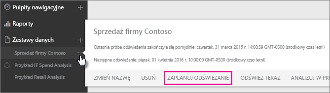
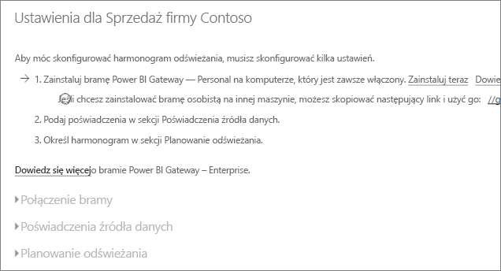
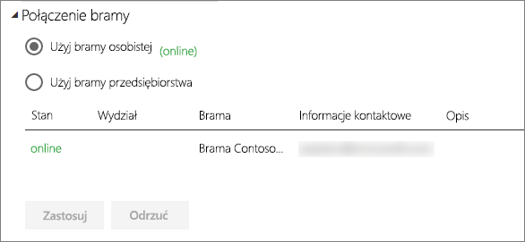
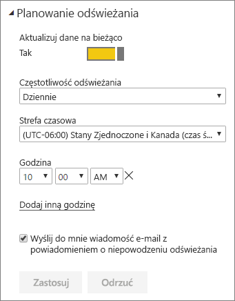

# Konfigurowanie zaplanowanego odświeżania

>[!NOTE]
>Po dwóch miesiącach braku aktywności zaplanowane odświeżanie zestawu danych zostanie wstrzymane. Aby uzyskać więcej informacji, zobacz sekcję [*Planowanie odświeżania*](#schedule-refresh) w dalszej części tego artykułu.
> 
> 

Jeśli zestaw danych obsługuje zaplanowane odświeżanie z użyciem poleceń Odśwież teraz i Zaplanuj odświeżanie, należy pamiętać o kilku wymaganiach i ustawieniach istotnych dla powodzenia odświeżania. Są to ustawienia w obszarach **Połączenie bramy**, **Poświadczenia źródła danych** oraz **Planowanie odświeżania**. Przyjrzyjmy się im bliżej.

Zostaną tu opisane opcje dostępne zarówno w przypadku bramy [Power BI Gateway — Personal](personal-gateway.md), jak i [lokalnej bramy danych](service-gateway-onprem.md).

Aby przejść do ekranu planowania odświeżania, wykonaj następujące czynności.

1. Wybierz ikonę **wielokropka (...)** obok zestawu danych w obszarze **Zestawy danych**.
2. Wybierz pozycję **Zaplanuj odświeżanie**.
   
    

## Połączenie bramy
Tutaj będą wyświetlane różne opcje w zależności od dostępności bramy, tego, czy działa w trybie online, a także tego, czy jest to brama osobista, czy brama przedsiębiorstwa.

Jeśli nie ma żadnej dostępnej bramy, opcja **Ustawienia bramy** będzie wyłączona. Zobaczysz również komunikat z informacją o tym, jak zainstalować bramę osobistą.

Jeśli masz skonfigurowaną bramę osobistą, będzie dostępna na liście do wyboru, o ile działa w trybie online. Jeśli nie, będzie wyświetlana jako offline.

Jeśli jest dostępna brama przedsiębiorstwa, możesz ją wybrać. Brama przedsiębiorstwa będzie dostępna tylko, jeśli Twoje konto znajduje się na liście na karcie Użytkownicy źródła danych skonfigurowanego dla tej bramy.

## Poświadczenia źródła danych
### Power BI Gateway — Personal
Jeśli do odświeżania danych używasz bramy osobistej, musisz podać poświadczenia używane do połączenia ze źródłem danych zaplecza. Jeśli łączysz się z pakietem zawartości z poziomu usługi online, do zaplanowanego odświeżenia zostaną użyte poświadczenia wprowadzone podczas nawiązywania połączenia.

Logowanie do źródła danych jest wymagane tylko podczas pierwszego odświeżania danych w tym zestawie danych. Wprowadzone poświadczenia są zachowywane wraz z zestawem danych.

> [!NOTE]
> W przypadku niektórych metod uwierzytelniania, w których hasło używane do logowania do źródła danych wygasa lub wymaga zmiany, będzie konieczna zmiana hasła również w obszarze Poświadczenia źródła danych.
> 
> 

Ewentualne problemy zazwyczaj związane są z tym, że brama jest w trybie offline, ponieważ nie może zalogować się do systemu Windows i uruchomić usługi, lub z tym, że usługa Power BI nie może zalogować się do źródeł danych w celu wysłania zapytania o zaktualizowane dane. Jeśli odświeżanie nie powiedzie się, sprawdź ustawienia zestawu danych. Jeśli usługa bramy jest offline, zobaczysz błąd w obszarze Stan bramy. Jeśli usługa Power BI nie może zalogować się do źródeł danych, zobaczysz błąd w obszarze Poświadczenia źródła danych.

### Lokalna brama danych
Jeśli do odświeżania danych używasz lokalnej bramy danych, nie musisz wprowadzać poświadczeń, ponieważ są one definiowane dla źródła danych przez administratora bramy danych.

> [!NOTE]
> Podczas łączenia się z lokalnym programem SharePoint w celu odświeżenia danych usługa Power BI obsługuje tylko mechanizmy uwierzytelniania *Anonimowe*, *Podstawowe* oraz *Windows (NTLM/Kerberos)*. W przypadku odświeżania danych z lokalnych źródeł danych programu SharePoint usługa Power BI nie obsługuje uwierzytelniania *ADFS* ani żadnych mechanizmów *uwierzytelniania opartego na formularzach*.
> 
> 

## Planowanie odświeżania
W tej sekcji określa się częstotliwość i przedziały czasowe odświeżania zestawu danych. Niektóre źródła danych umożliwiają konfigurację nawet wtedy, gdy nie jest dostępna brama. Inne wymagają bramy.

Aby móc skonfigurować ustawienia, należy ustawić suwak **Aktualizuj dane na bieżąco** w pozycji **Tak**.

> [!NOTE]
> Usługa Power BI docelowo rozpoczyna odświeżanie danych w ciągu **15 minut** od zaplanowanego czasu odświeżenia.
> 
> 

> [!NOTE]
> Po dwóch miesiącach braku aktywności zaplanowane odświeżanie zestawu danych zostanie wstrzymane. Zestaw danych jest uznawany za nieaktywny, jeśli żaden użytkownik nie korzysta z żadnego pulpitu nawigacyjnego ani raportu utworzonego na podstawie tego zestawu danych. W takiej sytuacji właściciel zestawu danych otrzymuje wiadomość e-mail z informacją o wstrzymaniu zaplanowanego odświeżania, a w obszarze planowania odświeżania zestawu danych jest widoczny komunikat **wyłączone**. Aby wznowić zaplanowane odświeżanie, wystarczy odwiedzić dowolny pulpit nawigacyjny lub raport utworzony na podstawie zbioru danych.
> 
> 

## Zakres obsługi
Niektóre zestawy danych są obsługiwane przez różne bramy na potrzeby zaplanowanego odświeżania. Poniżej znajdziesz informacje o dostępnych opcjach.

### Power BI Gateway — Personal
**Power BI Desktop**

* Wszystkie źródła danych online widoczne w obszarach Pobieranie danych i Edytor zapytań programu Power BI Desktop.
* Wszystkie lokalne źródła danych widoczne w obszarach Pobieranie danych i Edytor zapytań programu Power BI Desktop z wyjątkiem źródeł danych Plik usługi Hadoop (HDFS) i Microsoft Exchange.

**Excel**

> [!NOTE]
> W programie Excel 2016 i nowszych wersjach pozycja Power Query znajduje się teraz na karcie wstążki Dane w grupie Pobieranie i przekształcanie danych.
> 
> 

* Wszystkie źródła danych online widoczne w obszarze Power Query.
* Wszystkie lokalne źródła danych widoczne w obszarze Power Query z wyjątkiem źródeł danych Plik usługi Hadoop (HDFS) i Microsoft Exchange.
* Wszystkie źródła danych online widoczne w obszarze Power Pivot.\*
* Wszystkie lokalne źródła danych widoczne w obszarze Power Pivot z wyjątkiem źródeł danych Plik usługi Hadoop (HDFS) i Microsoft Exchange.

<!-- Refresh Data sources-->
[!INCLUDE [refresh-datasources](./includes/refresh-datasources.md)]

## Rozwiązywanie problemów
Może się zdarzyć, że odświeżanie danych nie będzie przebiegać zgodnie z oczekiwaniami. Problemy są najczęściej związane z bramą. Aby zapoznać się z narzędziami i znanymi problemami, zobacz artykuły dotyczące rozwiązywania problemów z bramą.

[Rozwiązywanie problemów z lokalną bramą danych](service-gateway-onprem-tshoot.md)

[Rozwiązywanie problemów z bramą Power BI Gateway — Personal](service-admin-troubleshooting-power-bi-personal-gateway.md)

## Następne kroki
[Odświeżanie danych w usłudze Power BI](refresh-data.md)  
[Power BI Gateway — Personal](personal-gateway.md)  
[Lokalna brama danych](service-gateway-onprem.md)  
[Rozwiązywanie problemów z lokalną bramą danych](service-gateway-onprem-tshoot.md)  
[Rozwiązywanie problemów z bramą Power BI Gateway — Personal](service-admin-troubleshooting-power-bi-personal-gateway.md)  

Masz więcej pytań? [Zadaj pytanie społeczności usługi Power BI](http://community.powerbi.com/)

