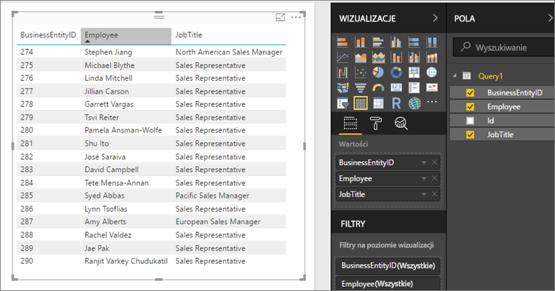

# Uzyskiwanie dostępu do udostępnionych zestawów danych jako źródeł danych usługi OData na serwerze raportów usługi Power BI
Możesz uzyskać dostęp do udostępnionych zestawów danych z programu Power BI Desktop ze źródłem danych usługi OData.

1. Za pomocą adresu URL źródła danych usługi OData możesz połączyć się ze źródłem usługi OData.
   
    
2. Po przekazaniu danych do programu Power BI Desktop możesz modyfikować je w edytorze zapytań.
   
    
3. Teraz można użyć danych do projektowania raportów.
   
    

Pamiętaj, aby użyć pozycji **Opcje zaawansowane**, aby można było włączyć otwarty typ kolumny i odpowiednio sformatować kolumny w dodatku Power Query, aby zaspokoić swoje potrzeby.

Przeczytaj więcej na temat [nawiązywania połączenia ze źródłami danych usługi OData w programie Power BI Desktop](../desktop-connect-odata.md).

Masz więcej pytań? [Zadaj pytanie społeczności usługi Power BI](https://community.powerbi.com/)

