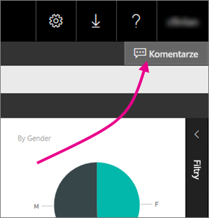
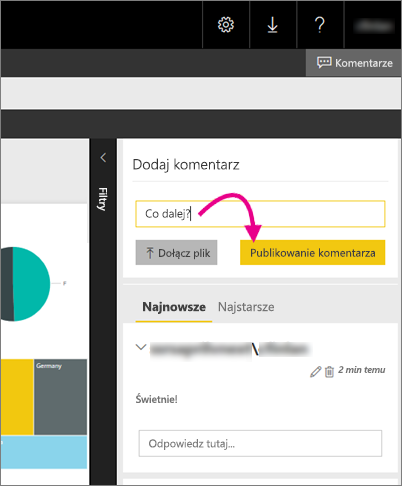

# Dodawanie komentarzy do raportu na serwerze raportów
Do raportów, w tym do raportów usługi Power BI, można dodawać komentarze w portalu internetowym serwera raportów. Komentarze są połączone z raportem i każda osoba mająca odpowiednie uprawnienia może wyświetlać komentarze do raportu. Aby uzyskać szczegółowe informacje, zobacz sekcję [Uprawnienia](#permissions) poniżej.

## Dodawanie lub wyświetlanie komentarzy
1. Otwórz raport z podziałem na strony lub raport usługi Power BI na serwerze raportów.
2. W prawym górnym rogu wybierz pozycję **Komentarze**.
   
    
   
    W okienku Komentarze widać wszystkie komentarze.
3. Wpisz komentarz, a następnie wybierz pozycję **Opublikuj komentarz**.
   
    
   
    Komentarz pojawi się w okienku w portalu internetowym wraz z wszelkimi wcześniejszymi komentarzami. Komentarze nie są wyświetlane w raporcie w aplikacjach mobilnych Power BI.
   
   > [!TIP]
   > Czy wiesz? [W aplikacjach mobilnych Power BI możesz dodawać adnotacje do raportów usługi Power BI](../mobile-annotate-and-share-a-tile-from-the-mobile-apps.md) i udostępniać te raporty z adnotacjami innym osobom.
   > 
   > 

## Uprawnienia
W zależności od uprawnień możesz:

* Nie widzieć żadnych komentarzy.
* Wyświetlać wszystkie komentarze oraz publikować, edytować i usuwać własne.
* Wyświetlać wszystkie komentarze oraz publikować, edytować i usuwać własne, a także usuwać komentarze innych osób.

## Następne kroki
* [Co to jest serwer raportów usługi Power BI?](get-started.md)  

Masz więcej pytań? [Zadaj pytanie społeczności usługi Power BI](https://community.powerbi.com/)

