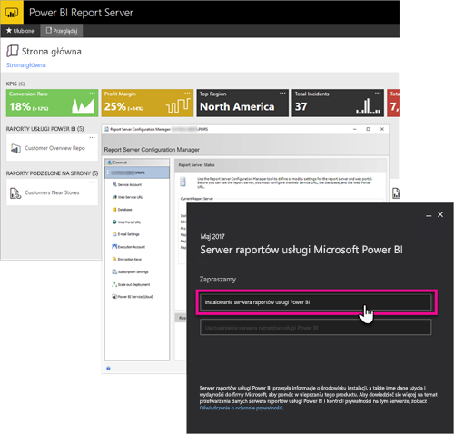

# Omówienie administracji, serwer raportów usługi Power BI
W tym artykule przedstawiono omówienie administracji serwera raportów usługi Power BI, który jest lokalizacją lokalną służącą do przechowywania raportów podzielonych na strony, raportów dla urządzeń przenośnych i raportów usługi Power BI, jak również zarządzania nimi. W tym artykule przedstawiono koncepcje planowania i wdrażania serwera raportów usługi Power BI oraz zarządzania nim, a także linki do dodatkowych informacji.

## Instalowanie i migracja
Musisz zainstalować serwer raportów usługi Power BI, aby rozpocząć korzystanie z niego. Są dostępne artykuły opisujące, jak wykonać to zadanie.

Przed rozpoczęciem instalacji, uaktualniania lub migracji do serwera raportów usługi Power BI zapoznaj się z [wymaganiami systemowymi](system-requirements.md) serwera raportów.

### Instalowanie
Jeżeli wdrażasz nowy serwer raportów usługi Power BI, użyj poniższego dokumentu jako pomocy. 

[Instalacja serwera raportów usługi Power BI](install-report-server.md)

### Migracja
Nie ma dostępnego uaktualnienia w miejscu dla usług SQL Server Reporting Services. Jeśli masz istniejące wystąpienie usług SQL Server Reporting Services, które ma zostać serwerem raportów usługi Power BI, musisz przeprowadzić migrację. Przeprowadzenie migracji może być pożądane także z innych powodów. Zapoznaj się z dokumentem migracji, aby uzyskać więcej informacji.

[Migrowanie instalacji serwera raportów](migrate-report-server.md)

## Konfigurowanie serwera raportów
Podczas konfigurowania serwera raportów dostępnych jest wiele opcji. Czy będziesz używać protokołu SSL? Czy chcesz skonfigurować serwer poczty e-mail? Czy chcesz zintegrować z usługą Power BI w celu przypinania wizualizacji?

Większość konfiguracji zostanie przeprowadzona w Menedżerze konfiguracji serwera raportów. Zapoznaj się z dokumentacją [menedżera konfiguracji](https://docs.microsoft.com/sql/reporting-services/install-windows/reporting-services-configuration-manager-native-mode), aby uzyskać więcej szczegółowych informacji.

## Zabezpieczenia
Zabezpieczenia i ochrona są ważne dla każdej organizacji. Informacje na temat uwierzytelniania, autoryzacji, ról i uprawnień możesz znaleźć w dokumentacji [zabezpieczeń](https://docs.microsoft.com/sql/reporting-services/security/reporting-services-security-and-protection).

## Następne kroki
[Instalacja serwera raportów usługi Power BI](install-report-server.md)  
[Znajdowanie klucza produktu serwera raportów](find-product-key.md)  
[Instalowanie programu Power BI Desktop zoptymalizowanego pod kątem serwera raportów usługi Power BI](install-powerbi-desktop.md)  
[Instalowanie programu Report Builder](https://docs.microsoft.com/sql/reporting-services/install-windows/install-report-builder)  
[Pobieranie programu SQL Server Data Tools (SSDT)](http://go.microsoft.com/fwlink/?LinkID=616714)

Masz więcej pytań? [Zadaj pytanie społeczności usługi Power BI](https://community.powerbi.com/)

