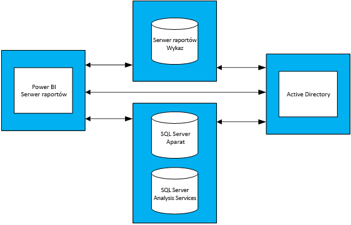

# Wskazówki dotyczące planowania wydajności serwera raportów usługi Power BI
Serwer raportów usługi Power BI to samoobsługowe rozwiązanie z zakresu analizy biznesowej i raportowania dla przedsiębiorstw. Rozwiązanie to może być wdrażane przez klienta w siedzibie firmy, za zaporą. Serwer ten stanowi połączenie interaktywnych funkcji raportów znanych z programu Power BI Desktop oraz lokalnej platformy serwera znanej z usług SQL Server Reporting Services. Firmy coraz intensywniej korzystają z funkcji analiz i raportów, przez co trudno jest określić budżet na infrastrukturę sprzętową i licencje na oprogramowanie wymagane do skalowania bazy użytkowników w przedsiębiorstwie. Ten dokument zawiera wskazówki dotyczące planowania wydajności serwera raportów usługi Power BI przez udostępnianie wyników licznych testów obciążenia wykonywanych na serwerze raportów przy różnych obciążeniach. Mimo że raporty, zapytania i wzorce użycia stosowane w organizacji mogą być różne, wyniki przedstawione w tym dokumencie, wykonane testy oraz szczegółowy opis sposobu ich przeprowadzenia służą za punkt odniesienia dla każdego, kto zaczyna planowanie wdrażania serwera raportów usługi Power BI.

## Streszczenie działań
Zastosowaliśmy względem serwera raportów usługi Power BI dwa różne typy obciążeń. Każde obciążenie obejmowało różne rodzaje raportów i wykonanie rozmaitych działań w portalu internetowym. 

* W przypadku obciążenia „Power BI Report Heavy” najczęściej wykonywaną operacją (tj. operacją wykonywaną przez 60% czasu) było renderowanie raportów usługi Power BI.
* W przypadku obciążenia „Paginated Report Heavy” najczęściej wykonywaną operacją było renderowanie raportów z podziałem na strony.

Poniższa tabela przedstawia maksymalną liczbę użytkowników, jaką może obsłużyć serwer raportów usługi Power BI przy zapewnieniu niezawodności na poziomie 99%, w przypadku topologii obejmującej cztery serwery raportów usługi Power BI i przy założeniu, że w danym momencie z serwera raportów korzysta najwyżej 5% użytkowników. 

| Obciążenie | 8 rdzeni/32 GB pamięci RAM | 16 rdzeni/64 GB pamięci RAM |
| --- | --- | --- |
| **Power BI Report Heavy** (> 60%) |1000 użytkowników |3000 użytkowników |
| **Paginated (RDL) Report Heavy** (> 60%) |2000 użytkowników |3200 użytkowników |

W każdym przebiegu najbardziej obciążonym zasobem był procesor. W tej sytuacji wyższą niezawodność systemu można zapewnić, zwiększając liczbę rdzeni serwera raportów usługi Power BI (a nie zwiększając ilość pamięci czy też miejsca na dysku twardym). 

## Metodologia testów
Topologia testowania bazowała na maszynach wirtualnych platformy Azure Microsoft, a nie na sprzęcie fizycznym specyficznym dla danego dostawcy. Wszystkie maszyny były hostowane w Stanach Zjednoczonych. W ten sposób odzwierciedlono ogólny trend wirtualizacji sprzętu — zarówno lokalnie, jak i w chmurze publicznej. 

### Topologia serwera raportów usługi Power BI
Wdrożenie serwera raportów usługi Power BI obejmowało następujące maszyny wirtualne:

* Kontroler domeny usługi Active Directory wymagany przez aparat bazy danych programu SQL Server, usługi SQL Server Analysis Services i serwer raportów usługi Power BI Report Server zapewniający bezpieczne uwierzytelnianie żądań.
* Aparat bazy danych programu SQL Server i usługi SQL Server Analysis Services: tutaj były przechowywane wszystkie bazy danych używane przez raporty podczas ich renderowania.
* Serwer raportów usługi Power BI
* Baza danych serwera raportów usługi Power BI. Baza danych serwera raportów jest hostowana na innej maszynie niż serwer raportów usługi Power BI, dzięki czemu nie musi rywalizować z aparatem bazy danych programu SQL Server o zasoby, takie jak pamięć, procesor, sieć i miejsce na dysku.

Aby uzyskać informacje na temat szczegółowej konfiguracji poszczególnych maszyn wirtualnych użytych w tej topologii, zobacz Dodatek 1.1 — Topologia serwera raportów usługi Power BI i Dodatek 1.2 — Konfiguracja maszyny wirtualnej serwera raportów usługi Power BI.

### Testy
Testy używane w przebiegach testów obciążenia są publicznie dostępne w projekcie usługi GitHub o nazwie Reporting Services Load Test Project (zobacz https://github.com/Microsoft/Reporting-Services-LoadTest). To narzędzie umożliwia badanie wydajności, niezawodności, skalowalności i możliwości odzyskiwania w zakresie usług SQL Server Reporting Services i serwera raportów usługi Power BI. Ten projekt składa się z czterech grup przypadków testowych:

* Testy symulujące renderowanie raportów usługi Power BI,
* Testy symulujące renderowanie raportów dla urządzeń przenośnych,
* Testy symulujące renderowanie małych i dużych raportów z podziałem na strony, 
* Testy symulujące wykonywanie różnych operacji w portalu internetowym. 

Wszystkie testy polegają na wykonaniu operacji obejmującej całą procedurę (np. renderowania raportu, utworzenia nowego źródła danych itp.). Jest to realizowane przez wysłanie do serwera raportów co najmniej jednego żądania internetowego (za pośrednictwem interfejsów API). W rzeczywistości do wykonania dowolnej z tych operacji może być konieczne wykonanie kilku działań pośrednich. Na przykład w celu renderowania raportu użytkownik musi przejść do portalu internetowego, przejść do folderu zawierającego raport, a następnie kliknąć raport, aby go renderować. Mimo tego, że testy nie wykonują wszystkich operacji wymaganych do zrealizowania całego zadania, zapewniają większość obciążenia, które wystąpiłoby na serwerze raportów usługi Power BI. W projekcie dostępnym w usłudze GitHub znajduje się więcej informacji na temat różnych typów raportów oraz operacji.

### Obciążenia
Istnieją 2 profile obciążeń używane do testowania: Power BI Report Heavy (Intensywna obsługa raportów w usłudze Power BI) oraz Paginated Report Heavy (Intensywna obsługa raportów z podziałem na strony). W poniższej tabeli przedstawiono dystrybucję żądań wykonywanych względem serwera raportów.

| Działanie | Power BI Report Heavy, częstotliwość występowania | Paginated Report Heavy, częstotliwość występowania |
| --- | --- | --- |
| **Renderowanie raportów usługi Power BI** |60% |10% |
| **Renderowanie raportów z podziałem na strony (RDL)** |30% |60% |
| **Renderowanie raportów dla urządzeń przenośnych** |5% |20% |
| **Operacje w portalu internetowym** |5% |10% |

### Obciążenie użytkownikami
Każdy przebieg testu został wykonany na podstawie częstotliwości określonej w jednym z dwóch obciążeń. Na początku testów do serwera raportów skierowano 20 równoczesnych żądań użytkowników. Następnie obciążenie użytkownikami stopniowo zwiększano, aż niezawodność spadła poniżej wartości docelowej wynoszącej 99%.

## Wyniki
### Pojemność dotycząca jednoczesnych użytkowników
Jak wspomniano wcześniej, na początku testów do serwera raportów jednocześnie wysyłało żądania 20 użytkowników. Następnie liczba jednoczesnych użytkowników była stopniowo zwiększana do momentu, kiedy 1% wszystkich żądań kończył się niepowodzeniem. Wyniki przedstawione w poniższej tabeli pozwalają poznać liczbę jednoczesnych użytkowników obsługiwanych przez serwer do czasu wystąpienia szczytowego obciążenia, czyli przy wskaźniku niepowodzeń wynoszącym mniej niż 1%.

| Obciążenie | 8 rdzeni/32 GB pamięci RAM | 16 rdzeni/64 GB pamięci RAM |
| --- | --- | --- |
| **Power BI Report Heavy** |50 jednoczesnych użytkowników |150 jednoczesnych użytkowników |
| **Paginated Report Heavy** |100 jednoczesnych użytkowników |160 jednoczesnych użytkowników |

### Całkowita pojemność dotycząca użytkowników
W firmie Microsoft istnieje wdrożenie produkcyjne serwera raportów usługi Power BI używane przez kilka zespołów. Podczas analizy rzeczywistego wykorzystania tego środowiska zaobserwowaliśmy, że liczba jednoczesnych użytkowników w dowolnym momencie (nawet podczas szczytowego obciążenia dziennego) nie przekroczyła 5% wszystkich użytkowników. Wartość 5% jednoczesnych użytków posłużyła nam za punkt odniesienia. Dokonując ekstrapolacji, określiliśmy bazę wszystkich użytkowników, jaką serwer raportów usługi Power BI mógłby obsłużyć z niezawodnością na poziomie 99%.

| Obciążenie | 8 rdzeni/32 GB pamięci RAM | 16 rdzeni/64 GB pamięci RAM |
| --- | --- | --- |
| **Power BI Report Heavy** |1000 użytkowników |3000 użytkowników |
| **Paginated Report Heavy** |2000 użytkowników |3200 użytkowników |

### Wyświetlanie wyników
Wybierz raport, aby wyświetlić wyniki testu obciążenia.

| Obciążenie | 8 rdzeni/32 GB pamięci RAM | 16 rdzeni/64 GB pamięci RAM |
| --- | --- | --- |
| **Power BI Report Heavy** |[Widok — 8 rdzeni](https://msit.powerbi.com/view?r=eyJrIjoiMDhhNGY4NGQtNGRhYy00Yzk4LTk2MzAtYzFlNWI5NjBkMGFiIiwidCI6IjcyZjk4OGJmLTg2ZjEtNDFhZi05MWFiLTJkN2NkMDExZGI0NyIsImMiOjV9) |[Widok — 16 rdzeni](https://msit.powerbi.com/view?r=eyJrIjoiNDBiODk1OGUtYTAyOC00MzVhLThmZmYtNzVjNTFjNzMwYzkwIiwidCI6IjcyZjk4OGJmLTg2ZjEtNDFhZi05MWFiLTJkN2NkMDExZGI0NyIsImMiOjV9) |
| **Paginated Report Heavy** |[Widok — 8 rdzeni](https://msit.powerbi.com/view?r=eyJrIjoiNDFiZWYzMTktZGIxNS00MzcwLThjODQtMmJkMGRiZWEzNjhlIiwidCI6IjcyZjk4OGJmLTg2ZjEtNDFhZi05MWFiLTJkN2NkMDExZGI0NyIsImMiOjV9) |[Widok — 16 rdzeni](https://msit.powerbi.com/view?r=eyJrIjoiOTU0YjJkYTgtNDg4Yy00NzlhLWIwMGYtMzg4YWI2MjNmOTZjIiwidCI6IjcyZjk4OGJmLTg2ZjEtNDFhZi05MWFiLTJkN2NkMDExZGI0NyIsImMiOjV9) |

<iframe width="640" height="360" src="https://msit.powerbi.com/view?r=eyJrIjoiMDhhNGY4NGQtNGRhYy00Yzk4LTk2MzAtYzFlNWI5NjBkMGFiIiwidCI6IjcyZjk4OGJmLTg2ZjEtNDFhZi05MWFiLTJkN2NkMDExZGI0NyIsImMiOjV9" frameborder="0" allowFullScreen="true"></iframe>

<iframe width="640" height="360" src="https://msit.powerbi.com/view?r=eyJrIjoiNDBiODk1OGUtYTAyOC00MzVhLThmZmYtNzVjNTFjNzMwYzkwIiwidCI6IjcyZjk4OGJmLTg2ZjEtNDFhZi05MWFiLTJkN2NkMDExZGI0NyIsImMiOjV9" frameborder="0" allowFullScreen="true"></iframe>

<iframe width="640" height="360" src="https://msit.powerbi.com/view?r=eyJrIjoiNDFiZWYzMTktZGIxNS00MzcwLThjODQtMmJkMGRiZWEzNjhlIiwidCI6IjcyZjk4OGJmLTg2ZjEtNDFhZi05MWFiLTJkN2NkMDExZGI0NyIsImMiOjV9" frameborder="0" allowFullScreen="true"></iframe>

<iframe width="640" height="360" src="https://msit.powerbi.com/view?r=eyJrIjoiOTU0YjJkYTgtNDg4Yy00NzlhLWIwMGYtMzg4YWI2MjNmOTZjIiwidCI6IjcyZjk4OGJmLTg2ZjEtNDFhZi05MWFiLTJkN2NkMDExZGI0NyIsImMiOjV9" frameborder="0" allowFullScreen="true"></iframe>

## Podsumowanie
W przypadku każdego przebiegu testu obciążenia najbardziej obciążonym zasobem w szczytowym momencie był procesor maszyny hostującej serwer raportów usługi Power BI. Dlatego też pierwszym zasobem, którego liczbę należy zwiększyć, są rdzenie. Alternatywnie można rozważyć skalowanie w poziomie przez dodanie serwerów hostujących serwer raportów usługi Power BI w danej topologii.

W tym dokumencie przedstawiono wyniki wykonania określonego zestawu raportów korzystających z określonego zestawu danych, co powtórzono w określony sposób. Jest to przydatny materiał referencyjny, ale należy pamiętać, że faktyczne użycie zależy od raportów, zapytań, wzorców użycia i wdrożenia serwera raportów usługi Power BI w danej organizacji.

## Dodatek
### 1 Topologia
**1.1 Topologia serwera raportów usługi Power BI**

Aby skoncentrować się wyłącznie na działaniu serwera raportów usługi Power BI w różnych konfiguracjach, konfiguracja maszyny wirtualnej dla każdego typu maszyny (oprócz maszyny hostującej serwer raportów usługi Power BI) była taka sama. Każda maszyna była aprowizowana tak jak maszyny serii D drugiej generacji (v2) z dyskiem Premium Storage. Szczegółowe informacje dotyczące poszczególnych rozmiarów maszyny wirtualnej można znaleźć w sekcji „Zastosowania ogólne” na stronie https://azure.microsoft.com/pl-pl/pricing/details/virtual-machines/windows/.

| Typ maszyny wirtualnej | Procesor | Pamięć | Rozmiar maszyny wirtualnej platformy Azure |
| --- | --- | --- | --- |
| **Kontroler domeny usługi Active Directory** |2 rdzenie |7 GB |Standard_DS2_v2 |
| **Aparat bazy danych programu SQL Server i usług SQL Server Analysis Services** |16 rdzeni |56 GB |Standard_DS5_v2 |
| **Baza danych serwera raportów** |16 rdzeni |56 GB |Standard_DS5_v2 |

**1.2 Konfiguracja maszyny wirtualnej serwera raportów usługi Power BI** 

Na maszynie wirtualnej hostującej serwer raportów usługi Power BI były używane różne konfiguracje procesora i pamięci. W przeciwieństwie do innych maszyn wirtualnych, ta maszyna była aprowizowana tak jak maszyny serii D trzeciej generacji (v3) z dyskiem Premium Storage. Szczegółowe informacje dotyczące poszczególnych rozmiarów tej maszyny wirtualnej można znaleźć w sekcji „Zastosowania ogólne” na stronie https://azure.microsoft.com/pl-pl/pricing/details/virtual-machines/windows/.

| Maszyna wirtualna | Procesor | Pamięć | Rozmiar maszyny wirtualnej platformy Azure |
| --- | --- | --- | --- |
| **Serwer raportów usługi Power BI (mały)** |8 rdzeni |32 GB |Standard_D8S_v3 |
| **Serwer raportów usługi Power BI (duży)** |16 rdzeni |64 GB |vStandard_D16S_v3 |

### 2 Uruchamianie narzędzia LoadTest
Aby uruchomić narzędzie Reporting Services LoadTest we wdrożeniu serwera raportów programu Power BI (własnym lub na platformie Microsoft Azure), wykonaj poniższe czynności.

1. Sklonuj projekt Reporting Services LoadTest z usługi GitHub (https://github.com/Microsoft/Reporting-Services-LoadTest).
2. W katalogu projektu znajdziesz plik rozwiązania o nazwie RSLoadTests.sln. Otwórz ten plik w programie Visual Studio 2015 lub nowszym.
3. Zdecyduj, czy chcesz uruchomić to narzędzie względem własnego wdrożenia serwera raportów usługi Power BI czy też względem wdrożenia serwera raportów usługi Power BI na platformie Microsoft Azure. Jeśli zamierzasz uruchomić narzędzie we wdrożeniu własnym, przejdź do kroku 5.
4. Wykonaj instrukcje znajdujące się na stronie https://github.com/Microsoft/Reporting-Services-LoadTest#create-a-sql-server-reporting-services-load-environment-in-azure, aby utworzyć środowisko serwera raportów usługi Power BI na platformie Azure.
5. Po zakończeniu wdrażania środowiska wykonaj instrukcje ze strony https://github.com/Microsoft/Reporting-Services-LoadTest#load-test-execution, aby uruchomić testy.

Masz więcej pytań? [Zadaj pytanie społeczności usługi Power BI](https://community.powerbi.com/)

