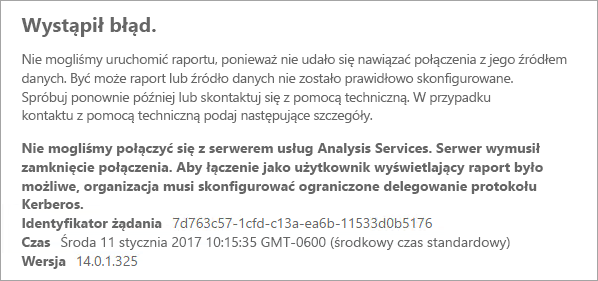
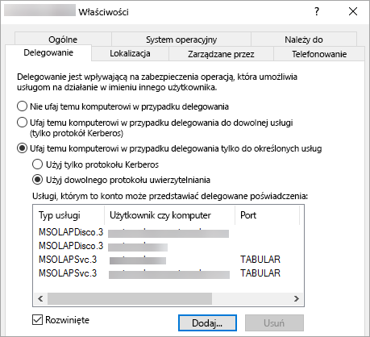

# <a name="configure-kerberos-to-use-power-bi-reports"></a>Konfigurowanie protokołu Kerberos do używania z raportami usługi Power BI
<iframe width="640" height="360" src="https://www.youtube.com/embed/vCH8Fa3OpQ0?showinfo=0" frameborder="0" allowfullscreen></iframe>

Dowiedz się, jak skonfigurować na serwerze raportów uwierzytelnianie Kerberos na potrzeby źródeł danych używanych w raportach usługi Power BI w środowisku rozproszonym.

Serwer raportów usługi Power BI umożliwia hostowanie raportów tej usługi. Obsługuje też wiele źródeł danych. Mimo że ten artykuł dotyczy konkretnie usług SQL Server Analysis Services, można stosować przedstawione tu koncepcje do innych źródeł danych, takich jak program SQL Server.

Serwer raportów usługi Power BI, program SQL Server i usługi Analysis Services można zainstalować na jednym komputerze i wszystko powinno działać bez dodatkowej konfiguracji. To doskonała konfiguracja dla środowiska testowego. Błędy mogą występować, jeśli te usługi są zainstalowane na osobnych komputerach, co jest nazywane środowiskiem rozproszonym. W takim środowisku wymagane jest stosowanie uwierzytelniania Kerberos. Zaimplementowanie tego wymaga utworzenia odpowiedniej konfiguracji. 

W szczególności należy skonfigurować ograniczone delegowanie. Protokół Kerberos może już być skonfigurowany w środowisku, ale może nie być skonfigurowany na potrzeby ograniczonego delegowania.

## <a name="error-running-report"></a>Błąd w trakcie działania raportu
Jeśli serwer raportów nie jest skonfigurowany poprawnie, może zostać wyświetlony następujący błąd.

    Something went wrong.

    We couldn’t run the report because we couldn’t connect to its data source. The report or data source might not be configured correctly. 

W sekcji szczegółów technicznych znajduje się następujący komunikat.

    We couldn’t connect to the Analysis Services server. The server forcibly closed the connection. To connect as the user viewing the report, your organization must have configured Kerberos constrained delegation.



## <a name="configuring-kerberos-constrained-delegation"></a>Konfigurowanie ograniczonego delegowania protokołu Kerberos
Do działania ograniczonego delegowania protokołu Kerberos wymagane jest skonfigurowanie kilku elementów. Obejmuje to nazwy jednostek usług (SPN, Service Principal Name) i ustawienia delegowania dla kont usług.

> [!NOTE]
> Do skonfigurowania nazw SPN i ustawień delegowania wymagane są uprawnienia administratora domeny.
> 
> 

Konieczne będzie skonfigurowanie lub zweryfikowanie następujących elementów.

1. Typ uwierzytelniania w konfiguracji serwera raportów.
2. Nazwy SPN konta usługi serwera raportów.
3. Nazwy SPN usług Analysis Services.
4. Nazwy SPN usługi SQL Browser na komputerze z usługami Analysis Services. Dotyczy to tylko wystąpień nazwanych.
5. Ustawienia delegowania na koncie usługi serwera raportów.

## <a name="authentication-type-within-report-server-configuration"></a>Typ uwierzytelniania w konfiguracji serwera raportów
Należy skonfigurować typ uwierzytelniania dla serwera raportów, aby umożliwić obsługę ograniczonego delegowania protokołu Kerberos. Należy to zrobić w pliku **rsreportserver.config**. Domyślna lokalizacja tego pliku to `C:\Program Files\Microsoft Power BI Report Server\PBIRS\ReportServer`.

W pliku rsreportserver.config znajdź sekcję **Authentication/AuthenticationTypes**.

Upewnij się, że pierwszą pozycją na liście typów uwierzytelniania jest RSWindowsNegotiate. Powinno to wyglądać mniej więcej tak.

```
<AuthenticationTypes>
    <RSWindowsNegotiate/>
    <RSWindowsNTLM/>
</AuthenticationTypes>
```

Jeśli konieczna była zmiana w tym pliku konfiguracji, należy zatrzymać i ponownie uruchomić serwer raportów, aby upewnić się, że zmiany zostały wprowadzone.

Aby uzyskać więcej informacji, zobacz [Konfigurowanie uwierzytelniania systemu Windows na serwerze raportów](https://docs.microsoft.com/sql/reporting-services/security/configure-windows-authentication-on-the-report-server).

## <a name="spns-for-the-report-server-service-account"></a>Nazwy SPN konta usługi serwera raportów
Następnie należy upewnić się, że serwer raportów ma dostępne prawidłowe nazwy SPN. Jest to zależne od konta usługi skonfigurowanego dla serwera raportów.

### <a name="virtual-service-account-or-network-service"></a>Konto usługi wirtualnej lub usługa sieciowa
Jeśli serwer raportów jest skonfigurowany dla konta usługi wirtualnej lub konta usługi sieciowej, najprawdopodobniej nie trzeba nic robić. Działają one w kontekście konta komputera. Dla konta komputera domyślnie istnieją nazwy SPN HOST. Umożliwią one obsługę usługi HTTP i będą używane przez serwer raportów.

Jeśli jest używana nazwa serwera wirtualnego, która jest różna od konta komputera, wpisy HOST nie zapewnią tej obsługi i trzeba ręcznie dodać nazwy SPN dla nazwy hosta serwera wirtualnego.

### <a name="domain-user-account"></a>Konto użytkownika domeny
Jeśli na serwerze raportów skonfigurowano używanie konta użytkownika domeny, konieczne jest ręczne utworzenie nazw SPN HTTP dla tego konta. Można to zrobić przy użyciu narzędzia setspn dostarczanego z systemem Windows.

> [!NOTE]
> Do utworzenia nazwy SPN wymagane są uprawnienia administratora domeny.
> 
> 

Zalecane jest utworzenie dwóch nazw SPN: jednej z nazwą NetBIOS, a drugiej z w pełni kwalifikowaną nazwą domeny (FQDN). Nazwa SPN będzie mieć następujący format.

    <Service>/<Host>:<port>

Serwer raportów usługi Power BI będzie używać usługi HTTP. Dla nazw SPN usługi HTTP nie będziemy podawać portu. W tym przypadku interesuje nas usługa HTTP. Hostem nazwy SPN będzie nazwa podana w adresie URL. Zazwyczaj jest to nazwa komputera. Jeśli środowisko znajduje się za modułem równoważenia obciążenia, może to być nazwa wirtualna.

> [!NOTE]
> Adres URL można sprawdzić, analizując tekst wprowadzany na pasku adresu przeglądarki. Można też sprawdzić go w Menedżerze konfiguracji serwera raportów na karcie adresu URL portalu internetowego.
> 
> 

Jeśli nazwą komputera jest ContosoRS, nazwa SPN będzie następująca.

| Typ nazwy SPN | SPN |
| --- | --- |
| W pełni kwalifikowana nazwa domeny (FQDN) |HTTP/ContosoRS.contoso.com |
| NetBIOS |HTTP/ContosoRS |

### <a name="location-of-spn"></a>Lokalizacja nazwy SPN
Gdzie należy umieścić nazwę SPN? Nazwa SPN powinna zostać umieszczona na koncie używanym jako konto usługi. Jeśli używasz konta usługi wirtualnej lub usługi sieciowej, będzie to konto komputera. Jak już wspomniano wcześniej, powinno to być wymagane tylko w przypadku wirtualnego adresu URL. Jeśli jako konta usługi serwera raportów używasz konta użytkownika domeny, umieść nazwę SPN na tym koncie użytkownika domeny.

Na przykład jeśli używasz konta usługi sieciowej, a nazwa komputera to ContosoRS, nazwę SPN należy umieścić na koncie ContosoRS.

Jeśli byłoby używane konto użytkownika domeny RSService, nazwę SPN należałoby umieścić na koncie RSService.

### <a name="using-setspn-to-add-the-spn"></a>Dodawanie nazwy SPN za pomocą narzędzia SetSPN
Nazwę SPN można dodać za pomocą narzędzia SetSPN. Wykorzystamy przykład omówiony powyżej z kontem komputera i kontem użytkownika domeny.

Umieszczenie nazwy SPN na koncie komputera, w przypadku nazwy SPN zarówno FQDN, jak i NetBIOS, wygląda mniej więcej tak, jak przedstawiono poniżej (używany jest wirtualny adres URL contosoreports).

      Setspn -a HTTP/contosoreports.contoso.com ContosoRS
      Setspn -a HTTP/contosoreports ContosoRS

Umieszczenie nazwy SPN na koncie użytkownika domeny, w przypadku nazwy SPN zarówno FQDN, jak i NetBIOS, wygląda mniej więcej tak, jak przedstawiono poniżej (jako host nazwy SPN używana jest nazwa komputera).

      Setspn -a HTTP/ContosoRS.contoso.com RSService
      Setspn -a HTTP/ContosoRS RSService

## <a name="spns-for-the-analysis-services-service"></a>Nazwy SPN usługi Analysis Services
Postępowanie z nazwami SPN usług Analysis Services przypomina to opisane dla serwera raportów usługi Power BI. Format nazwy SPN jest nieco inny, jeśli jest używane nazwane wystąpienie.

W przypadku usług Analysis Services używamy usługi MSOLAPSvc.3. Podamy nazwę wystąpienia jako lokalizację portu nazwy SPN. Część nazwy SPN dotycząca hosta będzie albo nazwą komputera, albo nazwą wirtualną klastra.

Oto przykład nazwy SPN usług Analysis Services.

| Typ | Format |
| --- | --- |
| Wystąpienie domyślne |MSOLAPSvc.3/ContosoAS.contoso.com<br>MSOLAPSvc.3/ContosoAS |
| Nazwane wystąpienie |MSOLAPSvc.3/ContosoAS.contoso.com:NAZWA_WYSTĄPIENIA<br>MSOLAPSvc.3/ContosoAS:NAZWA_WYSTĄPIENIA |

Także umieszczanie nazwy SPN wygląda podobnie jak w przypadku serwera raportów usługi Power BI. Zależy ono od konta usługi.  Jeśli używasz konta systemu lokalnego lub usługi sieciowej, będziesz używać kontekstu konta komputera. Jeśli używasz konta użytkownika domeny dla wystąpienia usług Analysis Services, umieść nazwę SPN na tym koncie użytkownika domeny.

### <a name="using-setspn-to-add-the-spn"></a>Dodawanie nazwy SPN za pomocą narzędzia SetSPN
Nazwę SPN można dodać za pomocą narzędzia SetSPN. W tym przykładzie nazwa komputera to ContosoAS.

Umieszczenie nazwy SPN na koncie komputera, w przypadku nazwy SPN zarówno FQDN, jak i NetBIOS, wygląda mniej więcej tak, jak przedstawiono poniżej.

    Setspn -a MSOLAPSvc.3/ContosoAS.contoso.com ContosoAS
    Setspn -a MSOLAPSvc.3/ContosoAS ContosoAS

Umieszczenie nazwy SPN na koncie użytkownika domeny, w przypadku nazwy SPN zarówno FQDN, jak i NetBIOS, wygląda mniej więcej tak, jak przedstawiono poniżej.

    Setspn -a MSOLAPSvc.3/ContosoAS.contoso.com OLAPService
    Setspn -a MSOLAPSvc.3/ContosoAS OLAPService

## <a name="spns-for-the-sql-browser-service"></a>Nazwy SPN usługi SQL Browser
Jeśli masz nazwane wystąpienie usług Analysis Services, musisz też upewnić się, że masz nazwę SPN dla usługi Browser. Dotyczy to tylko usług Analysis Services.

Postępowanie z nazwami SPN usługi SQL Browser przypomina to opisane dla serwera raportów usługi Power BI.

W przypadku usługi SQL Browser używamy usługi MSOLAPDisco.3. Podamy nazwę wystąpienia jako lokalizację portu nazwy SPN. Część nazwy SPN dotycząca hosta będzie albo nazwą komputera, albo nazwą wirtualną klastra.
Nie trzeba niczego określać jako nazwy wystąpienia ani portu.

Oto przykład nazwy SPN usług Analysis Services.

    MSOLAPDisco.3/ContosoAS.contoso.com
    MSOLAPDisco.3/ContosoAS

Także umieszczanie nazwy SPN wygląda podobnie jak w przypadku serwera raportów usługi Power BI. Różnica w tym przypadku polega na tym, że usługa SQL Browser jest zawsze uruchamiana za pomocą konta systemu lokalnego. Oznacza to, że nazwy SPN zawsze trafiają na konto komputera. 

### <a name="using-setspn-to-add-the-spn"></a>Dodawanie nazwy SPN za pomocą narzędzia SetSPN
Nazwę SPN można dodać za pomocą narzędzia SetSPN. W tym przykładzie nazwa komputera to ContosoAS.

Umieszczenie nazwy SPN na koncie komputera, w przypadku nazwy SPN zarówno FQDN, jak i NetBIOS, wygląda mniej więcej tak, jak przedstawiono poniżej.

    Setspn -a MSOLAPDisco.3/ContosoAS.contoso.com ContosoAS
    Setspn -a MSOLAPDisco.3/ContosoAS ContosoAS

Aby uzyskać więcej informacji, zobacz [Wymagana jest nazwa SPN dla usługi SQL Server Browser](https://support.microsoft.com/kb/950599).

## <a name="delegation-settings-on-the-report-server-service-account"></a>Ustawienia delegowania na koncie usługi serwera raportów
Ostatnią rzeczą, jaką należy skonfigurować, są ustawienia delegowania na koncie usługi serwera raportów. Istnieją różne narzędzia, za pomocą których można wykonać te kroki. W tym dokumencie pozostaniemy przy narzędziu Użytkownicy i komputery usługi Active Directory.

Najpierw należy przejść do właściwości konta usługi serwera raportów w narzędziu Użytkownicy i komputery usługi Active Directory. Będzie to albo konto komputera, jeśli używasz konta usługi wirtualnej lub usługi sieciowej, albo konto użytkownika domeny.

Należy skonfigurować ograniczone delegowanie z użyciem przejścia protokołu. W przypadku ograniczonego delegowania należy jawnie określić usługi docelowe delegowania. Dodamy zarówno nazwę SPN usług Analysis Services, jak i nazwę SPN usługi SQL Browser do listy pozycji, do których serwer raportów usługi Power BI może delegować.

1. Kliknij prawym przyciskiem myszy konto serwera raportów, a następnie wybierz pozycję **Właściwości**.
2. Wybierz kartę **Delegowanie**.
3. Wybierz pozycję **Ufaj temu komputerowi w delegowaniu tylko do określonych usług**.
4. Wybierz pozycję **Użyj dowolnego protokołu uwierzytelniania**.
5. W obszarze **Usługi, którym to konto może przedstawiać delegowane poświadczenia** wybierz pozycję **Dodaj**.
6. W nowym oknie dialogowym wybierz pozycję **Użytkownicy lub komputery**.
7. Wprowadź nazwę konta usługi dla usług Analysis Services i wybierz przycisk **OK**.
8. Wybierz utworzoną nazwę SPN. Będzie się ona zaczynać od `MSOLAPSvc.3`. Jeśli została dodana nazwa SPN zarówno FQDN, jak i NetBIOS, wybierz obie. Może być widoczna tylko jedna.
9. Wybierz przycisk **OK**.  Teraz nazwa SPN powinna być widoczna na liście.
10. Opcjonalnie można wybrać pozycję **Rozwinięte**, aby wyświetlać na liście zarówno nazwę SPN FQDN, jak i nazwę SPN NetBIOS.
11. Ponownie wybierz pozycję **Dodaj**. Teraz dodamy nazwę SPN usługi SQL Browser.
12. W nowym oknie dialogowym wybierz pozycję **Użytkownicy lub komputery**.
13. Wprowadź nazwę komputera, na którym działa usługa SQL Browser, i wybierz przycisk **OK**.
14. Wybierz utworzoną nazwę SPN. Będzie się ona zaczynać od `MSOLAPDisco.3`. Jeśli została dodana nazwa SPN zarówno FQDN, jak i NetBIOS, wybierz obie. Może być widoczna tylko jedna.
15. Wybierz przycisk **OK**. Jeśli została wybrana pozycja **Rozwinięte**, okno dialogowe będzie wyglądać podobnie do poniższego.
    
    
16. Wybierz przycisk **OK**.
17. Uruchom ponownie serwer raportów usługi Power BI.

## <a name="running-a-power-bi-report"></a>Uruchamianie raportu usługi Power BI
Po utworzeniu całej przedstawionej powyżej konfiguracji raport powinien być wyświetlany poprawnie. 


Chociaż ta konfiguracja powinna działać w większości przypadków, w razie używania protokołu Kerberos możliwe są inne konfiguracje w zależności od środowiska. Jeśli nadal nie można załadować raportu, skontaktuj się z administratorem domeny, aby dokładniej zbadać problem, lub skontaktuj się z pomocą techniczną.

## <a name="next-steps"></a>Następne kroki
[Podręcznik administratora](admin-handbook-overview.md)  
[Instalacja serwera raportów usługi Power BI](install-report-server.md)  

Masz więcej pytań? [Zadaj pytanie społeczności usługi Power BI](https://community.powerbi.com/)

