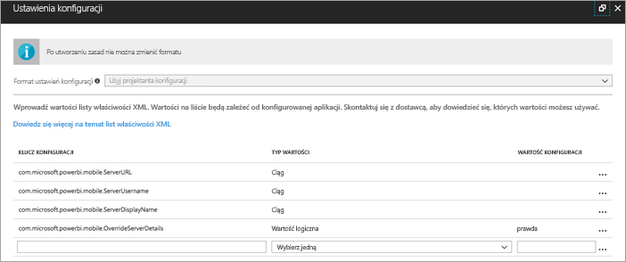
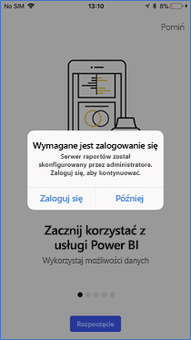
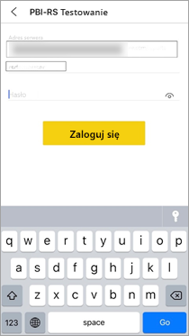

# Zdalne konfigurowanie dostępu aplikacji mobilnej Power BI dla systemu iOS do serwera raportów

W tym artykule dowiesz się, jak za pomocą narzędzia do zarządzania urządzeniami przenośnymi (MDM, Mobile Device Management) używanego organizacji skonfigurować dostęp aplikacji mobilnej Power BI dla systemu iOS do serwera raportów. Aby przeprowadzić konfigurację, administratorzy IT tworzą zasady konfiguracji aplikacji zawierające wymagane informacje, które mają być wypychane do aplikacji. 

 Następnie użytkownicy aplikacji mobilnej Power BI dla systemu iOS mogą łatwiej łączyć się z serwerem raportów organizacji, ponieważ połączenie z serwerem raportów jest już skonfigurowane. 

## Tworzenie zasad konfiguracji aplikacji w narzędziu MDM 

Jako administrator musisz wykonać następujące kroki w usłudze Microsoft Intune, aby utworzyć zasady konfiguracji aplikacji. Kroki i środowisko tworzenia zasad konfiguracji aplikacji mogą być inne w innych narzędziach MDM. 

1. Połącz się ze swoim narzędziem MDM. 
2. Utwórz nowe zasady konfiguracji aplikacji i nadaj im nazwę. 
3. Wybierz użytkowników, do których mają zostać wysłane te zasady konfiguracji aplikacji. 
4. Utwórz pary klucz-wartość. 

Pary zostały wymienione w poniższej tabeli.

|Klucz  |Typ  |Opis  |
|---------|---------|---------|
| com.microsoft.powerbi.mobile.ServerURL | String (ciąg) | Adres URL serwera raportów   Powinien zaczynać się od ciągu http/https |
| com.microsoft.powerbi.mobile.ServerUsername | String (ciąg) | [opcjonalnie]   Nazwa użytkownika do używania podczas łączenia z serwerem.   Jeśli klucz nie istnieje, aplikacja wyświetla użytkownikowi monit, aby wpisał nazwę użytkownika na potrzeby połączenia.| 
| com.microsoft.powerbi.mobile.ServerDisplayName | String (ciąg) | [opcjonalnie]   Wartość domyślna to „Serwer raportów”   Przyjazna nazwa używana w aplikacji w celu reprezentowania serwera | 
| com.microsoft.powerbi.mobile.OverrideServerDetails | Boolean (wartość logiczna) | Wartość domyślna to True   W przypadku ustawienia wartości „True” wszelkie definicje serwerów raportów znajdujące się już na urządzeniu przenośnym są zastępowane (już skonfigurowane istniejące serwery są usuwane).   Włączenie zastępowania uniemożliwia również użytkownikowi usunięcie tej konfiguracji.   Ustawienie wartości „False” powoduje dodanie wypchniętych wartości bez zmian istniejących ustawień.   Jeśli dany adres URL serwera jest już skonfigurowany w aplikacji mobilnej, aplikacja pozostawia tę konfigurację bez zmian i nie prosi użytkownika o ponowne uwierzytelnienie dla tego samego serwera. |

Oto przykład ustawienia zasad konfiguracji przy użyciu usługi Intune.

## Łączenie użytkowników końcowych z serwerem raportów

Po opublikowaniu zasad konfiguracji aplikacji użytkownicy i urządzenia na liście dystrybucyjnej zdefiniowanej dla tych zasad mają następujące środowisko po uruchomieniu aplikacji mobilnej Power BI dla systemu iOS. 

1. Widzą komunikat z informacją o tym, że aplikacja mobilna została skonfigurowana przy użyciu serwera raportów i naciskają przycisk **Zaloguj się**.

    

2.  Na stronie **Łączenie z serwerem** będą już wypełnione szczegóły serwera raportów. Naciskają przycisk **Połącz**.

    

3. Wpisują hasło, aby się uwierzytelnić, a następnie naciskają przycisk **Zaloguj się**. 

    

Teraz mogą wyświetlać i stosować wskaźniki KPI oraz raporty usługi Power BI przechowywane na serwerze raportów.

## Następne kroki
[Omówienie dla administratorów](admin-handbook-overview.md)  
[Instalacja serwera raportów usługi Power BI](install-report-server.md)  

Masz więcej pytań? [Zadaj pytanie społeczności usługi Power BI](https://community.powerbi.com/)

