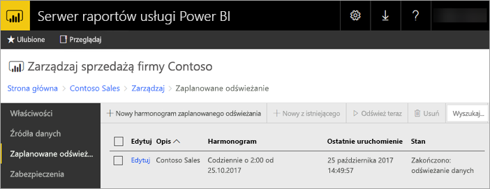
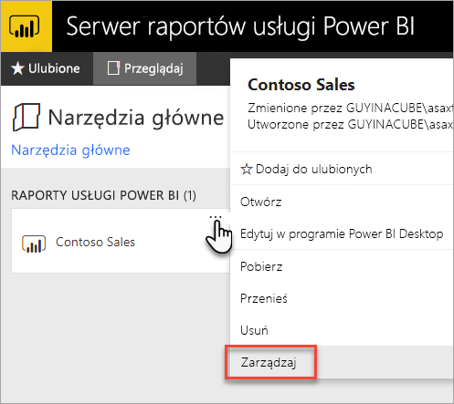
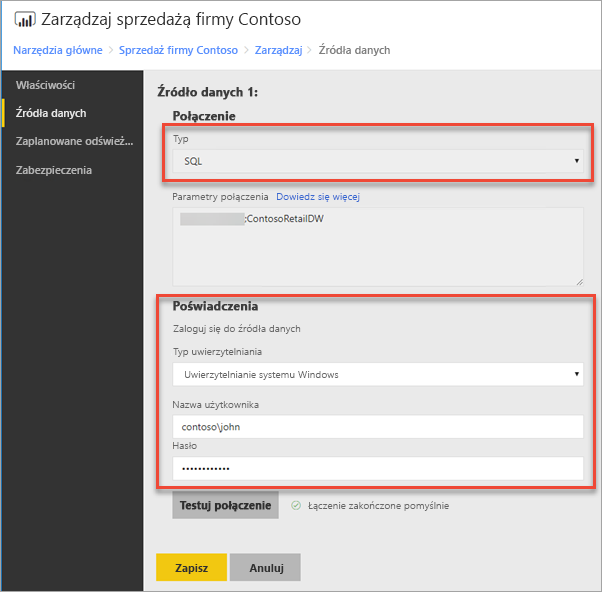
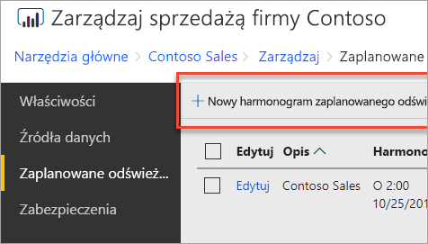
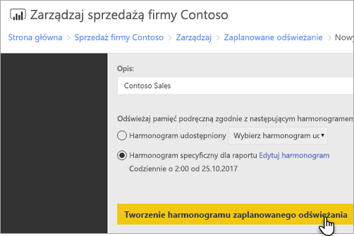
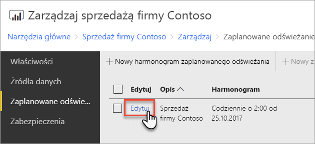
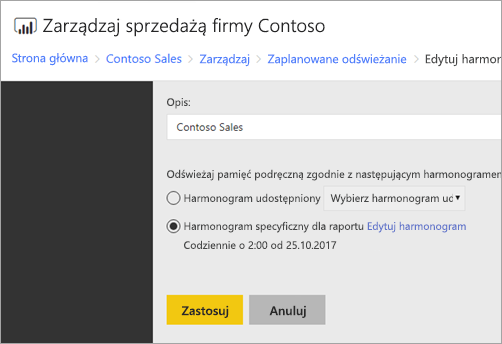

# Konfigurowanie zaplanowanego odświeżania raportu usługi Power BI
Aby odświeżyć dane w raporcie usługi Power BI, należy utworzyć harmonogram zaplanowanego odświeżania. Można to zrobić w obszarze *Zarządzanie* raportu usługi Power BI.

## Konfigurowanie poświadczeń źródła danych
Przed utworzeniem harmonogramu zaplanowanego odświeżania należy ustawić poświadczenia dla **każdego źródła danych** używanego w raporcie usługi Power BI.

1. W portalu internetowym kliknij prawym przyciskiem myszy raport usługi Power BI, a następnie wybierz pozycję **Zarządzaj**.
   
    
2. W menu po lewej stronie wybierz kartę **Źródła danych**.
3. Dla każdego wyświetlonego źródła danych wybierz typ uwierzytelniania, który ma być używany podczas nawiązywania połączenia z tym źródłem danych. Wprowadź odpowiednie poświadczenia.
   
    

## Tworzenie harmonogramu zaplanowanego odświeżania
Wykonaj następujące czynności, aby utworzyć harmonogram zaplanowanego odświeżania.

1. W portalu internetowym kliknij prawym przyciskiem myszy raport usługi Power BI, a następnie wybierz pozycję **Zarządzaj**.
   
    
2. W menu po lewej stronie wybierz kartę **Zaplanowane odświeżanie**.
3. Na stronie **Zaplanowane odświeżanie** wybierz pozycję **Nowy harmonogram zaplanowanego odświeżania**.
   
    
4. Na stronie **Nowy harmonogram zaplanowanego odświeżania** wprowadź opis i ustawienia w celu sprecyzowania terminu odświeżania modelu danych.
5. Po zakończeniu wybierz polecenie **Utwórz harmonogram zaplanowanego odświeżania**.
   
    

## Modyfikowanie harmonogramu zaplanowanego odświeżania
Modyfikowanie harmonogramu zaplanowanego odświeżania przypomina jego tworzenie.

1. W portalu internetowym kliknij prawym przyciskiem myszy raport usługi Power BI, a następnie wybierz pozycję **Zarządzaj**.
   
    
2. W menu po lewej stronie wybierz kartę **Zaplanowane odświeżanie**.
3. Na stronie **Zaplanowane odświeżanie** wybierz pozycję **Edytuj** obok harmonogramu odświeżania, którym chcesz zarządzać.
   
    
4. Na stronie **Edytowanie harmonogramu zaplanowanego odświeżania** wprowadź opis i ustawienia w celu sprecyzowania terminu odświeżania modelu danych.
5. Po zakończeniu wybierz pozycję **Zastosuj**.
   
    

## Wyświetlanie stanu harmonogramu zaplanowanego odświeżania
Wyświetl stan harmonogramu zaplanowanego odświeżania w portalu internetowym.

1. W portalu internetowym kliknij prawym przyciskiem myszy raport usługi Power BI, a następnie wybierz pozycję **Zarządzaj**.
   
    
2. W menu po lewej stronie wybierz kartę **Zaplanowane odświeżanie**.
3. Na stronie **Zaplanowane odświeżanie** kolumna po prawej stronie wyświetla stan harmonogramu.
   
   | **Stan** | **Opis** |
   | --- | --- |
   | Nowy harmonogram zaplanowanego odświeżania |Harmonogram został utworzony, ale nie uruchomiony. |
   | Odświeżanie |Rozpoczęto proces odświeżania. |
   | Przesyłanie strumieniowe modelu do programu Analysis Server |Kopiowanie modelu z bazy danych katalogu serwera raportów do hostowanego wystąpienia usług Analysis Services. |
   | Odświeżanie danych |Odświeżanie danych w modelu. |
   | Usuwanie poświadczeń z modelu |Poświadczenia używane do nawiązywania połączenia ze źródłami danych zostały usunięte z modelu. |
   | Zapisywanie modelu w katalogu |Odświeżanie danych zostało ukończone, a odświeżony model jest ponownie zapisywany w bazie danych katalogu serwera raportów. |
   | Zakończono: odświeżanie danych |Odświeżanie zostało zakończone. |
   | Błąd: |Wyświetla błąd, który wystąpił podczas odświeżania. |

Strona internetowa musi zostać odświeżona, aby wyświetlić bieżący stan. Stan nie zmieni się automatycznie.

## Następne kroki
Aby dowiedzieć się więcej o tworzeniu i modyfikowaniu harmonogramów, zobacz [Tworzenie, modyfikowanie i usuwanie harmonogramów](https://docs.microsoft.com/sql/reporting-services/subscriptions/create-modify-and-delete-schedules).

Aby uzyskać informacje na temat rozwiązywania problemów dotyczących zaplanowanego odświeżania, zobacz [Rozwiązywanie problemów z zaplanowanym odświeżaniem na Serwerze raportów usługi Power BI](scheduled-refresh-troubleshoot.md).

Masz więcej pytań? [Zadaj pytanie społeczności usługi Power BI](https://community.powerbi.com/)

