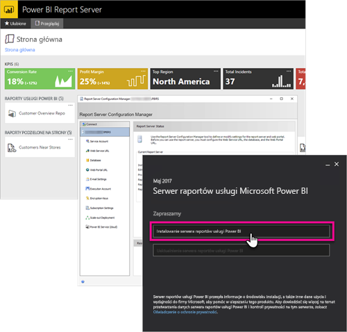

# Omówienie podręcznika dewelopera — serwer raportów usługi Power BI
Witamy w podręczniku dewelopera serwera raportów usługi Power BI, który jest lokalizacją lokalną służącą do przechowywania podzielonych na strony raportów dla urządzeń przenośnych i usługi Power BI, jak również zarządzania nimi.

W tym podręczniku wymieniono opcje dostępne dla deweloperów podczas pracy z serwerem raportów usługi Power BI.

## Osadzanie
Dowolny raport serwera raportów usługi Power BI można osadzić w elemencie iFrame, dodając parametr querystring `?rs:Embed=true` do adresu URL. Metoda ta działa w przypadku raportów usługi Power BI oraz innych typów raportów.

### Kontrolka przeglądarki raportów
W przypadku raportów wielostronicowych można korzystać z kontrolki przeglądarki raportów. Kontrolkę tę można umieścić w aplikacji .NET dla systemu Windows lub aplikacji internetowej. Aby uzyskać więcej informacji, zobacz [Wprowadzenie do kontrolki przeglądarki raportów](https://docs.microsoft.com/sql/reporting-services/application-integration/integrating-reporting-services-using-reportviewer-controls-get-started).

## Interfejsy API
Dostępnych jest kilka opcji użycia interfejsu API na potrzeby interakcji z serwerem raportów usługi Power BI. Są to następujące opcje.

* [Interfejsy API REST](rest-api.md)
* [Dostęp za pomocą adresu URL](https://docs.microsoft.com/sql/reporting-services/url-access-ssrs)
* [Dostawca WMI](https://docs.microsoft.com/sql/reporting-services/wmi-provider-library-reference/reporting-services-wmi-provider-library-reference-ssrs)

Do zarządzania serwerem raportów można również użyć [narzędzi programu PowerShell](https://github.com/Microsoft/ReportingServicesTools) typu open source.

> [!NOTE]
> Aktualnie narzędzia programu PowerShell nie obsługują plików programu Power BI Desktop (pbix).
> 
> 

## Rozszerzenia niestandardowe
Biblioteka rozszerzeń to zestaw klas, interfejsów i typów wartości, dołączonych do serwera raportów usługi Power BI. Biblioteka ta zapewnia dostęp do funkcji systemowych i stanowi podstawę, na której można tworzyć aplikacje Microsoft .NET Framework używane do rozszerzania składników serwera raportów usługi Power BI.

Można tworzyć różne typy rozszerzeń.

* Rozszerzenia przetwarzające dane
* Rozszerzenia usług dostarczania
* Rozszerzenia renderowania dla raportów wielostronicowych
* Rozszerzenia zabezpieczeń

Aby dowiedzieć się więcej, zobacz [Biblioteka rozszerzeń](https://docs.microsoft.com/sql/reporting-services/extensions/reporting-services-extension-library).

## Następne kroki
[Wprowadzenie do kontrolki przeglądarki raportów](https://docs.microsoft.com/sql/reporting-services/application-integration/integrating-reporting-services-using-reportviewer-controls-get-started)  
[Building Applications Using the Web Service and the .NET Framework (Tworzenie aplikacji przy użyciu usługi internetowej i programu .NET Framework)](https://docs.microsoft.com/sql/reporting-services/report-server-web-service/net-framework/building-applications-using-the-web-service-and-the-net-framework)  
[Dostęp za pomocą adresu URL](https://docs.microsoft.com/sql/reporting-services/url-access-ssrs)  
[Biblioteka rozszerzeń](https://docs.microsoft.com/sql/reporting-services/extensions/reporting-services-extension-library)  
[Dostawca WMI](https://docs.microsoft.com/sql/reporting-services/wmi-provider-library-reference/reporting-services-wmi-provider-library-reference-ssrs)

Masz więcej pytań? [Zadaj pytanie społeczności usługi Power BI](https://community.powerbi.com/)

