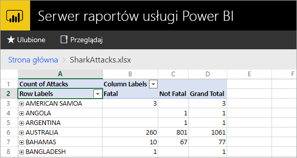
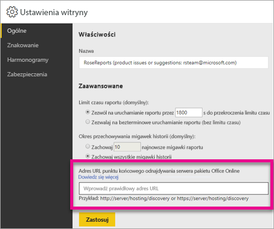

# <a name="configure-your-report-server-to-host-excel-workbooks-using-office-online-server-oos"></a>Konfigurowanie serwera raportów do hostowania skoroszytów programu Excel przy użyciu programu Office Online Server (OOS)
Oprócz wyświetlania raportów usługi Power BI w portalu internetowym, użytkownicy biznesowi mogą teraz wykonywać te same operacje ze skoroszytami programu Excel na serwerze raportów usługi Power BI, zapewniając im jedną lokalizację do publikowania i wyświetlania zawartości ich samoobsługowej analizy biznesowej firmy Microsoft.

> [!NOTE]
> To jest funkcja zapoznawcza udostępniona w wersji zapoznawczej z sierpnia 2017 roku. Aby uzyskać więcej informacji, zobacz [Co nowego w serwerze raportów usługi Power BI](whats-new.md).
> 
> 



Można to zrobić przy użyciu programu [Office Online Server](https://technet.microsoft.com/library/jj219437\(v=office.16\).aspx) (OOS).

## <a name="prepare-server-to-run-office-online-server"></a>Przygotowywanie serwera do uruchamiania programu Office Online Server
Należy wykonać następujące procedury na serwerze, na którym będzie uruchamiany program Office Online Server. Musi to być serwer z systemem Windows Server 2012 R2 lub Windows Server 2016. W przypadku systemu Windows Server 2016 jest wymagany program Office Online Server w wersji z kwietnia 2017 r. lub nowszej.

### <a name="install-prerequisite-software-for-office-online-server"></a>Instalowanie wstępnie wymaganego oprogramowania dla programu Office Online Server
1. Otwórz wiersz polecenia programu Windows PowerShell jako administrator i uruchom to polecenie, aby zainstalować wymagane role i usługi.
   
    **Windows Server 2012 R2:**
   
    ```
    Add-WindowsFeature Web-Server,Web-Mgmt-Tools,Web-Mgmt-Console,Web-WebServer,Web-Common-Http,Web-Default-Doc,Web-Static-Content,Web-Performance,Web-Stat-Compression,Web-Dyn-Compression,Web-Security,Web-Filtering,Web-Windows-Auth,Web-App-Dev,Web-Net-Ext45,Web-Asp-Net45,Web-ISAPI-Ext,Web-ISAPI-Filter,Web-Includes,InkandHandwritingServices,NET-Framework-Features,NET-Framework-Core,NET-HTTP-Activation,NET-Non-HTTP-Activ,NET-WCF-HTTP-Activation45,Windows-Identity-Foundation,Server-Media-Foundation
    ```
   
    **Windows Server 2016:**
   
    ```
    Add-WindowsFeature Web-Server,Web-Mgmt-Tools,Web-Mgmt-Console,Web-WebServer,Web-Common-Http,Web-Default-Doc,Web-Static-Content,Web-Performance,Web-Stat-Compression,Web-Dyn-Compression,Web-Security,Web-Filtering,Web-Windows-Auth,Web-App-Dev,Web-Net-Ext45,Web-Asp-Net45,Web-ISAPI-Ext,Web-ISAPI-Filter,Web-Includes,NET-Framework-Features,NET-Framework-45-Features,NET-Framework-Core,NET-Framework-45-Core,NET-HTTP-Activation,NET-Non-HTTP-Activ,NET-WCF-HTTP-Activation45,Windows-Identity-Foundation,Server-Media-Foundation
    ```
   
    Jeśli zostanie wyświetlony monit, uruchom ponownie serwer.
2. Zainstaluj następujące oprogramowanie:
   
   * [.NET Framework 4.5.2](https://go.microsoft.com/fwlink/p/?LinkId=510096)
   * [Pakiety redystrybucyjne języka Visual C++ dla programu Visual Studio 2013](https://www.microsoft.com/download/details.aspx?id=40784)
   * [Pakiet redystrybucyjny języka Visual C++ dla programu Visual Studio 2015](https://go.microsoft.com/fwlink/p/?LinkId=620071)
   * [Microsoft.IdentityModel.Extention.dll](https://go.microsoft.com/fwlink/p/?LinkId=620072)

### <a name="install-office-online-server"></a>Instalowanie programu Office Online Server
Jeśli planujesz używać funkcji programu Excel Online korzystających z dostępu do danych zewnętrznych (takich jak dodatek Power Pivot), należy pamiętać, że program Office Online Server musi znajdować się w tym samym lesie usługi Active Directory co jego użytkownicy oraz zewnętrze źródła danych, do których planujesz uzyskiwać dostęp za pomocą uwierzytelniania systemu Windows.

1. Pobierz program Office Online Server z [centrum usługi licencjonowania zbiorowego](http://go.microsoft.com/fwlink/p/?LinkId=256561). Plik do pobrania znajduje się w obszarze produktów pakietu Office w portalu centrum usługi licencjonowania zbiorowego. W celach programistycznych możesz pobrać program OOS z plików do pobrania w witrynie MSDN.
2. Uruchom program Setup.exe.
3. Na stronie **Przeczytaj postanowienia licencyjne dotyczące oprogramowania firmy Microsoft** wybierz pozycję **Akceptuję postanowienia tej umowy** i wybierz przycisk **Kontynuuj**.
4. Na stronie **Wybierz lokalizację pliku** wybierz folder, w którym mają zostać zainstalowane pliki programu Office Online Server (na przykład *C:\Program Files\Microsoft Office Web Apps*) i wybierz przycisk **Zainstaluj teraz**. Jeśli określony folder nie istnieje, zostanie utworzony przez instalator.
   
    Zalecamy zainstalowanie programu Office Online Server na dysku systemowym.
5. Po zakończeniu instalacji programu Office Online Server przez instalator wybierz przycisk **Zamknij**.

### <a name="install-language-packs-for-office-web-apps-server-optional"></a>Instalowanie pakietów językowych dla programu Office Web Apps Server (opcjonalnie)
Pakiety językowe programu Office Online Server umożliwiają użytkownikom wyświetlanie plików pakietu Office opartego Internecie w wielu językach.

Aby zainstalować pakiety językowe, wykonaj następujące kroki.

1. Pobierz pakiety językowe programu Office Online Server z [Centrum pobierania Microsoft](http://go.microsoft.com/fwlink/p/?LinkId=798136).
2. Uruchom program **wacserverlanguagepack.exe**.
3. W kreatorze pakietów językowych programu Office Online na stronie **Przeczytaj postanowienia licencyjne dotyczące oprogramowania firmy Microsoft** wybierz pozycję **Akceptuję postanowienia tej umowy** i wybierz przycisk **Kontynuuj**.
4. Po zakończeniu instalacji programu Office Online Server przez instalator wybierz przycisk **Zamknij**.

## <a name="deploy-office-online-server"></a>Wdrażanie programu Office Online Server
### <a name="create-the-office-online-server-farm-https"></a>Tworzenie farmy serwerów programu Office Online Server (HTTPS)
Użyj polecenia New-OfficeWebAppsFarm, aby utworzyć nową farmę serwerów programu Office Online Server składającą się z pojedynczego serwera, jak pokazano w poniższym przykładzie.

```
New-OfficeWebAppsFarm -InternalUrl "https://server.contoso.com" -ExternalUrl "https://wacweb01.contoso.com" -CertificateName "OfficeWebApps Certificate"
```

**Parametry**

* **–InternalURL** to w pełni kwalifikowana nazwa domeny (FQDN) serwera, na którym jest uruchamiany program Server, na przykład http://nazwaserwera.contoso.com.
* **–ExternalURL** to nazwa FQDN, która jest dostępna za pośrednictwem sieci Internet.
* **–CertificateName** to przyjazna nazwa certyfikatu.

### <a name="create-the-office-online-server-farm-http"></a>Tworzenie farmy serwerów programu Office Online Server (HTTP)
Użyj polecenia New-OfficeWebAppsFarm, aby utworzyć nową farmę serwerów programu Office Online Server składającą się z pojedynczego serwera, jak pokazano w poniższym przykładzie.

```
New-OfficeWebAppsFarm -InternalURL "http://servername" -AllowHttp
```

**Parametry**

* **–InternalURL** to nazwa serwera, na którym jest uruchamiany program Office Online Server, na przykład http://nazwaserwera.
* **–AllowHttp** konfiguruje farmę do użycia protokołu HTTP.

### <a name="verify-that-the-office-online-server-farm-was-created-successfully"></a>Sprawdzanie, czy farma programu Office Online Server została pomyślnie utworzona
Po utworzeniu farmy szczegółowe informacje na jej temat są wyświetlane w wierszu polecenia programu Windows PowerShell. Aby sprawdzić, czy program Office Online Server jest prawidłowo zainstalowany i skonfigurowany, użyj przeglądarki internetowej w celu przejścia do adresu URL odnajdywania programu Office Online Server, jak pokazano w poniższym przykładzie. Adres URL odnajdywania to parametr *InternalUrl* określony podczas konfigurowania farmy programu Office Online Server, po którym następuje ciąg */hosting/discovery*, na przykład:

```
<InternalUrl>/hosting/discovery
```

Jeśli program Office Online Server działa zgodnie z oczekiwaniami, w przeglądarce internetowej powinien zostać wyświetlony plik XML odnajdywania protokołu WOPI (Web Application Open Platform Interface). Pierwszych kilka wierszy tego pliku powinno wyglądać następująco:

```
<?xml version="1.0" encoding="utf-8" ?> 
- <wopi-discovery>
- <net-zone name="internal-http">
- <app name="Excel" favIconUrl="<InternalUrl>/x/_layouts/images/FavIcon_Excel.ico" checkLicense="true">
<action name="view" ext="ods" default="true" urlsrc="<InternalUrl>/x/_layouts/xlviewerinternal.aspx?<ui=UI_LLCC&><rs=DC_LLCC&>" /> 
<action name="view" ext="xls" default="true" urlsrc="<InternalUrl>/x/_layouts/xlviewerinternal.aspx?<ui=UI_LLCC&><rs=DC_LLCC&>" /> 
<action name="view" ext="xlsb" default="true" urlsrc="<InternalUrl>/x/_layouts/xlviewerinternal.aspx?<ui=UI_LLCC&><rs=DC_LLCC&>" /> 
<action name="view" ext="xlsm" default="true" urlsrc="<InternalUrl>/x/_layouts/xlviewerinternal.aspx?<ui=UI_LLCC&><rs=DC_LLCC&>" /> 
```

### <a name="configure-excel-workbook-maximum-size"></a>Konfigurowanie maksymalnego rozmiaru skoroszytu programu Excel
Maksymalny rozmiar pliku dla wszystkich plików na serwerze raportów usługi Power BI wynosi 100 MB. Aby zastosować to ustawienie, należy ustawić je ręcznie w programie OOS.

```
Set-OfficeWebAppsFarm -ExcelWorkbookSizeMax 100
```

## <a name="using-effectiveusername-with-analysis-services"></a>Użycie właściwości EffectiveUserName z usługami Analysis Services
Aby zezwolić na połączenia na żywo z usługami Analysis Services w przypadku połączeń w skoroszycie programu Excel, które korzystają z właściwości EffectiveUserName. Aby można było użyć właściwości EffectiveUserName w programie OOS, należy dodać konto komputera serwera programu OOS jako administratora dla tego wystąpienia usług Analysis Services. W tym celu potrzebny jest program Management Studio for SQL Server 2016 lub nowszy.

Obecnie w skoroszycie programu Excel są obsługiwane tylko osadzone połączenia usług Analysis Services. Konto użytkownika musi mieć uprawnienie do nawiązywania połączeń z usługami Analysis Services, ponieważ możliwość użycia serwera proxy przez użytkownika nie jest dostępna.

Uruchom następujące polecenia programu PowerShell na serwerze programu OOS.

```
Set-OfficeWebAppsFarm -ExcelUseEffectiveUserName:$true
Set-OfficeWebAppsFarm -ExcelAllowExternalData:$true
Set-OfficeWebAppsFarm -ExcelWarnOnDataRefresh:$false
```

## <a name="configure-a-power-pivot-instance-for-data-models"></a>Konfigurowanie wystąpienia dodatku Power Pivot dla modeli danych
Instalacja wystąpienia trybu dodatku Power Pivot w usługach Analysis Services umożliwia pracę ze skoroszytami programu Excel, które korzystają z dodatku Power Pivot. Należy upewnić się, że nazwa wystąpienia to *POWERPIVOT*. Dodaj konto serwera programu OOS jako administrator dla wystąpienia trybu dodatku Power Pivot w usługach Analysis Services. W tym celu potrzebny jest program Management Studio for SQL Server 2016 lub nowszy.

Aby program OOS mógł używać wystąpienia trybu dodatku Power Pivot, uruchom następujące polecenie.

```
New-OfficeWebAppsExcelBIServer -ServerId <server_name>\POWERPIVOT
```

Jeśli nie zezwolono jeszcze na użycie danych zewnętrznych, w powyższym kroku dotyczącym usług Analysis Services należy uruchomić następujące polecenie.

```
Set-OfficeWebAppsFarm -ExcelAllowExternalData:$true
```

### <a name="firewall-considerations"></a>Istotne zagadnienia dotyczące zapory
Aby uniknąć problemów z zaporą, należy otworzyć porty 2382 i 2383. Można również dodać program *msmdsrv.exe* dla wystąpienia dodatku Power Pivot jako zasady zapory aplikacji.

## <a name="configure-power-bi-report-server-to-use-the-oos-server"></a>Konfigurowanie serwera raportów usługi Power BI do użycia serwera programu OOS
Na stronie **Ogólne** w obszarze **Ustawienia lokacji** wprowadź adres URL odnajdywania programu OOS. Adres URL odnajdywania programu OOS odpowiada parametrowi *InternalUrl* użytemu podczas wdrażania serwera programu OOS, po którym następuje ciąg */hosting/discovery*. Na przykład `http://servername/hosting/discovery` w przypadku protokołu HTTP. `https://server.contoso.com/hosting/discovery` w przypadku protokołu HTTPS.

Aby przejść do obszaru **Ustawienia lokacji**, wybierz **ikonę koła zębatego** w prawym górnym rogu i wybierz pozycję **Ustawienia lokacji**.

Ustawienia adresu URL odnajdywania programu Office Online Server będą widoczne tylko dla użytkownika o roli **Administrator systemu**.



Po wprowadzeniu adresu URL odnajdywania i wybraniu przycisku **Zastosuj** wybranie skoroszytu programu Excel w portalu internetowym powinno spowodować wyświetlenie skoroszytu w portalu internetowym.

## <a name="limitations-and-considerations"></a>Ograniczenia i istotne zagadnienia
* Możliwość wyświetlania skoroszytów programu Excel na serwerze raportów usługi Power BI jest obecnie w wersji zapoznawczej.
* Możliwe jest jedynie odczytywanie skoroszytów.

## <a name="next-steps"></a>Następne kroki
[Administrator handbook](admin-handbook-overview.md) (Podręcznik administratora)  
[Szybki start: instalowanie serwera raportów usługi Power BI](quickstart-install-report-server.md)  
[Instalowanie programu Report Builder](https://docs.microsoft.com/sql/reporting-services/install-windows/install-report-builder)  
[Pobieranie narzędzi SQL Server Data Tools (SSDT)](http://go.microsoft.com/fwlink/?LinkID=616714)

Masz więcej pytań? [Zadaj pytanie społeczności usługi Power BI](https://community.powerbi.com/)

