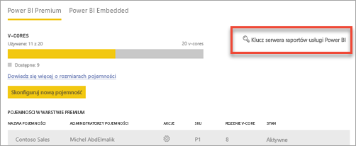

# Jak znaleźć klucz produktu serwera raportów
Dowiedz się, jak znaleźć klucz produktu serwera raportów usługi Power BI, aby zainstalować serwer w środowisku produkcyjnym.

<iframe width="640" height="360" src="https://www.youtube.com/embed/6CQnf-NGtpU?rel=0&amp;showinfo=0" frameborder="0" allowfullscreen></iframe>

Masz pobrany serwer raportów usługi Power BI i umowę SQL Server Enterprise Software Assurance. Lub masz zakupioną usługę Power BI Premium. Chcesz zainstalować serwer w środowisku produkcyjnym, ale potrzebujesz klucza produktu, aby to zrobić. Gdzie jest klucz produktu? 

Klucz produktu jest w jednym z dwóch miejsc, w zależności od tego, co zostało zakupione.

## Zakupiona usługa Power BI Premium
Jeśli zakupiono usługę Power BI Premium, na karcie **Ustawienia pojemności** w portalu administracyjnym usługi Power BI będzie dostępny klucz produktu serwera raportów usługi Power BI. Jest on dostępny tylko dla administratorów globalnych lub użytkowników z przypisaną rolą administratora usługi Power BI.

Wybranie pozycji **Klucz serwera raportów usługi Power BI** spowoduje wyświetlenie okna dialogowego z Twoim kluczem produktu. Możesz skopiować go i użyć podczas instalacji.

## Zakupiona umowa Software Assurance
Jeśli masz licencję programu SQL Server Enterprise z programem SA, możesz uzyskać kod produktu w witrynie [Volume Licensing Service Center](https://www.microsoft.com/Licensing/servicecenter/). Sprawdź w obszarze najnowszego dodatku service pack, aby uzyskać najnowszą wersję programu SQL Server. Jeśli nie widzisz jej tam, sprawdź w obszarze wydania RTM najnowszej wersji programu SQL Server.

> [!NOTE]
> Musisz szukać w sekcji pobierania. Nie w sekcji kluczy.
> 
> 

## Następne kroki
[Instalacja serwera raportów usługi Power BI](install-report-server.md)  
[Instalowanie programu Power BI Desktop zoptymalizowanego pod kątem serwera raportów usługi Power BI](install-powerbi-desktop.md)  
[Pobieranie programu Report Builder](https://www.microsoft.com/download/details.aspx?id=53613)  
[Pobieranie programu SQL Server Data Tools (SSDT)](http://go.microsoft.com/fwlink/?LinkID=616714)

Masz więcej pytań? [Zadaj pytanie społeczności usługi Power BI](https://community.powerbi.com/)

