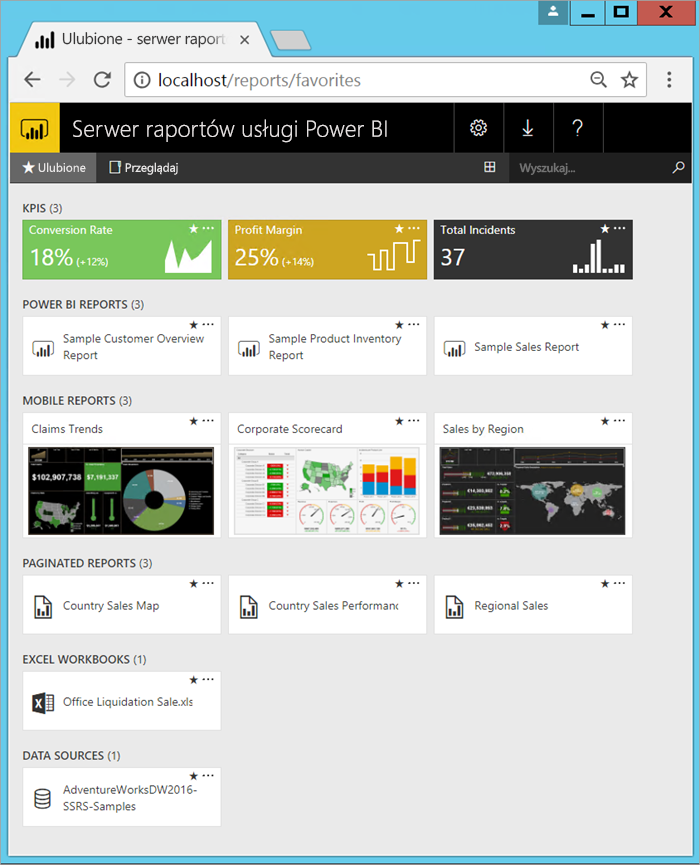

# Co to jest serwer raportów usługi Power BI?

Serwer raportów usługi Power BI to lokalny serwer raportów z portalem internetowym, w którym można wyświetlać raporty i wskaźnikami KPI oraz zarządzać nimi. Udostępnia on narzędzia do tworzenia raportów, raportów wielostronicowych, raportów dla urządzeń przenośnych i wskaźników KPI usługi Power BI. Użytkownicy mają dostęp do tych raportów na różne sposoby: mogą wyświetlić je w przeglądarce internetowej, na urządzeniu przenośnym lub jako wiadomości e-mail w skrzynce odbiorczej.

## Porównanie serwera raportów usługi Power BI 
Serwer raportów usługi Power BI jest podobny do usługi SQL Server Reporting Services i usługi Power BI w trybie online, ale na różne sposoby. Tak jak usługa Power BI, serwer raportów usługi Power BI hostuje raporty usługi Power BI (PBIX) i pliki programu Excel. Podobnie jak usługi Reporting Services, serwer raportów usługi Power BI działa lokalnie i hostuje raporty podzielone na strony (RDL). Serwer raportów usługi Power BI jest nadzbiorem usług Reporting Services: wszystko, co można zrobić w usługach Reporting Services, można zrobić z serwerem raportów usługi Power BI — a nawet więcej, dzięki dodaniu obsługi raportów usługi Power BI. Szczegółowe informacje można znaleźć w temacie [Porównanie serwera raportów usługi Power BI i usługi Power BI](compare-report-server-service.md).

## Licencjonowanie serwera raportów usługi Power BI
Serwer raportów usługi Power BI jest dostępny za pośrednictwem dwóch różnych licencji: [usługi Power BI Premium](../service-premium.md) i [programu SQL Server Enterprise Edition](https://www.microsoft.com/sql-server/sql-server-2017-editions) z pakietem Software Assurance. Licencja usługi Power BI Premium umożliwia tworzenie hybrydowego wdrożenia łączącego chmurę i środowisko lokalne.  

## Portal internetowy
Punkt wejścia serwera raportów usługi Power BI to bezpieczny portal internetowy, który można wyświetlić w dowolnej nowoczesnej przeglądarce. W tym miejscu można uzyskać dostęp do wszystkich swoich raportów i wskaźników KPI. Zawartość portalu internetowego jest zorganizowana przy użyciu tradycyjnej hierarchii folderów. Zawartość folderów jest zorganizowana według typu: raporty usługi Power BI, raporty dla urządzeń przenośnych, raporty z podziałem na strony i kluczowe wskaźniki wydajności oraz skoroszyty programu Excel, a także udostępnione zestawy danych i udostępnione źródła danych służące jako bloki konstrukcyjne raportów. Można otagować ulubione elementy, aby wyświetlić je w jednym folderze. W portalu internetowym można również tworzyć kluczowe wskaźniki wydajności. 

W zależności od uprawnień można zarządzać zawartością w portalu internetowym. Można planować przetwarzanie raportów, uzyskiwać dostęp do raportów na żądanie i subskrybować opublikowane raporty. Można także zastosować własne, niestandardowe [znakowanie](https://docs.microsoft.com/sql/reporting-services/branding-the-web-portal) w portalu internetowym. 

Więcej informacji o [portalu internetowym serwera raportów usługi Power BI](https://docs.microsoft.com/sql/reporting-services/web-portal-ssrs-native-mode).

## Raporty usługi Power BI
Można tworzyć raporty usługi Power BI (PBIX) przy użyciu wersji programu Power BI Desktop zoptymalizowanej pod kątem serwera raportów. Następnie można je opublikować i wyświetlić w portalu internetowym we własnym środowisku.

Raport usługi Power BI to widok modelu danych z wielu perspektyw z wizualizacjami przedstawiającymi różne wyniki i szczegółowe informacje wynikające z tego modelu danych.  Raport może zawierać jedną wizualizację lub kilka stron wypełnionych wizualizacjami. W zależności od roli użytkownika można odczytywać i poznawać raporty lub utworzyć je dla innych użytkowników.

Instalowanie [programu Power BI Desktop zoptymalizowanego pod kątem serwera raportów usługi Power BI](quickstart-create-powerbi-report.md).

## Raporty z podziałem na strony
Raporty podzielone na strony (RDL) to raporty przypominające dokumenty z wizualizacjami, w których tabele rozwijają się w poziomie i w pionie w celu wyświetlenia wszystkich danych. Raporty te są kontynuowane na kolejnych stronach zgodnie z potrzebami. To doskonałe rozwiązanie do tworzenia dokumentów o stałym układzie z idealnie rozmieszczoną treścią, zoptymalizowanych pod kątem wydruku, takich jak pliki PDF i pliki programu Word.

Raporty o nowoczesnym wyglądzie można tworzyć przy użyciu programów [Report Builder](https://docs.microsoft.com/sql/reporting-services/report-builder/report-builder-in-sql-server-2016) i Report Designer w narzędziach [SQL Server Data Tools (SSDT)](https://docs.microsoft.com/sql/reporting-services/tools/reporting-services-in-sql-server-data-tools-ssdt).

## Raporty usług Reporting Services dla urządzeń przenośnych
Raporty dla urządzeń przenośnych łączą się z danymi lokalnymi i mają dynamiczny układ, który dostosowuje się do różnych urządzeń i sposobów ich trzymania. Można je utworzyć za pomocą programu Microsoft SQL Server Mobile Report Publisher.

Więcej informacji o [raportach usług Reporting Services dla urządzeń przenośnych](https://docs.microsoft.com/sql/reporting-services/mobile-reports/create-mobile-reports-with-sql-server-mobile-report-publisher). 

## Funkcje programowania serwera raportów
Korzystaj z zalet funkcji programowania serwera raportów usługi Power BI, aby rozszerzać i dostosowywać funkcje raportowania dzięki interfejsom API do integracji i rozszerzania możliwości przetwarzania danych i raportów w aplikacjach niestandardowych.

Więcej [dokumentacji dla deweloperów serwera raportów](https://docs.microsoft.com/sql/reporting-services/reporting-services-developer-documentation).

## Następne kroki
[Instalacja serwera raportów usługi Power BI](install-report-server.md)  
[Instalowanie programu Report Builder](https://docs.microsoft.com/sql/reporting-services/install-windows/install-report-builder)  

Masz więcej pytań? [Zadaj pytanie społeczności usługi Power BI](https://community.powerbi.com/)

