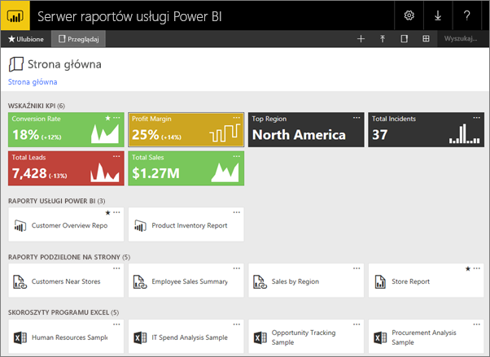
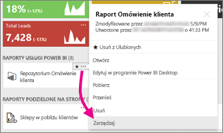
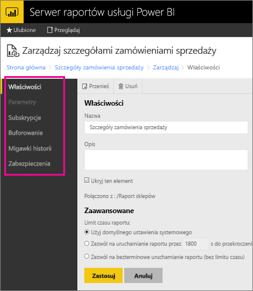

# Zarządzanie zawartością w portalu internetowym 
Portal internetowy Serwera raportów usługi Power BI jest lokalizacją lokalną służącą do wyświetlania raportów usługi Power BI, raportów dla urządzeń przenośnych i raportów podzielonych na strony oraz kluczowych wskaźników wydajności, jak również ich przechowywania i zarządzania nimi.

Portal internetowy można wyświetlić w dowolnej nowoczesnej przeglądarce. W portalu internetowym raporty i kluczowe wskaźniki wydajności są zorganizowane w folderach i można oznaczać je jako ulubione. W tym miejscu można również przechowywać skoroszyty programu Excel. Z poziomu portalu internetowego można uruchamiać narzędzia niezbędne do tworzenia raportów:

* **Raporty usługi Power BI** utworzone przy użyciu programu Power BI Desktop: można je wyświetlać w portalu internetowym oraz w aplikacjach mobilnych usługi Power BI.
* **Raporty z podziałem na strony** utworzone w programie Report Builder: dokumenty o stałym układzie i nowoczesnym wyglądzie, zoptymalizowane pod kątem drukowania.
* **Kluczowe wskaźniki wydajności** utworzone bezpośrednio w portalu internetowym.

W portalu internetowym można przeglądać foldery na serwerze raportów lub wyszukiwać konkretne raporty. Można wyświetlić raport, jego właściwości ogólne oraz wcześniejsze kopie raportu, które zostały przechwycone w historii raportu. Zależnie od uprawnień może być dostępna opcja subskrybowania raportów w celu ich dostarczania do skrzynki odbiorczej poczty e-mail lub folderu udostępnianego w systemie plików.

## Role i uprawnienia w portalu internetowym
Aplikacja portalu internetowego jest uruchamiana w przeglądarce. Po uruchomieniu portalu internetowego wyświetlane strony, linki i opcje różnią się zależnie od Twoich uprawnień na serwerze raportów. Jeśli masz przypisaną rolę o pełnych uprawnieniach, masz dostęp do kompletnego zestawu menu i stron aplikacji do zarządzania serwerem raportów. Jeśli masz przypisaną rolę z uprawnieniami do wyświetlania i uruchamiania raportów, są wyświetlane tylko menu i strony niezbędne do wykonywania tych działań. Można mieć przypisane inne role na poszczególnych serwerach raportów, a nawet w przypadku różnych raportów i folderów na jednym serwerze raportów.

## Uruchamianie portalu internetowego
1. Otwórz przeglądarkę internetową.
   
    Zapoznaj się z listą [obsługiwanych przeglądarek internetowych i ich wersji](browser-support.md).
2. Na pasku adresu wpisz adres URL portalu internetowego.
   
    Domyślny adres URL to *http://[NazwaKomputera]/reports*.
   
    Serwer raportów może być skonfigurowany do używania konkretnego portu. Na przykład *http://[NazwaKomputera]:80/reports* lub *http://[NazwaKomputera]:8080/reports*
   
    Zauważ, że portal internetowy grupuje elementy w następujących kategoriach:
   
   * Kluczowe wskaźniki wydajności
   * Raporty dla urządzeń przenośnych
   * Raporty z podziałem na strony
   * Raporty programu Power BI Desktop
   * Skoroszyty programu Excel
   * Zestawy danych
   * Źródła danych
   * Zasoby

## Zarządzanie elementami w portalu internetowym
Serwer raportów usługi Power BI umożliwia szczegółową kontrolę nad elementami, które są przechowywane w portalu internetowym. Na przykład można skonfigurować subskrypcje, buforowanie, migawki i zabezpieczenia dla poszczególnych raportów z podziałem na strony.

1. Wybierz przycisk wielokropka (...) w prawym górnym rogu elementu i wybierz polecenie **Zarządzaj**.
   
    
2. Wybierz właściwość lub inną funkcję, którą chcesz ustawić.
   
    
3. Wybierz pozycję **Zastosuj**.

Dowiedz się więcej o [pracy z subskrypcjami w portalu internetowym](https://docs.microsoft.com/sql/reporting-services/working-with-subscriptions-web-portal).

## Następne kroki
[Co to jest serwer raportów usługi Power BI?](get-started.md)

Masz więcej pytań? [Zadaj pytanie społeczności usługi Power BI](https://community.powerbi.com/)

