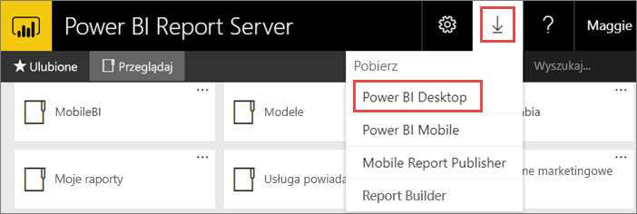

# Instalowanie programu Power BI Desktop zoptymalizowanego pod kątem serwera raportów usługi Power BI
Dowiedz się, jak zainstalować program Power BI Desktop zoptymalizowany pod kątem serwera raportów usługi Power BI.

Aby utworzyć raporty usługi Power BI dla serwera raportów usługi Power BI, musisz pobrać i zainstalować program Power BI Desktop zoptymalizowany pod kątem serwera raportów usługi Power BI. Ta wersja jest inna niż wersja programu Power BI Desktop używana z usługą Power BI. Na przykład wersja programu Power BI Desktop dla usługi Power BI zawiera funkcje wersji zapoznawczej, które nie są dostępne na serwerze raportów usługi Power BI przed ich premierą. Użycie tej wersji zapewnia, że serwer raportów może współdziałać ze znaną wersją raportów i modelu. 

Dobra wiadomość jest taka, że programy Power BI Desktop i Power BI Desktop zoptymalizowany pod kątem serwera raportów usługi Power BI można zainstalować obok siebie na tym samym komputerze.

## Pobieranie i instalowanie programu Power BI Desktop

Najprostszym sposobem sprawdzenia, czy masz najnowszą wersję programu Power BI Desktop zoptymalizowaną pod kątem serwera raportów usługi Power BI jest uruchomienie go z portalu internetowego serwera raportów.

1. W portalu internetowym serwera raportów wybierz strzałkę **Pobierz** > **Power BI Desktop**.

    

    Możesz też przejść bezpośrednio do programu [Microsoft Power BI Desktop](https://www.microsoft.com/download/details.aspx?id=56723) (zoptymalizowanego pod kątem serwera raportów usługi Power BI — marzec 2018) w Centrum pobierania Microsoft.

2. Na stronie Centrum pobierania wybierz pozycję **Pobierz**.

3. W zależności od komputera wybierz: 

    - **PBIDesktopRS.msi** (wersja 32-bitowa) lub

    - **PBIDesktopRS_x64.msi** (wersja 64-bitowa).

1. Po pobraniu instalatora uruchom kreatora instalacji programu Power BI Desktop (październik 2017).
2. Na koniec instalacji zaznacz pozycję **Uruchom program Power BI Desktop teraz**.
   
    Program zostanie uruchomiony automatycznie i będzie można rozpocząć pracę.

## Sprawdzanie, czy jest używana właściwa wersja
Możesz sprawdzić, czy używasz właściwej wersji programu Power BI Desktop, spoglądając na ekran powitalny lub pasek tytułu tego programu. Na pasku tytułu są podane miesiąc i rok wydania.

Na pasku tytułu wersji programu Power BI Desktop związanej z usługą Power BI nie ma miesiąca ani roku.

## Skojarzenie rozszerzenia nazwy pliku
Jeśli na tym samym komputerze zainstalowano zarówno program Power BI Desktop, jak i program Power BI Desktop zoptymalizowany pod kątem serwera raportów usługi Power BI, ostatnia z tych instalacji będzie skojarzona z plikami pbix. Oznacza to, że kliknięcie dwukrotne pliku pbix spowoduje uruchomienie programu Power BI Desktop, który zainstalowano jako ostatni.

Jeśli na komputerze z już istniejącym programem Power BI Desktop zainstalowano program Power BI Desktop zoptymalizowany pod kątem serwera raportów usługi Power BI, wszystkie pliki pbix będą domyślnie otwierane w programie Power BI Desktop zoptymalizowanym pod kątem serwera raportów usługi Power BI. Jeśli więc pliki pbix powinny być domyślnie otwierane w programie Power BI Desktop, ponownie zainstaluj program Power BI Desktop z usługi Power BI.

Zawsze możesz najpierw otworzyć wersję programu Power BI Desktop, której chcesz używać. Następnie możesz za pomocą tego programu Power BI Desktop otworzyć właściwy plik.

Edytowanie raportu usługi Power BI z poziomu serwera raportów usługi Power BI lub utworzenie nowego raportu usługi Power BI z poziomu portalu internetowego zawsze spowoduje otwarcie właściwej wersji programu Power BI Desktop.

## Istotne zagadnienia i ograniczenia
Raporty na serwerze raportów usługi Power BI oraz w usłudze Power BI (http://powerbi.com) działają prawie dokładnie tak samo, ale różnią się pod względem kilku funkcji.

### W przeglądarce
W raportach na serwerze raportów usługi Power BI obsługiwane są wszystkie wizualizacje, w tym:

* Wizualizacje niestandardowe

W raportach na serwerze raportów usługi Power BI nie są obsługiwane:

* Wizualizacje języka R
* Mapy ArcGIS
* Linki do stron nadrzędnych
* Funkcje programu Power BI Desktop w wersji zapoznawczej

### W aplikacjach mobilnych Power BI
W raportach na serwerze raportów usługi Power BI obsługiwane są wszystkie funkcje podstawowe w [aplikacjach mobilnych Power BI](../mobile-apps-for-mobile-devices.md), w tym:

* [Układ raportu na telefonie](../desktop-create-phone-report.md): można zoptymalizować raport dla aplikacji mobilnych Power BI. Na telefonie komórkowym zoptymalizowane raporty mają specjalną ikonę, , i układ.
  
    

Następujące funkcje w aplikacjach mobilnych Power BI nie są obsługiwane w raportach na serwerze raportów usługi Power BI:

* Wizualizacje języka R
* Mapy ArcGIS
* Wizualizacje niestandardowe
* Linki do stron nadrzędnych
* Filtrowanie geograficzne ani kody kreskowe

## Program Power BI Desktop dla wcześniejszych wersji serwera raportów usługi Power BI

Jeśli serwer raportów jest we wcześniejszej wersji, potrzebujesz odpowiedniej wersji programu Power BI Desktop. Oto dwie poprzednie wersje.

- Microsoft Power BI Desktop ([zoptymalizowany do pracy z serwerem raportów usługi Power BI — wersja z października 2017](https://www.microsoft.com/download/details.aspx?id=56136))
- Microsoft Power BI Desktop ([zoptymalizowany do pracy z serwerem raportów usługi Power BI — wersja z czerwca 2017](https://www.microsoft.com/download/details.aspx?id=55330))

## Następne kroki
Program Power BI Desktop został już zainstalowany, więc możesz przystąpić do tworzenia raportów usługi Power BI.

[Tworzenie raportu usługi Power BI dla serwera raportów usługi Power BI](quickstart-create-powerbi-report.md)  
[Co to jest serwer raportów usługi Power BI?](get-started.md)

Masz więcej pytań? [Zadaj pytanie społeczności usługi Power BI](https://community.powerbi.com/)

