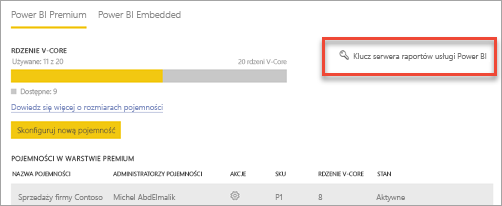
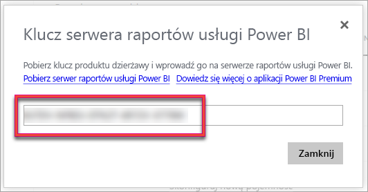
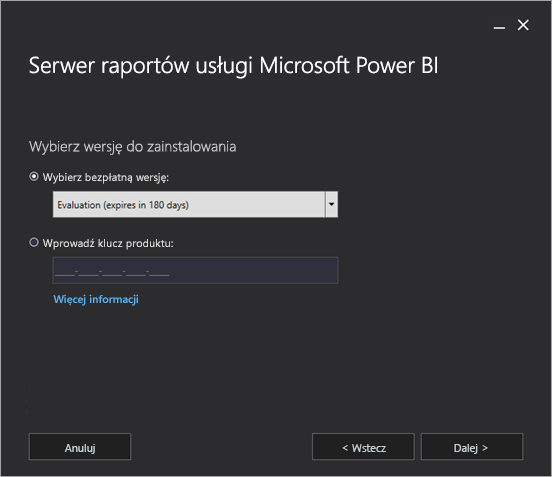
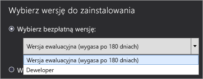
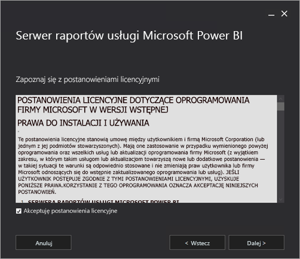
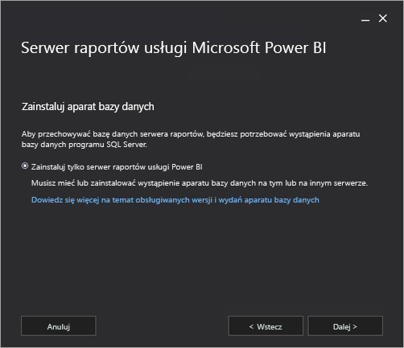
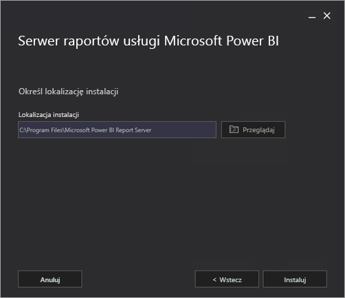
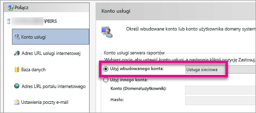
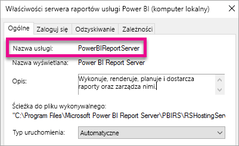

# Instalowanie serwera raportów usługi Power BI

Dowiedz się, jak zainstalować serwer raportów usługi Power BI.

 **Pobieranie** 

Aby pobrać serwer raportów usługi Power BI, przejdź do tematu [Raportowanie lokalne przy użyciu serwera raportów usługi Power BI](https://powerbi.microsoft.com/report-server/). 

Przejdź do Centrum pobierania firmy Microsoft, aby pobrać program [Microsoft Power BI Desktop](https://go.microsoft.com/fwlink/?linkid=861076) (zoptymalizowany dla serwera raportów usługi Power BI — październik 2017).

 Aby uzyskać bieżące informacje o wersji, zobacz [Informacje o wersji serwera raportów usługi Power BI](release-notes.md).

<iframe width="640" height="360" src="https://www.youtube.com/embed/zacaEb9A4F0?showinfo=0" frameborder="0" allowfullscreen></iframe>

## Zanim rozpoczniesz
Przed zainstalowaniem serwera raportów usługi Power BI zalecane jest przejrzenie tematu [Wymagania sprzętowe i programowe dotyczące instalowania serwera raportów usługi Power BI](system-requirements.md).

### Klucz produktu serwera raportów usługi Power BI
#### Power BI Premium
Jeśli zakupiono usługę Power BI Premium, na karcie **Ustawienia wersji Premium** w portalu administracyjnym usługi Power BI będzie dostępny klucz produktu serwera raportów usługi Power BI. Jest on dostępny tylko dla administratorów globalnych lub użytkowników z przypisaną rolą administratora usługi Power BI.

Wybranie pozycji **Klucz serwera raportów usługi Power BI** spowoduje wyświetlenie okna dialogowego z Twoim kluczem produktu. Możesz skopiować go i użyć podczas instalacji.

#### SQL Server Enterprise Software Assurance (SA)
Jeśli masz licencję programu SQL Server Enterprise z programem SA, możesz uzyskać kod produktu w witrynie [Volume Licensing Service Center](https://www.microsoft.com/Licensing/servicecenter/).

## Instalowanie serwera raportów
Instalowanie serwera raportów usługi Power BI jest bardzo proste. Instalacja plików wymaga wykonania zaledwie kilku kroków.

> [!NOTE]
> Aparat bazy danych programu SQL Server nie musi być dostępny podczas instalacji. Będzie on potrzebny do skonfigurowania usług Reporting Services po instalacji.
> 
> 

1. Znajdź lokalizację pliku PowerBIReportServer.exe i uruchom instalator.
2. Wybierz polecenie **Zainstaluj serwer raportów usługi Power BI**.
   
    
3. Wybierz wersję do zainstalowania i wybierz przycisk **Dalej**.
   
    
   
    Z listy rozwijanej możesz wybrać wersję Evaluation lub Developer.
   
    
   
    Możesz również wprowadzić klucz produktu serwera uzyskany z usługi Power BI lub witryny Volume License Service Center. Więcej informacji na temat uzyskiwania klucza produktu zawiera sekcja [Zanim rozpoczniesz](#before-you-begin).
4. Przeczytaj i zgódź się na warunki i postanowienia licencyjne, a następnie wybierz przycisk **Dalej**.
   
    
5. Aparat bazy danych musi być dostępny, aby można było przechowywać bazę danych serwera raportów. Wybierz przycisk **Dalej**, aby zainstalować tylko serwer raportów.
   
    
6. Określ lokalizację instalacji serwera raportów. Wybierz opcję **Zainstaluj**, aby kontynuować.
   
    
   
   > [!NOTE]
   > Domyślna ścieżka to C:\Program Files\Microsoft Power BI Report Server.
   > 
   > 
7. Po pomyślnej instalacji możesz wybrać opcję **Skonfiguruj serwer raportów**, aby uruchomić Menedżera konfiguracji usług Reporting Services.
   
    

## Konfigurowanie serwera raportów
Po wybraniu opcji **Konfiguruj serwer raportów** w instalatorze zostanie wyświetlony Menedżer konfiguracji usług Reporting Services. Więcej informacji zawiera temat [Menedżer konfiguracji usług Reporting Services](https://docs.microsoft.com/sql/reporting-services/install-windows/reporting-services-configuration-manager-native-mode).

Należy [utworzyć bazę danych serwera raportów](https://docs.microsoft.com/sql/reporting-services/install-windows/ssrs-report-server-create-a-report-server-database) w celu ukończenia wstępnej konfiguracji usług Reporting Services. Do ukończenia tego kroku jest wymagana baza danych programu SQL Server.

### Tworzenie bazy danych na innym serwerze
Jeśli tworzysz bazę danych serwera raportów na serwerze bazy danych na innym komputerze, należy zmienić konto usługi dla serwera raportów na poświadczenia rozpoznawane na serwerze bazy danych. 

Domyślnie serwer raportów używa wirtualnego konta usługi. Jeśli próbujesz utworzyć bazę danych na innym serwerze, może zostać wyświetlony następujący błąd w kroku Stosowanie uprawnień połączenia.

`System.Data.SqlClient.SqlException (0x80131904): Windows NT user or group '(null)' not found. Check the name again.`

Aby obejść ten błąd, można zmienić konto usługi na konto usługi sieciowej lub domeny. Zmiana konta usługi na konto usługi sieciowej powoduje zastosowanie uprawnień w kontekście konta komputera serwera raportów.

Aby uzyskać więcej informacji, zobacz [Konfigurowanie konta usługi serwera raportów](https://docs.microsoft.com/sql/reporting-services/install-windows/configure-the-report-server-service-account-ssrs-configuration-manager).

## Usługa systemu Windows
Usługa systemu Windows jest tworzona jako część instalacji. Jest wyświetlana jako **Serwer raportów usługi Power BI**. Nazwa usługi to **PowerBIReportServer**.

## Rezerwacje domyślnego adresu URL
Rezerwacje adresu URL składają się z prefiksu, nazwy hosta, portu i katalogu wirtualnego:

| Część | Opis |
| --- | --- |
| Prefiks |Domyślny prefiks to HTTP. Jeśli wcześniej zainstalowano certyfikat protokołu SSL (Secure Sockets Layer), Instalator podejmuje próbę utworzenia rezerwacji adresów URL, które używają prefiksu HTTPS. |
| Nazwa hosta |Domyślna nazwa hosta to silny symbol wieloznaczny (+). Określa, czy serwer raportów akceptuje wszystkie żądania HTTP na wyznaczonym porcie dla dowolnej nazwy hosta, która jest rozpoznawana jako komputer, w tym `http://<computername>/reportserver`, `http://localhost/reportserver` lub `http://<IPAddress>/reportserver.`. |
| Port |Domyślny port to 80. Jeśli używasz innego portu niż 80, musisz jawnie dodać go do adresu URL podczas otwierania portalu internetowego w oknie przeglądarki. |
| Katalog wirtualny |Domyślnie katalogi wirtualne są tworzone w formacie ReportServer dla usługi internetowej serwera raportów oraz Reports dla portalu internetowego. Dla usługi internetowej serwera raportów domyślny katalog wirtualny to **reportserver**. Dla portalu internetowego domyślny katalog wirtualny to **reports**. |

Przykładowy pełny ciąg adresu URL może być następujący:

* `http://+:80/reportserver`, zapewnia dostęp do serwera raportów.
* `http://+:80/reports`, zapewnia dostęp do portalu internetowego.

## Zapora
Jeśli uzyskujesz dostęp do serwera raportów z komputera zdalnego, upewnij się, że skonfigurowano odpowiednie reguły zapory w przypadku obecności zapory.

Musisz otworzyć port TCP, który skonfigurowano dla adresu URL usługi internetowej i adresu URL portalu internetowego. Domyślnie są one skonfigurowane na porcie TCP 80.

## Dodatkowa konfiguracja
* Aby skonfigurować integrację z usługą Power BI w celu raportowania elementów do pulpitu nawigacyjnego usługi Power BI, zobacz temat [Integracja z usługą Power BI](https://docs.microsoft.com/sql/reporting-services/install-windows/power-bi-report-server-integration-configuration-manager).
* Aby skonfigurować wiadomości e-mail dla przetwarzania subskrypcji, zobacz [Ustawienia poczty e-mail](https://docs.microsoft.com/sql/reporting-services/install-windows/e-mail-settings-reporting-services-native-mode-configuration-manager) i [Dostarczanie wiadomości e-mail na serwerze raportów](https://docs.microsoft.com/sql/reporting-services/subscriptions/e-mail-delivery-in-reporting-services).
* W celu skonfigurowania portalu internetowego, aby móc uzyskiwać do niego dostęp na komputerze do raportów i wyświetlać raporty oraz zarządzać nimi, zobacz [Konfigurowanie zapory w celu uzyskiwania dostępu do serwera raportów](https://docs.microsoft.com/sql/reporting-services/report-server/configure-a-firewall-for-report-server-access) oraz [Konfigurowanie serwera raportów w celu administracji zdalnej](https://docs.microsoft.com/sql/reporting-services/report-server/configure-a-report-server-for-remote-administration).

## Następne kroki
[Podręcznik administratora](admin-handbook-overview.md)  
[Jak znaleźć klucz produktu serwera raportów](find-product-key.md)  
[Instalowanie programu Power BI Desktop zoptymalizowanego pod kątem serwera raportów usługi Power BI](install-powerbi-desktop.md)  
[Weryfikacja instalacji usług raportowania](https://docs.microsoft.com/sql/reporting-services/install-windows/verify-a-reporting-services-installation)  
[Konfigurowanie konta usługi serwera raportów](https://docs.microsoft.com/sql/reporting-services/install-windows/configure-the-report-server-service-account-ssrs-configuration-manager)  
[Konfigurowanie adresów URL serwera raportów](https://docs.microsoft.com/sql/reporting-services/install-windows/configure-report-server-urls-ssrs-configuration-manager)  
[Konfigurowanie połączenia z bazą danych serwera raportów](https://docs.microsoft.com/sql/reporting-services/install-windows/configure-a-report-server-database-connection-ssrs-configuration-manager)  
[Inicjowanie serwera raportów](https://docs.microsoft.com/sql/reporting-services/install-windows/ssrs-encryption-keys-initialize-a-report-server)  
[Konfigurowanie połączeń SSL na serwerze raportów](https://docs.microsoft.com/sql/reporting-services/security/configure-ssl-connections-on-a-native-mode-report-server)  
[Konfigurowanie kont usługi i uprawnień systemu Windows](https://docs.microsoft.com/sql/database-engine/configure-windows/configure-windows-service-accounts-and-permissions)  
[Obsługa przeglądarek dla serwera raportów usługi Power BI](browser-support.md)

Masz więcej pytań? [Zadaj pytanie społeczności usługi Power BI](https://community.powerbi.com/)

