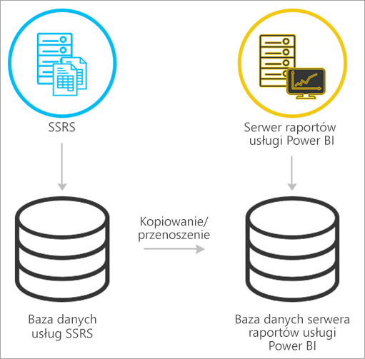
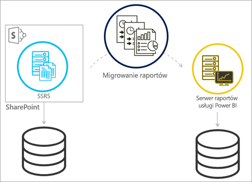
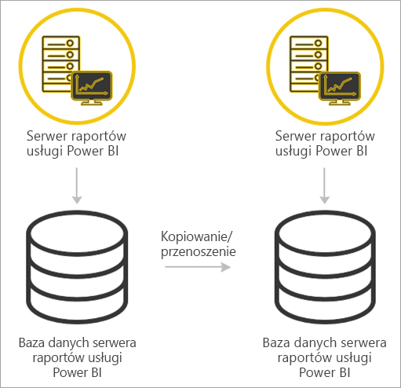

# <a name="migrate-a-report-server-installation"></a>Migrowanie instalacji serwera raportów
Dowiedz się, jak przeprowadzić migrację istniejącego wystąpienia usług SQL Server Reporting Services (SSRS) do wystąpienia Serwera raportów usługi Power BI.

Migracja jest definiowana jako przenoszenie plików danych aplikacji do nowego wystąpienia Serwera raportów usługi Power BI. Poniżej przedstawiono typowe przyczyny migracji instalacji:

* Chcesz zmienić używane rozwiązanie z usług SQL Server Reporting Services na Serwer raportów usługi Power BI.
  
  > [!NOTE]
  > Nie ma możliwości uaktualnienia w miejscu z usług SQL Server Reporting Services do Serwera raportów usługi Power BI. Konieczne jest przeprowadzenie migracji.
  > 
  > 
* Masz wymagania dotyczące aktualizacji lub wdrożenie o dużej skali.
* Zmieniasz sprzęt lub topologię instalacji.
* Występuje problem, który uniemożliwia uaktualnienie.

## <a name="migrating-to-power-bi-report-server-from-ssrs-native-mode"></a>Migrowanie do Serwera raportów usługi Power BI z usług SSRS (tryb natywny)
Migrowanie z wystąpienia usług SSRS (tryb natywny) do Serwera raportów usługi Power BI obejmuje kilka kroków.



> [!NOTE]
> Obsługiwana jest migracja z usług SQL Server 2008 Reporting Services i nowszych.
> 
> 

* Utworzenie kopii zapasowej plików bazy danych, aplikacji i konfiguracji.
* Utworzenie kopii zapasowej klucza szyfrowania.
* Sklonowanie bazy danych serwera raportów hostującej raporty.
* Zainstalowanie Serwera raportów usługi Power BI. Jeśli korzystasz z tego samego sprzętu, można zainstalować Serwer raportów usługi Power BI na tym samym serwerze co wystąpienie usług SSRS. Aby uzyskać więcej informacji na temat instalowania Serwera raportów usługi Power BI, zobacz [Instalowanie Serwera raportów usługi Power BI](install-report-server.md).

> [!NOTE]
> Wystąpienie Serwera raportów usługi Power BI będzie mieć nazwę *PBIRS*.
> 
> 

* Skonfigurowanie serwera raportów przy użyciu Menedżera konfiguracji serwera raportów i nawiązanie połączenia ze sklonowaną bazą danych.
* Wykonanie niezbędnego czyszczenia wystąpienia usług SSRS (tryb natywny)

## <a name="migration-to-power-bi-report-server-from-ssrs-sharepoint-integrated-mode"></a>Migracja do Serwera raportów usługi Power BI z usług SSRS (tryb zintegrowany programu SharePoint)
Migrowanie z usług SSRS (tryb zintegrowany programu SharePoint) do Serwera raportów usługi Power BI nie jest tak proste, jak w przypadku trybu natywnego. Choć te kroki stanowią pewne wskazówki, mogą istnieć inne pliki i zasoby w programie SharePoint wymagające obsługi, które nie zostały uwzględnione w tych krokach.



Należy przeprowadzić migrację określonej zawartości serwera raportów z programu SharePoint do Serwera raportów usługi Power BI. Przyjęto założenie, że Serwer raportów usługi Power BI został już zainstalowany w środowisku. Aby uzyskać więcej informacji na temat instalowania Serwera raportów usługi Power BI, zobacz [Instalowanie Serwera raportów usługi Power BI](install-report-server.md).

Aby skopiować zawartość serwera raportów ze środowiska programu SharePoint do Serwera raportów usługi Power BI, należy użyć narzędzi, takich jak program **rs.exe**. Poniżej przedstawiono przykładowy skrypt do kopiowania zawartości serwera raportów z programu SharePoint do Serwera raportów usługi Power BI.

> [!NOTE]
> Przykładowy skrypt powinien działać w przypadku programu SharePoint 2010 i nowszych wersji oraz usług SQL Server 2008 Reporting Services i nowszych wersji.
> 
> 

### <a name="sample-script"></a>Przykładowy skrypt
```
Sample Script
rs.exe
-i ssrs_migration.rss -e Mgmt2010
-s http://SourceServer/_vti_bin/reportserver
-v st="sites/bi" -v f="Shared Documents“
-u Domain\User1 -p Password
-v ts=http://TargetServer/reportserver
-v tu="Domain\User" -v tp="Password"
```

## <a name="migrateing-from-one-power-bi-report-server-to-another"></a>Migrowanie z jednego Serwera raportów usługi Power BI na inny
Migracja z jednego Serwera raportów usługi Power BI na inny obejmuje takie same czynności co migracja z usług SSRS (w trybie natywnym).



* Utworzenie kopii zapasowej plików bazy danych, aplikacji i konfiguracji.
* Utworzenie kopii zapasowej klucza szyfrowania.
* Sklonowanie bazy danych serwera raportów hostującej raporty.
* Zainstalowanie Serwera raportów usługi Power BI. *Nie można* zainstalować Serwera raportów usługi Power BI na tym samym serwerze, z którego przeprowadzana jest migracja. Aby uzyskać więcej informacji na temat instalowania Serwera raportów usługi Power BI, zobacz [Instalowanie Serwera raportów usługi Power BI](install-report-server.md).

> [!NOTE]
> Wystąpienie Serwera raportów usługi Power BI będzie mieć nazwę *PBIRS*.
> 
> 

* Skonfigurowanie serwera raportów przy użyciu Menedżera konfiguracji serwera raportów i nawiązanie połączenia ze sklonowaną bazą danych.
* Wykonanie niezbędnego czyszczenia starej instalacji Serwera raportów usługi Power BI.

## <a name="next-steps"></a>Następne kroki
[Podręcznik administratora](admin-handbook-overview.md)  
[Szybki start: instalowanie serwera raportów usługi Power BI](quickstart-install-report-server.md)  
[Korzystanie ze skryptów przy użyciu narzędzia rs.exe i usługi internetowej](https://docs.microsoft.com/sql/reporting-services/tools/script-with-the-rs-exe-utility-and-the-web-service)

Masz więcej pytań? [Zadaj pytanie społeczności usługi Power BI](https://community.powerbi.com/)

