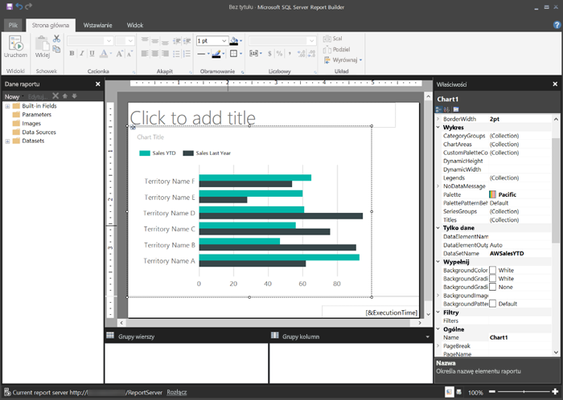
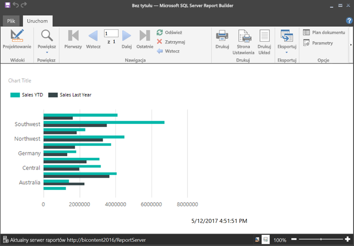

# Tworzenie raportu podzielonego na strony dla serwera raportów usługi Power BI
Jak wskazuje nazwa, raporty z podziałem na strony można uruchamiać na wielu stronach. Mają one układ zgodny z ustalonym formatem i umożliwiają dokładne dostosowanie. Raporty z podziałem na strony są plikami RDL.

Raporty z podziałem na strony można przechowywać i zarządzać nimi w portalu internetowym serwera raportów usługi Power BI, podobnie jak w portalu sieci web usługi SQL Server Reporting Services (SSRS). Możesz je tworzyć i edytować za pomocą programu Report Builder lub Projektanta raportów w programie SQL Server Data Tools (SSDT), a następie opublikować je w dowolnym portalu sieci web. Następnie czytelnicy raportów w Twojej organizacji będą mogli wyświetlać je w przeglądarce lub w aplikacji mobilnej usługi Power BI na swoim urządzeniu przenośnym.

Jeśli masz już doświadczenie w tworzeniu raportów z podziałem na strony za pomocą programu Report Builder lub Projektanta raportów, możesz przystąpić do tworzenia raportów z podziałem na strony dla serwera raportów usługi Power BI. Jeśli nie, poniżej znajdziesz kilka szybkich kroków ułatwiających rozpoczęcie pracy.

## Krok 1. Instalowanie i uruchamianie programu Report Builder
Być może masz już zainstalowany program Report Builder do tworzenia raportów dla serwera usługi SSRS. Możesz używać tej samej wersji dodatku Report Builder, aby tworzyć raporty dla serwera raportów usługi Power BI. Jeśli jeszcze go nie zainstalowano, proces jest prosty.

1. W portalu sieci web serwera raportów usługi Power BI wybierz pozycje **Nowy** > **Raport podzielony na strony**.
   
    
   
    Jeśli nie masz jeszcze zainstalowanego programu Report Builder, ten program przeprowadzi Cię teraz przez proces instalacji.
2. Po zainstalowaniu program Report Builder wyświetli ekran **Nowy raport lub zestaw danych**.
   
    
3. Wybierz kreatora dla rodzaju raportu, który chcesz utworzyć:
   
   * Tabela lub macierz
   * Wykres
   * Mapa
   * Pusty
4. Zacznijmy pracę z kreatorem wykresu.
   
    Kreator wykresu przeprowadzi Cię przez etapy tworzenia podstawowego wykresu w raporcie. Z tego miejsca można dostosować raport w praktycznie nieograniczony sposób.

## Krok 2. Praca z kreatorem wykresu
Kreator wykresu zawiera opis podstawowych kroków tworzenia wizualizacji w raporcie.

Raporty z podziałem na strony mogą łączyć się z wieloma różnymi źródłami danych — programem Microsoft SQL Server, bazą danych SQL Azure Microsoft, Oracle, Hyperion i wieloma innymi. Przeczytaj informacje o [źródłach danych obsługiwanych przez raporty z podziałem na strony](connect-data-sources.md).

Na pierwszej stronie Kreatora wykresu, **Wybór zestawu danych**, możesz utworzyć zestaw danych lub wybrać udostępniony zestaw danych na serwerze. *Zestawy danych* zwracają dane raportu z zapytania względem zewnętrznego źródła danych.

1. Wybierz pozycje **Przeglądaj** > wybierz udostępniony zestaw danych na serwerze > **Otwórz** > **Dalej**.
   
    
   
     Chcesz utworzyć zestaw danych? Zobacz [Tworzenie udostępnionego lub osadzonego zestawu danych](https://docs.microsoft.com/sql/reporting-services/report-data/create-a-shared-dataset-or-embedded-dataset-report-builder-and-ssrs).
2. Wybierz typ wykresu — w tym przypadku wykres słupkowy.
   
    
3. Uporządkuj pola, przeciągając je do pól **Kategorie**, **Szeregi** i **Wartości**.
   
    
4. Wybierz pozycje **Dalej** > **Zakończ**.

## Krok 3. Projektowanie raportu
Teraz znajdujesz się w widoku Projekt raportu. Zwróć uwagę, że dane są symbolami zastępczymi, a nie właściwymi danymi.

* Aby wyświetlić dane, wybierz pozycję **Uruchom**.
  
     
* Aby powrócić do widoku projektu, wybierz pozycję **Projekt**.

Możesz zmodyfikować właśnie utworzony wykres, zmieniając układ, wartości, legendę itd. — naprawdę niemal wszystkie elementy.

Możesz także dodawać dowolne inne wizualizacje: mierników, tabel, macierzy, tabel, map i inne. Można dodawać nagłówki i stopki dla wielu stron. Zobacz [Samouczki programu Report Builder](https://docs.microsoft.com/sql/reporting-services/report-builder-tutorials), aby wypróbować je samodzielnie.

## Krok 4. Zapisywanie raportu na serwerze raportów
Kiedy raport jest gotowy, zapisz go na serwerze raportów usługi Power BI.

1. W menu **Plik** wybierz polecenie **Zapisz jako** i zapisz plik na serwerze raportów. 
2. Teraz możesz wyświetlić go w przeglądarce.
   
    

## Następne kroki
Istnieje wiele wspaniałych zasobów na potrzeby projektowania raportów w programie Report Builder i w Projektancie raportów w narzędziach SQL Server Data Tools. Samouczki programu Report Builder są dobrym miejscem do rozpoczęcia pracy z nimi.

* [Samouczki programu Report Builder](https://docs.microsoft.com/sql/reporting-services/report-builder-tutorials)
* [Co to jest serwer raportów usługi Power BI?](get-started.md)  

Masz więcej pytań? [Zadaj pytanie społeczności usługi Power BI](https://community.powerbi.com/)

