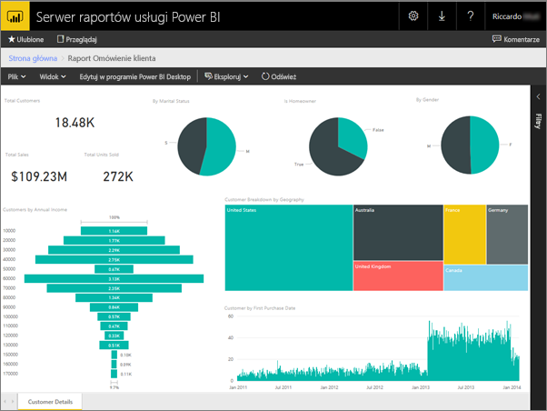
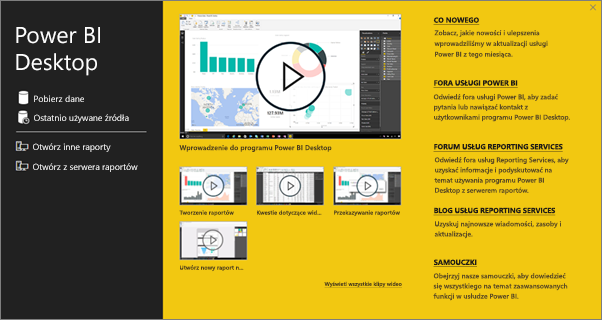
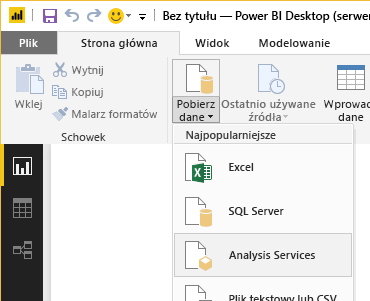
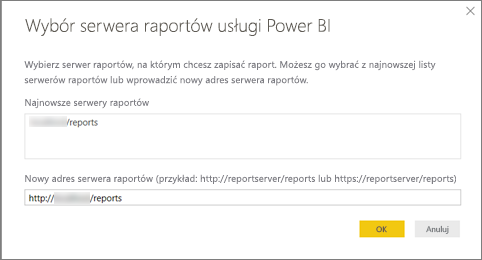
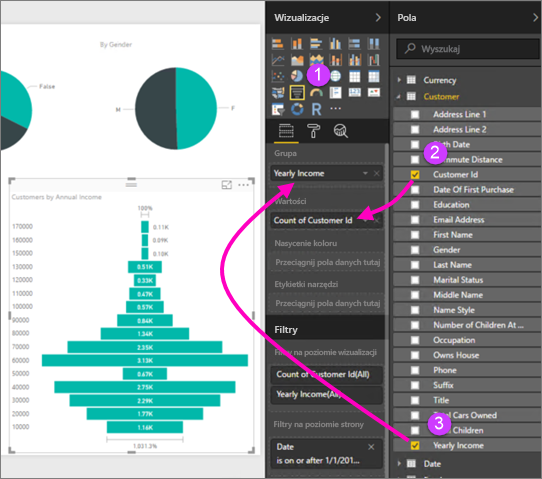
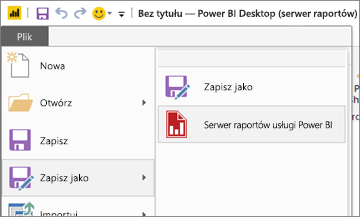

# Szybki start: tworzenie raportu usługi Power BI dla serwera raportów usługi Power BI
Raporty usługi Power BI można przechowywać i zarządzać nimi lokalnie w portalu internetowym serwera raportów usługi Power BI, podobnie jak w przypadku przechowywania ich w chmurze w usłudze Power BI (https://powerbi.com). Raporty usługi Power BI można tworzyć i edytować w programie Power BI Desktop, a następnie publikować je w portalu internetowym. Odbiorcy raportów w organizacji będą mogli wyświetlać je w przeglądarce lub w aplikacji mobilnej Power BI na urządzeniach przenośnych.

Oto cztery szybkie kroki ułatwiające rozpoczęcie pracy.

## Krok 1. Instalowanie programu Power BI Desktop zoptymalizowanego pod kątem serwera raportów usługi Power BI

Jeśli masz już doświadczenie w tworzeniu raportów usługi Power BI w programie Power BI Desktop, jesteś blisko rozpoczęcia tworzenia raportów usługi Power BI dla serwera raportów usługi Power BI. Zalecamy zainstalowanie wersji programu Power BI Desktop zoptymalizowanej pod kątem serwera raportów usługi Power BI, aby serwer i aplikacja były zawsze zsynchronizowane. Obie wersje programu Power BI Desktop mogą być zainstalowane na tym samym komputerze.

1. W portalu internetowym serwera raportów wybierz strzałkę **Pobierz** > **Power BI Desktop**.

    

    Możesz też przejść bezpośrednio do programu [Microsoft Power BI Desktop](https://go.microsoft.com/fwlink/?linkid=861076) (zoptymalizowanego pod kątem serwera raportów usługi Power BI — październik 2017) w Centrum pobierania Microsoft.

2. Na stronie Centrum pobierania wybierz pozycję **Pobierz**.

3. W zależności od komputera wybierz:

    - **PBIDesktopRS.msi** (wersja 32-bitowa) lub

    - **PBIDesktopRS_x64.msi** (wersja 64-bitowa).

4. Po pobraniu instalatora uruchom kreatora instalacji programu Power BI Desktop (październik 2017).

2. Na koniec instalacji zaznacz pozycję **Uruchom program Power BI Desktop teraz**.
   
    Program zostanie uruchomiony automatycznie i będzie można rozpocząć pracę. Na pasku tytułu będzie widnieć napis „Power BI Desktop (październik 2017)” — oznacza to, że jest to właściwa wersja.

    

3. Jeśli nie masz doświadczenia w pracy z programem Power BI Desktop, możesz obejrzeć wideo na ekranie powitalnym.
   
    

## Krok 2. Wybieranie źródła danych
Możliwe jest łączenie się z różnymi źródłami danych. Przeczytaj więcej na temat [łączenia się ze źródłami danych](connect-data-sources.md).

1. Na ekranie powitalnym wybierz pozycję **Pobierz dane**.
   
    Ewentualnie na karcie **Narzędzia główne** wybierz pozycję **Pobierz dane**.
2. Wybierz źródło danych — w tym przykładzie będą to usługi **Analysis Services**.
   
    
3. Wypełnij pole **Serwer** i opcjonalnie pole **Baza danych**. Upewnij się, że jest wybrana pozycja **Połącz na żywo**, i wybierz przycisk **OK**.
   
    
4. Wybierz serwer raportów, na którym będziesz zapisywać raporty.
   
    

## Krok 3. Projektowanie raportu
To najbardziej interesująca część: tworzenie wizualizacji ilustrujących dane.

Możesz na przykład utworzyć wykres lejkowy dotyczący klientów i zgrupować wartości według dochodów rocznych.

1. W obszarze **Wizualizacje** wybierz pozycję **Wykres lejkowy**.
2. Przeciągnij pole, które ma być zliczane, do obszaru **Wartości**. Jeśli nie jest to pole liczbowe, program Power BI Desktop automatycznie utworzy dla niego wartość *Liczba elementów*.
3. Przeciągnij pole do zgrupowania do obszaru **Grupa**.

Przeczytaj znacznie więcej na temat [projektowania raportu usługi Power BI](../desktop-report-view.md).

## Krok 4. Zapisywanie raportu na serwerze raportów
Gdy raport będzie gotowy, zapisz go na serwerze raportów usługi Power BI wybranym w kroku 2.

1. W menu **Plik** wybierz polecenie **Zapisz jako** > **Serwer raportów usługi Power BI**.
   
    
2. Teraz można go wyświetlić w portalu internetowym.
   
    

## Istotne kwestie i ograniczenia
Raporty na serwerze raportów usługi Power BI oraz w usłudze Power BI (http://powerbi.com) działają prawie dokładnie tak samo, ale różnią się pod względem kilku funkcji.

### W przeglądarce
W raportach na serwerze raportów usługi Power BI obsługiwane są wszystkie wizualizacje, w tym:

* Wizualizacje niestandardowe

W raportach na serwerze raportów usługi Power BI nie są obsługiwane:

* Wizualizacje języka R
* Mapy ArcGIS
* Linki do stron nadrzędnych
* Funkcje programu Power BI Desktop w wersji zapoznawczej

### W aplikacjach mobilnych Power BI
W raportach na serwerze raportów usługi Power BI obsługiwane są wszystkie funkcje podstawowe w [aplikacjach mobilnych Power BI](../mobile-apps-for-mobile-devices.md), w tym:

* [Układ raportu na telefonie](../desktop-create-phone-report.md): można zoptymalizować raport dla aplikacji mobilnych Power BI. Na telefonie komórkowym zoptymalizowane raporty mają specjalną ikonę, , i układ.
  
    

Następujące funkcje w aplikacjach mobilnych Power BI nie są obsługiwane w raportach na serwerze raportów usługi Power BI:

* Wizualizacje języka R
* Mapy ArcGIS
* Wizualizacje niestandardowe
* Linki do stron nadrzędnych
* Filtrowanie geograficzne ani kody kreskowe

## Następne kroki
### Power BI Desktop
Dostępnych jest wiele wspaniałych zasobów dotyczących tworzenia raportów w programie Power BI Desktop. Te linki stanowią dobry punkt wyjścia.

* [Wprowadzenie do programu Power BI Desktop](../desktop-getting-started.md)
* Uczenie z przewodnikiem: [Wprowadzenie do programu Power BI Desktop](../guided-learning/gettingdata.yml#step-2)

### Serwer raportów usługi Power BI
* [Instalowanie programu Power BI Desktop zoptymalizowanego pod kątem serwera raportów usługi Power BI](install-powerbi-desktop.md)  
* [Serwer raportów usługi Power BI — podręcznik użytkownika](user-handbook-overview.md)  

Masz więcej pytań? [Zadaj pytanie społeczności usługi Power BI](https://community.powerbi.com/)
