# <a name="quickstart-embed-a-power-bi-report-server-report-using-an-iframe-in-sharepoint-server"></a>Szybki start: osadzanie raportu serwera raportów usługi Power BI w elemencie iFrame w programie SharePoint Server

Z tego przewodnika Szybki start dowiesz się, jak osadzać raport serwera raportów usługi Power BI przy użyciu elementu iFrame na stronie programu SharePoint. W przypadku pracy z usługą SharePoint Online serwer raportów usługi Power BI musi być publicznie dostępny. W usłudze SharePoint Online składnik Web Part usługi Power BI, który współpracuje z usługą Power BI, nie działa na serwerze raportów usługi Power BI. 

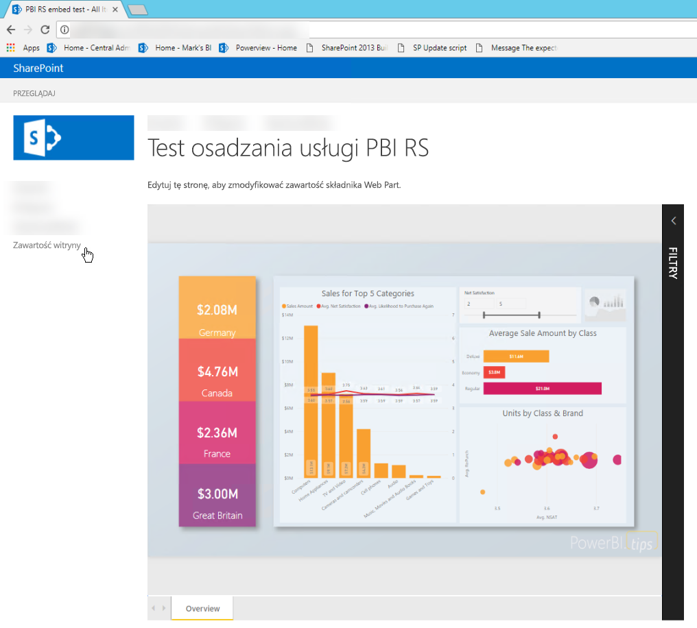
## <a name="prerequisites"></a>Wymagania wstępne
* Musisz mieć zainstalowany i skonfigurowany [serwer raportów usługi Power BI](https://powerbi.microsoft.com/en-us/report-server/).
* Konieczne będzie zainstalowanie programu [Power BI Desktop zoptymalizowanego pod kątem serwera raportów usługi Power BI](install-powerbi-desktop.md).
* Musisz mieć zainstalowane i skonfigurowane środowisko programu [SharePoint](https://docs.microsoft.com/en-us/sharepoint/install/install).

## <a name="creating-the-power-bi-report-server-report-url"></a>Tworzenie adresu URL raportu serwera raportów usługi Power BI

1. Pobierz przykład [Blog Demo](https://github.com/Microsoft/powerbi-desktop-samples) (Pokaz bloga) z usługi GitHub.

    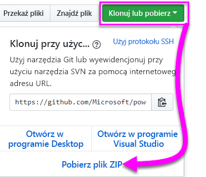

2. Otwórz przykładowy plik PBIX z serwisu GitHub w programie **Power BI Desktop zoptymalizowanym pod kątem serwera raportów usługi Power BI**.

    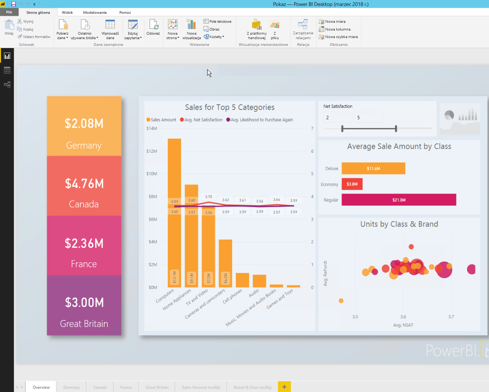

3. Zapisz raport na **serwerze raportów usługi Power BI**. 

    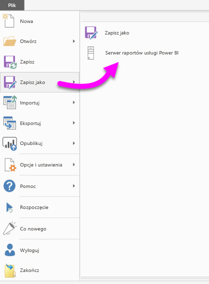

4. Wyświetl raport w **portalu internetowym**.

    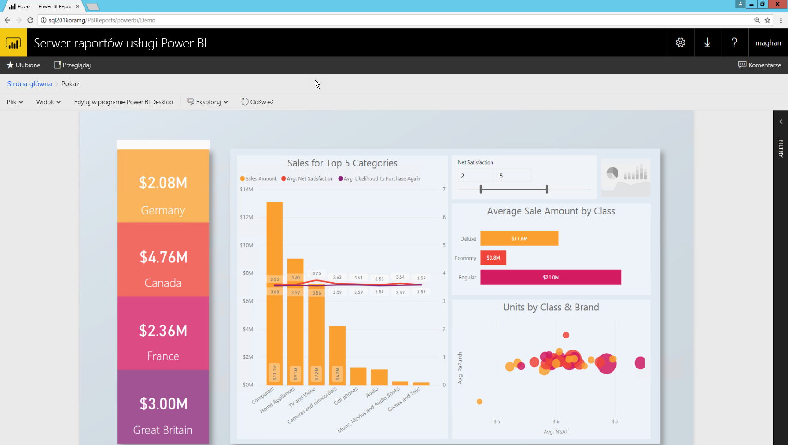

### <a name="capturing-the-url-parameter"></a>Przechwytywanie parametru adresu URL

Po utworzeniu adresu URL można utworzyć element iFrame w ramach strony programu SharePoint do hostowania raportu. W przypadku dowolnego adresu URL raportu serwera raportów usługi Power BI można dodać parametr querystring elementu `?rs:embed=true` w celu osadzenia raportu w elemencie iFrame. 

   Na przykład:
    ``` 
    http://myserver/reports/powerbi/Sales?rs:embed=true
    ```
## <a name="embedding-a-power-bi-report-server-report-in-a-sharepoint-iframe"></a>Osadzanie raportu serwera raportów usługi Power BI w elemencie iFrame programu SharePoint

1. Przejdź do strony **Zawartość witryny** programu SharePoint.

    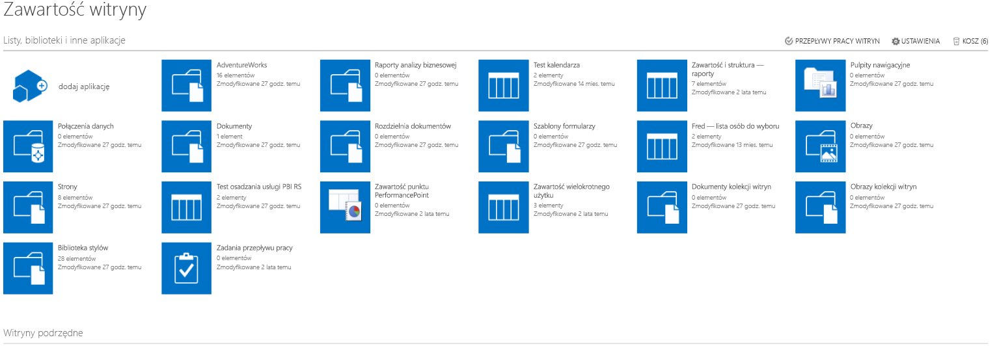

2. Wybierz stronę, na której chcesz dodać raport.

    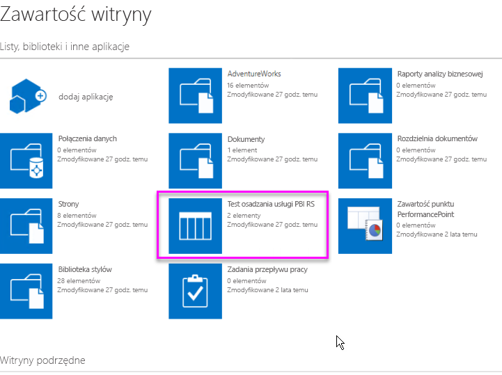

3. Wybierz ikonę koła zębatego w prawym górnym rogu i wybierz pozycję **Edytuj stronę**.

    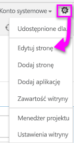

4. Wybierz pozycję **Dodaj składnik Web Part**.

    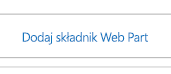

5. W obszarze **Kategorie** wybierz pozycję **Nośniki i zawartość**, w obszarze **Składniki** wybierz pozycję **Edytor zawartości**, a następnie wybierz pozycję **Dodaj**.

    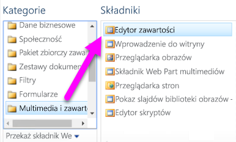 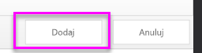

6. Wybierz pozycję **Kliknij tutaj, aby dodać nową zawartość**.

    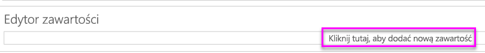

7. Na wstążce wybierz kartę **Formatowanie tekstu**, a następnie wybierz pozycję **Edytuj źródło**.

     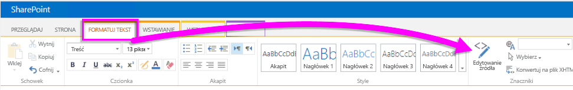

8. W oknie Edytowanie źródła wklej kod elementu iFrame, a następnie wybierz przycisk OK.

    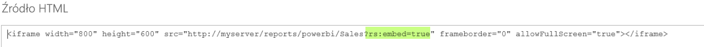

     Na przykład:
     ```
     <iframe width="800" height="600" src="http://myserver/reports/powerbi/Sales?rs:embed=true" frameborder="0" allowFullScreen="true"></iframe>
     ```

9. Na wstążce wybierz kartę **Strona** i wybierz pozycję **Zatrzymaj edytowanie**.

    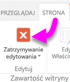

10. Teraz raport powinien być widoczny na stronie.

    

## <a name="next-steps"></a>Następne kroki

[Szybki start: tworzenie raportu usługi Power BI dla serwera raportów usługi Power BI](quickstart-create-powerbi-report.md)  
[Szybki start: tworzenie raportu z podziałem na strony dla serwera raportów usługi Power BI](quickstart-create-paginated-report.md)  

Masz więcej pytań? [Zadaj pytanie społeczności usługi Power BI](https://community.powerbi.com/) 