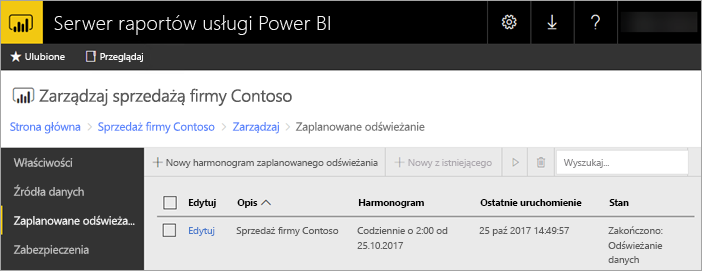

# Zaplanowane odświeżanie raportu usługi Power BI na Serwerze raportów usługi Power BI
Zaplanowane odświeżanie raportów usługi Power BI umożliwia uzyskiwanie najnowszych danych dla raportu.

Zaplanowane odświeżanie dotyczy raportów usługi Power BI z osadzonym modelem. Oznacza to, że dane zostały zaimportowane do raportu i nie użyto połączenia na żywo ani zapytania bezpośredniego. Podczas importowania danych są one odłączane od oryginalnego źródła danych i muszą być aktualizowane, aby były aktualne. Zaplanowane odświeżanie jest sposobem na uzyskiwanie aktualnych danych.

Zaplanowane odświeżanie należy skonfigurować w sekcji zarządzania raportu. Aby uzyskać więcej informacji na temat konfigurowania zaplanowanego odświeżania, zobacz [Konfigurowanie zaplanowanego odświeżania raportu usługi Power BI](configure-scheduled-refresh.md).

## Jak to działa
Podczas zaplanowanego odświeżania raportów usługi Power BI zaangażowanych jest kilka składników.

* Program SQL Server Agent służy jako czasomierz do generowania zaplanowanych zdarzeń.
* Zaplanowane zadania są dodawane do kolejki zdarzeń i powiadomień w bazie danych serwera raportów. W przypadku wdrożenia skalowalnego w poziomie kolejka jest współdzielona przez wszystkie serwery raportów we wdrożeniu.
* Wszystkie procesy związane z przetwarzaniem raportów uruchamiane w wyniku zaplanowanych zdarzeń są wykonywane w tle.
* Model danych jest ładowany w wystąpieniu usług Analysis Services.
* W przypadku niektórych źródeł danych do łączenia się z nimi i przekształcania danych jest używany aparat mashupów dodatku Power Query. Z innymi źródłami danych można łączyć się bezpośrednio z usługi Analysis Services używanej do hostowania modeli danych dla Serwera raportów usługi Power BI.
* Nowe dane są ładowane do modelu danych w ramach usług Analysis Services.
* Usługi Analysis Services przetwarzają dane i wykonują wszelkie wymagane obliczenia.

Serwer raportów usługi Power BI obsługuje kolejkę zdarzeń dla wszystkich zaplanowanych operacji. Wysyła on zapytania do kolejki w regularnych odstępach czasu, sprawdzając, czy istnieją nowe zdarzenia. Domyślnie kolejka jest skanowana co 10 sekund. Interwał można zmienić, modyfikując ustawienia konfiguracji **PollingInterval**, **IsNotificationService** i **IsEventService** w pliku RSReportServer.config. Przy użyciu ustawienia **IsDataModelRefreshService** można również określić, czy zaplanowane zdarzenia mają być przetwarzane przez serwer raportów.

### Analysis Services
Renderowanie raportu usługi Power BI, jak również wykonywanie zaplanowanego odświeżania, wymaga ładowania modelu danych raportu usługi Power BI w usługach Analysis Services. Proces usług Analysis Services będzie uruchamiany wraz z Serwerem raportów usługi Power BI.

## Istotne kwestie i ograniczenia
### Kiedy nie można używać zaplanowanego odświeżania
W przypadku niektórych raportów usługi Power BI utworzenie planu zaplanowanego odświeżania nie jest możliwe. Poniżej znajduje się lista raportów usługi Power BI, dla których nie można utworzyć planu zaplanowanego odświeżania.

* Raport zawiera co najmniej jedno źródło danych usług Analysis Services, które używa połączenia na żywo.
* Raport zawiera co najmniej jedno źródło danych, które używa zapytań bezpośrednich.
* Raport nie zawiera żadnych źródeł danych. Na przykład dane są wprowadzane ręcznie za pośrednictwem funkcji *Wprowadź dane* lub raport zawiera tylko zawartość statyczną, taką jak obrazy, tekst itd.

Oprócz powyższej listy istnieją określone scenariusze ze źródłami danych w trybie *importowania*, dla których nie można tworzyć planów odświeżania.

* Jeśli używane jest źródło danych *Plik* lub *Folder*, a ścieżka pliku jest ścieżką lokalną (np. C:\Users\użytkownik\Documents), nie można utworzyć planu odświeżania. Ścieżka musi prowadzić do lokalizacji, z którą serwer raportów może się łączyć, takiej jak udział sieciowy. Na przykład *\\moj_udzial\Documents*.
* Jeśli połączenie ze źródłem danych może zostać nawiązane tylko przy użyciu protokołu uwierzytelniania OAuth (np. Facebook, Google Analytics, Salesforce itd.), nie można utworzyć planu odświeżania pamięci podręcznej. Obecnie serwer raportów nie obsługuje uwierzytelniania OAuth dla żadnego źródła danych, w tym raportów usługi Power BI, raportów z podziałem na strony oraz raportów dla urządzeń przenośnych.

### Limity pamięci
Tradycyjne obciążenie serwera raportów jest podobne do aplikacji internetowej. Możliwość ładowania raportów z zaimportowanymi danymi lub za pomocą zapytań bezpośrednich oraz możliwość wykonywania zaplanowanego odświeżania jest oparta na wystąpieniu usług Analysis Services hostowanym równolegle do serwera raportów. W związku z tym może wystąpić nieoczekiwane zapotrzebowanie na pamięć na serwerze. Odpowiednio zaplanuj wdrożenie serwera, uwzględniając możliwość większego użycia pamięci przez usługi Analysis Services działające równolegle z serwerem raportów.

Aby uzyskać informacje na temat sposobu monitorowania wystąpienia usług Analysis Services, zobacz [Monitorowanie wystąpienia usług Analysis Services](https://docs.microsoft.com/sql/analysis-services/instances/monitor-an-analysis-services-instance).

Aby uzyskać informacje o ustawieniach pamięci w ramach usług Analysis Services, zobacz [Właściwości pamięci](https://docs.microsoft.com/sql/analysis-services/server-properties/memory-properties).

### Uwierzytelnianie i protokół Kerberos
Jeśli dla źródła danych ustawiono użycie poświadczeń systemu Windows, może być wymagane skonfigurowanie ograniczonego delegowania protokołu Kerberos. Aby uzyskać więcej informacji, zobacz [Konfigurowanie uwierzytelniania systemu Windows na serwerze raportów](https://docs.microsoft.com/sql/reporting-services/security/configure-windows-authentication-on-the-report-server).

## Następne kroki
Skonfiguruj [zaplanowane odświeżanie](configure-scheduled-refresh.md) raportu usługi Power BI.

Masz więcej pytań? [Zadaj pytanie społeczności usługi Power BI](https://community.powerbi.com/)

