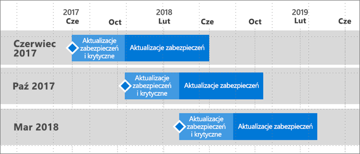

# Plan pomocy technicznej dla serwera raportów usługi Power BI
Serwer raportów usługi Power BI będzie wydawany kilka razy w roku. Aktualizacje zabezpieczeń i aktualizacje krytyczne będą dostępne do momentu, w którym kolejne wydanie stanie się ogólnie dostępne (GA). Po wydaniu następnej wersji poprzednie wydanie będzie otrzymywać aktualizacje zabezpieczeń przez pozostałą część 12-miesięcznego cyklu życia wersji.

Te zasady pomocy technicznej umożliwiają nam wdrażanie innowacji dla klientów w szybkim tempie, jednocześnie zapewniając klientom elastyczność i możliwość przyjmowania innowacji w swoim własnym tempie.

* Faza obsługi aktualizacji zabezpieczeń i aktualizacji krytycznych — podczas uruchamiania najnowszej bieżącej wersji serwera raportów usługi Raport BI otrzymasz aktualizacje zabezpieczeń i aktualizacje krytyczne.
* Faza obsługi aktualizacji zabezpieczeń (tylko) — po wydaniu nowej wersji pomoc techniczna dla starszych wersji zostanie zredukowana wyłącznie do aktualizacji zabezpieczeń w pozostałej części dwunastomiesięcznego (12) cyklu życia obsługi (rysunek 1).

    

## Historia wersji
| **Wersja** | **Data dostępności** | **Data zakończenia obsługi** |
| --- | --- | --- |
| Czerwiec 2017 |12 czerwca 2017 r. |12 czerwca 2018 r. |
| Październik 2017 |31 października 2017 r. |31 października 2018 r. |
| Marzec 2018 | 19 marca 2018 r. | 19 marca 2019 r. |

Aby pobrać serwer raportów usługi Power BI i program Power BI Desktop zoptymalizowany pod kątem serwera raportów usługi Power BI, przejdź do [Lokalne raportowanie za pomocą serwera raportów usługi Power BI](https://powerbi.microsoft.com/report-server/).

## Następne kroki
[Co nowego w serwerze raportów usługi Power BI](whats-new.md)  
[Podręcznik użytkownika](user-handbook-overview.md)  
[Podręcznik administratora](admin-handbook-overview.md)  
[Instalacja serwera raportów usługi Power BI](install-report-server.md)  

Masz więcej pytań? [Zadaj pytanie społeczności usługi Power BI](https://community.powerbi.com/)

