# Samouczek: eksplorowanie portalu internetowego serwera raportów usługi Power BI na maszynie wirtualnej
W tym samouczku utworzysz maszynę wirtualną platformy Azure przy użyciu już zainstalowanego serwera raportów usługi Power BI, aby zapoznać się z procesami wyświetlania i edytowania przykładowych raportów usługi Power BI i podzielonych na strony oraz kluczowych wskaźników wydajności, a także zarządzania nimi.

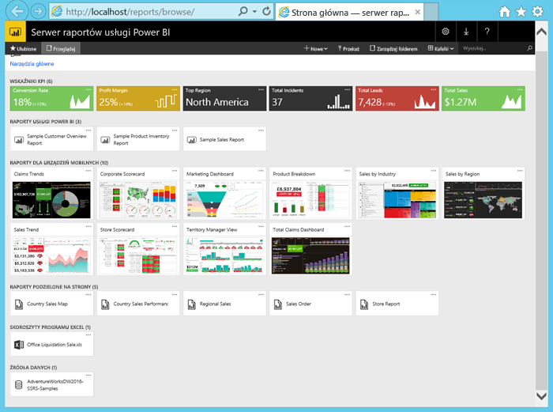

Oto zadania, które wykonasz w tym samouczku:

> [!div class="checklist"]
> * Tworzenie maszyny wirtualnej i łączenie się z nią
> * Uruchamianie i eksplorowanie portalu internetowego serwera raportów usługi Power BI
> * Tagowanie ulubionego elementu
> * Wyświetlanie i edytowanie raportu usługi Power BI
> * Wyświetlanie i edytowanie raportu podzielonego na strony oraz zarządzanie nim
> * Wyświetlanie skoroszytu programu Excel w usłudze Excel Online

Do pracy z tym samouczkiem potrzebujesz subskrypcji platformy Azure. Jeśli jej nie masz, przed rozpoczęciem utwórz [bezpłatne konto](https://azure.microsoft.com/free/?WT.mc_id=A261C142F).

## Tworzenie maszyny wirtualnej serwera raportów usługi Power BI

Na szczęście zespół usługi Power BI utworzył maszynę wirtualną z już zainstalowanym serwerem raportów usługi Power BI.

1. W portalu Azure Marketplace otwórz [serwer raportów usługi Power BI](https://azuremarketplace.microsoft.com/marketplace/apps/reportingservices.technical-preview?tab=Overview).  

2. Wybierz pozycję **Pobierz teraz**.
3. Aby zaakceptować warunki użytkowania i zasady ochrony prywatności dostawcy, wybierz pozycję **Kontynuuj**.

    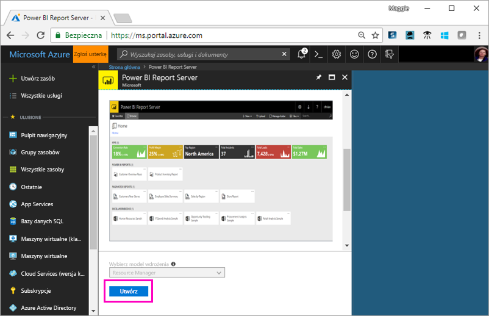

4. **Krok 1. Podstawy**, w polu **Nazwa maszyny wirtualnej** podaj nazwę **reportservervm**.

5. Utwórz nazwę użytkownika i hasło.

6. W polu **Grupa zasobów** zachowaj pozycję **Utwórz nową** i podaj nazwę **reportserverresourcegroup**.

    Jeśli wykonujesz instrukcje znajdujące się w tym samouczku więcej niż raz, za każdym razem należy podawać inną nazwę grupy zasobów. Nie można użyć tej samej nazwy grupy zasobów dwukrotnie w ramach jednej subskrypcji. 

7. Zachowaj inne wartości domyślne > **OK**.

    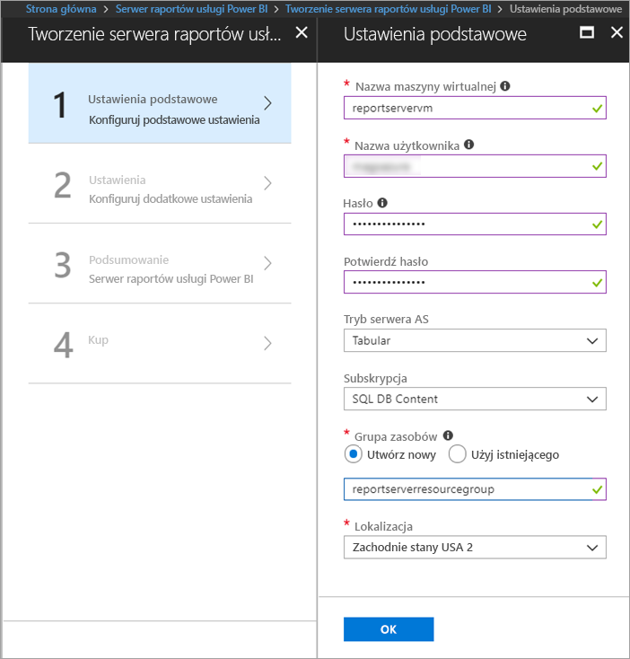

8. **Krok 2. Ustawienia**, zachowaj wartości domyślne > **OK**.

9. **Krok 3. Podsumowanie** > **OK**.

10. **Krok 4**, zapoznaj się z warunkami użytkowania i zasadami ochrony prywatności > **Utwórz**.

    Proces **Przesyłanie wdrożenia dla serwera raportów usługi Power BI** może potrwać kilka minut.

## Łączenie z maszyną wirtualną

1. W okienku nawigacji po lewej stronie platformy Azure wybierz pozycję **Maszyny wirtualne**. 

2. W polu **Filtruj według nazwy** wpisz ciąg „report”. 

3. Wybierz maszynę wirtualną o nazwie **REPORTSERVERVM**.

    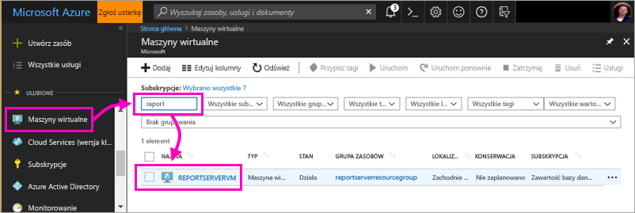

4. W obszarze maszyny wirtualnej REPORTSERVERVM wybierz pozycję **Połącz**.

    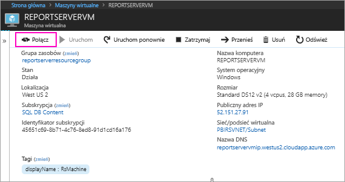

5. W oknie dialogowym Podłączanie pulpitu zdalnego wybierz pozycję **Połącz**.

6. Wprowadź nazwę i hasło utworzone dla maszyny wirtualnej > **OK**.

7. Następne okno dialogowe będzie zawierać informację o tym, że nie można zidentyfikować tożsamości komputera zdalnego. Wybierz pozycję **Yes**.

   I gotowe — zostanie otwarta nowa maszyna wirtualna.

## Serwer raportów usługi Power BI na maszynie wirtualnej

Po otwarciu maszyny wirtualnej na pulpicie zostaną wyświetlone poniższe elementy.

|Numer  |Co to jest  |
|---------|---------|
| | Uruchamia narzędzia SQL Server Data Tools w celu utworzenia raportów podzielonych na strony (RDL) |
| | Przykładowe raporty usługi Power BI (PBIX)  |
| | Linki do dokumentacji dotyczącej serwera raportów usługi Power BI   |
| | Uruchamia program Power BI Desktop zoptymalizowany pod kątem serwera raportów usługi Power BI (marzec 2018)  |
| | Otwiera portal internetowy serwera raportów usługi Power BI w przeglądarce   |

Kliknij dwukrotnie ikonę **portalu internetowego serwera raportów**. W przeglądarce zostanie otwarta strona `http://localhost/reports/browse`. W portalu internetowym zobaczysz różne pliki pogrupowane według typu. 

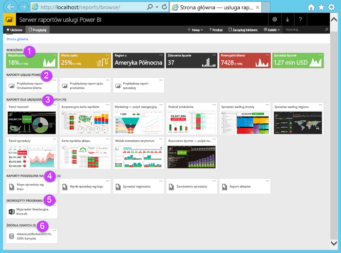

|Numer  |Co to jest  |
|---------|---------|
| | Kluczowe wskaźniki wydajności utworzone w portalu internetowym |
| |  Raporty usługi Power BI (PBIX)  |
| | Raporty mobilne utworzone w programie SQL Server Mobile Report Publisher  |
| |  Raporty podzielone na strony utworzone przy użyciu narzędzi Report Builder lub SQL Server Data Tools  |
| | Skoroszyty programu Excel   | 
| | Źródła danych raportów podzielonych na strony | 

## Tagowanie ulubionych elementów
Raporty i kluczowe wskaźniki wydajności, które mają zostać dodane do ulubionych, można otagować. Łatwiej będzie je odnaleźć, ponieważ są zgromadzone w jednym folderze Ulubione zarówno w portalu internetowym, jak i w aplikacjach mobilnych usługi Power BI. 

1. Wybierz przycisk wielokropka (**…**) w prawym górnym rogu obszaru kluczowego wskaźnika wydajności **Marża zysku** > **Dodaj do Ulubionych**.
   
    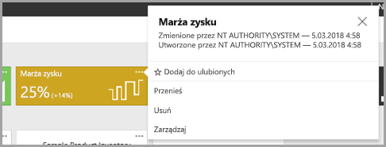
2. Wybierz pozycję **Ulubione** na wstążce w portalu internetowym, aby wyświetlić ten element wraz z innymi ulubionymi elementami na stronie Ulubione w portalu internetowym.
   
    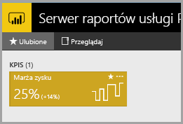

3. Wybierz pozycję **Przeglądaj**, aby wrócić do portalu internetowego.
   
## Wyświetlanie elementów w widoku listy
Domyślnie zawartość portalu internetowego jest wyświetlana w widoku kafelków.

Ten widok można zmienić na widok listy, w którym możliwe jest łatwe przenoszenie lub usuwanie wielu elementów naraz. 

1. Wybierz pozycję **Kafelki** > **Lista**.
   
    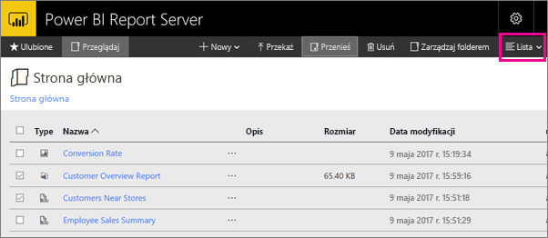

2. Przejdź wstecz do widoku Kafelki: Wybierz kolejno pozycje **Lista** > **Kafelki**.

## Raporty usługi Power BI

Raporty usługi Power BI można wyświetlać i pracować z nimi w portalu internetowym oraz uruchamiać program Power BI Desktop bezpośrednio z tego portalu.

### Wyświetlanie raportów usługi Power BI

1. W portalu internetowym w obszarze **Raporty usługi Power BI** wybierz raport **Sample Customer Overview Report** (Przykładowy raport omówienia klienta). Raport zostanie otwarty w przeglądarce.

1. Wybierz blok United States (Stany Zjednoczone) na mapie drzewa, aby zobaczyć, jak powiązane wartości zostaną wyróżnione w innych wizualizacjach.

    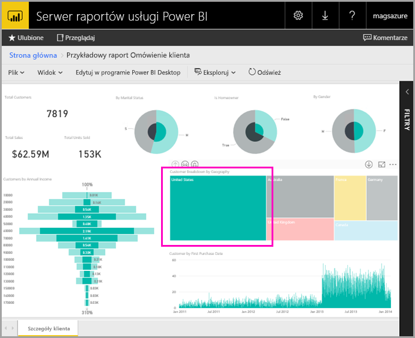

### Edytuj w programie Power BI Desktop

1. Wybierz pozycję **Edytuj w programie Power BI Desktop**.

1. Wybierz pozycję **Zezwalaj**, aby zezwolić tej witrynie internetowej na otwarcie programu na komputerze. 

     Raport zostanie otwarty w programie Power BI Desktop. Zauważ, że nazwa na pasku górnym to „Power BI Desktop (marzec 2018)”. Jest to wersja zoptymalizowana pod kątem serwera raportów usługi Power BI.

    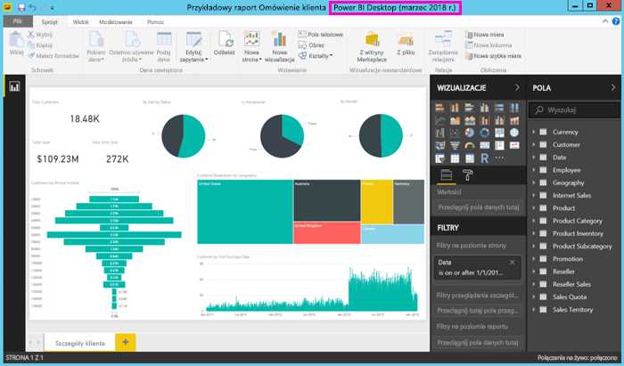

     Użyj wersji programu Power BI Desktop zainstalowanej na maszynie wirtualnej. Aby przekazać raport, nie można przechodzić między domenami.

3. W okienku Pola rozwiń tabelę Customers (Klienci) i przeciągnij pole Occupation (Zawód) do filtrów na poziomie raportu.

    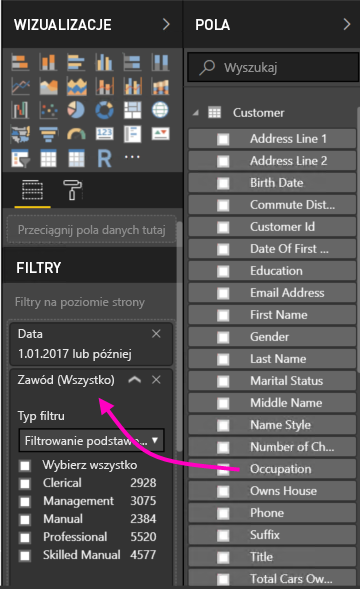

1. Zapisz raport.

1. Wróć do raportu w przeglądarce i wybierz ikonę **Odśwież** przeglądarki.

    

8. Rozwiń okienko **Filtry** po prawej stronie, aby wyświetlić dodane pole **Occupation** (Zawód). Wybierz pozycję **Professional** (Profesjonalista).

    

3. Wybierz pozycję **Przeglądaj**, aby wrócić do portalu internetowego.

## Raporty podzielone na strony (RDL)

Raporty podzielone na strony można wyświetlać i zarządzać nimi, a także uruchamiać narzędzie Report Builder, w portalu internetowym.

### Zarządzanie raportem podzielonym na strony

1. W portalu internetowym w obszarze **Raporty podzielone na strony** wybierz wielokropek (...) obok pozycji **Zamówienie sprzedaży** > **Zarządzaj**.

1. Wybierz pozycję **Parametry**, zmień wartość domyślną pola **SalesOrderNumber** na **SO50689** > **Zastosuj**.

   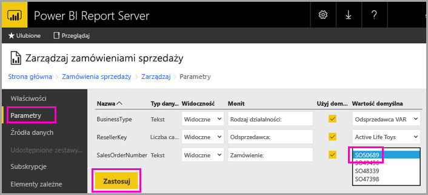

3. Wybierz pozycję **Przeglądaj**, aby wrócić do portalu internetowego.

### Wyświetlanie raportu podzielonego na strony

1. Wybierz pozycję **Sales Order** (Zamówienie sprzedaży) w portalu internetowym.
 
3.  Zobaczysz otwartą stronę parametru **Order** (Zamówienie) ustawionego na **SO50689**. 

    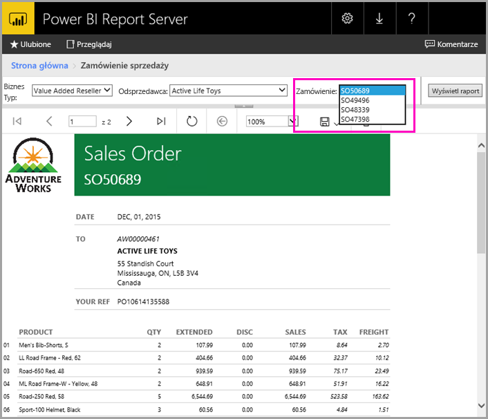

    Możesz zmienić dany parametr oraz inne parametry, nie zmieniając ustawień domyślnych.

1. Wybierz kolejno pozycje **Order** **SO48339** > **Wyświetl raport**.

4. Zobaczysz, że jest to strona 1 z 2. Wybierz strzałkę w prawo, aby wyświetlić drugą stronę. Dalsza część tabeli będzie znajdować się na tej stronie.

    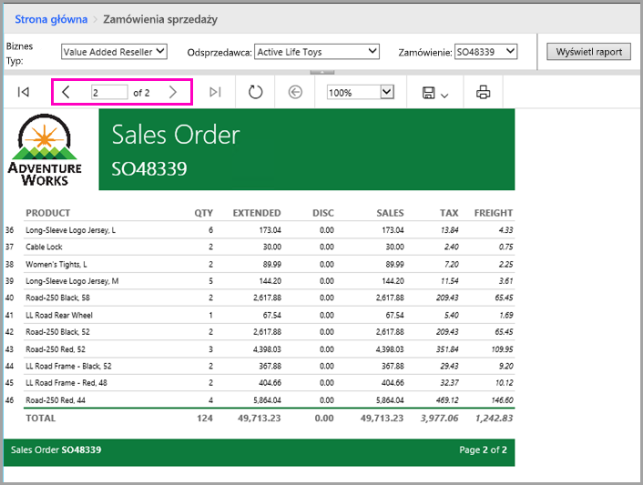

5. Wybierz pozycję **Przeglądaj**, aby wrócić do portalu internetowego.

### Edytowanie raportu podzielonego na strony

Raporty podzielone na strony można edytować w narzędziu Report Builder. Narzędzie to można uruchomić bezpośrednio z przeglądarki.

1. W portalu internetowym wybierz wielokropek (...) obok pozycji **Sales Order** > **Edytuj w narzędziu Report Builder**.

1. Wybierz pozycję **Zezwalaj**, aby zezwolić tej witrynie internetowej na otwarcie programu na komputerze.

1. Raport Sales Order (Zamówienie sprzedaży) zostanie otwarty w widoku projektu narzędzia Report Builder.

    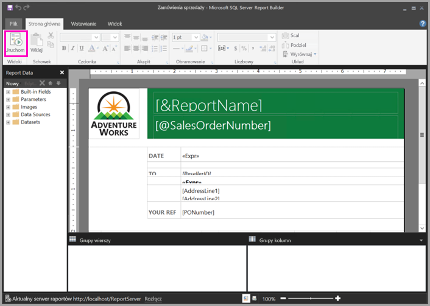

1. Wybierz pozycję **Run** (Uruchom), aby wyświetlić podgląd raportu.

    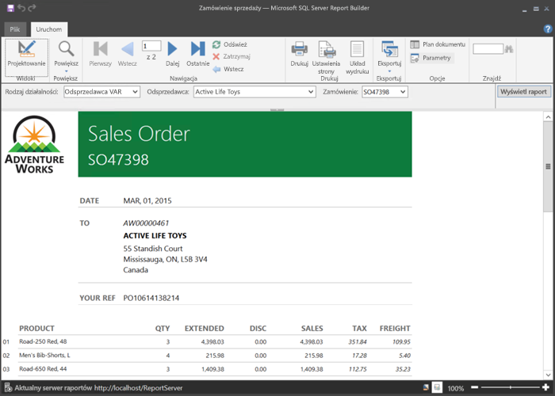

5. Zamknij narzędzie Report Builder i wróć do przeglądarki.

## Wyświetlanie skoroszytów programu Excel

Skoroszyty programu Excel można wyświetlać w usłudze Excel Online na serwerze raportów usługi Power BI. 

1. Wybierz skoroszyt programu Excel **Office Liquidation Sale.xlsx**. Może pojawić się monit o poświadczenia. Wybierz pozycję **Anuluj**. 
    Skoroszyt zostanie otwarty w portalu internetowym.
1. We fragmentatorze wybierz pozycję **Appliance** (Urządzenie).

    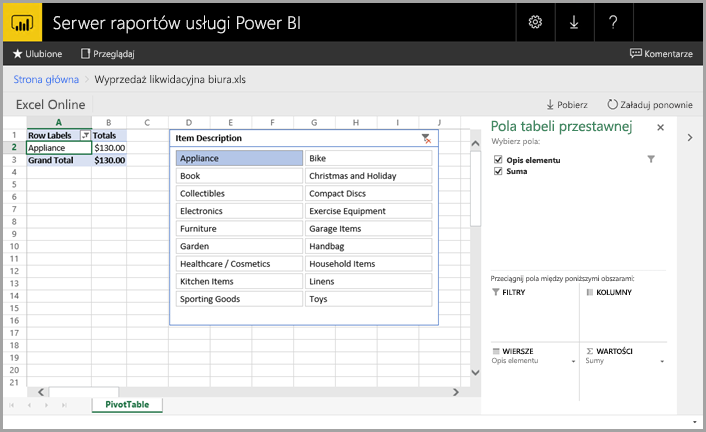

1. Wybierz pozycję **Przeglądaj**, aby wrócić do portalu internetowego.

## Czyszczenie zasobów

Teraz po zakończeniu pracy z tym samouczkiem usuń grupę zasobów, maszynę wirtualną i wszystkie powiązane zasoby. 

- W tym celu wybierz grupę zasobów dla maszyny wirtualnej i wybierz pozycję **Usuń**.

## Następne kroki

W tym samouczku utworzono maszynę wirtualną z serwerem raportów usługi Power BI. Wypróbowano niektóre funkcje portalu internetowego i otwarto raport usługi Power BI oraz raport podzielony na strony w odpowiednich edytorach. Na tej maszynie wirtualnej zainstalowane są źródła danych usług SQL Server Analysis Services, dzięki czemu możesz spróbować utworzyć własną usługę Power BI i wielostronicowe raporty z tymi samymi źródłami danych. 

Aby dowiedzieć się więcej na temat tworzenia raportów dla serwera raportów usługi Power BI, kontynuuj pracę.

> [!div class="nextstepaction"]
> [Tworzenie raportu usługi Power BI dla serwera raportów usługi Power BI](./quickstart-create-powerbi-report.md)

