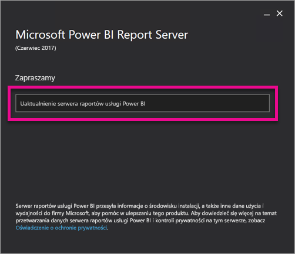

# Uaktualnienie serwera raportów usługi Power BI
Dowiedz się, jak uaktualnić serwer raportów usługi Power BI.

 **Pobieranie** 

Aby pobrać serwer raportów usługi Power BI i program Power BI Desktop zoptymalizowany pod kątem serwera raportów usługi Power BI, przejdź do [Lokalne raportowanie za pomocą serwera raportów usługi Power BI](https://powerbi.microsoft.com/report-server/).

## Zanim rozpoczniesz
Przed uaktualnieniem serwera raportów zaleca się wykonanie następujących kroków, aby utworzyć kopię zapasową serwera raportów.

### Utworzenie kopii zapasowej kluczy szyfrowania
Podczas pierwszej konfiguracji instalacji serwera raportów należy utworzyć kopię zapasową kluczy szyfrowania. Ponadto należy utworzyć kopię zapasową kluczy zawsze wtedy, gdy zmienia się tożsamość kont usługi lub zmienia się nazwę komputera. Aby uzyskać więcej informacji, zobacz [Tworzenie kopii zapasowych i przywracanie kluczy szyfrowania usług raportowania](https://docs.microsoft.com/sql/reporting-services/install-windows/ssrs-encryption-keys-back-up-and-restore-encryption-keys).

### Tworzenie kopii zapasowych baz danych serwera raportów
Ponieważ serwer raportów jest serwerem bezstanowym, wszystkie dane aplikacji są przechowywane w bazach danych **reportserver** i **reportservertempdb** uruchamianych w wystąpieniu aparatu bazy danych programu SQL Server. Możesz utworzyć kopie zapasowe baz danych **reportserver** i **reportservertempdb** przy użyciu jednej z obsługiwanych metod tworzenia kopii zapasowych baz danych programu SQL Server. Zalecenia dotyczące baz danych serwera raportów obejmują poniższe:

* W celu utworzenia kopii zapasowej bazy danych **reportserver** użyj pełnego modelu odzyskiwania.
* W celu utworzenia kopii zapasowej bazy danych **reportservertempdb** użyj prostego modelu odzyskiwania.
* Możesz użyć innych harmonogramów tworzenia kopii zapasowej dla każdej z baz danych. Jedynym powodem tworzenia kopii zapasowej bazy danych **reportservertempdb** jest zapobieganie potrzebie ponownego utworzenia bazy danych w przypadku awarii sprzętowej. W przypadku awarii sprzętu nie trzeba odzyskiwać danych z bazy danych **reportservertempdb**, ale struktura tabeli jest potrzebna. Jeśli stracisz bazę danych **reportservertempdb**, jedynym sposobem jej odzyskania jest ponowne utworzenie bazy danych serwera raportów. Jeśli ponownie utworzysz bazę danych **reportservertempdb**, ważne jest, aby miała taką samą nazwę, jak podstawowa baza danych serwera raportów.

Aby uzyskać więcej informacji o tworzeniu kopii zapasowych i odzyskiwaniu relacyjnych baz danych programu SQL Server, zobacz [Tworzenie kopii zapasowych i przywracanie baz danych programu SQL Server](https://docs.microsoft.com/sql/relational-databases/backup-restore/back-up-and-restore-of-sql-server-databases).

### Tworzenie kopii zapasowej plików konfiguracji
Serwer raportów usługi Power BI używa plików konfiguracji, aby przechowywać ustawienia aplikacji. Należy utworzyć kopię zapasową plików podczas pierwszej konfiguracji serwera oraz po wdrożeniu jakichkolwiek rozszerzeń niestandardowych. Pliki do uwzględnienia w kopii zapasowej obejmują:

* config.json
* RSHostingService.exe.config
* Rsreportserver.config
* Rssvrpolicy.config
* Reportingservicesservice.exe.config
* Web.config w przypadku aplikacji ASP.NET serwera raportów
* Machine.config w przypadku platformy ASP.NET

## Uaktualnianie serwera raportów
Uaktualnianie serwera raportów usługi Power BI jest bardzo proste. Instalacja plików wymaga wykonania zaledwie kilku kroków.

1. Znajdź lokalizację pliku PowerBIReportServer.exe i uruchom instalator.
2. Wybierz opcję **Uaktualnij serwer raportów usługi Power BI**.
   
    
3. Przeczytaj i zgódź się na warunki i postanowienia licencyjne, a następnie wybierz opcję **Uaktualnij**.
   
    
4. Po pomyślnym uaktualnieniu możesz wybrać opcję **Skonfiguruj serwer raportów**, aby uruchomić program Reporting Services Configuration Manager lub wybrać opcję **Zamknij**, aby wyjść z instalatora.
   
    

## Uaktualnienie aplikacji Power BI Desktop
Po uaktualnieniu serwera raportów należy upewnić się, że wszyscy twórcy raportów usługi Power BI uaktualnią aplikację Power BI Desktop do wersji zoptymalizowanej pod kątem serwera raportów usługi Power BI pasującej do serwera.

## Następne kroki
[Podręcznik administratora](admin-handbook-overview.md)  
[Instalowanie programu Power BI Desktop zoptymalizowanego pod kątem serwera raportów usługi Power BI](install-powerbi-desktop.md)  
[Weryfikacja instalacji usług raportowania](https://docs.microsoft.com/sql/reporting-services/install-windows/verify-a-reporting-services-installation)  
[Konfigurowanie konta usługi serwera raportów](https://docs.microsoft.com/sql/reporting-services/install-windows/configure-the-report-server-service-account-ssrs-configuration-manager)  
[Konfigurowanie adresów URL serwera raportów](https://docs.microsoft.com/sql/reporting-services/install-windows/configure-report-server-urls-ssrs-configuration-manager)  
[Konfigurowanie połączenia z bazą danych serwera raportów](https://docs.microsoft.com/sql/reporting-services/install-windows/configure-a-report-server-database-connection-ssrs-configuration-manager)  
[Inicjowanie serwera raportów](https://docs.microsoft.com/sql/reporting-services/install-windows/ssrs-encryption-keys-initialize-a-report-server)  
[Konfigurowanie połączeń SSL na serwerze raportów](https://docs.microsoft.com/sql/reporting-services/security/configure-ssl-connections-on-a-native-mode-report-server)  
[Konfigurowanie kont usługi i uprawnień systemu Windows](https://docs.microsoft.com/sql/database-engine/configure-windows/configure-windows-service-accounts-and-permissions)  
[Obsługa przeglądarek dla serwera raportów usługi Power BI](browser-support.md)

Masz więcej pytań? [Zadaj pytanie społeczności usługi Power BI](https://community.powerbi.com/)

