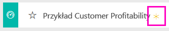
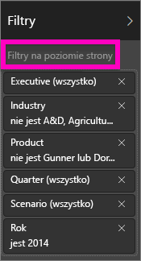

# Próbka danych dotyczących zyskowności klientów dla usługi Power BI: krótki przewodnik
Pakiet zawartości „Customer Profitability Sample” zawiera pulpit nawigacyjny, raport i zestaw danych dotyczące firmy produkującej materiały marketingowe. Ten pulpit nawigacyjny został utworzony przez dyrektora finansowego w celu wyświetlenia kluczowych metryk dotyczących pięciu menedżerów jednostki biznesowej (dyrektorów), produktów, klientów i marży brutto. W skrócie dyrektor może zobaczyć czynniki, które wpływają na zyskowność.

Te przykładowe dane stanowią części serii ilustrującej, w jaki sposób można wykorzystać usługę Power BI w pracy z danymi biznesowymi, raportami i pulpitami nawigacyjnymi. Są to prawdziwe dane pochodzące z firmy obviEnce ([www.obvience.com](http://www.obvience.com/)) przedstawione w sposób anonimowy.

## Wymagania wstępne

Zanim będzie można używać przykładu, musisz go najpierw pobrać jako pakiet zawartości, plik pbix lub skoroszyt programu Excel.

### Pobieranie pakietu zawartości dla tego przykładu

1. Otwórz usługę Power BI (app.powerbi.com) i zaloguj się.
2. W lewym dolnym rogu wybierz opcję **Pobierz dane**.
   
    
3. Na wyświetlonej stronie Pobieranie danych wybierz ikonę **Przykłady**.
   
   
4. Wybierz pozycję **Przykład Customer Profitability**, a następnie wybierz polecenie **Połącz**.  
   
   
5. Usługa Power BI zaimportuje pakiet zawartości i doda nowy pulpit nawigacyjny, raport oraz zestaw danych do bieżącego obszaru roboczego. Nowa zawartość jest oznaczona żółtą gwiazdką. Przeprowadź test działania usługi Power BI za pomocą przykładów.  
   
   
  
### Pobieranie pliku pbix dla tego przykładu

Alternatywnie przykład możesz pobrać jako plik pbix, który został zaprojektowany do użycia w programie Power BI Desktop. 

- [Przykład Customer Profitability](http://download.microsoft.com/download/6/A/9/6A93FD6E-CBA5-40BD-B42E-4DCAE8CDD059/Customer Profitability Sample PBIX.pbix)

### Pobieranie skoroszytu programu Excel dla tego przykładu

Alternatywnie dla tego przykładu możesz również pobrać sam [zestaw danych (skoroszyt programu Excel)](http://go.microsoft.com/fwlink/?LinkId=529781). Skoroszyt zawiera arkusze programu Power View, które można wyświetlać i modyfikować. Aby wyświetlić nieprzetworzone dane, wybierz pozycje **Power Pivot > Zarządzaj**.

## O czym informuje nas pulpit nawigacyjny?

W obszarze **Mój obszar roboczy** znajdź pulpit nawigacyjny dla przykładu Customer Profitability:

### Kafelki pulpitu nawigacyjnego dla całej firmy
Te kafelki zapewniają dyrektorowi finansowemu wgląd w ważne metryki wysokiego poziomu dotyczące firmy.  W przypadku zauważenia czegoś interesującego może wybrać kafelek, aby bliżej przyjrzeć się tym danym.

1. Marża brutto w naszej firmie wynosi 42,5%.
2. Mamy 80 klientów.
3. Sprzedajemy 5 różnych produktów.
4. Najniższa procentowa wariancja przychodu do budżetu nastąpiła w lutym, a najwyższa w marcu.
5. Większość zysków pochodzi z regionów Wschód i Północ. Marża brutto nigdy nie przekroczyła budżetu, wskaźniki ER-0 i MA-0 wymagają dalszego badania.
6. Całkowity przychód w roku jest zbliżony do budżetu.

### Kafelki pulpitu nawigacyjnego dotyczące konkretnego menedżera
Te kafelki zapewniają kartę wyników zespołu. Dyrektor finansowy musi śledzić swoich menedżerów, a te kafelki zapewniają szczegółowy wgląd w zyski — przy użyciu wartości procentowej marży brutto (GM%). Jeśli trend wskaźnika GM% jest nieoczekiwany dla któregoś z menedżerów, dyrektor może zbadać tę sprawę dokładniej.

Wskaźnik GM% Annelie jest najniższy, chociaż widzimy stabilny wzrost od marca. Z drugiej strony Valery doświadczyła znacznego spadku w zakresie wskaźnika GM%. U Andrew rok wyglądał na zmienny. Kliknij dowolny z kafelków dotyczących konkretnego menedżera, aby otworzyć źródłowy raport. Raport ma trzy strony i otworzy się na stronie „Analiza marży w branży”.

## Przeglądanie stron w raporcie
Raport zawiera 3 strony:

* Strona „Wyniki zespołu” skupia się na wydajności pięciu menedżerów oraz ich „księgach działalności biznesowej”.
* Strona „Analiza marży w branży” umożliwia analizowanie zyskowności w porównaniu do trendów w całej branży.
* Strona „Wyniki dyrektora” zapewnia wgląd w informacje dotyczące wszystkich menedżerów sformatowane pod kątem wyświetlania w Cortanie.

### Strona wyników zespołu

Teraz przyjrzyjmy się bardziej szczegółowo członkom zespołu i zobaczmy, jakie informacje można uzyskać. We fragmentatorze po lewej stronie wybierz imię Andrew, aby odfiltrować stronę raportu i wyświetlić tylko dane dotyczące Andrew.

* Aby uzyskać szybki kluczowy wskaźnik wydajności, sprawdź **Stan przychodu** Andrew — jest zaznaczony na zielono. Jego wydajność jest w porządku.
* Wykres warstwowy „Wariacja przychodu (%) w porównaniu do budżetu według miesiąca” wskazuje, że Andrew radzi sobie całkiem dobrze, poza spadkiem w lutym. Jego dominującym regionem jest Wschód, obsługuje 49 klientów oraz 5 (z 7) produktów. Jego wskaźnik marży brutto GM% nie jest najwyższy ani najniższy.
* Wykres „Przychód w roku podatkowym i wariacja przychodu (%) w porównaniu do budżetu względem miesiąca” pokazuje stabilny, równomierny zysk. Jeśli jednak odfiltrujesz dane, klikając kwadrat **Centralny** w mapie drzewa regionów, odkryjesz, że Andrew uzyskał przychody tylko w marcu i tylko w stanie Indiana. Czy jest to zamierzone, czy też należy się temu przyjrzeć?

Przejdźmy teraz do Valery. We fragmentatorze wybierz imię Valery, aby odfiltrować stronę raportu i wyświetlić tylko dane dotyczące Valery.  

* Zwróć uwagę na czerwony kluczowy wskaźnik wydajności dla pozycji **Stan przychodów w roku podatkowym**. Ta sytuacja stanowczo wymaga zbadania.
* Wariancja przychodów również stanowi niepokojący obraz — nie spełnia ona swoich celów w zakresie marży.
* Valery ma tylko 9 klientów, obsługuje tylko 2 produkty i pracuje niemal wyłącznie z klientami na północy. Ta specjalizacja może wyjaśniać znaczne fluktuacje w jej metrykach.
* Wybranie kwadratu **Północ** na mapie drzewa regionów wskaże, że marża brutto Valery w regionie Północ jest spójna z jej ogólną marżą.
* Wybranie innych kwadratów oznaczających **Region** spowoduje uzyskanie interesujących informacji: jej wskaźnik GM% waha się w zakresie od 23% do 79%, a jej przychody we wszystkich regionach poza regionem Północ są bardzo sezonowe.

Kontynuuj eksplorowanie danych, aby dowiedzieć się, dlaczego obszar Valery nie działa optymalnie. Przyjrzyj się regionom, innym jednostkom biznesowym i kolejnej stronie raportu — „Analiza marży w branży”.

### Analiza marży w branży
Ta strona raportu zapewnia inny wycinek danych. Analizuje ona marżę brutto w całej branży, z rozbiciem na poszczególne segmenty. Dyrektor finansowy korzysta z tej strony, aby porównywać metryki dotyczące firmy i jednostki biznesowej z metrykami branżowymi, co jest pomocne w wyjaśnianiu trendów i zyskowności. Być może zastanawiasz się, dlaczego wykres warstwowy „Marża brutto według miesiąca i dyrektora” znajduje się na tej stronie, chociaż jest to wykres dotyczący zespołu. Umożliwia on filtrowanie strony według menedżerów jednostek biznesowych.  

W jaki sposób zyskowność zmienia się w branży? Jak wygląda rozbicie produktów i klientów w branży? Wybierz co najmniej jedną branże w lewym górnym rogu. (Zacznij od branży produktów szybkozbywalnych, CPG). Aby wyczyścić filtr, wybierz ikonę gumki.

Na wykresie bąbelkowym dyrektor finansowy szuka największych bąbelków, ponieważ to one mają największy wpływ na przychody. Filtrowanie strony według menedżerów poprzez klikanie ich imion na wykresie warstwowym ułatwia sprawdzenie wpływu poszczególnych menedżerów z uwzględnieniem segmentu branży.

* Obszar wpływów Andrew obejmuje wiele różnych segmentów w branży przy bardzo zmiennej wartości GM% (większość po stronie dodatniej) oraz Var%. 
* Wykres Annelie jest podobny, poza tym, że koncentruje się ona na zaledwie kilku segmentach branży, skupiając się na segmencie federalnym oraz produkcie o nazwie Gladius. 
* Carlos skupia się na segmencie usług i uzyskuje dobre przychody. Zdołał znacznie poprawić wariancję (%) dla segmentu nowoczesnych technologii, a segment przemysłowy, nowy dla niego, zapewnił wyjątkowo dobrą wydajność w porównaniu do budżetu. 
* Tina pracuje w kilku segmentach i ma najwyższy wskaźnik marży brutto GM%, ale przeważnie niewielki rozmiar bąbelków na wykresie wskazuje, że jej wpływ na wynik końcowy firmy jest minimalny. 
* Valery, która odpowiada za tylko jeden produkt, pracuje w zaledwie pięciu segmentach branży. Jej wpływ branżowy jest sezonowy, ale zawsze skutkuje dużym bąbelkiem na wykresie, co wskazuje na znaczny wpływ na wynik końcowy firmy. Czy kwestie branżowe wyjaśniają jej słabą wydajność?

### Wyniki dyrektora
Ta strona jest sformatowana jako karta odpowiedzi Cortany. Aby dowiedzieć się więcej, zobacz [tworzenie kart odpowiedzi dla Cortany](service-cortana-answer-cards.md)

## Szczegółowe badanie danych poprzez zadawanie pytań w funkcji pytań i odpowiedzi
Dla celów naszej analizy warto określić, która branża generuje największe przychody dla Valery. Użyjmy funkcji pytań i odpowiedzi.

1. Wybierz opcję **Power BI** w górnym pasku nawigacyjnym, aby powrócić do pulpitu nawigacyjnego.
2. Wybierz pole pytania funkcji pytań i odpowiedzi w górnej części pulpitu nawigacyjnego.
   
    
3. Wpisz **total revenue by industry for Valery** (całkowity przychód Valery w kontekście branży). Zwróć uwagę na to, jak aktualizowana jest wizualizacja podczas wpisywania pytania.
   
    
   
   Dystrybucja jest obszarem zapewniającym największe przychody Valery.

### Głębsza analiza przy użyciu filtrów
Przyjrzyjmy się branży *Dystrybucja*.  

1. Wróć do pulpitu nawigacyjnego i wybierz wykres warstwowy z trendem marży brutto Andrew. Spowoduje to otworzenie raportu na stronie „Analiza marży w branży”.
2. Bez zaznaczania żadnych wizualizacji na stronie raportu rozwiń okienko filtru po prawej stronie. Okienko Filtry powinno wyświetlać tylko Filtry na poziomie strony.  
   
   
3. Zlokalizuj filtr **Branża** i wybierz strzałkę, aby rozwinąć listę. Dodajmy filtr strony do branży Dystrybucja. Najpierw usuń wszystkie wybory, usuwając zaznaczenie pola wyboru **Zaznacz wszystko**. Następnie wybierz opcję **Dystrybucja.**  
   
   
4. Wykres warstwowy „Marża brutto według miesiąca i dyrektora” informuje nas, że tylko Valery i Tina miały klientów w tej branży oraz że Valery pracowała w tej branży tylko od czerwca do listopada.   
5. Wybierz pozycję **Tina**, a następnie **Valery** w legendzie wykresu warstwowego „Marża brutto według miesiąca i dyrektora”. Zauważ, że fragment Tiny „Całkowity przychód według produktu” jest bardzo mały w porównaniu do wskaźnika Valery. 
6. Aby zobaczyć faktyczne przychody, wróć do pulpitu nawigacyjnego i użyj funkcji pytań i odpowiedzi, aby zadać pytanie **total revenue for distribution by scenario by executive** (całkowity przychód dla dystrybucji względem scenariusza i dyrektora).  
   
   

Możemy podobnie zbadać inne branże, a nawet dodać klientów do naszych elementów wizualnych, aby zrozumieć przyczyny wydajności Valery.

Pracując na danych w tym środowisku, nie musisz się niczego obawiać. Zawsze możesz zrezygnować z zapisania wprowadzonych zmian. Jeśli jednak je zapiszesz, możesz przejść do obszaru **Pobieranie danych** i pobrać nową kopię zestawu danych użytego w tym przykładzie.

Możesz również [pobrać sam zestaw danych (skoroszyt programu Excel) omawiany w tym przykładzie](http://go.microsoft.com/fwlink/?LinkId=529781).

## Następne kroki: łączenie z danymi
Mamy nadzieję, że dzięki temu przewodnikowi wiesz już, że pulpity nawigacyjne usługi Power BI, aparat Pytania i odpowiedzi oraz raporty mogą okazać się niezastąpione w uzyskiwaniu informacji o danych dotyczących klienta. Teraz Twoja kolej — połącz się ze swoimi danymi. Usługa Power BI umożliwia nawiązanie połączenia z różnymi źródłami danych. Dowiedz się więcej o [rozpoczynaniu pracy z usługą Power BI](service-get-started.md).

[Powrót do przykładowych danych w usłudze Power BI](sample-datasets.md)  

