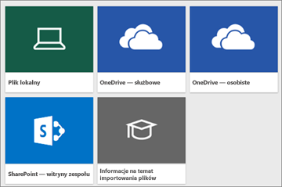

# Jakie przykładowe dane są dostępne do użycia w usłudze Power BI?
Załóżmy, że jesteś nowym użytkownikiem usługi Power BI i chcesz ją wypróbować, ale nie masz żadnych danych.  A może masz zestaw danych, ale ponieważ nie rozumiesz (jeszcze) jak działa usługa Power BI, martwisz się, że możesz w jakiś sposób uszkodzić swój zestaw danych?

Nie musisz się stresować. Firmy obviEnce ([www.obvience.com](http://www.obvience.com/)) i Microsoft utworzyły przykłady, z których możesz korzystać, dopóki nie poczujesz się pewniej w użytkowaniu usługi Power BI.  Dane są anonimowe i reprezentują różne branże: finanse, kadry, sprzedaż i inne. W miarę zapoznawania się z naszą dokumentacją online odkryjesz samouczki i przykłady, które korzystają z tych próbek danych, więc będziesz w stanie z nich skorzystać.      

   

Każda próbka jest dostępna w różnych formatach: jako pakiet zawartości, skoroszyt programu Excel i plik pbix. Jeśli nie wiesz, czym są te elementy lub jak się nimi posługiwać — nie martw się. Wyjaśnimy to w dalszej części tego artykułu. Ponadto dla każdego przykładu utworzyliśmy *przewodnik*, czyli rodzaj artykułu, który opowiada historię stojącą za przykładem i prowadzi Cię przez różne scenariusze. Jeden scenariusz może obejmować odpowiadanie na pytania menedżera, inny może skupiać się na poszukiwaniu informacji zapewniających przewagę konkurencyjną lub tworzeniu raportów i pulpitów nawigacyjnych do udostępniania, a kolejny na wyjaśnianiu zmian biznesowych.   

Zanim zaczniemy, przeczytaj poniższe wskazówki prawne dotyczące korzystania z tych przykładów. Kiedy skończysz, przedstawimy przykłady i pokażemy jak ich używać.   

## Wskazówki dotyczące przykładowych skoroszytów programu Excel dla usługi Power BI
Przeczytaj te informacje przed użyciem przykładów usługi Power BI.

©2015 Microsoft Corporation. Wszelkie prawa zastrzeżone. Dokumenty i skoroszyty są udostępniane w stanie takim, w jakim są. Informacje i poglądy wyrażone w tych skoroszytach, w tym adresy URL i inne odniesienia do witryn internetowych, mogą ulegać zmianie bez powiadomienia. Użytkownik ponosi ryzyko związane z ich użyciem. Niektóre przykłady zostały podane jedynie dla celów ilustracyjnych i są fikcyjne. Żadne rzeczywiste skojarzenia nie są zamierzone ani wnioskowane. Firma Microsoft nie udziela żadnych gwarancji, jawnych lub domniemanych, w odniesieniu do informacji podanych w tym miejscu.

Skoroszyty nie zapewniają jakichkolwiek praw do własności intelektualnej w jakimkolwiek produkcie firmy Microsoft. Możesz skopiować ten skoroszyt i używać go do wewnętrznych celów referencyjnych.

Skoroszyty i powiązane dane są zapewniane przez firmę obviEnce. [www.obvience.com](http://www.obvience.com)

ObviEnce jest niezależnym dostawcą oprogramowania oraz inkubatorem własności intelektualnej skupiającym się na pakiecie Microsoft Business Intelligence. ObviEnce ściśle współpracuje z firmą Microsoft, aby opracowywać najlepsze rozwiązania i idee kierownicze umożliwiające szybkie uruchamianie i wdrażanie rozwiązań Microsoft Business Intelligence.

Skoroszyty i dane są własnością firmy obviEnce, LLC i zostały udostępnione wyłącznie w celu zademonstrowania funkcji usługi Power BI z wykorzystaniem przykładowych danych branżowych.

Wszelkie przypadki użycia skoroszytów i/lub danych muszą uwzględniać powyższe uznanie autorstwa (dotyczy to również arkusza informacyjnego dołączanego do każdego skoroszytu). Do skoroszytu i wszelkich wizualizacji musi być dołączane następujące powiadomienie o prawach autorskich: obviEnce ©.

Klikając dowolny z poniższych linków w celu pobrania plików skoroszytów programu Excel lub plików pbix, akceptujesz powyższe warunki.

## Dostępne przykłady
Do użycia jest dostępnych osiem przykładów.  Każdy z nich reprezentuje inną branżę.

### Przykład Customer Profitability 
[Zobacz przewodnik po przykładzie Customer Profitability](sample-customer-profitability.md)

Ten branżowy przykład analizuje kluczowe metryki dyrektora finansowego pod kątem kadry kierowniczej, produktów i klientów. Możesz zbadać, które czynniki mają wpływ na rentowność przedsiębiorstwa.

### Przykład Human Resources 
[Zobacz przewodnik po przykładzie Human Resources](sample-human-resources.md)

Ten branżowy przykład skupia się na strategii zatrudniania w firmie poprzez analizowanie nowych pracowników, aktywnych pracowników i pracowników, którzy odeszli z firmy.  Eksplorując dane, możesz znaleźć trendy związane z odejściami z pracy oraz tendencje strategii zatrudniania.

### Przykład IT Spend Analysis 
[Zobacz przewodnik po przykładzie IT Spend Analysis](sample-it-spend.md)

W tym branżowym przykładzie analizujemy prognozowane i faktyczne koszty działu IT w firmie. To porównanie pomaga nam zrozumieć, jak dobrze firma zaplanowała rok, i zbadać obszary wykazujące duże odchylenia od planu. Firma w tym przykładzie przechodzi przez roczny cykl planowania, a następnie co kwartał wydaje nowe najnowsze oszacowanie, aby pomóc w analizowaniu zmian w wydatkach na zasoby informatyczne w roku obrachunkowym.

### Przykład Opportunity Analysis 
[Zobacz przewodnik po przykładzie Opportunity Analysis](sample-opportunity-analysis.md)

Ten branżowy przykład eksploruje kanał sprzedażowy firmy zajmującej się oprogramowaniem. Menedżerowie ds. sprzedaży monitorują bezpośrednie i partnerskie kanały sprzedaży, śledząc szanse sprzedaży i zyski według regionu, rozmiaru transakcji i kanału.

### Przykład Procurement Analysis 
[Zobacz przewodnik po przykładzie Procurement Analysis](sample-procurement.md)

Ten branżowy przykład analizuje kluczowe metryki dyrektora finansowego pod kątem kadry kierowniczej, produktów i klientów. Możesz zbadać, które czynniki mają wpływ na rentowność przedsiębiorstwa

### Przykład Retail Analysis 
[Zobacz przewodnik po przykładzie Retail Analysis](sample-retail-analysis.md)

Ten branżowy przykład przedstawia analizę danych sprzedaży detalicznej towarów w wielu sklepach i regionach. Metryki porównują tegoroczne i ubiegłoroczne wyniki w następujących obszarach: sprzedaż, liczba jednostek, marża brutto i odchylenia, a także analizują nowe sklepy.

### Przykład Sales and Marketing 
[Zobacz przewodnik po przykładzie Sales and Marketing ](sample-sales-and-marketing.md)

Ten branżowy przykład przedstawia analizę firmy produkcyjnej, VanArsdel Ltd. Umożliwia ona dyrektorowi ds. marketingu obserwowanie branży i udziału firmy VanArsdel w rynku.  Eksplorując ten przykład, możesz znaleźć udział firmy w rynku, ilość produktów, sprzedaż oraz nastrój klientów.

### Przykład Supplier Quality 
[Zobacz przewodnik po przykładzie Supplier Quality](sample-supplier-quality.md)

Ten branżowy przykład skupia się na jednym z typowych wyzwań łańcucha dostaw — analizie jakości dostawców. W tej analizie główną rolę odgrywają dwie podstawowe metryki: łączna liczba defektów oraz łączny czas przestojów spowodowanych przez te defekty. Ten przykład ma dwa główne cele: poznanie najlepszego i najgorszego dostawcy w zakresie jakości oraz zidentyfikowanie zakładów, które lepiej sobie radzą w wykrywaniu i odrzucaniu defektów w celu zminimalizowania czasu przestoju.

Teraz wiesz, co jest dostępne. Nadszedł czas, aby dowiedzieć się, jak uzyskać te przykłady.  

## Jak uzyskać przykłady
Jak już wspomniano powyżej, przykłady są dostępne w kilku formatach: jako pakiety zawartości, skoroszyty programu Excel oraz pliki pbix. Opiszemy sposób używania każdego z tych formatów, począwszy od pakietów zawartości.

## Przykłady usługi Power BI jako pakiety zawartości
Pakiety zawartości są jedynym formatem przykładów, który jest dostępny z poziomu usługi Power BI. Nie musisz opuszczać usługi Power BI, aby je znaleźć. Pakiet zawartości jest zasadniczo pakietem zawierającym co najmniej jeden pulpit nawigacyjny, zestaw danych i raport, który został przez kogoś utworzony i może być używany w usłudze Power BI. Pakiety zawartości są tworzone, aby udostępniać je współpracownikom. Każdy z przykładowych pakietów zawartości Power BI zawiera zestaw danych, raport i pulpit nawigacyjny.  Pakiety zawartości nie są dostępne dla programu Power BI Desktop. Jeśli chcesz dowiedzieć się więcej na temat pakietów zawartości, zobacz [Intro to content packs in Power BI (Wprowadzenie do pakietów zawartości w usłudze Power BI)](service-organizational-content-pack-introduction.md).

### Pobieranie i otwieranie przykładowego pakietu zawartości w usłudze Power BI
1. Otwórz usługę Power BI (app.powerbi.com) i zaloguj się.
2. W lewym dolnym rogu wybierz opcję **Pobierz dane**.
   
    
3. Na wyświetlonej stronie Pobieranie danych wybierz ikonę **Przykłady**.
   
   
4. Wybierz jeden z przykładów, aby otworzyć jego opis. Następnie wybierz pozycję **Połącz**.  
   
   
5. Usługa Power BI zaimportuje pakiet zawartości i doda nowy pulpit nawigacyjny, raport oraz zestaw danych do bieżącego obszaru roboczego. Nowa zawartość jest oznaczona żółtą gwiazdką. Przeprowadź test działania usługi Power BI za pomocą przykładów.  
   
   

Teraz, gdy masz dane, jesteś na dobrej drodze.  Spróbuj skorzystać z naszych samouczków przy użyciu przykładowych pakietów zawartości lub po prostu uruchom usługę Power BI i zapoznaj się z nią.

## Przykłady usługi Power BI jako pliki programu Excel
Każdy z tych przykładowych pakietów zawartości jest również dostępny jako skoroszyt programu Excel. Skoroszyty programu Excel są przeznaczone do użycia z usługą Power BI.  

1. Pobierz pliki oddzielnie przy użyciu poniższych linków lub [pobierz plik zip ze wszystkimi plikami przykładowymi](http://go.microsoft.com/fwlink/?LinkId=535020). Jeśli jesteś użytkownikiem zaawansowanym, możesz pobrać skoroszyty programu Excel, aby eksplorować lub edytować modele danych.
   
   * [Przykład Retail Analysis](http://go.microsoft.com/fwlink/?LinkId=529778)
   * [Przykład Supplier Quality Analysis](http://go.microsoft.com/fwlink/?LinkId=529779)
   * [Przykład Human Resources](http://go.microsoft.com/fwlink/?LinkId=529780)
   * [Przykład Customer Profitability](http://go.microsoft.com/fwlink/?LinkId=529781)
   * [Przykład Opportunity Tracking](http://go.microsoft.com/fwlink/?LinkId=529782)
   * [Przykład IT Spend Analysis](http://go.microsoft.com/fwlink/?LinkId=529783)
   * [Przykład Procurement Analysis](http://go.microsoft.com/fwlink/?LinkId=529784)
   * [Przykład Sales and Marketing](http://go.microsoft.com/fwlink/?LinkId=529785)
2. Zapisz pobrany plik. Miejsce zapisu pliku ma znaczenie.
   
   *  **Lokalnie** — jeśli zapiszesz plik na dysku lokalnym na komputerze lub w innej lokalizacji w organizacji, będzie można zaimportować plik do usługi Power BI z jej poziomu. Plik pozostanie na dysku lokalnym, więc tak naprawdę nie jest w całości importowany do usługi Power BI. Właściwie nowy zestaw danych jest tworzony w witrynie usługi Power BI, a dane oraz, w niektórych przypadkach, model danych, są ładowane do zestawu danych. Jeśli plik zawiera jakiekolwiek raporty, zostaną one wyświetlone w witrynie usługi Power BI w sekcji Raporty.
   *  **OneDrive — dla firm** — jeśli masz usługę OneDrive dla Firm i zalogujesz się do niej przy użyciu tego samego konta, z którego korzystasz do logowania się w usłudze Power BI, zapewnisz najwydajniejszy sposób na utrzymanie synchronizacji pracy w pliku programu Excel, Power BI lub CSV z zestawem danych, raportami oraz pulpitami nawigacyjnymi w usłudze Power BI. Ponieważ usługi Power BI i OneDrive działają w chmurze, usługa Power BI łączy się z plikiem w usłudze OneDrive mniej więcej co godzinę. W przypadku wykrycia jakichkolwiek zmian zestaw danych, raporty i pulpity nawigacyjne zostaną automatycznie zaktualizowane w usłudze Power BI.
   *  **OneDrive — dla osób prywatnych** — w przypadku zapisu plików na własnym koncie w usłudze OneDrive zapewnisz sobie wiele takich samych korzyści, jak w przypadku usługi OneDrive dla Firm. Największa różnica dotyczy pierwszego połączenia z plikiem (przy użyciu opcji Pobierz dane > Pliki > OneDrive — dla osób prywatnych), ponieważ trzeba zalogować się do usługi OneDrive przy użyciu konta Microsoft, które zazwyczaj różni się od konta używanego do logowania w usłudze Power BI. Podczas logowania do usługi OneDrive przy użyciu konta Microsoft należy wybrać opcję Nie wylogowuj mnie. Dzięki temu usługa Power BI będzie w stanie nawiązać połączenie z plikiem co godzinę i zapewnić synchronizację zestawu danych w usłudze Power BI.
   *  **Witryny zespołu programu SharePoint** — zapisywanie plików usługi Power BI w witrynach zespołu programu SharePoint jest bardzo podobne do zapisywania plików w usłudze OneDrive dla Firm. Największa różnica polega na sposobie nawiązywania połączenia z plikiem z poziomu usługi Power BI. Możesz określić adres URL lub połączyć się z folderem głównym.
3. Otwórz usługę Power BI (app.powerbi.com) i zaloguj się.
   
   > [!TIP]
   > W tym momencie można utworzyć nowy pulpit nawigacyjny i nazwać go na podstawie pliku, który planujesz zaimportować.  W przeciwnym razie podczas importowania zestawu danych programu Excel usługa Power BI nie utworzy nowego pulpitu nawigacyjnego o nazwie na podstawie przykładu, ale zamiast tego doda kafelek do obecnie otwartego pulpitu nawigacyjnego. Wybranie tego kafelka spowoduje przeniesienie użytkownika do raportu dotyczącego zestawu danych. Nie jest to bardzo istotna kwestia, ponieważ zawsze można utworzyć nowy pulpit nawigacyjny później, ale rozpoczęcie z nowym pulpitem nawigacyjnym skróci procedurę o krok lub dwa.
   > 
   > 
4. W lewym dolnym rogu wybierz opcję **Pobierz dane**.
   
    
5. Na wyświetlonej stronie Pobieranie danych wybierz pozycję **Pliki > Pobierz**.
   
     
6. Przejdź do lokalizacji, w której pobrano i zapisano przykład.
   
   
7. Wybierz plik, w tym przypadku **Procurement Analysis Sample.xlsx**, który został zapisany w usłudze OneDrive dla Firm, a następnie wybierz opcję **Połącz**.
   
   
8. Wybierz, czy chcesz zaimportować dane, czy przenieść skoroszyt do usługi Power BI i wyświetlić go dokładnie w taki sam sposób, jak w usłudze Excel Online.
   
    
9. Jeśli wybierzesz opcję **Importuj**, usługa Power BI zaimportuje przykładowy skoroszyt i doda go jako nowy zestaw danych o nazwie **Procurement Analysis Sample**.  Jeśli skoroszyt zawiera jakiekolwiek arkusze, tabele lub zakresy Power View bądź model danych, usługa Power BI utworzy również raport (o tej samej nazwie). Ponadto jeśli nie masz jeszcze otwartego pulpitu nawigacyjnego, usługa Power BI utworzy nowy pulpit nawigacyjny. (Jeśli w momencie kliknięcia opcji **Pobierz dane** był otwarty pulpit nawigacyjny, na tym pulpicie nawigacyjnym pojawi się nowy pusty kafelek.  Kliknięcie tego kafelka spowoduje przejście do raportu dla dodanego zestawu danych). Nowa zawartość jest nazwana na podstawie przykładu i jest oznaczona żółtą gwiazdką.
10. Kiedy zostanie wyświetlony ekran **Twój zestaw danych jest gotowy!**, wybierz opcję **Wyświetl zestaw danych** lub **Uzyskaj szybki wgląd w szczegóły** albo po prostu w usłudze Power BI użyj paska nawigacji po lewej stronie, aby znaleźć i otworzyć skojarzony raport i pulpit nawigacyjny.  
    
     

### (Opcjonalnie) Przyjrzyj się przykładom w formacie programu Excel w programie Excel
Chcesz zrozumieć, w jaki sposób dane w skoroszycie programu Excel są konwertowane na zestawy danych i raporty usługi Power BI? Otworzenie przykładów w formacie programu Excel ***w programie Excel*** i sprawdzenie skoroszytów zapewni nieco odpowiedzi.

* Po pierwszym otworzeniu przykładowego skoroszytu w programie Excel możesz zobaczyć dwa ostrzeżenia. Pierwsze z nich informuje o tym, że skoroszyt jest w widoku chronionym. Wybierz opcję **Włącz edytowanie**. Drugie ostrzeżenie może informować o tym, że skoroszyt ma połączenia z danymi zewnętrznymi. Wybierz opcję **Włącz zawartość**.
* Każdy skoroszyt zawiera kilka arkuszy. Ponieważ te przykłady programu Excel zawierają co najmniej jeden arkusz Power View z wizualizacjami, kiedy zaimportujesz plik programu Excel do usługi Power BI, otrzymasz zestaw danych **oraz** raport.
  
   Może być konieczne [włączenie dodatku Power View](https://support.office.com/article/Create-a-Power-View-sheet-in-Excel-2013-B23D768D-7586-47FE-97BD-89B80967A405#__toc328591957).
* Gdzie znajdują się faktyczne dane? Znajdują się w modelu danych Power Pivot. Aby wyświetlić dane, na karcie **PowerPivot** wybierz opcję **Zarządzaj modelem danych**.
  
    Nie widzisz karty PowerPivot? [Włącz dodatek Power Pivot](https://support.office.com/article/Start-Power-Pivot-in-Microsoft-Excel-2013-add-in-A891A66D-36E3-43FC-81E8-FC4798F39EA8). 
* Karta Informacje zawiera informacje dotyczące obviEnce, firmy, która utworzyła przykład.

## Przykłady usługi Power BI jako pliki pbix
Każdy z tych przykładowych pakietów zawartości jest również dostępny jako plik pbix usługi Power BI. Pliki pbix są przeznaczone do użytku z programem Power BI Desktop.  

1. Pobierz poszczególne pliki, korzystając z poniższych linków.
   
   * [Przykład Retail Analysis](http://download.microsoft.com/download/9/6/D/96DDC2FF-2568-491D-AAFA-AFDD6F763AE3/Retail Analysis Sample PBIX.pbix)
   * [Przykład Supplier Quality Analysis](http://download.microsoft.com/download/8/C/6/8C661638-C102-4C04-992E-9EA56A5D319B/Supplier-Quality-Analysis-Sample-PBIX.pbix)
   * [Przykład Human Resources](http://download.microsoft.com/download/6/9/5/69503155-05A5-483E-829A-F7B5F3DD5D27/Human Resources Sample PBIX.pbix)
   * [Przykład Customer Profitability](http://download.microsoft.com/download/6/A/9/6A93FD6E-CBA5-40BD-B42E-4DCAE8CDD059/Customer Profitability Sample PBIX.pbix)
   * [Przykład Opportunity Tracking](http://download.microsoft.com/download/9/1/5/915ABCFA-7125-4D85-A7BD-05645BD95BD8/Opportunity Analysis Sample PBIX.pbix)
   * [Przykład IT Spend Analysis](http://download.microsoft.com/download/E/9/8/E98CEB6D-CEBB-41CF-BA2B-1A1D61B27D87/IT Spend Analysis Sample PBIX.pbix)
   * [Przykład Procurement Analysis](http://download.microsoft.com/download/D/5/3/D5390069-F723-413B-8D27-5888500516EB/Procurement Analysis Sample PBIX.pbix)
   * [Przykład Sales and Marketing](http://download.microsoft.com/download/9/7/6/9767913A-29DB-40CF-8944-9AC2BC940C53/Sales and Marketing Sample PBIX.pbix)
2. Zapisz pobrany plik.
3. W programie Desktop wybierz opcję **Plik > Otwórz** i przejdź do lokalizacji, w której zapisano przykładowy plik pbix.
   
   
4. Wybierz plik pbix, aby otworzyć go w programie Desktop.

## Następne kroki
[Power BI — podstawowe pojęcia](service-basic-concepts.md)

[Tutorial: Connect to the Power BI samples (Samouczek: Nawiązywanie połączenia z przykładami usługi Power BI)](sample-tutorial-connect-to-the-samples.md)

[Źródła danych dla usługi Power BI](service-get-data.md)

Masz więcej pytań? [Odwiedź społeczność usługi Power BI](http://community.powerbi.com/)

