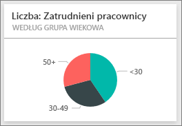

# Próbka danych dotyczących kadr dla usługi Power BI: krótki przewodnik
Dział kadr ma ten sam model raportowania w różnych firmach, nawet wtedy, gdy różnią się one branżą lub wielkością. W tym przykładzie analizujemy nowych pracowników, zatrudnionych pracowników i pracowników, którzy odeszli, w celu wykrycia wszelkich trendów w strategii zatrudniania. Naszymi głównymi celami jest zrozumienie:

* Kogo zatrudniamy
* Czym kierujemy się podczas zatrudniania
* Jakie są trendy dobrowolnych odejść

Te przykładowe dane stanowią części serii ilustrującej, w jaki sposób możesz wykorzystać usługę Power BI w pracy z danymi biznesowymi, raportami i pulpitami nawigacyjnymi. Są to prawdziwe dane pochodzące z firmy obviEnce ([www.obvience.com](http://www.obvience.com/)) przedstawione w sposób anonimowy.

Chcesz z nich skorzystać? W [usłudze Power BI](https://powerbi.com) przejdź do pozycji **Pobierz dane > Przykłady > Przykład Human Resources > Połącz**, aby pobrać własną kopię przykładowych danych.

Możesz też [pobrać sam zestaw danych (skoroszyt programu Excel)](http://go.microsoft.com/fwlink/?LinkId=529780) omawiany w tym przykładzie.

## Nowi pracownicy
Zajmijmy się najpierw badaniem nowych pracowników.

1. W swoim obszarze roboczym wybierz kartę **Pulpity nawigacyjne**, a następnie otwórz pulpit nawigacyjny kadr.
2. Na pulpicie nawigacyjnym wybierz kafelek **Liczba nowych pracowników, Nowi pracownicy w tym samym okresie w zeszłym roku, Zmiana zatrudnienia w % rok do roku** **Według miesiąca**.  
     
   
   Przykładowy raport kadr zostanie otwarty na stronie **Nowi pracownicy**.  
   
   

Zapamiętaj poniższe:

* Wykres kombi **Liczba nowych pracowników, Nowi pracownicy SPLY i Zmiana zatrudnienia w % rok do roku według miesiąca** pokazuje, że zatrudnialiśmy więcej osób każdego miesiąca tego roku w porównaniu do zeszłego roku &#151; znacznie więcej osób w pewnych miesiącach.
* Na wykresie kombi **Liczba nowych pracowników i Liczba zatrudnionych pracowników według regionu i pochodzenia etnicznego** należy zauważyć, że zatrudniamy mniej osób w regionie **Wschodnim**.
* Wykres kaskadowy **Zmiana liczby nowych pracowników rok do roku według grupy wiekowej** pokazuje, że zatrudniamy głównie młodsze osoby. Może to być spowodowane głównie niepełnym wymiarem czasu pracy.
* Wykres kołowy **Liczba nowych pracowników według płci** pokazuje dosyć równy podział.

Czy możesz znaleźć więcej szczegółowych informacji, na przykład region, gdzie podział płci nie jest równy? Wybierz inne grupy wieku oraz płci na wykresach, aby zbadać relacje między wiekiem, płcią, regionem i grupą etniczną.

Wybierz nazwę pulpitu nawigacyjnego z górnego paska nawigacyjnego, aby powrócić do pulpitu nawigacyjnego.

## Porównanie obecnie zatrudnionych i byłych pracowników
Przyjrzyjmy się danym obecnie zatrudnionych pracowników i pracowników, którzy już nie pracują dla firmy.

Na pulpicie nawigacyjnym wybierz kafelek **Liczba zatrudnionych pracowników według grupy wiekowej**.  

Przykładowy raport kadr zostanie otwarty na stronie **Zatrudnieni pracownicy a odejścia**.  

**Interesujące elementy**:

* Wykresy kombi po lewej stronie pokazują zmiany rok do roku dla zatrudnionych pracowników i odejść. W tym roku mamy więcej zatrudnionych dzięki szybkiemu zatrudnianiu, ale również więcej odejść niż w zeszłym roku.
* W sierpniu było więcej odejść w porównaniu do innych miesięcy. Wybierz inne grupy wiekowe, płci lub regiony, aby zobaczyć, czy możesz znaleźć jakiekolwiek elementy odstające.
* Patrząc na wykresy kołowe, zauważymy, że mamy całkiem równy podział wśród naszych zatrudnionych pracowników według płci i grup wiekowych. Wybierz różne grupy wiekowe, aby zobaczyć, jak podział płci różni się w zależności od wieku. Czy mamy równy podział według płci w każdej grupie wiekowej? 

## Przyczyny odejść
Przyjrzyjmy się raportowi w widoku do edycji. Wybierz pozycję **Edytuj raport** w lewym górnym rogu. 

Zmień wykresy kołowe, aby pokazać dane odejść zamiast zatrudnienia.

1. Wybierz wykres kołowy **Liczba zatrudnionych pracowników według grupy wiekowej**.
2. W pozycji **Pola** wybierz strzałkę obok pozycji **Pracownicy**, aby rozszerzyć tabelę Pracownicy. Wyczyść pole wyboru obok pozycji **Liczba zatrudnionych pracowników**, aby usunąć to pole.
3. Zaznacz pole wyboru obok pozycji **Liczba odejść** w tabeli Pracownicy, aby dodać ją do pola **Wartości** w źródle pola.
4. Wracając do kanwy raportu, wybierz słupek **Dobrowolne** na wykresie słupkowym **Liczba odejść według powodu odejścia**. To powoduje zaznaczenie tych, którzy dobrowolnie odeszli, na innych elementach wizualnych w raporcie.
5. Kliknij wycinek 50+ na wykresie kołowym Liczba odejść według grupy wiekowej.
   
   Spójrz na wykres liniowy Odejścia według przyczyny w prawym dolnym rogu. Ten wykres jest filtrowany w celu wyświetlania dobrowolnych odejść.  
   
   
   Widzisz trend w grupie wiekowej 50+? W dalszej części roku więcej pracowników w wieku powyżej 50 lat odchodzi dobrowolnie. Będzie to obszar, który trzeba dokładniej zbadać korzystając z większej ilości danych.
6. Możesz wykonać te same kroki dla wykresu kołowego **Liczba zatrudnionych pracowników według płci**, zmieniając go na odejścia zamiast zatrudnionych pracowników. Spójrz na dane dobrowolnych odejść według płci, aby zobaczyć, czy znajdziesz jakiekolwiek inne informacje szczegółowe.
7. Kliknij pozycję **Power BI** na górnym pasku nawigacyjnym, aby powrócić do pulpitu nawigacyjnego. Możesz zapisać zmiany wprowadzone do raportu lub nie.

## Nietrafione zatrudnienie
Ostatnim badanym obszarem jest nietrafione zatrudnienie. Nietrafione zatrudnienie jest definiowane jako zatrudnieni, którzy nie wytrwali dłużej niż 60 dni. My szybko zatrudniamy. Czy zatrudniamy dobrych kandydatów?

1. Wybierz kafelek pulpitu nawigacyjnego **Nietrafione zatrudnienie jako % zatrudnionych według grupy wiekowej**. Spowoduje to otwarcie raportu na stronie 3 „Nietrafione zatrudnienie”.
   
     
2. Zaznacz pole wyboru **Północno-zachodni** we fragmentatorze regionu po lewej stronie i wycinek **Męski** na wykresie pierścieniowym Liczba nietrafnie zatrudnionych według płci.  Spójrz na inne wykresy na stronie „Nietrafione zatrudnienie”. Więcej nietrafnie zatrudnionych mężczyzn niż kobiet i wielu nietrafnie zatrudnionych w grupie A.
     
3. Patrząc na wykres pierścieniowy **Nietrafione zatrudnienie według płci** i klikając fragmentator **Region**, zauważymy, że wschód to jedyny region, gdzie jest więcej nietrafnie zatrudnionych kobiet niż mężczyzn.  
4. Wybierz nazwę pulpitu nawigacyjnego z górnego paska nawigacyjnego, aby powrócić do pulpitu nawigacyjnego.

## Zadawanie pytania w polu funkcji pytań i odpowiedzi
[Pole pytania funkcji pytań i odpowiedzi](service-how-to-q-and-a.md) jest miejscem, gdzie wpisujesz pytanie przy użyciu języka naturalnego. Funkcja pytań i odpowiedzi rozpoznaje wpisywane słowa i określa, gdzie w Twoim zestawie danych znaleźć odpowiedź.

1. Kliknij pole pytania funkcji pytań i odpowiedzi. Zauważ, że jeszcze przed rozpoczęciem pisania pole pytań i odpowiedzi zawiera sugestie:
   
   
2. Możesz wybrać jedną z tych sugestii lub wpisać: **pokaż grupę wiekową, płeć i nietrafne zatrudnienie SPLY, gdy regionem jest wschód**.  
   
   
   
   Należy zauważyć, że większość nietrafnie zatrudnionych kobiet ma mniej niż 30 lat.

Pracując na danych w tym środowisku, nie musisz się niczego obawiać. Zawsze możesz zrezygnować z zapisania wprowadzonych zmian. Jeśli jednak je zapiszesz, możesz przejść do obszaru **Pobieranie danych** i pobrać nową kopię zestawu danych użytego w tym przykładzie.

## Następne kroki: łączenie z danymi
Mamy nadzieję, że dzięki temu przewodnikowi wiesz już, że pulpity nawigacyjne usługi Power BI, funkcja Pytania i odpowiedzi oraz raporty mogą okazać się niezastąpione w uzyskiwaniu informacji o danych dotyczących kadr. Teraz Twoja kolej — połącz się ze swoimi danymi. Usługa Power BI umożliwia nawiązanie połączenia z różnymi źródłami danych. Dowiedz się więcej o [rozpoczynaniu pracy z usługą Power BI](service-get-started.md).  

