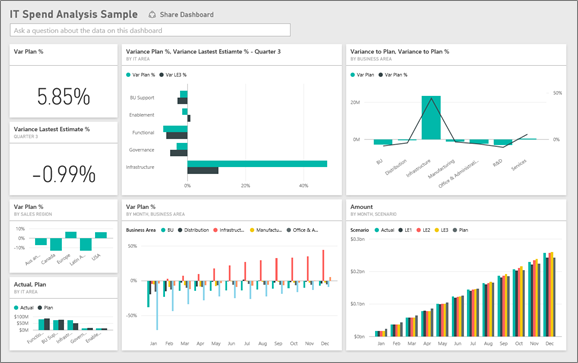

# Przykład IT Spend Analysis dla usługi Power BI: krótki przewodnik
[Pakiet zawartości](service-organizational-content-pack-introduction.md) IT Spend Analysis (pulpit nawigacyjny, raport i zestaw danych) służy do analizy planowanych i rzeczywistych kosztów działu IT. To porównanie pomaga nam zrozumieć, jak dobrze firma zaplanowała rok, i zbadać obszary wykazujące duże odchylenia od planu. Firma w tym przykładzie przechodzi przez roczny cykl planowania, a następnie co kwartał wydaje nowe najnowsze oszacowanie, aby pomóc w analizowaniu zmian w wydatkach na zasoby informatyczne w roku obrachunkowym.

Te przykładowe dane stanowią części serii ilustrującej, w jaki sposób można wykorzystać usługę Power BI w pracy z danymi biznesowymi, raportami i pulpitami nawigacyjnymi. Są to prawdziwe dane pochodzące z firmy obviEnce (<http://obvience.com/>) przedstawione w sposób anonimowy.

* [Pobierz pakiet zawartości IT Spend Analysis](sample-tutorial-connect-to-the-samples.md)
* [Pobierz tylko zestaw danych (skoroszyt programu Excel) omawiany w tym przykładzie](http://go.microsoft.com/fwlink/?LinkId=529783).

## Przykładowy pulpit nawigacyjny z zestawu IT Spend Analysis
Dwa kafelki z liczbami na pulpicie nawigacyjnym, **Var Plan %** (Wariancja względem planu %) oraz **Variance Latest Estimate % Quarter 3** (Wariancja względem najnowszych danych szacunkowych % dotyczących 3. kwartału), zapewniają przegląd rzeczywistych wydatków w odniesieniu do najnowszych danych szacunkowych dla kwartału (LE3 = Latest Estimate Quarter 3). Ogólnie plan został przekroczony o 6%. Zbadajmy przyczynę tej wariancji — kiedy, gdzie i w jakiej kategorii miała miejsce?

## Strona „YTD IT Spend Trend Analysis” (Analiza trendów wydatków na zasoby informatyczne od początku roku)
Wybranie kafelka pulpitu nawigacyjnego **Var Plan % by Sales Region** (Wariancja względem planu % wg regionu sprzedaży) powoduje przejście do strony „IT Spend Trend Analysis” (Analiza trendów wydatków na zasoby informatyczne) w przykładowym raporcie analizy wydatków na zasoby informatyczne. Na pierwszy rzut oka można dostrzec, że dodatnia wariancja występuje w Stanach Zjednoczonych i Europie, a ujemna wariancja występuje w Kanadzie, Ameryce Łacińskiej i Australii. W Stanach Zjednoczonych występuje dodatnia wariancja na poziomie około 6% względem najnowszych danych szacunkowych, a w Australii występuje ujemna wariancja na poziomie około 7% względem najnowszych danych szacunkowych.

Wyciąganie wniosków wyłącznie na podstawie tego wykresu może być mylące. Musimy przyjrzeć się rzeczywistym wartościom w dolarach, aby umieścić dane w odpowiednim kontekście.

1. Wybierz pozycje **Aus i NZ** na wykresie Var Plan % by Sales Region (Wariancja względem planu % wg regionu sprzedaży) i przyjrzyj się wykresowi Var Plan by IT Area (Wariancja względem planu wg obszaru zasobów informatycznych). 
   
   
2. Teraz wybierz pozycję **USA**. Teraz już wiesz, że Australia stanowi niewielką część całkowitych wydatków w porównaniu ze Stanami Zjednoczonymi.
   
    Zawęziliśmy analizę do Stanów Zjednoczonych. Co dalej? Sprawdźmy, która kategoria w Stanach Zjednoczonych powoduje wariancję.

## Zadawanie pytań dotyczących danych
1. Wybierz opcję **Przykład IT Spend Analysis** na górnym pasku nawigacyjnym, aby powrócić do pulpitu nawigacyjnego.
2. W polu pytania wpisz „show IT areas, var plan % and var le3 % bar chart” (pokaż wykres słupkowy dla obszarów zasobów informatycznych, wariancji względem planu % i wariancji względem najnowszych danych szacunkowych % w 3. kwartale).
   
    
   
   W pierwszym obszarze zasobów informatycznych, **Infrastructure** (Infrastruktura), procent zmienił się znacząco między wariancją względem początkowego planu i wariancją względem najnowszych danych szacunkowych.

## Strona „YTD Spend by Cost Elements” (Wydatki wg elementów kosztów od początku roku)
Wróć do pulpitu nawigacyjnego i spójrz na kafelek **Var Plan %, Var LE3%** (Wariancja względem planu %, Wariancja względem najnowszych danych szacunkowych % w 3. kwartale).

Obszar Infrastruktura wyróżnia się ogromną dodatnią wariancją względem planu.

1. Kliknij ten kafelek, aby przejść do strony “YTD Spend by Cost Elements” (Wydatki wg elementów kosztów od początku roku) w przykładowym raporcie analizy wydatków na zasoby informatyczne.
2. Kliknij pasek **Infrastructure** (Infrastruktura) na wykresie „Var Plan % and Var LE3 % by IT Area” (Wariancja względem planu % i wariancja względem najnowszych danych szacunkowych % dla 3. kwartału) w lewym dolnym rogu i przyjrzyj się wariancji względem planu na wykresie „Var Plan % by Sales Region” (Wariancja względem planu % wg regionu sprzedaży) po lewej stronie.
   
    
3. Kliknij nazwy poszczególnych grup elementów kosztów we fragmentatorze, aby znaleźć element kosztów o największej wariancji.
4. Wybierz pozycję **Other** (Inne), kliknij pozycję **Infrastructure** (Infrastruktura) w obszarze IT Area (Obszar zasobów informatycznych) i kliknij obszary podrzędne we fragmentatorze IT Sub Area (Obszar podrzędny zasobów informatycznych), aby znaleźć obszar podrzędny o największej wariancji.  
   
   Widoczna jest ogromna wariancja w obszarze **Networking** (Sieć).
   
   Najwyraźniej firma zdecydowała się zapewnić pracownikom usługi telefoniczne jako świadczenie, ale to działanie nie było planowane. 

## Strona „Plan Variance Analysis” (Analiza wariancji względem planu)
Nadal w raporcie kliknij kartę „Plan Variance Analysis” (Analiza wariancji względem planu) w dolnej części raportu, aby przejść do strony 3 raportu.

Na wykresie kombi „Var Plan, and Var Plan % by Business Area” (Wariancja względem planu i Wariancja względem planu % wg obszarów działalności) po lewej stronie kliknij kolumnę infrastruktury, aby wyróżnić wartości infrastruktury w pozostałej części strony.

Na wykresie „Var plan% by Month and Business Area” (Wariancja względem planu % wg miesięcy i obszarów działalności) należy zauważyć, że dodatnia wariancja w obszarze infrastruktury zaczęła występować około lutego i stale rośnie. Należy również zauważyć, że wartość wariancji względem planu dotycząca infrastruktury różni się w zależności od kraju w porównaniu z wartościami dla wszystkich obszarów działalności. Użyj fragmentatorów „IT Area” (Obszar zasobów informatycznych) i „Sub IT Areas” (Obszary podrzędne zasobów informatycznych) po prawej stronie, aby filtrować wartości w pozostałej części strony, zamiast je wyróżniać. Klikaj różne obszary zasobów informatycznych po prawej stronie, aby przeglądać dane w inny sposób. Możesz również klikać obszary podrzędne zasobów informatycznych, aby wyświetlić wariancję na tym poziomie.

## Edytowanie raportu
Kliknij pozycję **Edytuj raport** w prawym górnym rogu i przeglądaj raport w widoku edycji.

* Zobacz, jak zbudowane są strony — pola na poszczególnych wykresach, filtry na stronach.
* Dodawanie stron i wykresów w oparciu o te same dane
* Zmiana typu wizualizacji dla poszczególnych wykresów
* Przypinanie elementów do pulpitu nawigacyjnego

Pracując na danych w tym środowisku, nie musisz się niczego obawiać. Zawsze możesz zrezygnować z zapisania wprowadzonych zmian. Jeśli jednak je zapiszesz, możesz przejść do obszaru Pobieranie danych i pobrać nową kopię zestawu danych użytego w tym przykładzie.

## Następne kroki: łączenie z danymi
Mamy nadzieję, że dzięki temu przewodnikowi wiesz już, że pulpity nawigacyjne usługi Power BI, aparat Pytania i odpowiedzi oraz raporty mogą okazać się niezastąpione w uzyskiwaniu informacji o danych dotyczących wydatków na zasoby informatyczne. Teraz Twoja kolej — połącz się ze swoimi danymi. Usługa Power BI umożliwia nawiązanie połączenia z różnymi źródłami danych. Dowiedz się więcej o [rozpoczynaniu pracy z usługą Power BI](service-get-started.md).

