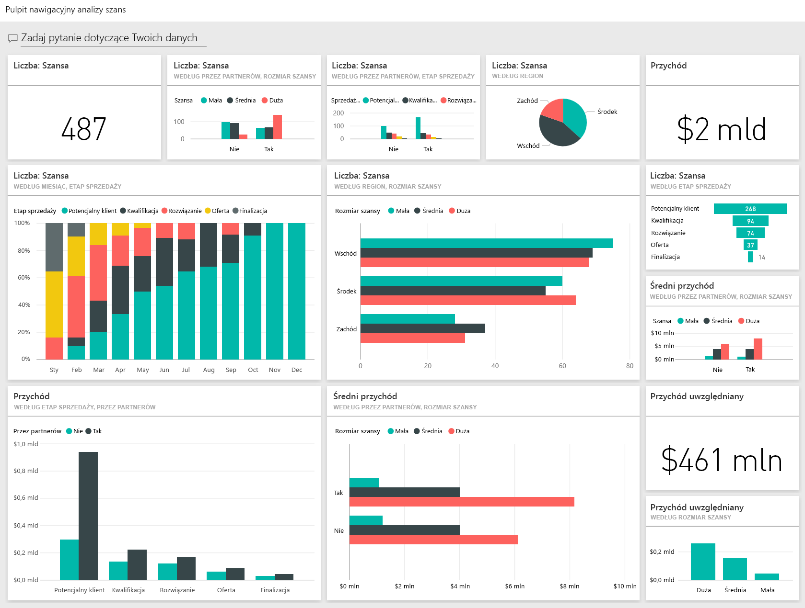
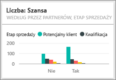
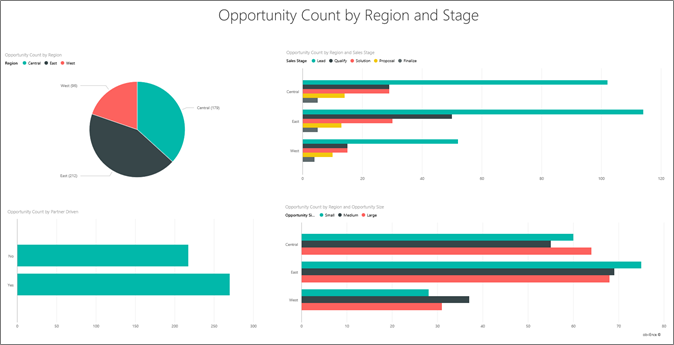

# Próbka danych do analizy szans biznesowych dla usługi Power BI: krótki przewodnik

## Omówienie przykładu Opportunity Analysis
**Przykład Opportunity Analysis** zawiera pulpit nawigacyjny (oraz skojarzony raport) dotyczący firmy zajmującej się oprogramowaniem, która posiada 2 kanały sprzedaży: *bezpośredni* i *partnerski*. Menedżer ds. sprzedaży utworzył ten pulpit nawigacyjny, aby śledzić możliwości biznesowe i przychody wg regionu, wielkości umowy i kanału.

Kierownik ds. sprzedaży bazuje na dwóch wskaźnikach przychodów:

* **Przychód** — jest to oszacowanie sprzedawcy w zakresie spodziewanego w jego ocenie przychodu.
* **Przychód uwzględniany** — obliczany jako procentowe prawdopodobieństwo przychodu X i powszechnie uznawany za dokładniejszy wskaźnik rzeczywistego przychodu ze sprzedaży. Prawdopodobieństwo jest określane na podstawie bieżącego ***etapu sprzedaży*** dla transakcji.
  * Potencjalny klient — 10%  
  * Kwalifikacja — 20%  
  * Rozwiązanie — 40%  
  * Oferta — 60%  
  * Finalizacja — 80%

  

Te przykładowe dane stanowią części serii ilustrującej, w jaki sposób można wykorzystać usługę Power BI w pracy z danymi biznesowymi, raportami i pulpitami nawigacyjnymi. Są to prawdziwe dane pochodzące z firmy obviEnce ([www.obvience.com](http://www.obvience.com/)) przedstawione w sposób anonimowy.

## Wymagania wstępne

 Zanim będzie można korzystać z przykładu, trzeba go najpierw pobrać jako [pakiet zawartości](https://docs.microsoft.com/power-bi/sample-opportunity-analysis#get-the-content-pack-for-this-sample), [plik pbix](http://download.microsoft.com/download/9/1/5/915ABCFA-7125-4D85-A7BD-05645BD95BD8/Opportunity-Analysis-Sample-PBIX.pbix) lub [skoroszyt programu Excel](http://go.microsoft.com/fwlink/?LinkId=529782).

### Pobieranie pakietu zawartości dla tego przykładu

1. Otwórz usługę Power BI (app.powerbi.com) i zaloguj się.
2. W lewym dolnym rogu wybierz opcję **Pobierz dane**.
   
    
3. Na wyświetlonej stronie Pobieranie danych wybierz ikonę **Przykłady**.
   
   
4. Wybierz pozycję **Przykład Opportunity Analysis**, a następnie wybierz polecenie **Połącz**.  
  
   
   
5. Usługa Power BI zaimportuje pakiet zawartości i doda nowy pulpit nawigacyjny, raport oraz zestaw danych do bieżącego obszaru roboczego. Nowa zawartość jest oznaczona żółtą gwiazdką. 
   
   
  
### Pobieranie pliku pbix dla tego przykładu

Alternatywnie przykład możesz pobrać jako plik pbix, który został zaprojektowany do użycia w programie Power BI Desktop. 

 * [Przykład Opportunity Analysis](http://download.microsoft.com/download/9/1/5/915ABCFA-7125-4D85-A7BD-05645BD95BD8/Opportunity%20Analysis%20Sample%20PBIX.pbix)

### Pobieranie skoroszytu programu Excel dla tego przykładu
Możesz też [pobrać sam zestaw danych (skoroszyt programu Excel)](http://go.microsoft.com/fwlink/?LinkId=529782) omawiany w tym przykładzie. Skoroszyt zawiera arkusze programu Power View, które można wyświetlać i modyfikować. Aby wyświetlić nieprzetworzone dane, wybierz pozycje **Power Pivot > Zarządzaj**.

## O czym informuje nas pulpit nawigacyjny?
Nasz kierownik ds. sprzedaży utworzył pulpit nawigacyjny, aby śledzić najważniejsze metryki. W przypadku zauważenia czegoś interesującego może wybrać kafelek, aby bliżej przyjrzeć się tym danym.

1. Przychód firmy wynosi 2 mld USD, zaś przychód uwzględniany 461 mln USD.
2. Liczba szans biznesowych i przychód układają się w podobny wzorzec lejka, z malejącymi wartościami całkowitymi na każdym kolejnym etapie.
3. Większość szans biznesowych jest dostępnych w regionie wschodnim.
4. Duże szanse biznesowe generują większy przychód niż szanse średnie i małe.
5. Duże transakcje partnerskie generują wyższe przychody: średnio 8 mln USD w porównaniu do 6 mln USD dla sprzedaży bezpośredniej.

Ponieważ nakład pracy związany z zawarciem transakcji jest taki sam, niezależnie od tego, czy transakcja jest uznawana za dużą, średnią, czy małą, firma powinna bliżej przyjrzeć się danym, aby dowiedzieć się więcej na temat dużych szans biznesowych.

Wybierz kafelek **Liczba szans biznesowych według kryterium partnerskiego i etapu sprzedaży**, aby otworzyć stronę 1 raportu.  

## Przeglądanie stron w raporcie
### Strona 1 naszego raportu nosi tytuł „Przegląd liczby szans biznesowych”.

* Wschód jest najważniejszym regionem pod względem liczby szans biznesowych.  
* Na wykresie kołowym wybierz kolejno każdy region, aby filtrować strony. W każdym z regionów partnerzy odpowiadają za znacznie większą liczbę dużych szans biznesowych.   
* Wykres kolumnowy liczby szans biznesowych według kryterium partnerskiego i rozmiaru szansy jasno pokazuje, że większość dużych szans biznesowych jest generowanych przez partnerów, a więcej małych i średnich szans biznesowych to szanse niegenerowane przez partnerów.
* Wybierz poszczególne etapy sprzedaży na wykresie słupkowym w lewym dolnym rogu, aby wyświetlić różnice w liczbach dla poszczególnych regionów i zwróć uwagę, że choć region wschodni jest największym regionem pod względem liczb, to w etapach Rozwiązanie, Oferta oraz Finalizacja wszystkie 3 regiony mają porównywalne wartości liczbowe. Oznacza to, że procentowo więcej transakcji dochodzi do skutku w regionie centralnym i zachodnim.

### Strona 2 naszego raportu ma tytuł „Omówienie przychodów”.
Na stronie tej zastosowano podobne spojrzenie na dane jednak z perspektywy przychodów zamiast liczby szans.  

* Region wschodni jest nie tylko największym regionem pod względem liczby szans, lecz także pod względem przychodów.  
* Filtrowanie według kryterium partnerskiego (wybierz pozycję **Tak** w legendzie w prawym górnym rogu) pokazuje przychody na poziomie 1,5 mld USD i 294 mln USD. Dla porównania przychody niegenerowane przez partnerów wynosiły odpowiednio 644 mld USD i 166 mln USD.  
* Średni przychód w przypadku dużych klientów jest wyższy (8 mln) dla szans generowanych przez partnerów w porównaniu do 6 mln dla szans biznesowych niegenerowanych przez partnerów.  
* W odniesieniu do szans biznesowych generowanych przez partnerów przeciętny przychód w przypadku dużych szans biznesowych jest niemal dwukrotnie wyższy niż w przypadku średnich szans biznesowych (4 mln).  
* Średni przychód z tytułu małych i średnich transakcji jest porównywalny dla szans generowanych przez partnerów i pozostałych.   

Nasi partnerzy wyraźnie lepiej radzą sobie ze sprzedażą produktów klientom.  Może się okazać sensowne realizowanie większej liczby transakcji za pośrednictwem partnerów.

### Strona 3 raportu nosi tytuł „Liczby według etapów i regionów”
Ta strona analizuje podobne dane, ale z podziałem na region i etap.  

* Filtrowanie według regionu wschodniego (wybierz pozycję **Wschód** na wykresie kołowym) pokazuje, że szanse biznesowe we wschodnim regionie dzielą się niemal równo na te generowane przez partnerów i bezpośrednio.
* Duże szanse biznesowe występują najczęściej w regionie centralnym, małe w regionie wschodnim, a średnie najczęściej w regionie zachodnim.

### Strona 4 raportu nosi nazwę „Nadchodzące szanse biznesowe”
Ponownie spoglądamy na podobne czynniki, jednak tym razem z perspektywy daty/czasu.  

Dyrektor finansowy używa tej strony do zarządzania obciążeniami. Przyglądając się możliwościom uzyskiwania przychodów w podziale na miesiące i etapy sprzedaży, może odpowiednio planować.

* Średni przychód dla etapu finalizacji jest najwyższy. Realizacja tych transakcji ma najwyższy priorytet.
* Filtrując według miesięcy (przez wybranie nazwy miesiąca w lewym fragmentatorze), widzimy, że na styczeń przypada znaczna część dużych transakcji na etapie finalizacji o uwzględnianym przychodzie na poziomie 75 mln USD. Dla porównania, w lutym mamy przede wszystkim średnie transakcje na etapie rozwiązania i oferty.
* Ogólnie wysokość uwzględnianego przychodu waha się w zależności od etapu sprzedaży, liczby szans biznesowych i rozmiaru transakcji. Dodaj filtry (za pomocą okienka filtrowania po prawej stronie) dla tych czynników, aby poznać dodatkowe szczegółowe informacje.

Pracując na danych w tym środowisku, nie musisz się niczego obawiać. Zawsze możesz zrezygnować z zapisania wprowadzonych zmian. Jeśli jednak je zapiszesz, możesz przejść do obszaru **Pobieranie danych** i pobrać nową kopię zestawu danych użytego w tym przykładzie.

## Następne kroki: łączenie z danymi
Mamy nadzieję, że dzięki temu przewodnikowi wiesz już, że pytania i odpowiedzi, raporty oraz pulpity nawigacyjne usługi Power BI mogą okazać się niezastąpione w uzyskiwaniu szczegółowych informacji pod kątem śledzenia szans biznesowych. Teraz Twoja kolej. Połącz się ze swoimi danymi. Usługa Power BI umożliwia nawiązanie połączenia z różnymi źródłami danych. Dowiedz się więcej o [rozpoczynaniu pracy z usługą Power BI](service-get-started.md).

[Pobierz przykłady](sample-datasets.md)  
