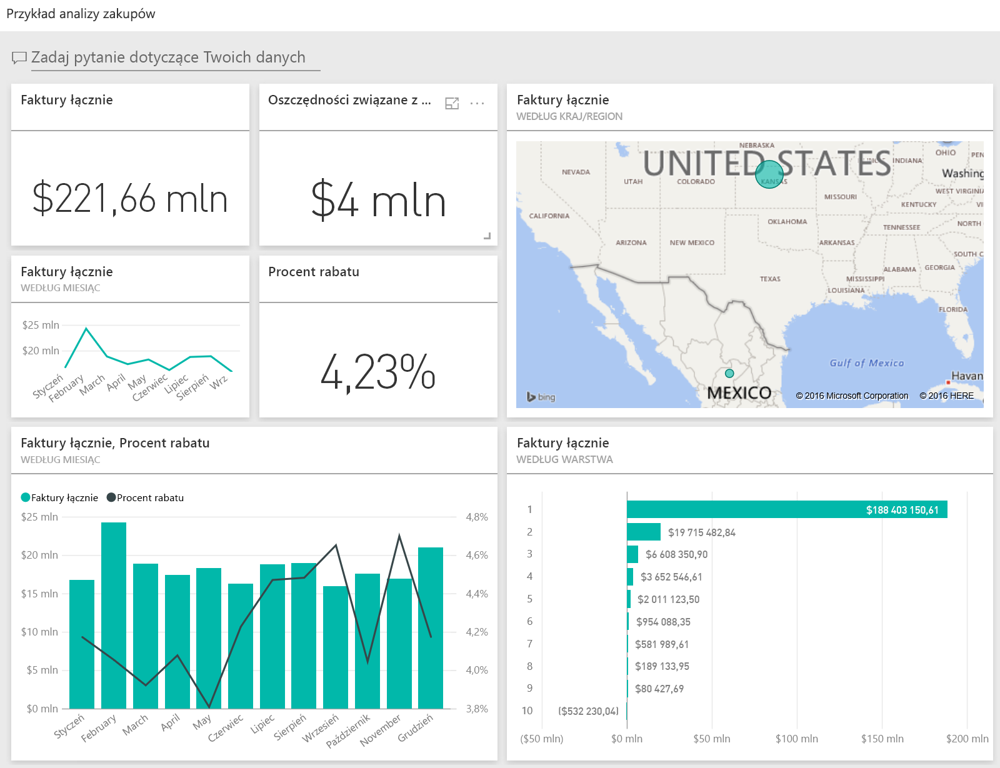
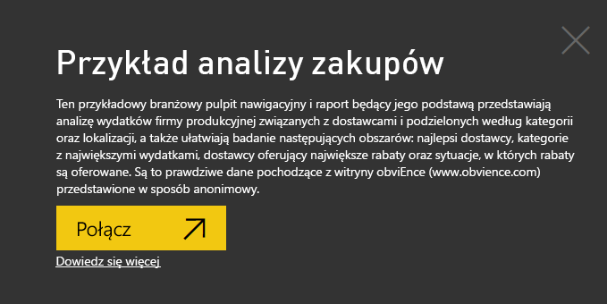
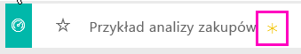
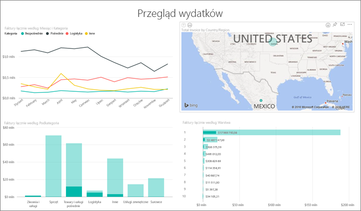
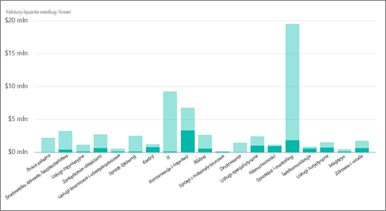
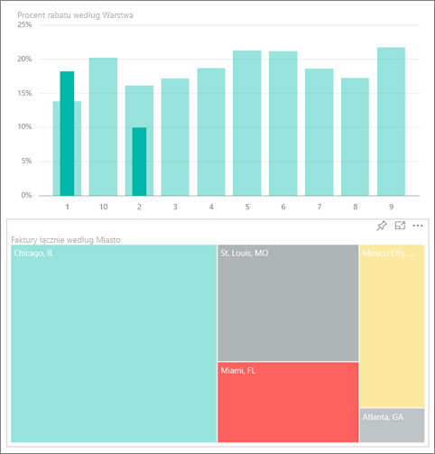
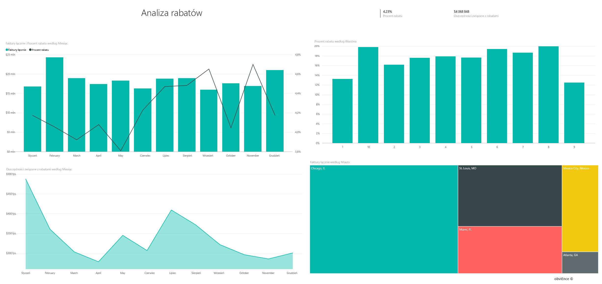
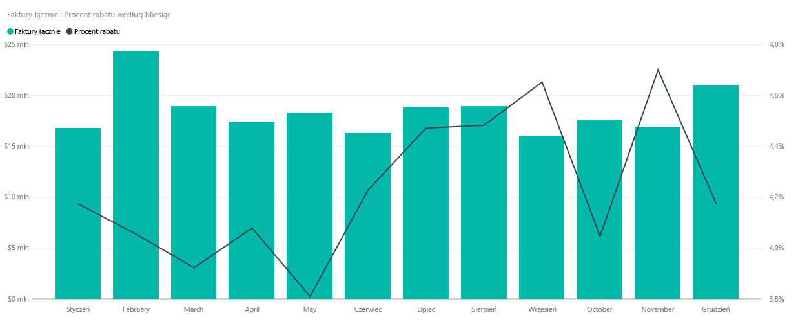
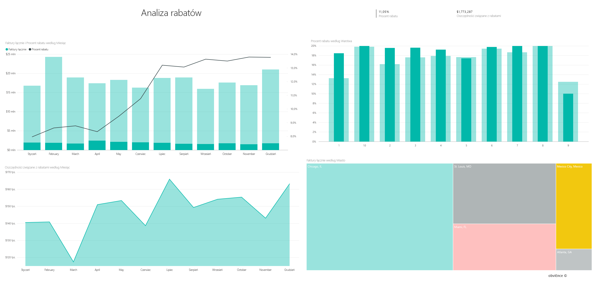

# Próbka danych do analizy zakupów dla usługi Power BI: krótki przewodnik

## Omówienie przykładu Procurement Analysis
Ten pulpit nawigacyjny oparty na próbce branżowej oraz źródłowy raport zapewniają analizę wydatków firmy produkcyjnej na dostawców według kategorii i lokalizacji. W przykładzie zbadamy następujące obszary:

* Kim są najlepsi dostawcy?
* W jakich kategoriach mamy największe wydatki?
* Którzy dostawcy dają nam największe rabaty i kiedy to robią?

Te przykładowe dane stanowią części serii ilustrującej, w jaki sposób można wykorzystać usługę Power BI w pracy z danymi biznesowymi, raportami i pulpitami nawigacyjnymi. Są to prawdziwe dane pochodzące z firmy obviEnce ([www.obvience.com](http://www.obvience.com/)) przedstawione w sposób anonimowy.

## Wymagania wstępne

 Zanim będzie można korzystać z przykładu, trzeba go najpierw pobrać jako [pakiet zawartości](https://docs.microsoft.com/power-bi/sample-procurement#get-the-content-pack-for-this-sample), [plik pbix](http://download.microsoft.com/download/D/5/3/D5390069-F723-413B-8D27-5888500516EB/Procurement%20Analysis%20Sample%20PBIX.pbix) lub [skoroszyt programu Excel](http://go.microsoft.com/fwlink/?LinkId=529784).

### Pobieranie pakietu zawartości dla tego przykładu

1. Otwórz usługę Power BI (app.powerbi.com) i zaloguj się.
2. W lewym dolnym rogu wybierz opcję **Pobierz dane**.
   
    
3. Na wyświetlonej stronie Pobieranie danych wybierz ikonę **Przykłady**.
   
   
4. Wybierz pozycję **Przykład Procurement Analysis**, a następnie wybierz polecenie **Połącz**.  
  
   
   
5. Usługa Power BI zaimportuje pakiet zawartości i doda nowy pulpit nawigacyjny, raport oraz zestaw danych do bieżącego obszaru roboczego. Nowa zawartość jest oznaczona żółtą gwiazdką. 
   
   
  
### Pobieranie pliku pbix dla tego przykładu

Alternatywnie przykład możesz pobrać jako plik pbix, który został zaprojektowany do użycia w programie Power BI Desktop. 

 * [Przykład Procurement Analysis](http://download.microsoft.com/download/D/5/3/D5390069-F723-413B-8D27-5888500516EB/Procurement%20Analysis%20Sample%20PBIX.pbix)

### Pobieranie skoroszytu programu Excel dla tego przykładu
Możesz też [pobrać sam zestaw danych (skoroszyt programu Excel)](http://go.microsoft.com/fwlink/?LinkId=529784) omawiany w tym przykładzie. Skoroszyt zawiera arkusze programu Power View, które można wyświetlać i modyfikować. Aby wyświetlić nieprzetworzone dane, wybierz pozycje **Power Pivot > Zarządzaj**.

## Trendy wydatków
Najpierw przyjrzyjmy się trendom w zakresie wydatków z podziałem na kategorie i lokalizacje.  

1. W obszarze roboczym otwórz kartę **Pulpity nawigacyjne** i wybierz pulpit nawigacyjny analizy zakupów.
2. Wybierz kafelek pulpitu nawigacyjnego **Faktury łącznie według kraju/regionu**. Ponadto spowoduje to otworzenie strony „Przegląd wydatków” raportu „Przykład analizy zakupów”.

    

Zwróć uwagę na kilka rzeczy:

* Na wykresie liniowym **Faktury łącznie według miesiąca i kategorii**: kategoria **Bezpośrednie** zawiera całkiem spójne wydatki, **Logistyka** wykazuje szczyt w grudniu, a szczyt kategorii **Inne** przypada w lutym.
* Na mapie **Faktury łącznie według kraju/regionu**: większość naszych wydatków ma miejsce w USA.
* Na wykresie kolumnowym **Faktury łącznie według podkategorii**: największymi kategoriami wydatków jest **Sprzęt** oraz **Towary i usługi pośrednie**.
* Na wykresie Faktury łącznie według warstwy: większość działalności biznesowej jest prowadzona wraz z warstwą 1 (10 pierwszych) dostawców. Ułatwia to lepsze zarządzanie relacjami z dostawcami.

## Wydatki w Meksyku
Sprawdźmy obszary wydatków w Meksyku.

1. Na wykresie kołowym wybierz bąbelek **Meksyk** na mapie. Zauważ, że na wykresie kolumnowym „Faktury łącznie według podkategorii” większa część przypada w podkategorii **Towary i usługi pośrednie**.

   
2. Przejdź do szczegółowych informacji w kolumnie **Towary i usługi pośrednie**:

   * Wybierz strzałkę przechodzenia do szczegółów  w prawym górnym rogu wykresu.
   * Wybierz kolumnę **Towary i usługi pośrednie**.

      Zdecydowanie największą część wydatków w tej kategorii pochłania Sprzedaż i marketing.
   * Wybierz ponownie **Meksyk** na mapie.

      Największą część wydatków w tej kategorii w Meksyku stanowi Konserwacja i naprawa.

      
3. Wybierz strzałkę w górę w lewym górnym rogu wykresu, aby powrócić do poprzednich informacji szczegółowych.
4. Wybierz strzałkę ponownie, aby wyłączyć przechodzenie do szczegółów.  
5. Wybierz opcję **Power BI** w górnym pasku nawigacyjnym, aby powrócić do obszaru roboczego.

## Ocena różnych miast
Możemy użyć wyróżnienia, aby ocenić różne miasta.

1. Wybierz kafelek pulpitu nawigacyjnego **Faktury łącznie, % rabatu według miesiąca**. Raport zostanie otwarty na stronie „Analiza rabatów”.
2. Wybierz różne miasta na mapie drzewa **Faktury łącznie według miasta**, aby zobaczyć ich porównanie. Prawie wszystkie faktury w Miami pochodzą od dostawców warstwy 1.

   

## Rabaty dostawcy
Przyjrzyjmy się również rabatom dostępnym u dostawców oraz okresom, w których uzyskujemy największe rabaty.

W szczególności szukamy odpowiedzi na poniższe pytania:

* Czy rabaty różnią się w poszczególnych miesiącach, czy też są takie same w każdym miesiącu?
* Czy niektóre miasta uzyskują wyższe rabaty od innych?

### Rabaty według miesięcy
Sprawdzając wykres złożony **Faktury łącznie i % rabatu według miesiąca**, zobaczymy, że **luty** jest najgorętszym miesiącem, a **wrzesień** najspokojniejszym. Teraz sprawdźmy procent rabatu w tych miesiącach.
Zauważ, że wzrost zapotrzebowania oznacza spadek rabatu, a spadek zapotrzebowania to z kolei wzrost rabatu. Im bardziej potrzebujemy rabatu, tym gorszą ofertę otrzymujemy.

### Rabaty według miast
Innym obszarem do zbadania jest rabat według miast. Wybierz każde miasto na mapie drzewa i zobacz, jak zmienia się wykres.

* W St. Louis (MO) odnotowano najwyższy szczyt w liczbie faktur w lutym oraz największy spadek oszczędności związany z rabatami w kwietniu.
* W Meksyku (Meksyk) odnotowano najwyższy procent rabatów (11,05%), a w Atlancie (GA) najniższy (0,08%).

### Edytowanie raportu
Wybierz opcję **Edytuj raport** w lewym górnym rogu i sprawdź widok edycji.

* Zobacz, jak tworzone są strony
* Dodawanie stron i wykresów w oparciu o te same dane
* Zmiana typu wizualizacji dla wykresu — na przykład zmiana mapy drzewa na wykres pierścieniowy
* Przypinanie elementów do pulpitu nawigacyjnego

Pracując na danych w tym środowisku, nie musisz się niczego obawiać. Zawsze możesz zrezygnować z zapisania wprowadzonych zmian. Jeśli jednak je zapiszesz, możesz przejść do obszaru **Pobieranie danych** i pobrać nową kopię zestawu danych użytego w tym przykładzie.

## Następne kroki: łączenie z danymi
Mamy nadzieję, że dzięki temu przewodnikowi wiesz już, że pulpity nawigacyjne usługi Power BI oraz raporty mogą okazać się niezastąpione w uzyskiwaniu informacji o danych dotyczących zakupów. Teraz Twoja kolej. Połącz się ze swoimi danymi. Usługa Power BI umożliwia nawiązanie połączenia z różnymi źródłami danych. Dowiedz się więcej o [rozpoczynaniu pracy z usługą Power BI](service-get-started.md).
