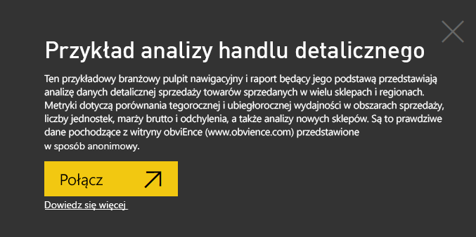

# Próbka analizy handlu detalicznego dla usługi Power BI: krótki przewodnik

Ten przykładowy pulpit nawigacyjny dla branży i raport będący jego podstawą przedstawiają analizę danych sprzedaży detalicznej towarów w wielu sklepach i regionach. Metryki dotyczą porównania tegorocznej i ubiegłorocznej wydajności w następujących obszarach: sprzedaż, liczba jednostek, marża brutto i odchylenia, a także analizy nowych sklepów. Są to prawdziwe dane pochodzące z firmy obviEnce ([www.obvience.com](http://www.obvience.com)) przedstawione w sposób anonimowy.

## Wymagania wstępne

 Zanim będzie można korzystać z przykładu, trzeba go najpierw pobrać jako [pakiet zawartości](https://docs.microsoft.com/en-us/power-bi/sample-datasets#get-and-open-a-sample-content-pack-in-power-bi-service), [plik pbix](http://download.microsoft.com/download/9/6/D/96DDC2FF-2568-491D-AAFA-AFDD6F763AE3/Retail%20Analysis%20Sample%20PBIX.pbix) lub [skoroszyt programu Excel](http://go.microsoft.com/fwlink/?LinkId=529778).

### Pobieranie pakietu zawartości dla tego przykładu

1. Otwórz usługę Power BI (app.powerbi.com) i zaloguj się.
2. W lewym dolnym rogu wybierz opcję **Pobierz dane**.
   
    
3. Na wyświetlonej stronie Pobieranie danych wybierz ikonę **Przykłady**.
   
   
4. Wybierz pozycję **Przykład Retail Analysis**, a następnie wybierz polecenie **Połącz**.  
  
   
   
5. Usługa Power BI zaimportuje pakiet zawartości i doda nowy pulpit nawigacyjny, raport oraz zestaw danych do bieżącego obszaru roboczego. Nowa zawartość jest oznaczona żółtą gwiazdką. 
   
   
  
### Pobieranie pliku pbix dla tego przykładu

Alternatywnie przykład możesz pobrać jako plik pbix, który został zaprojektowany do użycia w programie Power BI Desktop. 

 * [Przykład Retail Analysis](http://download.microsoft.com/download/9/6/D/96DDC2FF-2568-491D-AAFA-AFDD6F763AE3/Retail%20Analysis%20Sample%20PBIX.pbix)

### Pobieranie skoroszytu programu Excel dla tego przykładu
Możesz też [pobrać sam zestaw danych (skoroszyt programu Excel)](http://go.microsoft.com/fwlink/?LinkId=529778) omawiany w tym przykładzie. Skoroszyt zawiera arkusze programu Power View, które można wyświetlać i modyfikować. Aby wyświetlić nieprzetworzone dane, wybierz pozycje **Power Pivot > Zarządzaj**.

## Rozpoczynanie z poziomu pulpitu nawigacyjnego i otwieranie raportu
1. Na pulpicie nawigacyjnym wybierz kafelek „Total Stores” (Łączna liczba sklepów):

     

   Nastąpi przekierowanie na stronę raportu „Store Sales Overview” (Przegląd danych dotyczących sprzedaży). Jak widać, firma dysponuje 104 sklepami, spośród których 10 zostało niedawno otwartych. Sklepy należą do dwóch sieci: Fashions Direct i Lindseys. Średnia powierzchnia sklepów Fashions Direct jest większa.
2. Na wykresie kołowym wybierz pozycję **Fashions Direct**.

     

   Zwróć uwagę na wyniki zaprezentowane na wykresie bąbelkowym:

     

   W regionie FD-01 występuje najwyższa średnia sprzedaż na metr kwadratowy, region FD-02 ma najniższe odchylenie wartości sprzedaży w porównaniu z ostatnim rokiem, a w regionach FD-03 i FD-04 odnotowano najgorsze wyniki.
3. Wybierz pojedyncze bąbelki lub inne wykresy, aby zobaczyć jak poszczególne elementy są ze sobą powiązane.
4. Aby powrócić do pulpitu nawigacyjnego, wybierz odpowiednią nazwę w górnym pasku nawigacyjnym (linki do stron nadrzędnych).

   
5. Na pulpicie nawigacyjnym wybierz kafelek o nazwie „This Year’s Sales” (Sprzedaż w tym roku).

   

   Jest to równoważne wprowadzeniu wyrażenia „This year sales” (Sprzedaż w tym roku) w polu pytań.

   Zostanie wyświetlony następujący ekran:

   

## Przegląd kafelka utworzonego za pomocą aparatu Pytania i odpowiedzi usługi Power BI
Teraz postaramy się uzyskać bardziej szczegółowe informacje.

1. W polu pytań dodaj wyrażenie „this year sales **by district**” (sprzedaż w tym roku według regionu). Sprawdź otrzymany wynik: odpowiedź jest automatycznie umieszczana na wykresie słupkowym i sugerowane są inne wyrażenia:

   
2. Teraz zmień pytanie na „this year sales **by zip and chain**” (sprzedaż w tym roku według kodu pocztowego i nazwy sieci sklepów).

   Zauważ, że w miarę wpisywania uzyskujesz odpowiedź w postaci odpowiednich wykresów.
3. Poeksperymentuj z różnymi pytaniami i zobacz jakie otrzymasz wyniki.
4. W dowolnym momencie możesz powrócić do pulpitu nawigacyjnego.

## Szczegółowe informacje o danych
Teraz przyjrzyjmy się bardziej szczegółowym danym, uwzględniając wyniki osiągane w poszczególnych regionach.

1. Na pulpicie nawigacyjnym wybierz kafelek porównujący sprzedaż z tego roku ze sprzedażą z roku poprzedniego.

   

   Zwróć uwagę na dużą zmienność wartości procentowej odchylenia w odniesieniu do ostatniego roku i na szczególnie niekorzystne wyniki odnotowane w styczniu, kwietniu i lipcu.

   

   Przekonajmy się, czy uda nam się ustalić, co może być powodem otrzymania tak słabych rezultatów.
2. Wybierz wykres bąbelkowy, a następnie pozycję **020-Mens** (020-Mężczyźni).

     

   Zauważ, że spadek odnotowany w kwietniu miał większy wpływ na ogólną sytuację firmy niż na samą kategorię mężczyzn (chociaż dane ze stycznia i lipca i tak były niezadowalające).
3. Teraz wybierz bąbelek **010-Womens** (010-Kobiety).

   

   Kategoria uwzględniająca kobiety wypadła znacznie gorzej w stosunku do ogólnej sytuacji firmy we analizowanych wszystkich miesiącach i o wiele gorzej w prawie każdym miesiącu w porównaniu z rokiem poprzednim.
4. Ponownie wybierz bąbelek, aby wyczyścić filtr.

## Używanie fragmentatora
Przyjrzyjmy się danym dotyczącym poszczególnych regionów.

1. Z fragmentatora po lewej stronie wybierz osobę o nazwisku Allan Guinot.

   

   Zwróć uwagę, że w regionie zarządzanym przez Allana wyniki sprzedaży w marcu i czerwcu były lepsze od zeszłorocznych.
2. Mając nadal zaznaczone nazwisko Allana, wybierz bąbelek dotyczący danych na temat kobiet.

   

   Zauważ, że w przypadku kategorii uwzględniającej kobiety zarządzany przez niego region nigdy nawet nie zdołał osiągnąć sprzedaży na tym samym poziomie co w zeszłym roku.
3. Wypróbuj kombinacje innych kierowników regionów z poszczególnymi kategoriami. Jakie wnioski zauważasz?
4. W dowolnym momencie powróć do pulpitu nawigacyjnego.

## Co o tegorocznym wzroście sprzedaży mówią nam dane?
Ostatni aspekt, który przeanalizujemy dotyczy rozwoju firmy, czyli nowych sklepów otwartych w tym roku.

1. Wybierz kafelek „Stores Opened This Year” (Sklepy otwarte w tym roku).

   

   Jak widać na kafelku, sieć Fashions Direct otwarła w tym roku więcej sklepów niż sieć Lindseys.
2. Przyjrzyj się wykresowi „Sales Per Sq Ft by Name” (Sprzedaż na m2 według nazwy).

   

    Obserwujemy dość znaczną różnicę w średniej sprzedaży na m2 w nowych sklepach.
3. Kliknij element legendy dotyczący sieci Fashions Direct na prawym górnym wykresie. Nawet w obrębie tej samej sieci wyniki sprzedaży najlepszego sklepu (Winchester Fashions Direct) znacznie przewyższają wyniki najgorszego sklepu (Cincinnati 2 Fashions Direct), odnotowując odpowiednio wartości 21,22 USD i 12,86 USD.

   
4. Z poziomu fragmentatora kliknij pozycję Winchester Fashions Direct i przyjrzyj się wykresowi liniowemu. Pierwsze wyniki sprzedaży uwzględniają dane z lutego.
5. We fragmentatorze kliknij sklep Cincinnati 2 Fashions. Zostanie wyświetlony wykres liniowy, z którego dowiesz się, że został on otwarty w czerwcu i jest najprawdopodobniej najgorzej prosperującym sklepem.
6. Tak jak poprzednio, wypróbuj inne możliwości, klikając różne słupki, linie i bąbelki na wykresach. Jakie inne wnioski jesteś w stanie wyciągnąć?

Pracując na danych w tym środowisku, nie musisz się niczego obawiać. Zawsze możesz zrezygnować z zapisania wprowadzonych zmian. Jeśli jednak je zapiszesz, możesz przejść do obszaru Pobieranie danych i pobrać nową kopię zestawu danych użytego w tym przykładzie.

## Łączenie z danymi
Mamy nadzieję, że dzięki temu przewodnikowi wiesz już, że pulpity nawigacyjne usługi Power BI, aparat Pytania i odpowiedzi oraz raporty mogą okazać się niezastąpione w uzyskiwaniu informacji o danych sieci sprzedaży. Teraz Twoja kolej. Połącz się ze swoimi danymi. Usługa Power BI umożliwia nawiązanie połączenia z różnymi źródłami danych. Dowiedz się więcej o [rozpoczynaniu pracy z usługą Power BI](service-get-started.md).

## Następne kroki
* [Pobieranie przykładowych pakietów zawartości dotyczących analizy handlu detalicznego](sample-tutorial-connect-to-the-samples.md)
* [Pobieranie pliku zip ze wszystkimi przykładowymi plikami](http://go.microsoft.com/fwlink/?LinkId=535020)    
* [Pobieranie przykładowego skoroszytu programu Excel dla usługi Power BI](http://go.microsoft.com/fwlink/?LinkId=529778)    
* [Pobieranie danych (dla usługi Power BI)](service-get-data.md)    
* [Power BI — podstawowe pojęcia](service-basic-concepts.md)    
* Masz więcej pytań? [Odwiedź społeczność usługi Power BI](http://community.powerbi.com/)
