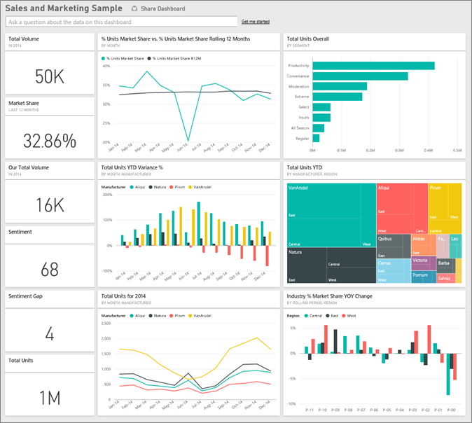
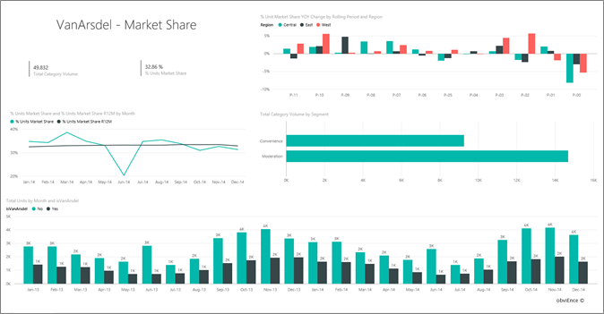

# Próbka danych dotyczących sprzedaży i marketingu dla usługi Power BI: krótki przewodnik
**Próbka danych dotyczących sprzedaży i marketingu** zawiera pulpit nawigacyjny i raport fikcyjnej firmy produkcyjnej o nazwie VanArsdel Ltd. Ten pulpit nawigacyjny został utworzony przez dyrektora ds. marketingu w firmie VanArsdel, aby śledzić udział w rynku, wolumen produktów, sprzedaż i wskaźniki nastrojów klientów branży i swojej firmy.

Firma VanArsdel ma dużą konkurencję, ale jest liderem rynku w swojej branży. Dyrektor ds. marketingu chce zwiększyć udział w rynku i odkryć możliwości wzrostu. Z jakiegoś powodu udział w rynku firmy VanArsdel zaczął maleć, ze znaczącym spadkiem w czerwcu.

Te przykładowe dane stanowią części serii ilustrującej, w jaki sposób można wykorzystać usługę Power BI w pracy z danymi biznesowymi, raportami i pulpitami nawigacyjnymi. Są to prawdziwe dane pochodzące z firmy obviEnce (www.obvience.com) przedstawione w sposób anonimowy.

[!Note] Możesz również [pobrać sam zestaw danych (skoroszyt programu Excel) omawiany w tym przykładzie](http://go.microsoft.com/fwlink/?LinkId=529785). Skoroszyt zawiera arkusze programu Power View, które można wyświetlać i modyfikować. Aby wyświetlić nieprzetworzone dane, wybierz pozycje **Power Pivot > Zarządzaj**.

## O czym informuje nas pulpit nawigacyjny?
Zacznijmy od pulpitu nawigacyjnego i przyjrzyjmy się kafelkom, które dyrektor wybrał do przypięcia. Widzimy informacje o udziale w rynku, sprzedaży i nastrojach. Widzimy także dane według regionu, czasu i konkurencji.

* Kafelki z liczbami wyświetlane w lewej kolumnie pokazują wolumen sprzedaży w branży w ostatnim roku (50 tys.), udział w rynku (32,86%), wielkość sprzedaży (16 tys.), wskaźnik nastrojów (68), lukę nastrojów klientów (4) i sumę jednostek sprzedanych (1 mln).
* Wykres liniowy u góry pokazuje, jak nasz udział w rynku zmienia się wraz z upływem czasu. Nasz udział w rynku naprawdę mocno spadł w czerwcu. Również w ostatnich 12 miesiącach (Rolling 12 Months, wykres kroczący dla 12 miesięcy) nasz udział w rynku, który przez chwilę wzrastał, zaczął spadać.
* Naszym największym konkurentem jest firma Aliqui (widoczna w na kafelku wykresu w środkowej kolumnie).
* Większość naszego biznesu prowadzimy w regionach Wschodnim i Centralnym.
* Wykres liniowy u dołu pokazuje, że nasz spadek w czerwcu nie jest sezonowy — żaden z naszych konkurentów nie odnotował tego samego trendu.
* Dwa kafelki „Total Units” (Łączna liczba jednostek) pokazują liczbę sprzedanych jednostek według segmentu i według regionu/producenta. Największe segmenty rynku dla naszej branży to **Productivity** i **Convenience**.

### Bardziej szczegółowa analiza z wykorzystaniem pytań i odpowiedzi
#### Jakie segmenty napędzają naszą sprzedaż? Czy jest to zgodne z trendem branżowym?
1. Wybierz kafelek „Total Units Overall by Segment” (Łączna ogólna liczba jednostek według segmentu), aby otworzyć funkcję pytań i odpowiedzi.
2. Wpisz **dla VanArsdel** na końcu istniejącego zapytania. Funkcja Pytania i odpowiedzi interpretuje pytanie i wyświetla zaktualizowany wykres z odpowiedzią. Nasz wolumen produktów pochodzi z segmentów Convenience i Moderation.
   
   
3. Nasz udział w kategoriach **Moderation** i **Convenience** jest bardzo duży — to są segmenty, w których konkurujemy.
4. Przejdź z powrotem do pulpitu nawigacyjnego, wybierając nazwę pulpitu nawigacyjnego na górnym pasku nawigacyjnym (linki do stron nadrzędnych).

#### Jak wygląda udział w rynku łącznej liczby jednostek dla kategorii (a jak dla regionu)?
1. Zwróć uwagę na kafelek „Total Units YTD by Manufacturer, Region” (Łączna liczba jednostek OPR według producenta, region). Zastanawiasz się, jak wygląda udział w rynku łącznej liczby jednostek według kategorii? 
   
   
2. W polu pytania, w górnej części pulpitu nawigacyjnego, wpisz pytanie **łączna liczba jednostek według producenta i kategorii 2014 jako mapa drzewa**. Zwróć uwagę na to, jak aktualizowana jest wizualizacja podczas wpisywania pytania.
   
3. Aby porównać wyniki, przypnij wykres do pulpitu nawigacyjnego. Bardzo interesujące: w roku 2014 firma VanArsdel sprzedawała tylko produkty należące do kategorii **Urban**.
4. Przejdź z powrotem do pulpitu nawigacyjnego.

Pulpity nawigacyjne są również punktem wejścia do raportów.  Jeśli kafelek został utworzony na podstawie raportu źródłowego, kliknięcie tego kafelka spowoduje otwarcie raportu. 

Na naszym pulpicie nawigacyjnym wiersz R12M (kroczące 12 miesięcy) pokazuje, że nasz udział w rynku już nie rośnie w czasie, a nawet nieco spada. I dlaczego mamy duży spadek udziału w rynku w czerwcu? Aby zbadać to dokładniej, kliknij tę wizualizację, aby otworzyć raport źródłowy.

### Raport zawiera 4 strony
#### Strona 1 raportu koncentruje się na udziale w rynku firmy VanArsdel.

1. Spójrz na wykres kolumnowy „Total Units by Month and isVanArsdel” (Suma jednostek wg miesięcy i isVanArsdel) u dołu. Czarna kolumna reprezentuje VanArsdel (nasze produkty), a zielona — naszą konkurencję. Spadek w czerwcu 2014, jaki odnotowała firma VanArsdel, nie wystąpił u naszej konkurencji.
2. Wykres słupkowy „Total Category Volume by Segment” (Łączny wolumen dla kategorii według segmentu) w środku po prawej stronie jest filtrowany w celu wyświetlania dwóch najważniejszych segmentów dla firmy VanArsdel. Zobaczmy, jak ten filtr został utworzony:  
   
   a.  Rozwiń okienko Filtry po prawej stronie.  
   b.  Kliknij, aby wybrać wizualizację.  
   c.  W obszarze Filtry na poziomie wizualizacji zwróć uwagę, że **Segment** jest filtrowany w celu uwzględnienia tylko segmentów **Convenience** i **Moderation**.  
   d.  Zmodyfikuj filtr, wybierając pozycję Segment, aby rozwinąć tę sekcję, a następnie zaznaczając pozycję **Productivity**, aby dodać także ten segment.  
3. Na wykresie „Total Units by Month and isVanArsdel” (Łączna liczba jednostek wg miesięcy i isVanArsdel) wybierz czarną pozycję „Yes” (Tak) w obszarze legendy, aby filtrować stronę według firmy VanArsdel. Zwróć uwagę, że nie konkurujemy w segmencie Productivity (Wydajność).
4. Wybierz ponownie czarną pozycję „Yes” (Tak), aby usunąć filtr.
5. Spójrz na wykres liniowy. Przedstawia on nasz miesięczny udział w rynku i udział w rynku dla 12 miesięcy. Dane kroczące dla 12 miesięcy ułatwiają wygładzenie miesięcznych fluktuacji i pokazują długoterminowe trendy. Na wykresie słupkowym wybierz segment Convenience, a następnie Moderation, aby zobaczyć, jak duże są fluktuacje udziału w rynku w przypadku każdego segmentu. Segment Moderation wykazuje większe fluktuacje udziału w rynku niż segment Convenience.

Nadal chcemy się dowiedzieć, dlaczego nasz udział w rynku tak bardzo spadł w czerwcu. Sprawdźmy wskaźniki nastrojów klientów.

#### Strona 3 raportu koncentruje się na nastrojach klientów.

Tweety, wpisy na Facebooku, blogi, artykuły, itp. składają się na wskaźnik nastroju klientów, który jest przedstawiany na dwóch wykresach liniowych. Wykres nastrojów klientów w górnym lewym rogu pokazuje, że wskaźniki nastrojów klientów dotyczące naszych produktów były do lutego raczej neutralne. Następnie w lutym rozpoczął się duży spadek, który osiągnął najniższy poziom w czerwcu. Co było przyczyną tego spadku wskaźnika nastrojów klientów? Musimy przyjrzeć się źródłom zewnętrznym. W lutym pojawiło się kilka artykułów i wpisów na blogu, w których obsługę klienta firmy VanArsdel oceniono jako najgorszą w branży. Ta zła prasa miała bezpośredni wpływ na nastroje klientów i na sprzedaż. Firma VanArsdel włożyła wiele wysiłku, aby poprawić obsługę klienta, a klienci i branża zauważyli to i docenili. W lipcu pozytywne nastroje klientów zaczęły rosnąć, aby następnie osiągnąć i utrzymywać poziom powyżej 60. Ta poprawa nastroju klientów znajduje swoje odzwierciedlenie na wykresach „Total Units by Month” (Łączna liczba jednostek wg miesięcy) na stronach 1 i 3 raportu. Być może to częściowo wyjaśnia spadek naszego udziału w rynku w czerwcu?

Kolejnym obszarem do zbadania jest różnica w nastrojach klientów: dla których regionów różnica w nastrojach klientów jest najwyższa, jak kierownictwo może to wykorzystać i w jaki sposób można to zreplikować w innych regionach.

#### Strona 2 raportu koncentruje się na trendzie kategorii od początku roku.

* Spośród wszystkich firm w tej kategorii firma VanArsdel jest największa, a naszą najpoważniejszą konkurencją są firmy Natura, Aliqui i Pirium. Skupimy się na nich.
* Sprzedaż Aliqui rośnie, ale ich wolumen produktów nadal jest niewielki w porównaniu z naszym.
* Na mapie drzewa firma VanArsdel jest wyświetlana w kolorze zielonym. W regionie wschodnim klienci preferują naszą konkurencję, w regionie centralnym radzimy sobie dobrze, a w regionie wschodnim nasz udział jest naszym najniższym.
* Lokalizacja geograficzna ma wpływ na liczbę sprzedanych jednostek. Wschód jest dominującym regionem dla większości producentów, a firma VanArsdel jest silnie obecna również w regionie centralnym.
* Na wykresie „Total Units YTD Var % by Month and Manufacturer” (Odchylenie procentowe łącznej liczby jednostek OPR według miesiąca i producenta) widocznym u dołu po prawej stronie mamy dodatnie odchylenie, co jest dobrym znakiem. Radzimy sobie lepiej niż w ubiegłym roku, ale inna konkurencyjna firma, Aliqui, również ma lepsze wyniki.

#### Strona 4 raportu koncentruje się na analizie konkurencyjnych produktów.

* Wykres u dołu po lewej stronie pokazuje wszystkie segmenty kategorii z wyjątkiem dwóch najsilniejszych segmentów firmy VanArsdel. Klikając słupki, możemy filtrować wykres według kategorii, aby łatwiej zidentyfikować potencjalne obszary ekspansji dla VanArsdel. Segmenty **Extreme** i **Productivity** rosną szybciej niż inne.
* Ale nie konkurujemy w tych segmentach. Jeśli chcemy przejść do tych obszarów, możemy skorzystać z danych, aby zobaczyć, które segmenty są popularne w poszczególnych regionach. Możemy dokładniej badać pytania, na przykład badać, w którym regionie wzrost jest najszybszy i kto byłby naszym najważniejszym konkurentem w tym segmencie.
* Pamiętasz czerwcowy spadek naszego udziału w rynku? Czerwiec jest świetnym miesiącem dla segmentu Productivity — segmentu, w którym w ogóle nie konkurujemy. To może pomóc wyjaśnić spadek naszego udziału w rynku w czerwcu.

Filtrując wizualizacje według VanArsdel, według segmentu, według miesiąca i według regionu, możemy zidentyfikować możliwości wzrostu dla VanArsdel.

Pracując na danych w tym środowisku, nie musisz się niczego obawiać. Zawsze możesz zrezygnować z zapisania wprowadzonych zmian. Jeśli jednak je zapiszesz, możesz przejść do obszaru **Pobieranie danych** i pobrać nową kopię zestawu danych użytego w tym przykładzie.

## Następne kroki: łączenie z danymi
Mamy nadzieję, że dzięki temu przewodnikowi wiesz już, że Pytania i odpowiedzi, raporty oraz pulpity nawigacyjne usługi Power BI mogą zapewnić szczegółowy wgląd w dane dotyczące sprzedaży i działań marketingowych. Teraz Twoja kolej. Połącz się ze swoimi danymi. Usługa Power BI umożliwia nawiązanie połączenia z różnymi źródłami danych. Dowiedz się więcej o [rozpoczynaniu pracy z usługą Power BI](service-get-started.md).  

